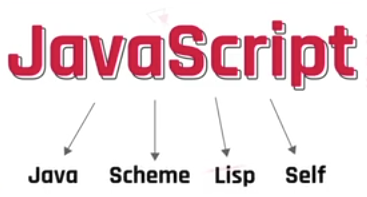
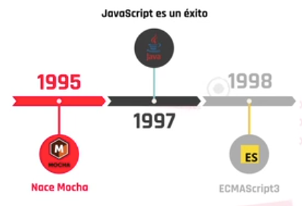
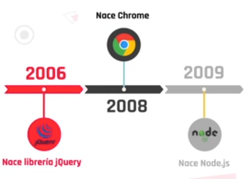
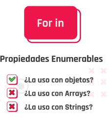
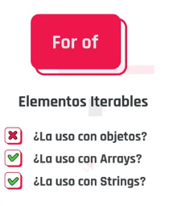
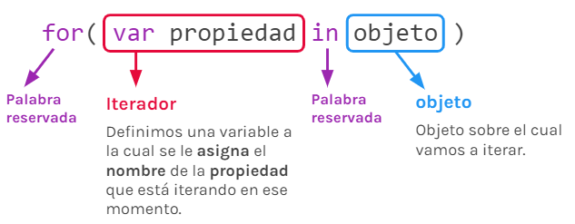
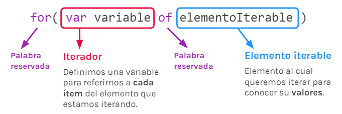

<style>

@import url('https://fonts.googleapis.com/css2?family=Roboto+Mono&display=swap');
t {
    font-size: 50px;
    color: #006d77;
    font-family: 'Roboto Mono', monospace;
    letter-spacing: 5px;
}
h1 {
color: #f2cc8f
}
h2 {
color: #e07a5f;
}
h3 {
color: #cd9777
}
r {
color: #03045e;
background-color: #90e0ef;
}
</style>

<t>Front End II</t>

---

## Índice <a id='up'></a>

1. Bienvenida e Introducción a Javascript Front
- [C1 - Bienvenida](#c1)
    - [Introduccion a la materia](#c1a)
    - [Origen de JavaScript](#c1b)
    - [DevTools: Consola](#c1c)
    - [console.log()](#c1z)
    - [alert()](#c1y)
    - [Vinculando HTML y JavaScript](#c1s)
- [C2 - Introducción a JavaScript Front](#c2)
    - [Capturando datos del cliente](#c2a)
        - [prompt()](#c2a1)
        - [confirm()](#c2a2)
    - [Manipulando datos](#c2b)
        - [ParseInt()](#c2b1)
        - [ParseFloat()](#c2b2)
        - [Math()](#c2b3)
    - [Bucles especificos](#c2c)
        - [for in](#c2c1)
        - [for of](#c2c2)
2. Manipulacion del DOM
3. Web reactica
4. Validacion del lado del cliente
5. Asincronismo y APIs
6. implementación practica, animaciones y librerias


# C1 - Introduccion <a id='c1'></a>


[Modulos de Front End](https://view.genial.ly/60ab9dbe27391f0d8711d89a) <a id='c1a'></a>

## Origen de Javascript <a id='c1b'></a>

> Ver video: Conociendo Javascript

<!-- inicio resumen video -->

Primero llamado *Mocha*, luego *LiveScript* luego ***Javascript***



### Cronologia




### Evolucion Javascript


<!-- Fin resumen video -->

> ver repaso PDF: repaso-javascript

***

## Conociendo la consola del navegador <a id='c1c'></a>

> Ver pdf: devtools

<!-- Inicio resumen pdf -->

La consola es una herramienta que tenemos los desarrolladores en el navegador para tomar decisiones sobre nuestro proyecto al mismo tiempo que es interpretado por Chrome.

¿qué podemos hacer con ella?Cuando algo no funciona como queremos, podemos pasar mucho tiempo intentando descubrir cuál es el problema y arreglarlo. Por eso, la consola nos sirve para agilizar este proceso porque nos señala qué ocurre cuando ejecutamos una tarea o petición al servidor. Puede ser que nos devuelva el dato que buscábamos, un error o un aviso (warning). A este proceso se lo llamadepurar el código o debugging.

**Elements y Styles**

En la pestaña Elements veremos el código HTML y en Styles, nuestro CSS. Si hacemos clic en la flecha indicada en la imagen y luego, colocamos el mouse sobre los elementos en pantalla, nos daremos cuenta fácilmente dónde se encuentran en el código para poder manipularlos y apreciar el cambio sin tener que ir al editor de texto y guardar.

## Tipos de errores

Existen varios tipos de errores, en la consola se muestran en color rojo. Por ahora, los más comunes que vamos a conocer son: 
- **SyntaxError**: Representa un error de sintaxis en el lenguaje representado en JavaScript.
- **TypeError**: Representa un error que ocurre cuando una variable o parámetro no es de un tipo válido, es decir, `undefined`.

## Responsive

Muchas veces necesitamos adaptar nuestra web para poder visualizarlas correctamente en distintos dispositivos. En la parte superior del inspector hay un icono de dispositivo, al hacer clic podemos determinar la resolución de pantalla o, directamente elegir un dispositivo.

## Application

Con la pestaña Application podremos ejecutar tareas respecto a los datos que se guardan por el cliente en nuestra web por cierta cantidad de tiempo. Como, por ejemplo, borrar de la memoria los datos ingresados en el login de un usuario.

*Lighthouse* es una herramienta que genera reportes para comprobar ciertos recursos que debe tener la web para que sea óptima. Algunos de ellos son:

- performance, 
- accesibilidad y 
- SEO.

<!-- fin resumen pdf -->

> Ver PDF: Javascript: Baby steps

<!-- inicio resumen pdf -->

## Primeros pasos en JavaScript

### `console.log()` <a id='c1z'></a>

Ahora que conocemos la consola como parte de las herramientas que debemos utilizar al desarrollar, pongamos en práctica algunas líneas de código.

Lo clásico sería mostrar un mensaje por consola, para eso, debemos implementar el método `log()` del objeto `Console`. Entonces, ¿cómo sería?

```javascript
console.log('Esto es un mensaje por consola');
```
Podemos probar ejecutar la misma sentencia con diferentes mensajes, incluso con
distintos tipos de datos y deberíamos tener el mismo resultado. Por ejemplo:

```javascript
console.log('Hola, soy otro texto');
console.log(25);
console.log(true);
```

**Variantes**

Como alternativas al .log() —pero rara vez implementadas— está bueno saber que
existen otros métodos como:

`.error()` Escribe un error en consola

`.warn()` Escribe una advertencia en consola

`.table()` Escribe una tabla en consola

```javascript
let miObjeto = {
mensaje: "Mensaje de texto",
utilidad: "prueba de JS"
};

let miArray = [ "Primer mensaje del array", "Segundo mensaje del array",
"Tercer mensaje del array"]

console.table(miObjeto);
console.table(miArray);
```

Sigamos probando alternativas, familiarizándonos con la consola del navegador e
implementemos código para obtener distintos resultados. 
**También podemos realizar operaciones aritméticas y relacionales.**

```javascript
let numero = 5;
let numeroEnLetras = "5";

console.log(numero == numeroEnLetras);
console.log(numero === numeroEnLetras);
```

### `alert()` <a id='c1y'></a>

Así como mostramos mensajes por consola, los cuales son muy útiles para debbuggear nuestro código, también tenemos mensajes de alerta que puede ver el
usuario.
El método `alert()` pertenece al objeto `window`, pero para utilizar podemos
directamente implementarlo en la consola.

```javascript
alert('Esto es una alerta');
```
El método muestra una caja de alerta con el mensaje que le pasamos por parámetro y un botón de OK. Justamente es implementado para mostrarle al usuario cierta información que creamos importante. De esta manera simple y rápida ya podemos comunicarnos con el usuario.

No se trata de la interfaz más bonita del mundo, pero al menos así podemos mostrar
un cartel inevitable a la vista.


**Quizz**

¿Qué combinación de teclas abre la consola del navegador? 
Ctrl, Shift + I
¡Correcto! Además de F12, podemos utilizar la combinación Ctrl, Shift + I

Puedo crear una variable directamente en la consola. 
Verdadero

La consola solo es visible para los usuarios que están logueados. 
Falso

A través de la consola puedo modificar páginas web.
Verdadero

¿Cuál es la función principal de la consola? 
Depurar páginas web.

¿Puedo activar o desactivar la consola en mi sitio web? 
Jamás, es una herramienta del navegador.

Al cerrar la consola pierdo todos los cambios que realicé en la misma. 
Falso
¡Correcto! Las variables se mantienen hasta que se cierre o cambie de página el sitio.

<!-- inicio pdf clase sincronica c1 -->

> Ver pdf: Vinculando HTML y JavaScript.pdf

## Vinculando HTML y JavaScript <a id='c1s'></a>

### Vinculación interna

Nos permite escribir código JavaScript directamente en nuestro archivo HTML. Sin embargo, esta no es la forma más prolija de trabajar.

```javascript
<body>

<script>
console.log(“HolaMundo!”);  
</script>

</body>
```

### Vinculación externa

Nos permite linkear nuestro archivo HTML con un archivo JavaScript externo

```javascript
<body> 

<script src="js/main.js"> </script>

</body>
```

Recordemos que, con el uso de la vinculación externa, no es necesario escribir las etiquetas `<script>` dentro de nuestro archivo con extensión **.js**

```javascript
let saludo='Hola mundo!';

console.log(saludo);
```
<!-- fin pdf clase sincronica -->

# C2 - Introduccion a javaScript Front <a id='c2'></a>

## Capturando datos del cliente <a id='c2a'></a>

> Ver video: Capturando datos del cliente

Como vimos anteriormente, JavaScript en el navegador nos provee de ciertos objetos y métodos que podemos aplicar con un simple llamado a los mismos. Para continuar utilizando métodos de Window, podemos sumar otros que le permiten al usuario ingresar información, la cual podemos captar y utilizar en nuestros programas. 

```javascript
alert("Esto es un alerta");
```
> Ver PDF: alert(), prompt(), confirm().pdf

## prompt() <a id='c2a1'></a>

Uno de ellos es el prompt(), este muestra un cuadro de diálogo con mensaje opcional, que solicita al usuario que introduzca un texto. Además tiene dos opciones: “Aceptar” o “Cancelar”.

```javascript
prompt("Ingresa nombre completo");
//Usuario ingresa contenido que queda tipo string

console.log(prompt("Ingresa nombre completo"));
//Muestra por consola lo que ingreso el ususario, de lo contrario es null
```

Por el momento ese dato se pierde, pero si lo almacenamos en un variable podremos utilizarlo para el resto de nuestro programa. Hagamos esa prueba.

```javascript
let nombreUsuario = prompt("Por favor, introduzca su nombre");
console.log(nombreUsuario);
```   

> Al utilizar un espacio en memoria para guardar este dato, podremos utilizarlo como información. En el caso de que el usuario seleccione “Cancelar”, el resultado que nos retorna es null. En cambio, si el usuario presiona “Aceptar” sin completar nada, nos devolverá un texto vacío. Probemos también este caso y veamos el resultado. 

## confirm() <a id='c2a2'></a>

El método `confirm()`muestra un cuadro de diálogo con un mensaje opcional y dos botones, “Aceptar” y “Cancelar”. En este caso, lo que nos <r>permite es ingresar alguna pregunta o indicación al usuario</r> para que este responda por sí o no únicamente. El valor que nos va a retornar es un booleano indicando `true` si pulsamos Aceptar y `false` si elegimos Cancelar.

```javascript
confirm("Esto pregunta y pide aceptar o cancelar");

console.log(confirm("acepta o cancela"));
// Devuelve true o false por consola
```

Recordemos que por sí solo el método no almacena ningún dato, pero si almacenamos el valor retornado en una variable, lo podremos utilizar como información. Hagamos la prueba de combinar ambos métodos en algo más funcional. 

```javascript
let tratoPersonalizado = confirm("¿Desea un trato personalizado?")

if(tratoPersonalizado){
    let nombre = prompt("Por favor, introduzca su nombre");
    alert("Le damos la bienvenida a nuestro sitio "+ nombre +". ¡Muchas gracias por visitarnos, estamos a su disposición!");
} else {
    alert("Gracias por conectarse.")
}
```

Ahora sí podemos ir viendo cómo tiene más sentido implementar los métodos, pero de manera conjunta para lograr un resultado más complejo. O por lo menos guardar esos datos y utilizarlos cuando lo creamos conveniente. 

**Quizz**

Un modal es una pequeña ventana con la que el usuario interactúa y no desaparece hasta que presiona “OK” o “Aceptar”. 
Verdadero

¿Qué método de window usamos en JavaScript para que el usuario ingrese datos por teclado? 
`prompt()`

¿Cuál es la diferencia entre alert y confirm? 
Con alert hay un botón para aceptar que el mensaje fue recibido, confirm hace una consulta al usuario y este decide por “Aceptar” o “Cancelar”.
¡Correcto! Con ambos métodos se utilizan botones y la ventana del modal no desaparece hasta pulsarlos. En el caso de alert, solo se podrá presionar “Aceptar” mientras que con confirm, nos aseguramos que el usuario decida por sí o por no, es decir, “Aceptar” o “Cancelar”.

Si no completo un dato en prompt y pulso “Aceptar”, retorna por defecto una cadena de texto vacío. 
Verdadero
¡Correcto! El valor por defecto siempre será una cadena de texto en caso de “Aceptar” y null en caso de “Cancelar”.

Los datos obtenidos con cualquiera de los métodos de window se almacenan automáticamente y se visualizan en consola. 
Falso
¡Correcto! Los datos se pierden si no son almacenados en una variable.

¿Qué retorna un prompt() si el usuario presiona “Cancelar”?
`null`
¡Correcto! El valor por defecto de la opción “Cancelar” es null, es decir, nulo o vacío. Que no existe. A diferencia de undefined, que existe, pero no está definido.

¿Qué tipo de dato almacena un confirm()?
booleano
¡Correcto! Porque “Aceptar” es verdadero (Sí) y Cancelar es falso (No).

***

## Manipulando datos <a id='c2b'></a>

**PARSEANDO**

Como vimos, los resultados de los valores obtenidos con el método `prompt()` no
siempre coinciden con el tipo de dato que necesitamos. Es decir, si le pedimos al
usuario que ingrese su edad y la guardamos en una variable para usar la misma y
sumársela al año actual, veremos que no obtenemos el resultado pretendido. 😐

```javascript
let edad = prompt("ingrese su edad");
console.log(edad+2021);
```

Está claro que si a un texto le sumamos un número no obtendremos la sumatoria,
sino que tendremos la concatenación de ambos como un texto.

## `parseInt()` <a id='c2b1'></a>

Para no incurrir en errores como el anterior u otros tantos que pueden surgir de no comprobar el tipo de dato que estamos manipulando tenemos la función `parseInt()`. <r>Esta función parsea una cadena de texto y **devuelve un número**.</r>

```javascript
parseInt("22");
parseInt(prompt("Ingrese edad"));
```
De nuevo a lo de siempre, si no guardamos estos datos en ningún lado, difícilmente podamos hacer algo con ellos. Para eso, implementamos variables que almacenan el resultado de las funciones. Veamos su resultado.

```javascript
let a = parseInt("22");
let b = parseInt(prompt("Ingrese edad"));
let c = parseInt("22"+"150");
let d = parseInt(22+150)
let e = parseInt(22+parseInt("150"));
let f = parseInt(22.55);
console.log(a); //22
console.log(b); //30
console.log(c); //22150
console.log(d); //172
console.log(e); //172
console.log(f); //22

//devuelve numeros
```
Al combinar y probar distintas posibilidades obtendremos distintos resultados, lo
fundamental es entender el funcionamiento de cada método y función para aplicarlo
según nuestras necesidades. Como vemos, en un caso puntual observamos que la
función `parseInt()` solo nos devuelve la parte entera del número que ingresemos, por lo que <r>si tenemos decimales los mismo quedarán truncados</r>.

## `parseFloat()` <a id='c2b2'></a>

Acá entra en juego esta otra función, que tiene el mismo objetivo que la anterior, pero en este caso si nos retorna los números decimales que existan.

```javascript
console.log(parseFloat(22.34));
console.log(parseFloat(22.3456284));
```

> Si fuimos probando estas funciones y además por curiosidad, o error —ambos son sumamente útiles🙂—, intentamos parsear un texto, vimos que el resultado obtenido no es un número.

## `NaN`

La propiedad `NaN` nos indica que el valor no es un número *(Not A Number)*, por lo que esto nos produciría un error si queremos realizar alguna operación aritmética con este valor.
Pongamos este ejemplo de una situación que nos produciría un error.
Supongamos que en el siguiente código, al ejecutarse, en el cuadro de
diálogo del prompt el usuario, por error o a propósito —cosa que
debemos tener en cuenta como programadores🧐—, ingresa un texto
“su edad”.

```javascript
let edad = parseInt(prompt("Ingrese su edad"));
if(edad>18){
console.log("Es mayor de edad");
}else{
console.log("Es menor de edad");
}
```

>🚨Claramente no estamos exentos de que el usuario sea un [troll](https://es.wikipedia.org/wiki/Trol_(Internet)), por eso, siempre tenemos que buscar maneras de validar los datos que el usuario puede manipular.

**Desafio**

Te invitamos a resolver el siguiente desafío para seguir practicando. Para ello,
podés abrir el VS Code y pegar el último bloque de código implementado.
- ¿Cuál es el resultado de este código?
- ¿Es correcto lo que arroja en base a lo que ingresó el usuario?
- ¿Dónde podría existir un problema?
- ¿Cómo podríamos solucionarlo y llegar a un mejor resultado utilizando los
métodos que ya conocemos? → Tip
🎈Animate a refactorizar el código, pensar en los posibles errores y cómo salvarlos.

→ Tip: Tenemos la función `isNaN()`, la cual nos devuelve `true` si el valor dado como parámetro es NaN. Para conocer más podés ingresar [acá](https://developer.mozilla.org/es/docs/Web/JavaScript/Reference/Global_Objects/isNaN).

**Resolucion**

```javascript
let edad = parseInt(prompt("Ingrese su edad"));

if(isNaN(edad)){
    console.log("No es un numero");
}else if(edad>18){
console.log("Es mayor de edad");
}else{
console.log("Es menor de edad");
}
```

**EXTRA**

## Math() <a id='c2b3'></a>

Como un apartado de esta sección, traemos para revisar información de un objeto
que quizás nos sirva en algún momento de nuestro desarrollo. Estamos hablando de
[Math](https://developer.mozilla.org/es/docs/Web/JavaScript/Reference/Global_Objects/Math), que consta de muchísimas propiedades y métodos que nos pueden ser de
utilidad.

> Ver PDF: Math.pdf

<!-- resumen math -->

>¿Para qué crear algo que ya existe y resuelve el problema por nosotros?

**Objetos incorporados en JavaScript**

Cuando hablamos de objetos incorporados, nos referimos a “cosas ya inventadas”. En referencia a la frase anterior, la respuesta puede variar, pero si existe una función o método que resuelve un problema típico, podemos recurrir a eso. No siempre es necesario crear una nueva solución, podemos implementar las disponibles.Justamente el objeto Math es uno de los casos porque tiene propiedades y métodos para constantes y funciones matemáticas.

**Propiedades**

Rara vez implementaremos alguna de las propiedades, pero estas se encuentran todas más que disponibles.

Por poner un ejemplo, podemos utilizar la propiedad que nos devuelve PI.

```javascript
Math.PI;  //3.141592653589793
```
>En total son 8 constantes matemáticas a las que se puede acceder.

**Métodos**

Estos son funciones matemáticas que ya conocemos, se utilizan diariamente para realizar cálculos. Algunas de ellas son:


Método | Función
------- | -------
`Math.random();` | Retorna un punto flotante, un número pseudoaleatorio dentro del rango [0, 1).
`Math.round();` | Retorna el valor de un número redondeado al entero más cercano.
`Math.max();` | Devuelve el mayor de cero o más números. | 

> ver mas [metodos aqui](https://developer.mozilla.org/es/docs/Web/JavaScript/Reference/Global_Objects/Math#propiedades)

**Ejemplos**

`Math.random()`

Obtiene un número aleatorio basado en un algoritmo.
- **No recibe parámetros.**
- **Retorna** un punto flotante, un número pseudoaleatorio dentro del rango [0, 1). Desde el 0 (Incluido) hasta el 1, pero sin incluirlo (excluido).

```javascript
let randomSimple = Math.random(); // 0.049253517516472556
let randomEscalado = Math.random()*(100-1)+1; // 86.5806550233727
parseInt(randomEscalado); // 86
```

`Math.round()`

Devuelve el valor del número dado redondeado al entero más cercano.
- **Recibe** un número, idealmente con punto flotante (float).
- **Retorna** el valor del número dado redondeado al entero más cercano.

```javascript
let num = Math.round(20.49); // 20
let aleatorio = Math.random()*(100-1)+1; // 86.5806550233727
Math.round(aleatorio); // 87
```

`Math.max()`

- **Recibe** un conjunto de números.
- **Retorna** el mayor de cero o más números.

>Si al menos uno de los argumentos no puede ser convertido a número, el resultado es `NaN`.

```javascript
let numUno = Math.max(10, 20);   //  20
let numDos = Math.max(10, 20, 30.58);   //  30.58
let numTres = Math.max(10, 20, 30.58, “No”);   //  NaN
```

<!-- fin resumen pdf -->

[Juego: Piedra papel o tijera con Math()](https://view.genial.ly/60a68f844000a90d34ab3be5)
<!-- imagenes c2b1 al c2b7 -->

## Bucles especificos <a id='c2c'></a>

>Ver video: Bucles especificos

Los bucles o loops son una gran herramienta para poder recorrer elementos iterables. Sumemos algunas opciones más a las que ya conocemos.

### `for in` <a id='c2c1'></a>

Solo itera sobre objetos literales
necesitamos un objeto sobre el cual iterar por ejemplo *persona*

```javascript
let persona = {
    nombre: "Liliana Ospina",
    edad: 30,
    profesion: "Programadora"
}
// palabra reservada for, parentesis y llaves, dentro de los parentesis declaramos unas variable cualquiera seguido de in mencionamos el objeto que deseemos iterar
for(let caracteristica in persona){
    //aqui podemos el codigo que va a iterar
    //la variable caracteristica toma las propiedades del objeto, no sus valores
    //si usamos en el console log el objeto y en corchetes la variable, traera los valores de cada propiedad
    console.log(persona[caracteristica]);
}
```


## `for of` <a id='c2c2'></a>

Lo usaremos para iterar sobre arrays
necesitamos un array sobre el cual iterar
tambien nos servira para iterar sobre cadenas de texto
La sintaxis es parecida a la de `for in`

```javascript
let series = [
    "Friends",
    "Game of thrones",
    "Breaking Bad"
];

for (let unaSerie of series) {
    console.log(unaSerie);
}
```



> ver PDF: Bucles específicos.pdf

<!-- resumen pdf -->

Las sentencias de Javascript for...in y for...of nos van a permitir iterar elementos usando una sintaxis clara y sencilla.

### Estructura for in

Estructura del for...in El bucle for...in nos permite iterar sobre cada una de las propiedades de un objeto

**for in**



### Estructura for of

**for of**

El bucle for...of nos permite iterar sobre cada uno de los valores de un elemento iterable, por ejemplo, un array



<!-- CLASE -->

```javascript
parseInt(Math.random()*3+1)
// Permite redonear, parseInt se queda con la parte entera del numero
```


<!-- subir al inicio -->
[subir al indice](#up)