<style>
@import url('https://fonts.googleapis.com/css2?family=Roboto+Mono&display=swap');
t {
font-size: 50px;
color: #006d77;
font-family: 'Roboto Mono', monospace;
letter-spacing: 5px;
}
h1 {
color: #f2cc8f
}
h2 {
color: #e07a5f;
}
h3 {
color: #cd9777
}
r {
color: #03045e;
background-color: #90e0ef;
}
</style>

<t>Infraestructura I</t>

## Índice <a id='up'></a>

1. Inmersion
- [C1 - Introducción a la materia & the big picture](#c1)
    - [Bienvenida](#c1a)
    - [Introducción a la materia](#c1b)
    - [El centro de computadoras](#c1c)
    - [The big picture](#c1d)

2. Automatizacion
- [C2 - Automatizacion](#c2)
    - [Automatizacion de la intraestructura](#c2a)
      - [5 Tareas mas comunes de automatizar](#c2a1)
      - [Configuracion y mantenimiento del sistema](#c2a2)
      - [Infraestructura y servicios](#c2a3)
      - [Manejo del codigo](#c2a4)
      - [Contenedores](#c2a5)
      - [Ambientes de trabajo](#c2a6)
      - [Monitores de red](#c2a7)
      - [Lenguajes de scripting](#c2a8)
    - [Virtualizacion](#c2b)
      - [Historia virtualizacion](#c2b1)
      - [Componentes virtualizacion](#c2b2)
      - [Instalacion VM Debian, Apache2, OpenSSH, puTTy](#c2s1)
- [C3 - Repaso](#c3s1)
    - [Vagrant: box Debian](#c3s1)
    - [Automatizar: modificando file de vagrant](#c3s2)
    - [Cambiar HTML base modificando file vagrant](#c3s3)
- [C4 - Shell Scripting - Parte I](#c4)
    - [Introducción a la terminal de Linux](#c4a)
      - [La consola de Linux](#c4a1)
      - [Tipos de shell](#c4a2)
        - [Bourne Shell](#c4a2a)
        - [C/TC Shell](#c4a2b)
        - [Korn Shell](#c4a2c)
        - [Bourne-Again Shell (BASH)](#c4a2d)
      - [Ejecucion de la consola](#c4a3)
      - [Elevacion de privilegios](#c4a4)
    - [Comandos más utilizados en la terminal de Linux](#c4b)
      - [Consolidando nuestro ambiente](#c4b1)
      - [Verificando nuestro ambiente](#c4b2)
      - [Comandos para el manejo de archivos](#c4b3)
      - [Comandos para leer archivos de texto](#c4b4)
      - [Obtener datos desde un web service](#c4b5)
      - [Comando cURL](#c4b6)
      - [Comando jq](#c4b7)
      - [Combinación de uso de ambos comandos](#c4b8)
    - [Clase en vivo 4](#c4s)
- [C5 - Shell Scripting - Parte II](#c5)
    - [Scripting](#c5a)
    - [Bash scripting](#c5b)
        - [Estructuras de control](#c5b1)
            - [Sentencia if-then](#c5b1a)
            - [Sentencia if-else](#c5b1b)
            - [Comparaciones numéricas](#c5b1c)
            - [Comparaciones de cadenas](#c5b1d)
            - [Cálculos matemáticos](#c5b1e)
        - [Ejemplo en Bash](#c5b2)
        
3. Containers
4. Cloud computing
5. Cierre


# C1 - Introducción a la materia & the big picture <a id='c1'></a>

[Modulos infraestructura](https://view.genial.ly/61263a284987a50dae61ca14) <a id='c1a'></a>

***

## Introducción a la materia <a id='c1b'></a>

En la actualidad, la actividad cotidiana depende en un porcentaje elevado del correcto funcionamiento de los sistemas informáticos —y saber operar con dichos sistemas—. La dependencia del ámbito productivo con los complicados sistemas informáticos es tal, que un problema en una terminal de trabajo deja prácticamente sin efecto la capacidad operativa de cualquier usuario. Ante situaciones de esta naturaleza —considerando la complejidad de las actuales plataformas tecnológicas y la multiplicidad de usuarios con diversos niveles de acceso y experticia—, se hace necesaria la presencia de un profesional confiable que intervenga, rápida y eficazmente, con habilidades y destrezas mayores a las del operador habitual.

La función de este profesional —conocido como administrador de infraestructura— es brindar respuestas a los problemas habituales de hardware y software en cualquier ámbito informatizado, planteándose desde una problemática y evaluando su mejor solución. Este servicio debe estar en manos de profesionales que orienten, configuren, prevengan y resuelvan eventualidades, manteniendo sus equipos en un estado óptimo. Además, el administrador de infraestructura debe ser capaz de prestar servicios de administración y soporte de sistemas de base y elementos de infraestructura para el procesamiento de aplicaciones informáticas, tales como servidores, dispositivos de almacenamiento masivo, otros dispositivos de hardware, sistemas operativos, máquinas virtuales y administradores de redes, servicios de comunicaciones a través de redes públicas y privadas, dispositivos de switching, firewalls, motores de bases de datos, entre otros. Podrá además brindar servicios de administración de la infraestructura tecnológica en la cual opera el software de estas aplicaciones interviniendo en forma puntual para resolver los problemas que experimente esa infraestructura o su eficiencia operativa y realizar un diagnóstico de incidentes que se presenten en la operatoria habitual del sistema.

La intención es contribuir con soluciones concretas a la problemática del soporte de infraestructura IT que se presentan en la casi totalidad de las instituciones públicas y/o privadas, acelerando los tiempos en materia de formación de recursos humanos capacitados y demandados por todas aquellas organizaciones que cuentan con una infraestructura IT.


## ¿Qué es infraestructura de IT?

La infraestructura de tecnología de la información, o infraestructura de IT, se refiere a los componentes combinados necesarios para el funcionamiento y la gestión de los servicios de IT de la empresa y los entornos de IT.


## ¿Quién hace infraestructura?

Estudiar una carrera profesional no consiste solamente en los años que le vas a dedicar a terminar tus estudios. Después de obtener tu título te espera un largo camino de crecimiento profesional y, si bien muchas veces tenemos una idea de las opciones profesionales que existen, a veces tenemos nociones erradas o no hemos explorado correctamente todas las posibilidades que hay disponibles. Por eso, a lo largo de la carrera te compartiremos las opciones en el campo laboral que tienen todos aquellos que decidan ser profesionales de sistemas.

Es evidente que estamos en una era en la que casi cualquier tipo de tarea es mediada por un computador. Por eso, el conocimiento de un profesional de sistemas es necesario en sectores tan diversos como, por ejemplo, el entretenimiento o el mundo empresarial. A través de esta materia adquirirán conocimientos aplicables a las tareas que deben desarrollar en cualquier sector de IT.

## ¿Cuál es el perfil de un analista de infraestructura?

Las funciones que ejerce un analista de infraestructura, entre otras, son:

- Administrar servidores, software de base, comunicaciones y demás subsistemas, maximizando el aprovechamiento de los recursos y anticipando posibles eventualidades.
- Administrar redes de comunicación de datos (cableadas o no), asegurando la accesibilidad de los servicios y optimizando los recursos.
- Atender incidentes que afecten al soporte de infraestructura de IT, diagnosticar las causas que los originan y resolverlos o coordinar su solución.
- Instalar o reemplazar componentes de soporte de infraestructura de IT o adaptarla a nuevas condiciones de servicios externos minimizando riesgos para la seguridad y continuidad del servicio.
- Migrar o convertir sistemas, aplicaciones o datos tratando de minimizar riesgos para la seguridad y continuidad del servicio.
- Entender temas de contingencias y riesgos que puedan afectar al soporte de infraestructura de IT.
- Generar propuestas innovadoras y/o emprendimientos productivos propios del ámbito de la gestión de soporte de infraestructura de IT.

Esta persona se desempeña en centros de procesamiento de datos, ya sean de empresas u organizaciones de cualquier tipo usuarias de tecnología de la información. Su posición ocupacional suele denominarse administrador de red o administrador de sistemas, y trabaja solo o en pequeños grupos para administrar los recursos de infraestructura de tecnología de la información y atender y resolver incidentes, a fin de minimizar la posibilidad de interrupciones al servicio que brindan las aplicaciones informáticas a las organizaciones.

Por lo general, depende directa o indirectamente de un gerente de tecnología responsable por toda la operación y —en función de la dimensión de la organización en la cual se desempeñe— puede trabajar solo, en pequeños grupos o en grupos más grandes que permitan su especialización en determinadas tecnologías. En la mayoría de los casos, no tiene personal a cargo, aunque puede coordinar las actividades de pequeños grupos operativos. En algunos casos en que la infraestructura es muy pequeña puede brindarle sus servicios profesionales externamente atendiendo a los centros de procesamiento en forma presencial o a distancia.

## ¿Por qué es tan importante la infraestructura de IT?

La tecnología es el motor de prácticamente todos los aspectos de las empresas actuales. Desde el trabajo de un empleado individual hasta las operaciones de bienes y servicios. Si se conecta correctamente, la tecnología se puede optimizar para mejorar la comunicación, crear eficiencia y aumentar la productividad.

Si una infraestructura de IT es flexible, fiable y segura, puede ayudar a una empresa a cumplir sus objetivos y a ofrecer una ventaja competitiva en el mercado. De forma alternativa, si una infraestructura de IT no se implementa correctamente, las empresas pueden afrontar problemas de conectividad, productividad y seguridad, como infracciones e interrupciones del sistema. En general, contar con una infraestructura correctamente implementada puede ser un factor clave para la rentabilidad de un negocio.

Con una infraestructura de IT, una empresa puede:

- Ofrecer una experiencia del cliente positiva proporcionando acceso ininterrumpido a su sitio web y la tienda en línea.
- Desarrollar y lanzar soluciones al mercado con rapidez.
- Recopilar datos en tiempo real para tomar decisiones rápidas.
- Mejorar la productividad de los empleados.

***

## Arquitectura cliente-servidor <a id='c1c'></a>

La arquitectura cliente-servidor persigue el objetivo de procesar la información de un modo distribuido. De esta forma, pueden estar dispersos en distintos lugares y acceder a recursos compartidos.

Además de la transparencia y la independencia del hardware y del software, una implementación cliente-servidor debe tener las siguientes características:

- Utilizar protocolos *asimétricos*, donde el servidor se limita a escuchar en espera de que un cliente inicie una solicitud.
- El acceso es transparente, multiplataforma y multiarquitectura.
- Se facilitará la *escalabilidad*, de manera que sea fácil añadir nuevos clientes a la infraestructura —escalabilidad horizontal— o aumentar la potencia del servidor o servidores, aumentando su número o su capacidad de cálculo —escalabilidad vertical—.

Ahora veamos las características de los tres componentes de la arquitectura cliente-servidor.

[Arquitectura cliente-servidor](https://view.genial.ly/609fd90a72150f0d1205fa78)

> Ver video: La importancia del centro de datos

<!-- Resumen video -->

dentro de los middleware estan:

## DBMS

Sistema de administracion de base de datos que permiten:

- crear
- Recuperar
- Actualizar 
- Administrar datos

## APIs

Interfaz de programacion de aplicaciones que brindan un conjunto de subrutinas funciones y procedimientos para ser utilizados en otro software

## Sistema operativo

El motor que va a aprovechar los recursos de la infraestructura, 
conjunto de programas capaz de administrar los recursos fisicos del servidor
asi como los protocolos de ejecucion de otro software


<!-- fin resumen --> 

[Caracteristicas fundamentales de un sistema operativo](https://view.genial.ly/60a81847f631260d39c063ca)

### Soporte de red

Es indispensable que tengan un soporte completo para poder brindar conectividad.

### Amplia compatibilidad con el hardware

Un punto fundamental para el aprovechamiento pleno de las características del servidor es que el S.O. <r>sea capaz de exprimir al máximo las características técnicas del hardware</r> en donde se ejecuta, es por ello que <r>se debe priorizar el uso de S.O. actualizados y con un soporte importante de controladores</r>. 
Por ejemplo, que nuestros controladores permitan acceder a características avanzadas de gestión de discos rígidos, con el propósito de realizar arreglos redundantes para tener mayor velocidad y tolerancia a fallos.

### Seguridad 

Teniendo en cuenta el rol que cumple el servidor, es de vital importancia que <r>el S.O. instalado sea seguro</r>; eso implica <r>no solo que este actualizado con todos los parches/actualizaciones, sino que además debe tener aplicadas políticas estrictas de acceso</r> para prevenir accesos no autorizados o ataques. 

Adicionalmente esa seguridad <r>debe reforzarse con la instalación de Firewalls (por software o hardware) y antivirus</r>. 

En este ítem también debemos incluir <r>el respaldo de la información</r>, ya sea por medio de herramientas que el propio S.O. nos ofrezca o instalando software externo, con el propósito de tener la menor pérdida de datos posible en caso de fallos fatales.

### Dispositivos físicos de protección

Debemos priorizar S.O. que en su arquitectura <r>permita una tolerancia a fallos</r>, ya sea mediante la generación de granja de servidores, que interconectados, operen como una gran unidad de proceso, dando la posibilidad <r>que ante la caída de uno de los integrantes de la granja, otro puede tomar su rol y responsabilidad</r>.

<!-- fin link -->

Conocidas estas características casi innegociables a la hora de elegir un S.O. para servidores, es común preguntarnos por qué se utilizan sistemas operativos y versiones específicas para el entorno de servidores y no usamos los mismos S.O. que tenemos instalados habitualmente en nuestras computadoras o estaciones de trabajo; eso se basa en algunas diferencias, a destacar:

### Manejo diferente del hardware:
Debido al diferente propósito, <r>los S.O. de estaciones de trabajo no pueden aprovechar todo el hardware disponible</r>, como, por ejemplo, el manejo de memoria RAM —teniendo el caso de Windows 10 64-bit que puede manejar 6TB de RAM, mientras que Windows Server 2019 alcanza los 24TB—.

### Características soportadas:
Hay funcionalidades que nativamente un S.O. de estación de trabajo no es capaz de brindar, ya que en su versión de kernel están limitadas o deshabilitadas —casos tales como la virtualización en algunas versiones de Windows 10—.

### Soporte:
Algo muy importante a tener en cuenta es, cuando nuestro negocio o aplicación depende de un S.O., es el <r>soporte por parte del fabricante/desarrollador</r>. En el caso de los S.O. de estación de trabajo, el soporte/cobertura que tenemos es para un uso específico, <r>si sobre esa base quisiéramos desplegar una arquitectura, por ejemplo, de servidor web, si bien es probable que nos funcione, vamos a carecer de soporte técnico</r> ya que el fabricante nos indicará que para ese propósito esta la version “Server” del producto.

Ya entrando en el terreno de las opciones disponibles para un S.O. de servidor, nos vamos a encontrar con dos opciones predominantes en el mercado:


En el grupo de los UNIX (o UNIX-like) tenemos a:

- GNU Linux
- FreeBSD
- macOsServer

En el grupo de Windows, integrado por toda la familia de Windows Server, tenemos las versiones que van desde la versión 2003 a 2019.

En el transcurso de la cursada nos vamos a centrar en GNU Linux y Windows, ya que son las opciones más utilizadas; iremos conociendo algunas características que ofrecen, como así también sus diferencias.

[juego unir conceptos](https://view.genial.ly/612678272e794b0d1e71472d)

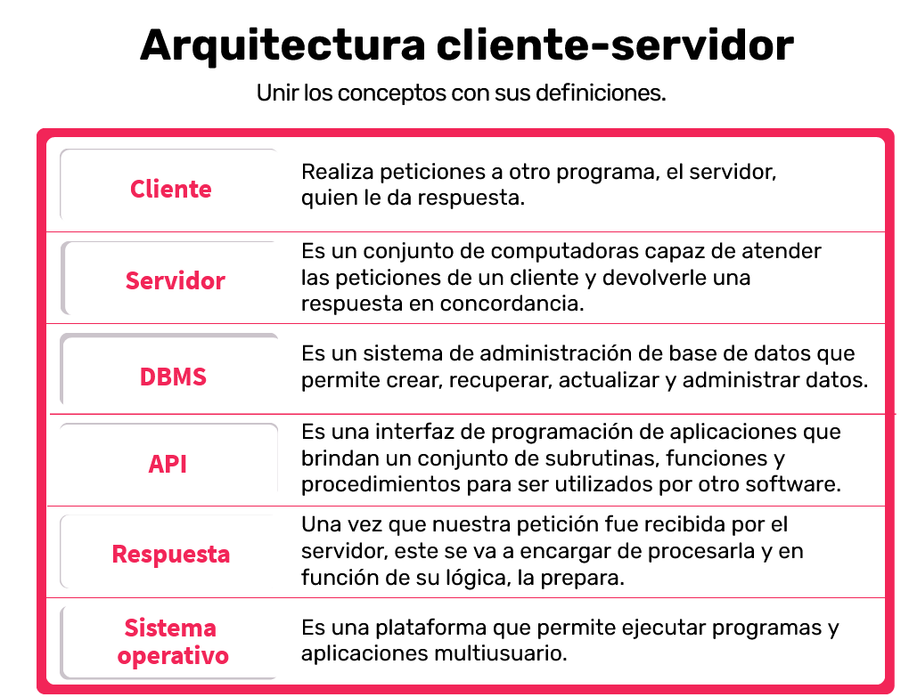

***

## ¿Querés saber todo lo que vas a aprender en esta materia? <a id='c1d'></a>

Los profesores te van a dar la bienvenida a esta gran aventura. Comenzarán explicándote cómo se compone y funciona un centro de cómputos. De esta manera, te abrimos la ventana al mundo de la infraestructura.

Te vamos a dar una visión teórica sobre el paradigma cliente-servidor y te vamos a llevar de viaje desde la PC de un cliente hacia el data center. Vas a aprender acerca de sistemas operativos en el contexto del data center. A saber la diferencia entre los distintos sistemas operativos que existen en el mercado. Y, como si fuera poco, vas a saber sobre los usos y servicios que se les pueden dar.

Seguiremos con la historia de la virtualización, analizando las capas de servicios con sus funcionalidades y, sobre todo, sabrán de los beneficios de esta tecnología. Te sumergiremos en el mundo de las redes mostrándote el modelo OSI, descubriendo sus protocolos y te llevaremos de viaje con un paquete de una estación de trabajo a otra. Vas a entender el famoso chiste del que hablan los informáticos sobre capa 8. Te mostraremos el mundo de los procesos ITIL: service request management, incident management, problem management y change management; por si llegás a tener que ver algún caso en una herramienta de tickets en tu carrera, vas a saber y poder diferenciarlos.

Además, te introduciremos en el maravilloso mundo de la criptografía. Vas a ver cómo puede ser utilizada para autenticar partes, principalmente, en el contexto de SSH y HTTPS. Aprenderás los comandos básicos para el copiado, borrado y creación de archivos y directorios. También te explicaremos los comandos básicos para la obtención de datos desde un web service y posterior proceso.

Estudiarás qué es el pipeline en la consola y te explicaremos Bash como lenguaje de scripting.

Luego, vamos a pasar por PowerShell, otro lenguaje de automation muy utilizado en las empresas hoy en día. Vas a saber cómo instalar, abrir y ejecutar comandos en una consola y los distintos módulos que existen que te van a ayudar a simplificar muchos futuros scripts.

Para que no te quedes afuera de los lenguajes de scripting, vas a ver también Python, uno de los más reconocidos hoy en día. Te vamos a dar una perspectiva de para qué es y para qué sirve y vas a poder reconocer las aplicaciones —que tanto usás en el día a día— que fueron creadas en ese lenguaje.

Seguimos el camino de esta carrera mostrándote configuration management y Ansible. A esta altura vas a usar el emoji con los anteojitos de sol o los de lectura, el que te guste más.

Continuaremos con una tecnología que nos encanta (y a vos seguro también): Docker. Recorreremos todos los productos de esta simpática ballenita y vamos a ver todos sus usos y mejores prácticas.

Terminaremos este viaje que es Infrastructura I mostrándote todo lo relacionado a cloud computing. Analizaremos los modelos de responsabilidad y vas a poder diferenciar los modelos IaaS, PaaS y SaaS. Conocerás modelos como nube híbrida y serverless. Te mostraremos diferentes nubes: Azure, Google y AWS. Practicarás con AWS Educate y armaremos un pequeño ambiente.

Del otro lado somos un equipo que armamos con mucha pasión todo el contenido de esta materia, con los requerimientos que el programa pide y de lo que nos hubiese gustado aprender a nosotros en el paso que ahora están haciendo. Te agradecemos enormemente tu tiempo y esperamos que nuestro aporte te sea de mucha utilidad en tu carrera. ¿Comenzamos?

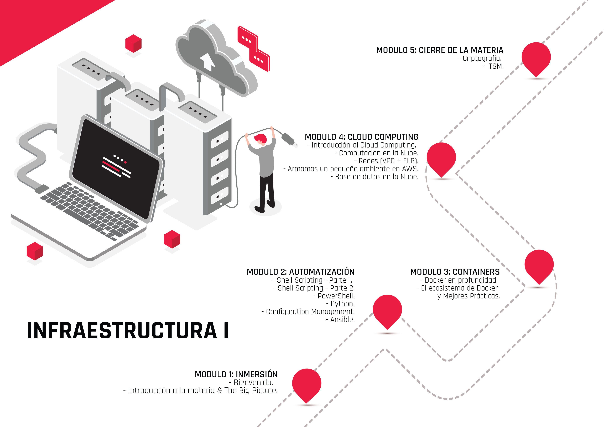

***

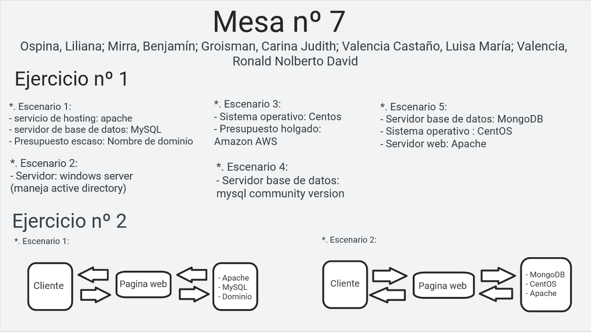

# C2 - Automatizacion <a id='c2'></a>

## Automatizacion de la infraestructura <a id='c2a'></a>

Habitualmente resulta cansador realizar las mismas tareas rutinarias en el área de sistemas. ¿Por qué mejor no automatizamos la infraestructura? Es decir, que esa tarea la realice un sistema sin errores y más eficientemente. En esta clase vas a conocer cómo implementar la automatización en infraestructura. 

> Ver PDF: Automatización de la infraestructura..pdf

<!-- inicio resumen pdf -->

**Automatización de la infraestructura**

Como vimos anteriormente, <r>la Infraestructura IT es el conjunto de dispositivos y aplicaciones de software necesarios para que cualquier empresa opere.</r>  Esta se compone de elementos como: 
- software, 
- hardware, 
- redes, 
- instalaciones 
- y todo lo que se requiera para desarrollar, controlar, monitorear y dar soporte a los servicios que ofrece el departamento de IT.
Por otro lado, <r>la automatización consiste en usar la tecnología para realizar tareas casi sin necesidad de las personas.</r> Se puede implementar en cualquier sector en el que se lleven a cabo tareas repetitivas.

La automatización de la IT —también denominada automatización de la infraestructura— <r>**consiste en el uso de sistemas de software para crear instrucciones y procesos repetibles a fin de reemplazar o reducir la interacción humana con los sistemas de IT.**</r>

## ¿Por qué automatizar?

Automatizar tareas permite ganar tiempo y maximizar la productividad de nuestra infraestructura IT. En tiempos de **cloud computing**, este es el mensaje que se repite una y otra vez: <r>cómo hacer más con menos</r>, cómo conseguir que los profesionales IT de nuestra empresa dediquen más tiempo a generar valor para la compañía y menos a tareas repetitivas que se podrían realizar de forma automática.

## Beneficios de automatizar

- Elevar la productividad empresarial.
- Reducir costos operativos.
- Tener una mejor capacidad de respuesta.
- Facilidad de adaptación.
- Disminuir los riesgos de fallas.
- Elevar la seguridad de la información.
- Alojar una mayor cantidad de datos.
- Elevar la competitividad del negocio.

<!-- fin resumen pdf -->

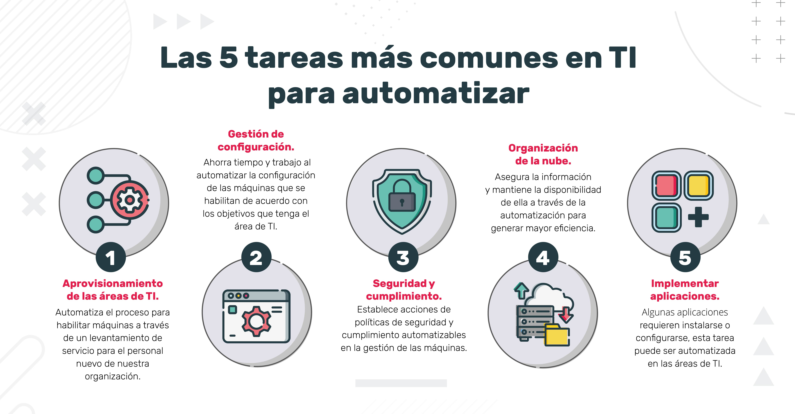 <a id='c2a1'></a>

> Ver PDF: Configuración y Mantenimiento del sistema.pdf

<!-- inicio resumen -->

## Configuración y mantenimiento del sistema <a id='c2a2'></a>

Retomando el concepto que vimos:

>“La automatización de la infraestructura consiste en el uso de sistemas de software para crear instrucciones y procesos repetibles a fin de reemplazar o reducir la interacción humana con los sistemas de TI”.

Este plantea una visión muy amplia, ya que tiene que abarcar los diversos rubros de las empresas que poseen su área de sistema. Según el tipo de organización en la que trabajamos, es el grado de automatización con el que nos vamos a encontrar en la infraestructura de TI.
Uno de los roles del equipo de trabajo del área de sistemas es el **DevOps** engineer, encargado de **automatizar** los procesos del área de **Development** y **Operations**. Su función es hacer más amigable y eficiente la relación entre estos dos equipos de trabajo.

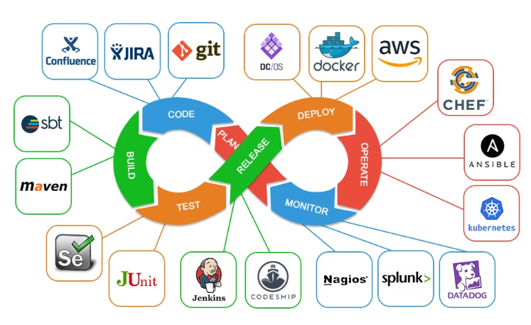

## Infraestructura y servicios <a id='c2a3'></a>

Primeramente tenemos que analizar los dispositivos que tenemos en nuestra red de IT. Si contamos con servidores **`legacy`** o servicios contratados por un **`cloud providers`**. 
De las dos opciones anteriores, lo que tenemos que tener en cuenta es el sistema operativo con el que trabajan (MAC, Linux, Windows).

De los cloud providers más conocidos contamos con:

- AWS
- Google Cloud
- Microsoft Azure


Para la elección se evalúan los costos y la oferta de **servicios que disponen**. Esta última es cada vez más robusta y completa (load balancing, backup, clustering, security, etc.).

## Manejo del código <a id='c2a4'></a>

Partimos desde donde alojamos nuestro código de trabajo si somos programadores. 
Por excelencia el gestor de versionado e integrador de código más utilizado es **Git**. 
Los alojamientos de estos repositorios más conocidos en la nube son GitLab, GitHub, Bitbucket, Gitea, entre otros. 
En estos se almacena nuestro código de las aplicaciones que
pueden estar en lenguajes de programación diversos según lo que necesitemos —por ejemplo: Python, JavaScript, Java, .NET, etc.—.
También podemos automatizar el deploy de nuestro código con CI/CD (refiere a las prácticas combinadas de integración continua y entrega continua). 

Algunas herramientas para hacerlo son:
- Jenkins
- GitActions
- JetBrains

## Contenedores <a id='c2a5'></a>

Los contenedores se están convirtiendo en el modelo de empaquetado de software del producto que desarrollamos. <r>Permiten la virtualización de ambientes de trabajo compatibles transportables, totalmente configurados para que nuestro código funcione en todos los equipos.</r> El más popular es **Docker**.

Cuando manejamos muchos contenedores, tenemos que migrar a un clúster de
contenedores, dirigidos por los orquestadores de contenedores. Por ejemplo:
Kubernetes o Docker Swarm.

## Ambientes de trabajo <a id='c2a6'></a>

Luego, hay que tener en cuenta en qué ambiente está nuestro clúster.

En cada ambiente se trabaja con distintas tecnologías, según el grado de exposición del producto. Automatizando estos procesos vamos a tener más eficiencia, transparencia, facilidad de replicación y recuperación. 

Los ambientes más populares son:

- Ansible
- Chef
- Puppet
- Terraform

## Monitores de red <a id='c2a7'></a>

Es muy importante tener la supervisión de los dispositivos que hay en nuestra red y de los servicios, y programar alertas en caso de que suceda algún cambio. 

Para esto podemos utilizar: 
- Nagios, 
- Prometheus, 
- Icinga2 o 
- DataDog.

## Lenguajes de scripting <a id='c2a8'></a>

Necesitamos trabajar en estrecha colaboración con los desarrolladores y el administrador del sistema para automatizar tareas de los operadores y desarrolladores (como pueden ser
backups, cron jobs, system monitoring).

Según el sistema operativo, podemos usar: 
- Bash o 
- PowerShell.

Pero también existen lenguajes de scripting independientes del SO, como:
- Python, 
- Ruby o
- Go. 
El más popular es `Python`, ya que posee muchas librerías y es de fácil lectura y aprendizaje.

**Conclusión**

Estas tecnologías expuestas para automatizar la infraestructura TI no son todas las que están en el mercado, sino una visión general de las que hoy son las más populares. Hay que tener en cuenta que cada día se están desarrollando nuevas herramientas y metodologías de trabajo para cada empresa, como también empresas que brindan el servicio de automatización outsourcing de la organización. 
<r>Siempre hay que tomar la decisión basándose en la necesidad, recursos disponibles y experiencia que cuenta la empresa.</r>

<!-- fin resumen pdf -->

## Virtualizacion <a id='c2b'></a>

¿Cómo viene todo hasta acá? Ahora vamos a refrescar algunos conocimientos que ya vimos en Introducción a la Informática, principalmente la virtualización, dado que es una de las formas de automatización más utilizadas en la infraestructura IT.

## Introducción a la virtualización

La **virtualización** permite mejorar la agilidad, la flexibilidad y la escalabilidad de la infraestructura de IT, al mismo tiempo que proporciona un importante ahorro de costos.

Algunas **ventajas** de la virtualización son:

- Mayor movilidad de las cargas de trabajo.
- Aumento del rendimiento.
- Menos esfuerzo en los upgrades/updates del sistema.
- Mejor disponibilidad de los recursos o la automatización de las operaciones:
- Simplifican la gestión de la infraestructura de IT.
- Permiten reducir los costos de propiedad y operativos.

A continuación, encontrarás la historia de la virtualización y sus componentes. 

## Historia de la virtualizacion <a id='c2b1'></a>

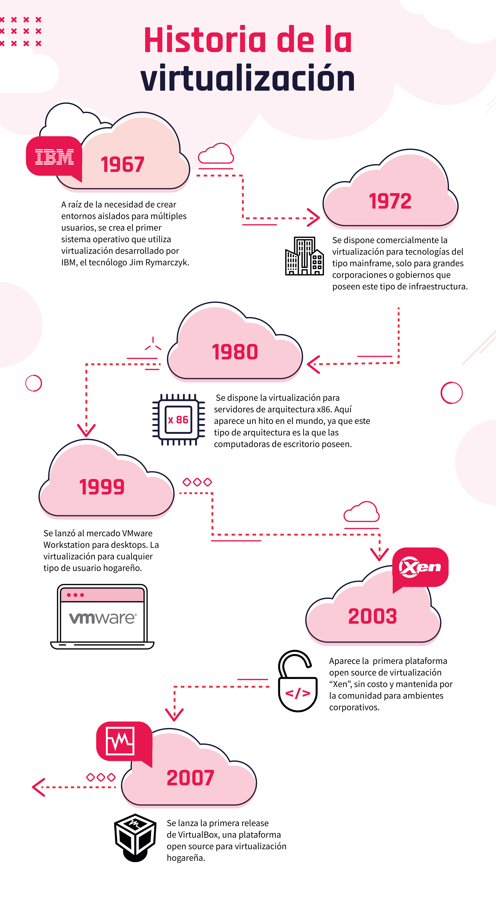

## Componentes de la virtualizacion <a id='c2b2'></a>

[Componentes](https://view.genial.ly/60a95ee45e2a3d0d271c0bbd)

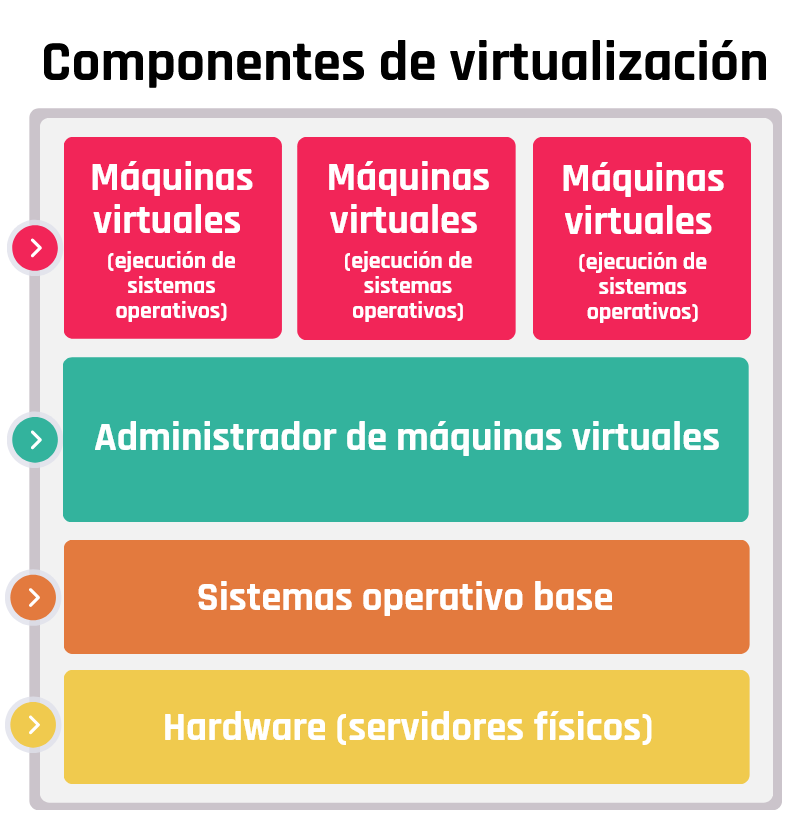

**Maquinas virtuales**

En la actualidad se pueden crear sistemas operativos guest del tipo Microsoft y Linux en casi todas sus versiones, se deben tener en cuenta las versiones de cada sistema operativo y la compatibilidad con el sistema host.

**Administrador de maquinas virtuales**

Desde la herramienta de management se administran todos los recursos físicos y virtuales de los guest que son las instancias virtuales que se crean para usos específicos. Desde el mismo management podremos establecer clustering con otros virtual machines manager para tener alta disponibilidad y tolerancia a fallos. Además, administra todos los recursos virtuales de nuestras virtual machines.

**Sistema operativo base**

Es el sistema operativo encargado de administrar los dispositivos físicos (hardware) y proveer una capa de abstracción a los entornos virtuales. 

**Hardware (Servidores fisicos)**

Los microprocesadores, tanto los de Intel como los de AMD, tienen una característica llamada virtualización de CPU. Se aplica a servidores o máquinas de escritorio. 

> Ver pdf: Instalacion virtual box y vagrant
>
> Ver actividad: crear mv

<!-- actividad sincronica -->
### actividad sincronica
para pasar a root
```bash
su -
```

- **APT** es un proyecto gigante y su plan original incluia una interfaz gráfica. Está basado en una biblioteca que contiene la aplicación central y apt-get fue la primera interfaz — basada en la línea de órdenes — desarrollada dentro del proyecto. apt es un segundo frontend de linea de comandos proporcionado por APT el cual soluciona algunos errores de diseño de la orden apt-get.

- **Su** El programa su permite usar el intérprete de comandos de otro usuario sin necesidad de cerrar la sesión actual. Comúnmente se usa para obtener permisos de root para operaciones administrativas sin tener que salir y reentrar al sistema.

- El servidor HTTP Apache es un servidor web que ofrece muchas y potentes funciones. Entre ellas se incluyen módulos que cargan de forma dinámica, soporte de medios robusto y una amplia integración con otro software popular.

- Me resolto familiar, como un escritorio remoto

<!-- fin actividad sincronica -->

***
<!-- inicio notas clase 2 en vivo -->

**Notas - Clase 2: Virtualizacion** 
<!-- inicio notas sincronico 2 -->

Uso de virtualizacion para testeo y aprovechar recursos de hardware.
Saber el comportamiento de una aplicacion en un sistema operativo.
Al hacer un servidor quiza sirva virtualizarlo, aprovechando los recursos de hardware de esa forma.

recomendado estar con red cableada para la instalacion de `Debian` la version mas comun es AMD64

servidores Legacy se refiere a los servidores fisicos.

## Instalacion VM Debian, Apache2, OpenSSH, puTTy <a id='c2s1'></a>

>ver instalacion vm Debian en min 09:00
>
>Ver PDF: Crear una VM
>
>Link video: habilitar virtualizacion [link](https://www.youtube.com/watch?v=oTMMc9KWtco)

instalamos la vm en oracle vm, para administrar un servidor sin un entorno grafico

GRUB es un gestor de arranque que se instala en el disco, antes de la particion donde teniendo ese GRUB podemos tener varias instalaciones en el mismo disco de distintos sistemas operativos

vamos a instalar un servidor web y lo vamos a consultar desde nuestra maquina host. Vamos a ver la pagina web que esta alojada en este servidor que estamos haciendo

Terminada la instalacion y configuracion de nuestra maquina cirtual Debian:
```
login: nombre
clase: clave
```
Procedemos a instalar el servidor web apache, el mas conocido en linux, mas antiguo y open source

cambiamos el login a root para realizar cambios de administrador

```bash
su root
```
instalamos apache2
```
apt-get install apache2
```
pide un S para continuar y bajara unos archivos e instalara el servidor web

verificamos que el servidor este andando en la computadora con:

```
ip address
```
ip address muestra los dispositivos de red que tenemos en nuestra maquina virtual


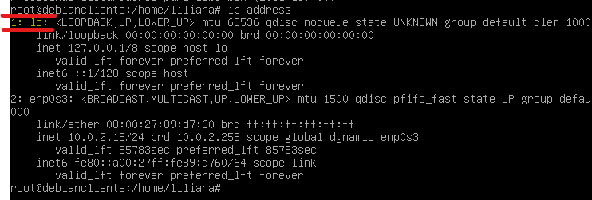

muestra 2 dispositivos, el primero es `lo` hace referencia al `local host` siempre es `127.0.0.1`, no la tenemos que usar ya que hace referencia a su misma placa de red.

la que tenemos que ver es la 2 `enp0s3`: `192.168.1.25` que la direccion que tiene esta en el mismo rango que la direccion ip de la maquina host. 

Verificamos esto fuera de nuestra maquina virtual, en nuestra maquina host

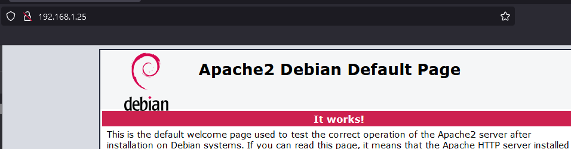

Ahora instalaremos un servidor SSH, desde el root, este servidor nos da una puerta de entrada a nuestra maquina virtual desde afuera, desde este protocolo ssh. (Como un team viewer para terminales, con esto s ehace mantenimiento de servidores)

```
apt-get install openssh-server
```
cuando ponemos esto crea ciertas dependencias y se instala el servidor ssh, al mismo tiempo usaremos la app `puTTy` en nuestro host.

en host name ponemos la ip que ip address 
`192.168.1.25` nos sale un warning y le ponemos que si.

y ya nos conecta, usamos el login del usuario normal no el root, ya que ssh no deja root.

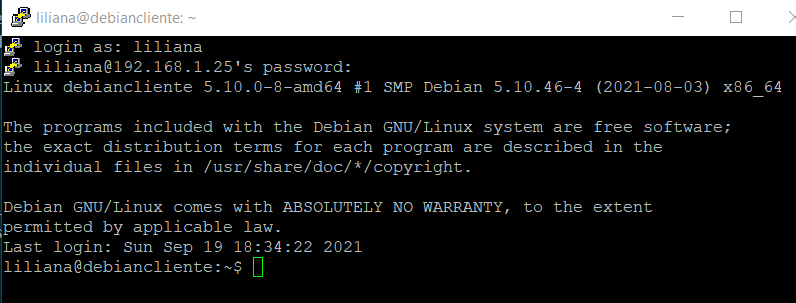

esto nos sirve para usar vagrant y nos acerca a la automatizacion.

<!-- fin resumen clase sincronica 2 -->

**Notas - Clase 3: Repaso**

<!-- inicio notas clase 3 sincronica -->

## Vagrant: Automatizacion box Debian <a id='c3s1'></a>

Vamos a usar vagrant para automatizar la virtualizacion.
Con un script con vagrant lo haremos mucho mas rapido

paso a paso:

- Creamos una carpeta llamada ejVagrant y accedemos desde PowerShell

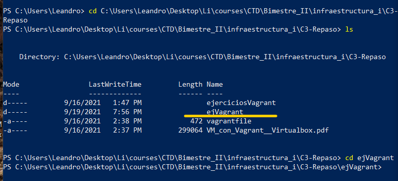

- con vagrant instalado, descargaremos la box de Debian, una box es una maquina virtual preconfigurada, vemos las diferentes boxes en la vagrant cloud:

<app.vagrantup.com/boxes/search>

nosotros usaremos:

una box de Debian y usaremos virtualbox como hypervisor, se llama `debian/buster`

ejecutamos el comando:

```powershell
vagrant box add debian/buster64
```
esto demora un poco, luego seleccionamos la opcion 2: virtualbox

el **vagranfile** que tiene el siguiente codigo con extension `all types`, configura la maquina virtual y le pone nombre `network server` y que configure una `public network`

```powershell
# -*- mode: ruby -*-
# vi: set ft=ruby :
# All Vagrant configuration is done below. The "2" in Vagrant.configure
# configures the configuration version (we support older styles for
# backwards compatibility). Please don't change it unless you know what
# you're doing.
Vagrant.configure("2") do |config|
  config.vm.define "server" do |server|
  config.vm.box = "debian/buster64"
  server.vm.hostname = "server"
  server.vm.network "public_network"
  end  
end
```
validamos el codigo:
```powershell
vagrant validate
```
si hacemos
```powershell
vagrant up
``` 
y hay un error, tambien lo va a validar
con `vagrant up` corre la maquina virtual

Todo el proceso de la clase 2 de instalar y configurar el sistema operativo vagrant lo va a automatizar; lo ahorramos con la box.

Cuando termine de instalar con el comando verificamos que esta corriendo.
```powershell
vagrant status
```

Si dice running y abrimos el virtualbox vemos que esta corriendo

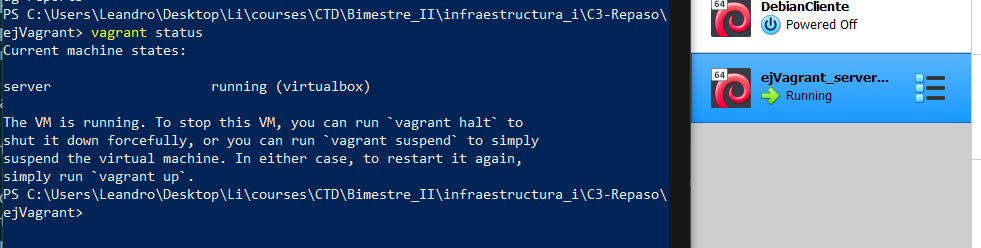

ahora vamos a instalar un servidor web, vamos a tener que loggearnos a esta maquina virtual

Como vagrant ya estala un ssh usamos el siguiente codigo y esto evita el uso de puTTy

```powershell
vagrant ssh server
```
el comando anterior nos logea automaticamente a la maquina virtual

ahora vamos a instalar un servidor web: apache, para eso necesitamos los permisos de root, vagrant es el password por defecto de root.

```powershell
su root
Password: vagrant
# Por defecto el password de root es vagrant
```

ahora que estamos como root instalaremos el servidor web apache2

```powershell
apt-get install apache2
```
pregunta, le decimos Y, lo va a bajar, configurar y lo va a instalar.

para ver si esta funcionando nos fijamos la ip

```powershell
ip address
```
Verficamos que funcione en el navegador
que corre nuestro servidor web

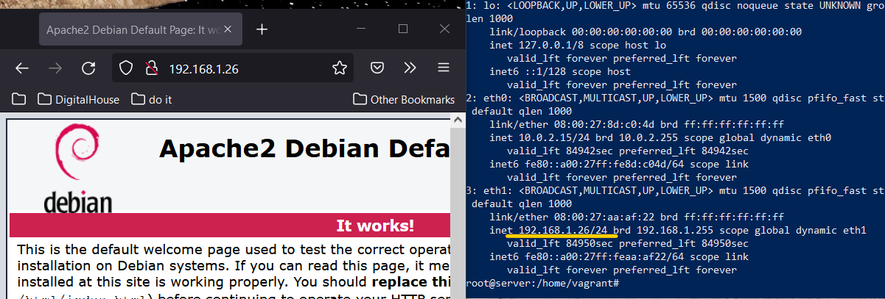

**Resumen**
Esto automatiza la tarea de tener un servidor web usando los recursos de hardware de nuestra computadora, antes lo usamos de forma manual en la clase 2 y en la clase 3 se automatiza el proceso.

Podemos cambiar las configuraciones cuando esta instalado en nuestra computadora, yendo a la documentacion de en este caso `Debian`

> Las boxes se guardan en:
```
C:usuarios>user>.vagrant.d>boxes
```

Automatizaremos mas el proceso anterior, agregando por defecto al script un servidor web

primero saldremos del root y de la maquina virtual.

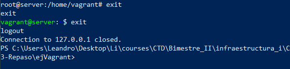

para parar nuestra maquina virtual:
```powershell
vagrant halt
```
Destruir la maquina de vagrant con:

```powershell
vagrant destroy -f
```

## Automatizar: modificando file de vagrant <a id='c3s2'></a>

Agregamos las intrucciones al script para que se instale automaticamente el `Apache2`

```powershell
Vagrant.configure("2") do |config|
  config.vm.define "server" do |server|
  config.vm.box = "debian/buster64"
  server.vm.hostname = "server"
  server.vm.network "public_network"
  #Esto es lo nuevo que se agrega al file
  #Le dice al server que se aprovisione desde la linea de comandos
  server.vm.provision "shell", inline: <<-SHELL
  #Y ejecute estos comandos:
    apt-get update
    apt-get install -y apache2
    #Dice que termine el shell
    SHELL
  end  
end
```
Primero lo validamos:

```powershell
vagrant validate
```
si esta ok
```powershell
vagrant up
```

Nos logueamos para ver la ip, aunque tambien podemos configurarla
```powershell
vagrant ssh server
```
y luego, no es necesario entrar como root, pedimos el ip y lo verificamos
```powershell
ip address
```
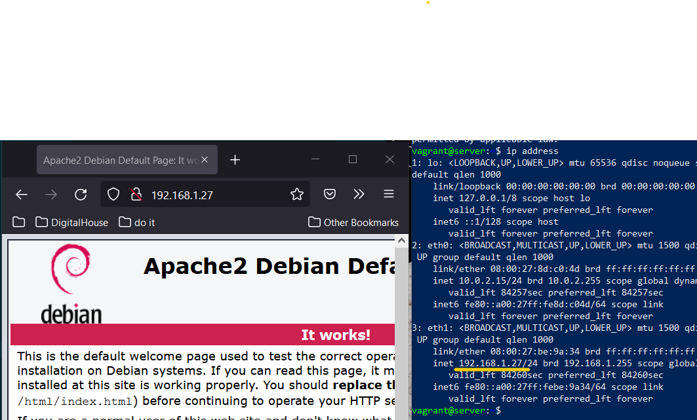

Cerramos la vm
```powershell
#loguados en el servidor con vagrant ssh server
exit
```
y eliminamos la VM con:
```powershell
vagrant destroy -f
```

## Cambiar html base en el script <a id='c3s3'></a>

Copiar el `HTML`, ponerlo en la carpeta vagranfile para copiar esta pagina en donde iria la pagina por defecto de Apache.

```powershell
Vagrant.configure("2") do |config|
    config.vm.define "server" do |server|
    config.vm.box = "debian/buster64"
    server.vm.hostname = "server"
    server.vm.network "public_network"
    server.vm.provision "shell", inline: <<-SHELL
        apt-get update
        apt-get install -y apache2
        SHELL
    #Esto es lo nuevo que se agrega al file
    server.vm.provision "file", source: "index.html", destination: "index.html"
    server.vm.provision "shell", inline: "mv index.html /var/www/html/index.html"
    end  
end
```
Esto movera el archivo HTML a ese lugar, tiene que existir ese HTML

Creamos una pagina html en la carpeta del vagrant file

```powershell
#paso 1: Correr vagrant
vagrant up
#paso 2: Elegir la red
1
#paso 3: Nos logueamos en la maquina virtual
vagrant ssh server
#paso 4: Consulto ip
ip address
```
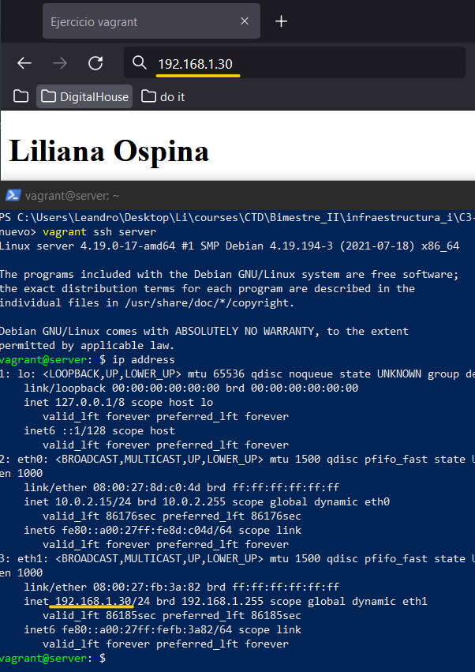

(Se ve en otra pc en mi misma red, no se si afuera)
(NO MATE ESTA ULTIMA MAQUINA VIRTUAL)
(UTIMO COMANDO FUE `vagrant halt`)

PARA PRENDERLA `vagrant up`

<!-- fin resumen clase 3 sincronica -->

>PENDIENTE: ACTIVIDAD SCRIPT

# C4 - Shell Scripting - Parte I <a id='c4'></a>

## Introducción a la terminal de Linux <a id='c4a'></a>

¿Cómo viene todo hasta acá? Ojalá hayas podido recuperar energías porque comienza el momento de trabajar sobre nuevas definiciones.

En esta clase vamos a avanzar respondiendo algunas preguntas:

- ¿Qué es una shell CLI o intérprete de comandos?
- ¿Cuáles son los tipos de shell?
- ¿Cómo iniciamos una consola en Linux?
- ¿Cuáles son los privilegios del superusuario root?

> ver PDF: Introduccion a la Terminal. Diferentes formas de ejecución.pdf

<!-- inicio resumen pdf -->

## La consola de Linux <a id='c4a1'></a>

La interfaz de línea de comandos, o CLI —por sus siglas en inglés command-line interface—, es un método de comunicación entre usuario y máquina que acepta instrucciones del usuario a través de líneas de texto (siguiendo unas determinadas reglas de sintaxis que puedan ser interpretadas por el sistema operativo).La herramienta que posibilita la función de interfaz de usuario se la denomina shell. Aplicado en el ámbito de la interfaz de línea de comandos, estaríamos hablando de una shell CLI o intérprete de comandos.
Diferentes

## Tipos de shell <a id='c4a2'></a>

En Linux tenemos una multitud de shells o intérpretes diferentes. El más conocido de todos probablemente es Bash, debido a que es el que suele venir por defecto en la gran mayoría de distribuciones GNU/Linux, pero también destacan otros como Bourne Shell (sh), Korn Shell (ksh) o C Shell (csh), los cuales vamos a conocer.

### Bourne Shell <a id='c4a2a'></a>
Lleva el nombre de su creador en los Laboratorios Bell, Steve Bourne. Fue la primera shell utilizada para el sistema operativo Unix y ha superado en gran parte la funcionalidad de muchas de las shells más recientes. Todas las versiones de Linux Unix permiten a los usuarios cambiar a la original Bourne Shell, conocida simplemente como "sh", si así lo desean. Sin embargo, hay que tener en cuenta que al hacerlo, se renuncia a funcionalidades como el completado de nombres de archivo y el historial de comandos que los depósitos posteriores han añadido.

### C/TC Shell <a id='c4a2b'></a>
El C Shell fue desarrollado posteriormente al Bourne Shell y está pensado en facilitar el control del sistema al programador en lenguaje C. La razón de esto es que su sintaxis, como vamos a apreciar, es muy similar a la de este lenguaje.Conocido popularmente también como csh, está presente en otros SO, por ejemplo, en Mac OS.  Posee una evolución, conocida como tcsh que incorpora funcionalidades avanzadas y mayores atajos de teclado

### Korn Shell <a id='c4a2c'></a>
Esta también fue escrita por un programador en los Laboratorios Bell, David Korn. Intenta combinar las características de la C Shell, TC Shell y Bourne Shell en un solo paquete. También incluye la capacidad para crear nuevos comandos de shell para los desarrolladores cuando surja la necesidad.

> Posee funciones avanzadas para manejar archivos de comandos que la colocan a la par de lenguajes de programación especializados, como AWK y Perl.

### Bourne-Again Shell (BASH) <a id='c4a2d'></a>

La Bourne-Again Shell es una versión actualizada de la Bourne Shell original. Es una shell utilizada ampliamente en la comunidad de código abierto.Su sintaxis es similar a la utilizada por la Bourne Shell, incorporando funcionalidades más avanzadas que se encuentran en las shells C, TC y Korn.Entre las funcionalidades adicionales que carecía Bourne, está la capacidad para completar nombres de archivos pulsando la tecla TAB, la capacidad de recordar un historial de comandos recientes y la capacidad de ejecutar múltiples programas en segundo plano a la vez.

## Ejecucion de la consola <a id='c4a3'></a>

### Consola de Linux: Ejecución en inicio
Si bien cada distribución de Linux tiene su manera particular de acceder a la consola, cuando el SO se inicia en los niveles 1, 2, 3 y 4 nos llevará por defecto a la consola.

### Consola de Linux: Ejecución desde GUI

Si en cambio nuestro SO inicia en nivel 5 (con GUI), para poder utilizar la terminal tenemos diferentes opciones. Estas varían de acuerdo a la distribución instalada. En el caso de Ubuntu, tenemos dos opciones: 

- La primera de ellas es lanzando un TTY, o espacio de trabajo sin entorno gráfico. Podemos ejecutar 7 terminales al mismo tiempo de esta forma. De la 1 a la 6, ninguna tiene interfaz gráfica. Para cambiar de TTY en Linux debemos usar el atajo de teclado Control+Alt más la tecla —de F1 al F7— del TTY que queramos ejecutar.

`ctrl + alt + f1`

- La segunda opción es encontrar una app dedicada que se ejecuta en una ventana, dentro del panel de aplicaciones de nuestra distro. En el caso de Ubuntu, por ejemplo, podemos encontrar esta terminal dentro del cajón de programas del entorno gráfico GNOME.

## Los privilegios del superusuario root <a id='c4a4'></a>

Por lo general, los sistemas operativos contemplan el uso de solo un usuario, el cual tiene permisos de administrador. En Linux las cosas se manejan de una forma particular, se separa la cuenta de usuario común de la de superusuario y es eso lo que conocemos como root. Esta cuentaposee todos los privilegios y permisos para realizar acciones sobre el sistema.

Para la ejecución de algunos comandos debemos ingresar dicho acceso (clave de root). Sin embargo, se debe tener un conocimiento sobre las acciones que se realizan, ya queuna acción realizada de manera errónea podría ocasionar daños importantes en el sistema. El uso de instrucciones con privilegios de superusuario pueden ser sumamente útiles, pero totalmente devastadoras si desconocemos las consecuencias de su uso en el sistema. Veamos el método para elevar nuestros privilegios.

### Elevando privilegio

Suponiendo que iniciamos sesión como un usuario “común”, denominado “edorio” y queremos reiniciar un servicio (cron), vamos a obtener lo siguiente:

```bash
edorio@DESKTOP-W10:~$ service cron start 
* Starting periodic command scheduler cron 
cron: can't open or create /var/run/crond.pid: Permission denied

[fail]
edorio@DESKTOP-W10:~$
```
Para evitar el error, debemos usar el comando sudo, previo al comando que queremos ejecutar. Nos pedirá la contraseña de root y se ejecutará como tal de manera satisfactoria

```bash
edorio@DESKTOP-W10:~$ sudo service cron start
[sudo] password for edorio: 
  * Starting periodic command scheduler cron 
[ OK ]
edorio@DESKTOP-W10:~
```

<!-- fin resumen pdf -->

## Comandos más utilizados en la terminal de Linux <a id='c4b'></a>

A continuación vas a encontrar respuestas a los siguientes interrogantes:

- ¿Cómo navegar por el sistema de archivos mediante la consola?
- ¿Cómo manejar los archivos desde la consola?
- ¿Cómo obtener información desde un web service?

> Ver PDF: Comandos Utiles - parte 1.pdf

<!-- resumen inicio pdf -->

## Consolidando nuestro ambiente <a id='c4b1'></a>

Para poder seguir correctamente los ejemplos posteriores, es deseable que en tu ambiente (máquina virtual o WSL) tengas replicada la siguiente estructura de carpetas y archivos.

Para ello debemos ejecutar los siguientes comandos, en el orden dado (solo el texto que está luego del prompt o sea, luego del “$”, en color blanco):

```bash
edorio@DESKTOP-W10:~$ mkdir dir1 dir2 dir3

edorio@DESKTOP-W10:~$ touch dir1/archivo1.txt dir2/archivo2.txt dir3/archivo3.txt
```

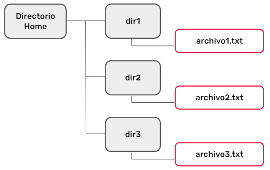

## Verificando nuestro ambiente <a id='c4b2'></a>

Listamos los directorios con la instrucción `ls -R`. Deberíamos obtener lo siguiente:

```bash
edorio@DESKTOP-W10:~$ ls -R
.:
dir1  dir2  dir3
./dir1:
archivo1.txt
./dir2:
archivo2.txt
./dir3:
archivo3.txt
```
## Comandospara el manejo de archivos <a id='c4b3'></a>

### ls

Con el comando ls podrás listar los diferentes archivos y directorios de la carpeta de trabajo en la que te encuentres. El comando acepta multitud de opciones, algunas de las cuales veremos a continuación.A continuación, podemos observar el uso más simple del comando ls. Si no le indicamos ninguna opción, enumerará todos los archivos y directorios que se encuentran en la carpeta de trabajo actual, sin tener en cuenta archivos ocultos.

```bash
edorio@DESKTOP-W10:~$ ls
dir1  dir2  dir
```

### ls -a

Con esta opción, el comando te mostrará —en forma de lista— todo el contenido que se encuentre dentro del directorio de trabajo, incluyendo archivos y carpetas ocultos. Dependiendo del shell, algunos tipos de archivos se mostrarán con colores diferentes

```bash
edorio@DESKTOP-W10:~$ ls -a
.         .aws           .bash_logout  .config    .landscape 
.profile                  .vagrant.d  dir3 ..        .azure 
.bashrc       .docker    .local       .ssh    dir1  .ansible 
.bash_history  .cache        .fastlane  .motd_shown 
.sudo_as_admin_successful  dir2
```

### ls -l

Esta opción es similar a la anterior, pero muestra el contenido en forma de lista e incluye información referente a cada elemento. Es de las más utilizadas, siendo especialmente útil a la hora de conocer el propietario y los permisos de cada fichero

```bash
edorio@DESKTOP-W10:~$ ls -l
total 12
drwxr-xr-x 2 edorio edorio 4096 May 21 01:59 dir1
drwxr-xr-x 2 edorio edorio 4096 May 21 01:59 dir2
drwxr-xr-x 2 edorio edorio 4096 May 21 01:59 dir3
```

### mkdir

Te permitirá crear un directorio con el nombre y la ruta que especifiques. Si no le indicás ninguna ruta, por defecto, te creará la carpeta dentro del directorio de trabajo en el que te encuentres

```bash
edorio@DESKTOP-W10:~$ mkdir dir4
```

Caso contrario, le podés indicar que cree un directorio con un path definido dentro de dir1.

```bash
edorio@DESKTOP-W10:~$ mkdir dir1/subdir1
```

### rmdir

Te permite eliminar el directorio que le especifiques. Un detalle importante es que para poder utilizar este comando, el directorio a borrar debe estar vacío

```bash
edorio@DESKTOP-W10:~$ rmdir dir4
```
El de arriba es el uso más simple del comando, sin indicar ruta.

Podemos también borrar un directorio con un path definido.

```bash
edorio@DESKTOP-W10:~$ rmdir dir1/subdir1
```

### rm

Este comando permite eliminar archivos sueltos y directorios que no se encuentren vacíos.

```bash
edorio@DESKTOP-W10:~$ rm dir1/archivo1.txt
```
El de arriba es el uso más simple del comando, sin indicar ruta.Eliminamos 1 archivo específico dentro de dir1

```bash
edorio@DESKTOP-W10:~$ rm -r dir2
```

Con el modificador -r eliminamos el directorio dir2 y, recursivamente, todo su contenido. Es un comando a utilizar con mucha precaución

### cp

Usando este comando serás capaz de copiar archivos y directorios. Así como ubicarlos en otras rutas, definiendo origen primero y luego destino.
```bash
edorio@DESKTOP-W10:~$ cp dir3/archivo3.txt dir1/archivo1.txt
```

El de arriba es el uso más simple del comando, sin indicar ruta. Copiamos en este caso el archivo3.txt, hacia dir1 y lo nombramos archivo1.txt.
En este caso, con el modificador -r copiamos el directorio dir3 en uno llamado dir2, que el mismo comando creo.

```bash
edorio@DESKTOP-W10:~$ cp -r dir3 dir2
```

### mv

Este comando te servirá para mover archivos desde la consola. La sintaxis es muy sencilla, solamente deberás especificar la ubicación de inicio —incluyendo el nombre del archivo— y la ubicación de destino.
```bash
edorio@DESKTOP-W10:~$ mv dir1/archivo1.txt dir3/archivo1.txt
```

Movimos un archivo de dir1 a dir3, conservando su nombre original.
En el siguiente caso usamos el comando mv para renombrar un archivo, ya que las rutas definidas son las mismas.

```bash
edorio@DESKTOP-W10:~$ mv dir3/archivo1.txt dir3/archivo3bis.tx
```

## Comandos para leer archivos de texto <a id='c4b4'></a>

### cat

Este es uno de los comandos más utilizados cuando se trata de manejar archivos de texto (en formato .txt) desde la terminal. Entre sus múltiples opciones, está la posibilidad de crear un archivo e imprimir por pantalla su contenido.
```bash
edorio@DESKTOP-W10:~$ cat >dir1/archivo1.txt
```

Esto nos abrirá el archivo1.txt, permitiendo editarlo. Con la combinación CTRL+D terminaremos la edición y se guardará el contenido.
```bash
edorio@DESKTOP-W10:~$ cat dir1/archivo1.txt
Hola Digital House, esto es CAT
```

Invocando el comando sin el símbolo “>”, nos mostrará por pantalla el contenido del mismo. Se puede usar con el modificador -n, para numerar las líneas y con el -b, con el propósito de no mostrar las líneas en blanco.

### more

Este es otro comando útil para imprimir por pantalla el contenido de un archivo de texto. Esencialmente es igual que el comando cat, con la diferencia que este comando pagina el contenido, por lo que es más adecuado para leer archivos largos.
```bash
edorio@DESKTOP-W10:~$ more /var/log/dpkg.log
```
Nos paginará el archivo en cuestión, de tal manera que en sus últimas líneas lo veremos así:

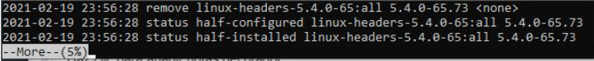

### nano

Nano es un editor de textos para la terminal, que más que para leer archivos sirve para modificarlos y editarlos. Aunque para esta guía también nos vale perfectamente para abrir el archivo y visualizar su contenido desde la línea de comandos.
```bash
edorio@DESKTOP-W10:~$ nano dir1/archivo1.txt
```

Nos mostrará:

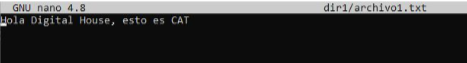

Una vez abierto, en la parte inferior se visualizará las diferentes combinaciones de teclas que necesitarás a la hora de trabajar con archivos.

En la parte inferior se muestran las diferentes combinaciones de teclas que se necesitarán a la hora de trabajar con archivos:
- `CTRL+R`: combinación para indicarle un archivo de texto a Nano para que lo abra y muestre su contenido por la consola.
- `CTRL+V:` estando dentro de Nano y con el archivo abierto en la consola, esta combinación sirve para avanzar a la página siguiente.
- `CTRL+Y`: sirve para retroceder a la página anterior.
- 0` CTRL+W`: sirve para introducir un carácter o grupo de caracteres y buscar en el texto cualquier letra o palabra que coincida con el parámetro de búsqueda.
- `CTRL+X`: para cerrar el archivo una vez que lo hayas terminado de visualizar en la consola. Eso cerrará el editor de texto Nano y volverá a aparecer el prompt de Bash por consola.

### grep

Este comando, perteneciente a la familia Unix, es una de las herramientas más versátiles y útiles disponibles. Se encarga de buscar un patrón que definamos en un archivo de texto. Su primer parámetro es la cadena de texto a buscar, luego el o los archivos (acepta comodines como *, pudiendo con el modificador -r recorrer recursivamente) que vamos a buscar.

```bash
edorio@DESKTOP-W10:~$ grep "Digital House" * -r
```

En este caso, buscamos la cadena “Digital House” en todos los archivos, de manera recursiva, la ejecución nos devolvió lo siguiente:

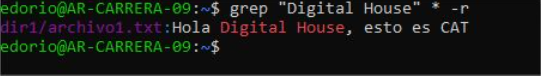

### tee

Lee una entrada estándar y la escribe en la salida estándar y en uno o más archivos. De forma normal, en la redirección de salida, las líneas del comando se escriben en un archivo, pero si queremos ver dicha salida al mismo tiempo, no podemos. ¡Usando el comando tee sí es posible lograrlo! 
```bash
edorio@DESKTOP-W10:~$ ls -l | tee listado.txt
```

En este caso, además de mostrarnos el directorio, el mismo será guardado en un archivo
```bash
edorio@DESKTOP-W10:~$ ls -l | tee -a listado.txt
```

Utilizando el modificador -a, se agregará el contenido al archivo, sin pisar lo anterior.

<!-- fin resumen pdf -->

> Ver PDF: Comandos Utiles - parte 2.pdf

<!-- inicio resumen pdf -->

## Obtener datos desde un web service <a id='c4b5'></a>

La terminal de Linux tiene tanta versatilidad y potencia que nos permite vincularla con un web service, obtener datos de allí y procesarlos con propósitos tales como agregarlo a archivos en nuestro servidor, modificarlos y republicarlos.Las opciones son muy variadas, por ejemplo obtener un JSON desde una URL externa, procesar su contenido, obtener el o los atributos que nos interesen y —en función de ello— crear nuevos archivos, insertarlos en una base de datos.

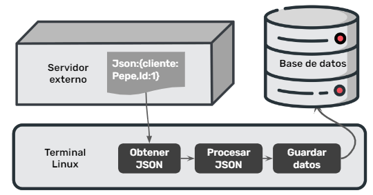

## Comando cURL <a id='c4b6'></a>

### Aspectos técnicos

Es un comando disponible en la mayoría de los sistemas basados en Unix. Es una abreviatura de “Client URL”. Los comandos de cURL están diseñados para funcionar como una forma de verificar la conectividad a las URL y como una gran herramienta para transferir datos.El comando tiene una amplia compatibilidad con los protocolos más usados

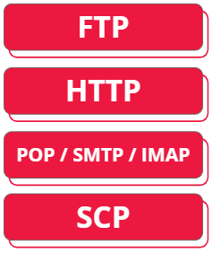

### Sintaxis básica

El uso más simple de cURL es mostrar el contenido de una página. El siguiente ejemplo mostrará la página de inicio de digitalhouse.com:
```bash
edorio@DESKTOP-W10:~$ curl https://www.digitalhouse.com
```

Como vemos, no es muy útil esto, ya que es dif ícil llegar a información que nos pueda ser de utilidad visualizándola solamente en pantalla. Pero si usamos el modificador `-o`, podremos escribir ese contenido HTML de la página de inicio en un archivo en nuestro equipo:
```bash
edorio@DESKTOP-W10:~$ curl https://www.digitalhouse.com -o mipagina.html
```

Esto guardará todo el HTML en el archivo mipagina.html.

### Descargas

El uso de este modificador puede extenderse a procesar descargas:
```bash
edorio@DESKTOP-W10:~$ curl https://ubuntu.zero.com.ar/ubuntu-releases/20.04/ubuntu-20.04.2.0-desktop-amd64.iso -o ubuntu.iso
```

Descarga la ISO de la URL de referencia y la nombrará **ubuntu.iso**
```bash
edorio@DESKTOP-W10:~$  curl https://ubuntu.zero.com.ar/ubuntu-releases/20.04/ubuntu-20.04.2.0-desktop-amd64.iso -O -C 0
```

En este caso, no renombramos el archivo de destino (con el modificador -O). Además, permitimos la continuidad de la descarga con el modificador -C.

### Encabezados y verificaciones

El modificador -v nos permite verificar la conectividad hacia un sitio remoto
```bash
edorio@DESKTOP-W10:~$ curl https://www.digitalhouse.com -v
```

Esto nos brindará, además del contenido, datos como la IP de destino, protocolos de seguridad y certificados utilizados.
```bash
edorio@DESKTOP-W10:~$  curl https://www.digitalhouse.com -I
```

El modificador -I nos muestra todos los encabezados de la solicitud, tales como ruta por defecto, publicador web, entre otros.

### Contenido JSON

Viendo todas las opciones brindadas, nos podemos imaginar lo útil de este comando con el propósito de obtener el contenido en formato JSON desde un endpoint que lo entregue en dicho formato. Por ejemplo, la API de OpenStreetMap, la cual nos devuelve una dirección pasándole las coordenadas, con la siguiente URL:
<https://nominatim.openstreetmap.org/reverse.php?lat=-34.60378&lon=-58.38161&zoom=18&format=jsonv2>
```bash
edorio@DESKTOP-W10:~$  curl "https://nominatim.openstreetmap.org/reverse.php?lat=-34.60378&lon=-58.38161&zoom=18&format=jsonv2" -o resultado.json
```

Allí estamos guardando en el archivo resultado.json lo obtenido en el web service. Notemos el detalle de colocar la URL entre comillas simples o dobles.

## El comando jq <a id='c4b7'></a>

### Aspectos técnicos `./jq`

JSON es un formato de datos estructurados ampliamente utilizado que se utiliza normalmente en la mayoría de las API y servicios de datos modernos. Es particularmente popular en aplicaciones web debido a su naturaleza liviana y compatibilidad con JavaScript.

Desafortunadamente, shells como Bash no pueden interpretar y trabajar con JSON directamente. Esto significa que trabajar con JSON a través de la línea de comando puede ser engorroso e implica la manipulación de texto utilizando una combinación de herramientas como sed y grep

Allí es donde aparece jq, un potente procesador JSON para la consola.

### Sintaxis básica

`jq` se basa en el concepto de filtros que funcionan sobre un flujo de JSON. Cada filtro toma una entrada y emite JSON a la salida estándar. Tomando el archivo JSON obtenido con cURL, una ejecución sencilla de jq nos devuelve todo el contenido del JSON.
```bash
edorio@DESKTOP-W10:~$ jq '.' resultado.json
```

Como vemos, no vamos a acceder a ningún atributo en especial, ya que con el modificador ‘.’ no se lo indicamos

### Accediendo a propiedades

Para poder acceder a una propiedad específica es necesario indicarla luego del punto, con el nombre de la misma
```bash
edorio@DESKTOP-W10:~$ jq '.display_name' resultado.json
```

En este caso, accederemos a la propiedad display_name del JSON. Si queremos acceder a varias propiedades, las separamos por coma

```bash
edorio@DESKTOP-W10:~$ jq '.display_name,.type' resultado.json
```

De esta manera, accedemos a display_name y type

> TIP: Si alguna propiedad tuviese un espacio en su nombre, debemos envolverla con comillas dobles

## Combinación de uso de ambos comandos <a id='c4b8'></a>

### Combinar comandos con pipelines

Para poder combinar el poder de cURL con el recurso y la capacidad de proceso de jq debemos combinarlo usando pipelines. Para ello vamos a realizar una introducción a una de las características más interesantes que tiene la terminal.El pipeline o tubería es una función que permite utilizar la salida de un programa como entrada en otro.

El pipeline en Linux se representa con la barra vertical (|), la cual dividirá los comandos. Por ejemplo, si nosotros queremos saber la IP de nuestro equipo, lo hacemos con la instrucción:

```bash
edorio@DESKTOP-W10:~$ ip address
```

Esta nos devolverá muchísimos datos (MAC, protocolos, direcciones IPv4 e IPv6, entre otros). Si quisiéramos filtrar dentro de ese texto por la cadena “192.168”, lo deberíamos llevar a un archivo y allí buscar con grep.

```bash
edorio@DESKTOP-W10:~$ grep “192.168” miarchivo.txt
```
Pero es aquí en donde aparece la magia del pipeline, ya que podemos combinar ambas sentencias en una.

Para ello, primero colocamos nuestra sentencia inicial, sabiendo que tipo de salida puede tener, separamos con el pipeline y colocamos la segunda sentencia.

```bash
edorio@DESKTOP-W10:~$ ip address | grep "192.168"
```

Allí el grep nos indicará la línea coincidente con “192.168”. Nuestro pipeline podría seguir aplicándose sin límites más allá de aquellos que imponga el sistema operativo, por ejemplo cantidad de procesos en ejecución

### Aplicar el pipeline con cURL y jq

Conociendo el uso básico del pipeline, vamos a aplicarlo a la obtención de datos externos y el parseo de una propiedad específica, la cual la guardaremos en un archivo. Nuestro comando tendrá tres partes

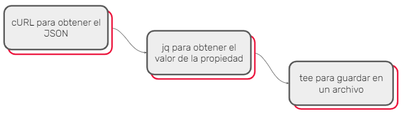

### Aplicar el pipeline con cURL y jq

En este caso, vemos cómo la sentencia obtiene el JSON con cURL, lo procesa con jq para obtener el display_namey el type, y finalmente lo guarda en un archivo llamado consultapipe.txt

```bash
edorio@DESKTOP-W10:~$ curl "https://nominatim.openstreetmap.org/reverse.php?lat=-34.60378&lon=-58.38161&zoom=18&format=jsonv2" | jq ".display_name,.type" | tee consultapipe.txt
```
> Ver PDF: comandos

<!-- HACER -->
<!-- fin resumen pdf -->

> 
> Ver PDF: Ejercitación - Comandos basicos.pdf
>
> Ver PDF: Ejercitacion

**Notas: Clase 4** <a id='c4s'></a>

<!-- resumen clase en vivo 4 -->

Run time levels, capas de linux al arrancar
Son estadios del kernel de Linux

[Link: Run level](https://searchdatacenter.techtarget.com/definition/runlevel)

En el run level 5 repasaremos comandos de Linux

Para apagar la maquina desde la consola, hay que pasar por esos niveles.
Primero hay que hacerlo desde el usuario `root`

Apaga el sistema
```bash
/sbin/init 0
```

Reinicia el sistema
```bash
/sbin/init 6
```

Para saber en que level estamos
```bash
who -r
```

Donde estamos ubicados
```bash
pwd
```

### cat

concatena informacion de archivos y crea uno nuevo

  cat nombrearchivo1 nombrearchivo2 > nombrearchivo3

tambien crea archivos
```
cat > lista_nombres
```
Se queda titilando esperando que in Lo guardo con `ctrol + D` y con `ctrol + x` salimos del archivo.

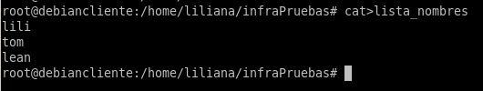

Lo consultamos con 

```
nano lista_nombres
```

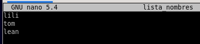

con `control + x` salimos del archivo

con cat tambien podemos convertir un archivo a mayusculas o minusculas.

## ;

Ejecuta las cosas sencuencialmente, primero uno, luego otro...

## &&

Ejecuta si el segundo comando si el anterior fue exitoso, no usa la salida del comando anterior.

## pipeline

conecta un comando con otro, devuelve un resultado/salida del comando que esta anteriormente
usa la salida de un comando para otro comando.
El pipeline, agarra el resultado del primer comando lo guarda en memoria y lo usa para el proximo comando

## grep

Hace una busqueda y nos va a devolver lo que le pedimos que buscara, en este caso que traiga todas las ip que comiencen con: `192.168`

```bash
ip address | grep "192.168"
```
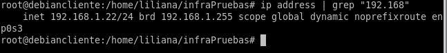

Busca dentro de un archivo, o dentro de un resultado y devuelve el resultado pedido

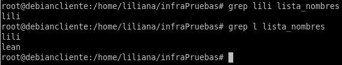

## sudo eleva permisos del superusuario

En debian no esta instalado por defecto, en ubuntu si
con sudo en debian, no es necesario estar como root cuando tienes el sudo, ya que sudo eleva los permisos como superusuario; directamente se puede instalar:

```bash
sudo apt-get install curl
```

## curl

Es una aplicacion consultar paginas web desde la terminal
Consultar json, bajar un archivo.

Pagina que sirve para consultar comandos `cheat.sh`

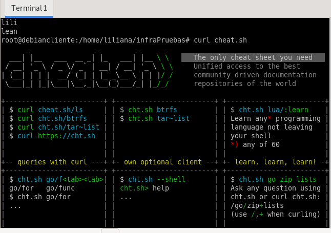

En esta pagina `cheat.sh` podemos consultar para que sirven comandos 

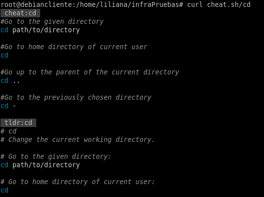

## chmod 

Cambia los permisos de lectura, escritura y ejecucion
Una forma facil de usar chmod es con sus valores numeros

usando la numeric representation: `rwx`
**_Read Write Execute_**
El primer digito habla sobre el duenio/usuario, el segundo es el grupo de usuarios(user group en linux: son los usuarios que estan dentro de un grupo de usuarios; los usuarios activos que estan dentro del servidor), y el tercero es el mundo; otros que no estan dentro del grupo.

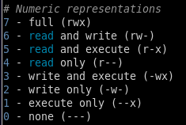

Ej: Si le quiero dar permiso para todo:

```bash
chmod 777
```

Ej: Solo permiso de lectura

```bash
chmod 400
```
Ej: Archivo de lectura y ejecucion

```bash
chmod 505
```

## ping

mide el tiempo de respuesta, se puede hacer con el tiempo de respuesta local o de otros servidores.
Se usa para medir servidores de una aplicacion y queremos medir el tiempo de respuesta.

```bash
#Dice que mande solo 5 paquetes, que mida 5 veces el tiempo de rfespuesta
ping -c 5 "192.168..."
```

## Abrir varias consolas a la misma vez

`control alt f2` abre otra instancia
`control alt f1` vuelve a la anterior

No paran, siguen funcionando en segundo plano

## Actividad en clase 

### Listar servicios del sistema <a id='c4s1'></a>

Listar todos los servicios que se estan ejecutando en el sistema 

```bash
systemctl list-unit-files --type service --all
```
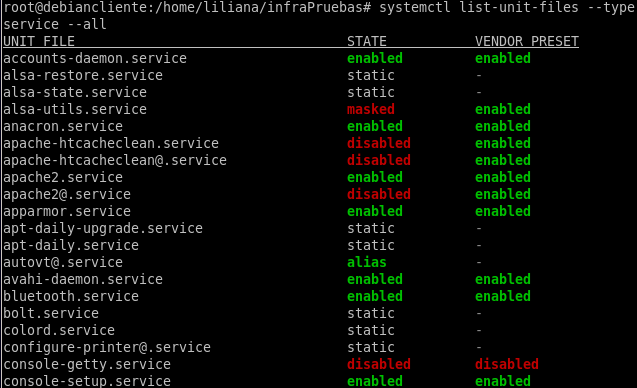

Pararemos el apache2 que habiamos instalado
```bash
sudo systemctl stop apache2
```
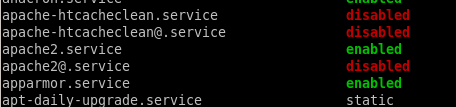

Prendiendo de nuevo apache
```bash
sudo systemctl start apache2
```

Para sacar a apache del inicio, cuando se activa la vm
```bash
sudo systemctl disable apache2
```
Para activar el serivio de apache desde el inicio
```bash
sudo systemctl enable apache2
```

Para ver el status, si esta corriendo o no
```bash
sudo systemctl status apache2
```

## Analizando los datos que van y vienen <a id='c4s2'></a>

Analizar los datos que van y vienen de nuestros servidores

>`netstat` esta deprecado

## ss -plnt

`ss -plnt` muestra los puertos que estan abierto escuchando la maquina

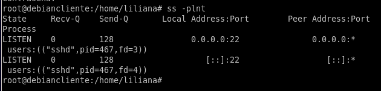

>Para borrar paquetes: `apt-get remove nombredeloquequieroborrar`

## tcpdump

Sirve para monitorear un puerto que este siendo utilizado por un servicio
Se usa para analizar y monitorear paquetes de red
Monitorea el trafico de red de un determinado puerto

```bash
tcpdump -i enp0s3 port 80
```

puede cambiar el nombre, lo verificamos con `ip address`
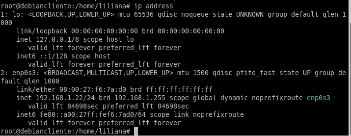

<!-- fin resumen clase en vivo -->

# C5 - Shell Scripting - Parte II <a id='c5'></a>

## Scripting <a id='c5a'></a>

**Automatizar procesos de tareas al sistema**

En esta clase vamos a presentar la interfaz de Bash como un shell de Unix, donde el usuario puede programar que se ejecuten órdenes al sistema operativo. Bash nos sirve para comunicarnos con nuestro sistema. Un ejemplo claro es la forma de automatizar la orden de realizar un backup cada determinado tiempo de la base de datos.

> Ver video: Introduccion a bash

<!-- inicio resumen pdf -->

## Interaccion con sistema operativo de una forma automatizable

`bash` es una interfaz que interpreta las ordenes que el usuario le hace al sistema ejecutado en una consola de UNIX
Tambien se pueden leer y ejecutar ordenes desde un archivo llamado script que nos permite hacer persistente una lista de tareas a realizar por el sistema operativo
Tambien es un lenguaje de scripting, lo que lo hace una herramienta muy potente para la administracion de sistemas y automatizacion de tareas 

Para ejecutar multiples comandos en un solo paso desde el shell, podemos escribirlos en una sola linea y separarlos en `;`

Creamos un nuevo archivo
```bash
touch myscript
nano myscript


Shebang: #!
```

Define que shell usaremos, `bash` the shell en nuestro caso
```bash
#!/bin/bash
```
Los comandos de shell se escriben 1 por linea

<!-- fin resumen pdf -->


<!-- FIN resumen -->

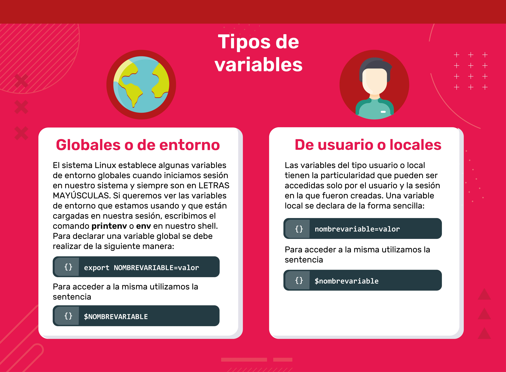

## Bash scripting <a id='c5b'></a>

¡Ahora sí! Manos a la obra. En este apartado vamos a tener nuestros primeros scripting realizados por nosotros. De a poco nos introduciremos en las estructuras de control de los algoritmos de programación.

> Ver PDF: Estructuras de control

<!-- inicio resumen pdf -->

## Estructuras de control <a id='c5b1'></a>

### Sentencia if-then <a id='c5b1a'></a>

Los scripts de Bash necesitarán condicionales. Normalmente nos imaginamos un escenario tal como “Si el valor es menor que 10, hacé esto, si no hacé aquello”. Para ello utilizamos if-then. La estructura más básica de la sentencia `if-then`es así:

if command; then
hacer algo
fi

```bash
#!/bin/bash
if whoami; then
  echo "It works"
fi
```

### Sentencia if-else <a id='c5b1b'></a>

La sentencia `if-then-else` toma la siguiente estructura:

if comand; then
hacer algo
else
hacer otra cosa
fi

Si el comando se ejecuta y retorna cero (lo cual significa éxito), no ejecuta los comandos después de la sentencia else. Por otro lado, si la sentencia if retorna un número distinto de cero (lo cual significa que la condición no se cumple), el shell ejecuta los comandos después de la sentencia else. En el ejemplo que sigue vemos cómo nos devuelve un mensaje de acuerdo si el comando ping fue satisfactorio.

```bash
#!/bin/bash
ping -c 1 8.8.8.8
if [ $? -ne 0 ]; then
echo "No está en red"
else
echo "Sí está en red"
fi
```

## Comparaciones numéricas <a id='c5b1c'></a>

Podemos realizar una comparación numérica entre dos valores numéricos utilizando las sentencias de esta tabla

| | |
------------------- | -------
number1 -eq number2 | Comprueba si number1 es igual a number2.
number1 -ge number2 | Comprueba si number1 es más grande o igual number2.
number1 -gt number2 | Comprueba si number1 es más grande que number2.
number1 -le number2 | Comprueba si number1 es más pequeño o igual number2.
number1 -lt number2 | Comprueba si number1 es más pequeño que number2.
number1 -ne number2 | Comprueba si number1 no es igual a number2.

Teniendo en cuenta que la sentencia de comparación se encuentra entre corchetes, ejemplificamos:

```bash
#!/bin/bash
num = 11
if [ $num -gt 10]; then
  echo "$num is bigger than 10"
else 
  echo "$num is less than 10"
fi
```

## Comparaciones de cadenas <a id='c5b1d'></a>

Podemos realizar una comparación de cadena entre dos valores alfanuméricos utilizando las sentencias de esta tabla

| | |
------------------- | -------

`string1 = string2`   Comprueba si string1 es idéntico a string2.
`string1 != string2`  Comprueba si string1 no es idéntico a string2.
`string1 < string2`    Comprueba si string1 es menor que string2.
`string1 > string2`   Comprueba si string1 es mayor que string2.
`-n string1`          Comprueba si string1 es mayor que cero. 
`-z string1`          Comprueba si string1 tiene una longitud de cero.

Podemos aplicar la comparación de cadenas en nuestro ejemplo. Si estamos logueados como root, va por el **if**, si no por el **then**

```bash
#!/bin/bash
user="root"
if [ $user = $USER ]; then
echo "The user $user&nbsp; is the current logged in user"
fi
```
## Cálculos matemáticos <a id='c5b1e'></a>

Podemos realizar cálculos matemáticos básicos utilizando la sintaxis $ ((2 + 2)):

```bash
#!/bin/bash
var1=$(( 5 + 5 ))
echo $var1
var2=$(( $var1 * 2 ))
echo $var2
```
<!-- fin resumen pdf -->

> Ver PDF: Ejemplo en Bash.pdf

## Ejemplo en Bash <a id='c5b2'></a>

<!-- inicio resumen pdf -->

## Preparacion de entorno


<!-- subir al inicio -->
[🚩 subir al indice](#up)

