# Introduccion a la informatica

[Glosario tecnico](https://view.genial.ly/6038fe0b21b4a20d66aa5233)


## Introducción a la terminal

terminal nos referimos a un software o programa contenedor que ejecuta un shell.
Un shell, es la interfaz de línea de comandos con la que vamos a interactuar, se encarga de procesar datos y devolver resultados.

> *Hace décadas, este era un dispositivo físico que consistía en poco más que un monitor y un teclado*


### `Terminal` 

Entonces, **una terminal es una interfaz que nos sirve para comunicarnos con una computadora**.

**Una consola es un tipo especial de terminal**. Para empezar a escribir en la consola es necesario hacerlo a través de **líneas de comandos**.

### `Lineas de comandos`
Es una instrucción específica dada a una aplicación informática para realizar algún tipo de tarea o función. **Permiten a los usuarios dar instrucciones por medio de textos sencillos como mostrar archivos**, crear archivos, mostrar datos, llamar procesos, entre otros.

Esos comandos son propios y generalmente varían según el sistema operativo.

[Comandos terminal bash](https://drive.google.com/file/d/1jPrmvt1oKPOh4MVzERW3t6izRl4ZUG_O/view)

[Diferencias CLI vs GUI](https://assets.digitalhouse.com/content/ar/td/iif/CLI%20vs%20GUI_Mesa%20de%20trabajo%201C2A.png)

[Que hacer con la terminal](https://view.genial.ly/60475ea26498a30dc36cdffc)

> comando tiene argumentos y acciones: Ej: ls (**argumento**) -t(**opciones**)

```
pwd // donde estas ubicado
cd // cambio de directorio
ls // muestra todos los archivos del repositorio
ls -t //ordena por fecha de modificacion
ls -a //lista hasta ocultosls
ls -R //lista el contenido y archivos que hayan
ls -lah //lista permisos, duenio, fecha...
cp // copiar archivos
cd / //hace que vayamos al home
cd .. //volver atras
cd ../carpeta/ //va para atras y se mete en la carpeta
mkdir //crea carpetas
touch //crea archivos
rm //remove
rm * //borra todos los archivps de la carpeta, sin pasar por consola
rm -r carpeta/ //borra recursivamente

```
### `Ruta absoluta`
Ruta completa, **pwd**, se usa la barra **` / `** al comienzo de la ruta, es mas precisa

### `Ruta relativa`
Damos la indicacion desde donde estamos parados.

[Busqueda: Find y Grep](https://view.genial.ly/60afb06cf42d920d778de964)

```
find -name //busca por nombre
find -size //busca por tamanio de archivo
find || grep -i //no tiene encuenta mayus, en find o grep
find || grep . //Busca a partir donde estamos ubicados.
grep -n //muestra la linea donde hay coincidencias dentro de archivos
grep -r // Busca en carpetas recursivamente
find || grep " " // cuando buscas un termino que tenga mas de 2 palabras
```
---
- El lenguaje que usamos en la consola e git bash es **bash**
- PowerShell es la consola mas potente

### Scripts

Archivos ejecutables, acciones automaticas usamos `nano`

```
echo //print de pantalla

```
creamos un script:

```
nano carpeta.bat
#!/bin/bash
echo "print algo"
echo " "
mkdir carpeta
cd carpeta
echo "fin proceso"
```
elegimos `control + o` enter `control + x`

```
chmod + x //Para modificar el script
chmod + x script.sh //cambia el tipo de archivo
tar //comando para comprimir
```

# Introducción a Git

Es una herramienta que tiene muchos beneficios:
Trabajar en grupo de forma colaborativa, comunicar cambios, manejar distintas versiones.

`git` es un software de control de versiones.
Pensado para la eficiencia y confiabilidad del mantenimiento de aplicaciones cuando estas tienen un gran numero de archivos de codigo fuente.
Su proposito es llevar registro de los cambios y coordinar el trabajo que varias personas realizan sobre los mismos.

- util para compartir proyectos con diferentes personas
- tener versiones del mismo proyecto
- guardar proyectos en la nube

**Satisface 2 necesidades**

1. Backup de nuestros archivos constantemente actualizado
2. compartir nuestro trabajo con los demas colaboradores de nuestro trabajo.

### **Creando un `repositorio local`**

Un repositorio sea local o remoto es un almacen de archivos; como una estantería, **donde seran almacenados los archivos** en pequenios commits.


Desde la terminal nos ubicamos en la carpeta y escribimos:

```
git init
```

Esto genera un repositorio local vacio, ya que hay que especificar que archivos deseamos agregar.

Los commits son el historial de cambios que se fueron haciendo en el proyecto; generan un punto cronologico en la linea de tiempo del proyecto, esto permite hacer un seguimiento de los cambios que se van realizando, dado que cada uno de ellos tiene una *time-stamp* y un autor.

Para hacer el seguimiento hay que agregarle nuestra identidad:

```
git config user.name "aqui va usuario"
```
podemos corroborar que lo agregamos bien:

```
git config user.name
```
agregamos nuestro mail de git

```
git config user.email "aqui va mail"
```
y tambien lo podemos corroborar:

```
git config user.email
```
podemos guardar la configuracion de forma predeterminada:

```
git config --global user.name "aqui va usuario"
git config --global user.email "aqui va mail"
```

despues de crear la url del repositorio en `Github`
posicionados en la carpeta donde creamos el repositorio local agreamos el comando:

```
git remote add origin "va url del repositorio de github"
```
Esta accion **sincroniza nuestro repositorio local con el repositorio remoto**.
Podemos verificar la operacion:
```
git remote -v
```
### **Agregar archivos a nuestro repositorio**

Posicionados en nuestro repositorio local:

```
git add nombre_de_archivo
```
Para pedir informacion del estado del repositorio:
```
git status
```
Para agregar **todos** los archivos presentes en el repositorio:

```
git add .
```
Por cada modificacion que se realice en un archivo, git la tomara como un archivo nuevo o indicacion de cambio efectuado. Este es el control de versiones.

Entonces para cada cambio repetirmos, git add

```
git add .
```
### **Confirmando archivos**

Creamos commits, que son pequenios paquetes de adiciones o modificaciones que tendran una marca/descripcion clara y estaran firmados por el autor.
Estos generan puntos cronologicos en la linea de tiempo del proyecto; nos permiten identificar el estado del mismo hasta ese momento especifico y volver a los mismos si quisieramos.

Para crear un commit, necesitamos haber agregado los archivos al repositorio con git add y luego:

```
git commit -m "descripcion de modificacion"
```
Para revisar el historial de cambios en nuestros proyectos; generamos un historial de los commits con:

```
git log
```
Podemos volver a un estado anterior siempre y cuando le hayamos puesto git add con:

```
git checkout nombre_archivo
```
> **Github** Es una plataforma colaborativa que permite llevar un control de versiones. Los repositorios que estan en github se llaman repositorios remotos y los que tenemos en la pc son repositorios locales.

### **Subiendo archivos**

`git push` Una vez hicimos el commit, enviaremos los archivos del repositorios local al repositorio remoto. Donde origin se refiere al repositorio remoto y main a la rama donde queremos insertar los commits.

```
git push origin main
```
Hace push a todas las ramas, creandolas en el remoto.
```
git push -u origin main
```

### **Bajando archivos**

Para generar una copia exacta en la computadora de todos los archivos existentes en un repositorio remoto.

```
git clone "url_del_repositorio"
```

`git pull` Para mantener sincronizados los archivos existentes entre diferentes pc y/o quieras actualizar el repositorio remoto con el local, siempre primero debes actualizar las archivos que hayan sufrido cambios o actualizaciones o hayan nuevos archivos con:

```
git pull origin main
```
### **Resolviendo conflictos**

Cuando 2 personas o mas modifican el mismo archivo.
Traemos los cambios con
```
git pull origin main
```
veremos en el documento algo como:
```
<<<<<<<<<<<<<<<<<<<<<<<<<HEAD
__aqui_van_nuestros_cambios__
=============================
__cambios_traidos_de_github__
>>>>>>>>>>>>>>>>>>>>>>>876769
```
Aqui decidiremos que haremos, si dejamos cambios nuevos mas los nuestros, si cambiamos los 2 cambios o dejamos los viejos.
una vez resuelto, volvemos a preparar los commits con `git add .`

> Una manera de evitar conflictos es hacer commits pequenios y el uso de ramas paralelas a la version principal.

### **Ramas**

Es una linea paralela que actua como copia alternativa del repositorio, en la cual podemos agregar funcionalidades sin modificar la linea original ni afectar el codigo que hay ahí.
Es una version 2 del proyecto en la cual puedo probar cosas nuevas y si gustan las puedo fusionar con la rama principal.

Para crear una nueva rama:
```
git branch nombre_rama_nueva
```
Podemos ver las ramas creadas con:
```
git branch --list
```
Muestra todas las ramas locales y remotas:
```
git branch -a
```
Para eliminar una rama:
```
git branch -d nombre_rama
```
Para forzar la eliminacion de una rama:
```
git branch -D nombre_rama
```
Para movernos de una rama a otra usamos:
(en visual code esquina izquierda podemos movernos tambien)

```
git checkout nombre_rama
```
> Solo podemos movernos a otras ramas si no tenemos cambios, si tenemos modificaciones y necesitamos cambiar de rama debemos eliminarlos o hacer commits.

Para guardar los cambios y subirlos al repositorio, ubicados en nuestra rama:

Traemos los nuevos posibles cambios de la rama con:
```
git pull origin nombre_rama
```
en caso que no haya conflicto o se haya resuelto:
```
git push origin nombre_rama
```
### **Fusionar con rama principal**

Luego de haber hecho los `git push` a nuestra rama. Mergearemos con la rama main.

Para eso nos cambiamos a la rama main:

```
git checkout main
```
Primero traemos los posibles cambios que se hayan dado en la rama principal:
```
git pull origin main
```
Podemos verificar que todo este bien con :
```
git status
```
Si esta todo limpio, es hora de mergear:
```
git merge nombre_rama
```
Ahora el contenido de mi rama esta en la rama main.
Con `git log` vemos que al hacer el merge se genera un commit automatico.
Luego, si hago un `git status` me avisara que la rama remota esta desactualizada por lo que hare un git push con los cambios.

```
git push origin main
```
Cuando tengamos que agregar mas archivos a mi rama.
Nos dirigimos a nuestra rama:
```
git checkout nombre_rama
```
Podemos verificar el ultimo commit para saber si nuestra rama esta desactualizada o no con:
```
git log --oneline
```
Si esta desactualizada, debemos emparejarlas, tenemos que mergear la rama main a mi rama, es decir el proceso inverso:

```
git merge main
```
[Guia de la mochila](https://docs.google.com/document/d/1UagYcWhfh-4T1eY8x3XcSeziYmJ-lkJu4rrOTAId1Hs/edit)

33333333333333333333333333333333333333333333333333333333333333333333333

# C14 - Lenguaje de programación

El lenguaje es un sistema compuesto por signos que las personas utilizamos para poder comunicarnos. Entonces, no sería tan disparatado pensar en utilizar un sistema para poder comunicarnos con la computadora.

Los lenguajes de programación son los medios a través de los cuales damos instrucciones a la computadora para indicarle lo que nuestro programa debe hacer. Estas instrucciones se componen de una serie de pasos (algoritmos) que deben ser claros y precisos, es decir, no pueden contener ambigüedades.

Por ello, no podemos darle instrucciones en nuestro lenguaje natural, sino que debemos realizarlo mediante un lenguaje formal.

En relación a lo anterior, podemos clasificar los lenguajes de programación de acuerdo a diversos criterios. 

- hay que ser especificos al programar
- Se da a traves de pasos que se llaman algoritmos
- los lenguajes formales para dar instrucciones los llamamos lenguajes de programacion
- cambian con el tiempo

Existen muchos lenguajes de programacion, divididos en:

1. especificos 

Resuelven problemas puntuales
ej: para realizar graficos matematicos

2. generales 

Aplicaciones distintas, independiente del contexto

hay lenguajes de programacion de

1. alto nivel

mas cercanos al lenguaje natural, que al lenguaje maquina de `0 y 1`
ej: Javascript

2. bajo nivel

Son utilizados para dar instrucciones especificas y utilizar al maximo los recursos disponibles
hay qeu estar atentos al hardware


# Paradigmas de programación

Un paradigma es una forma de pensar bajo un modelo preestablecido. Pero… ¿qué es un paradigma de programación?

**Es una manera o estilo de programación de software**. Existen diferentes formas de diseñar un lenguaje de programación y varios modos de trabajar para obtener los resultados que necesitan los programadores. 
Se trata de un conjunto de métodos sistemáticos aplicables en todos los niveles del diseño de programas para resolver problemas computacionales.

Los lenguajes de programación adoptan uno o varios paradigmas en función del tipo de órdenes que permiten implementar. Estos paradigmas varían dependiendo de nuestros intereses y necesidades.

decada 60:
- formas de programacion estrcuturada, codigo linea tras linea
- pensar otro modelo de programacion
- otras reglas para programar, representando los objetos de la nave, con estado interno y funcion, ahi nacio el lenguaje de programacion: **simula** y el paradigma de programacion orientado a objetos.

> a la forma de pensar bajo un modelo, se le llama paradigma

[Paradigmas de programación](https://view.genial.ly/606da0a1c1da530d9635eb62)

## Paradigma estructurado
- sigue una linea de pensamiento
- se suele ejecutar una instruccion a la vez
- acotado set de instrucciones
- utilizado en el desarrollo de sistemas

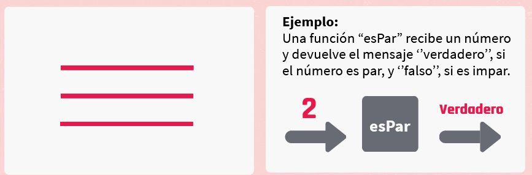

## Paradigma de programacion orientado a objetos

- el codigo puede agruparse
- se agrupa de tal forma de representar la entidad
- interpreta mensajes
- utiliza abstracciones 
- crea entidades

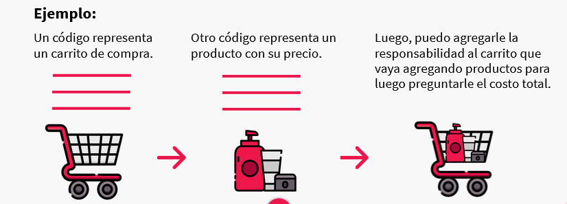

## Paradigma funcional

- se basa en funciones matematicas
- Tiene la propiedad de **inmutabiliadad**, devuelve el mismo valor:
    La fortaleza del paradigma radica en que siempre que a la funcion x se le pasa el valor A, esta siempre va a devolver el valor B.

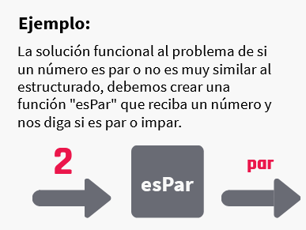

## Paradigma logico

- utiliza reglas logicas para consultar al sistema
- infiere de las reglas logicas que hacer

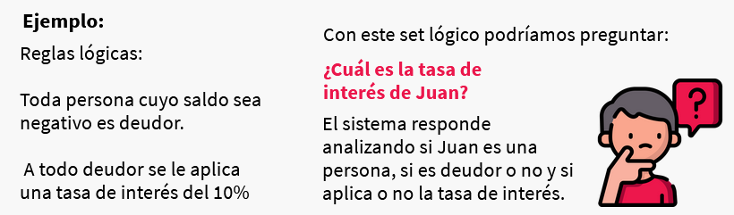

## Paradigma de programacion con lenguaje especifico de dominio

- resuelven problemas superespecificos

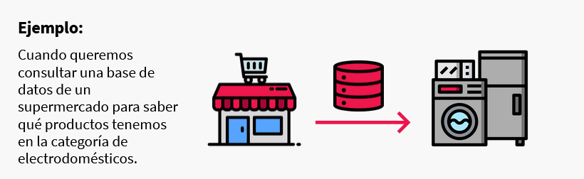

## Multiparadigma

- lenguajes modificados para dar soluciones en distintos paradigmas 

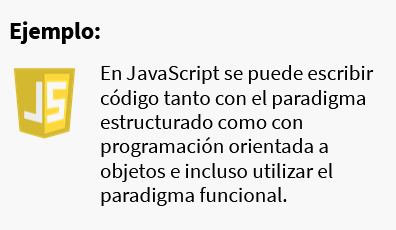

# Del código al ejecutable

Cuando escribimos un código, podemos hacerlo en un lenguaje similar al nuestro, pero… ¿cómo hace la computadora para entender este código?

A continuación, veremos cómo trabaja el compilador, esta increíble herramienta que convertirá nuestro código en instrucciones que la computadora pueda entender y ejecutar: el código máquina.

**Como interpreta la maquina**

Un programa puede estar escrito en distintos archivos y distintos lenguajes.

las instrucciones pasan del codigo que escribimos al codigo que la maquina entienda, esta traduccion se llama `compilacion`

**`Compilacion`**

Toma todo el codigo fuente y lo transforma en el programa ejecutable escrito o codigo maquina, listo para ser ejecutado en los dispositivos

El resultado de la compilacion es `el ejecutable` se ejecutara correctamente siempre y cuando la maquina donde se compile sea similar a donde se ejecute

Esto quiere decir:
- Similar arquitectura de CPU
- Sistema operativo similar

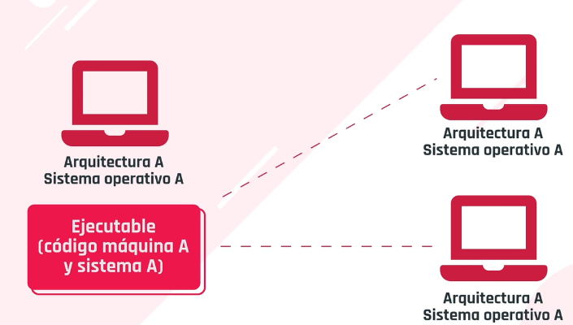


Un codigo puede ser independiente a la arquitectura con:

1. maquinas virtuales VM
Cuando escribimos codigo en la VM, en codigo fuente va a ser compilado a codigo maquina, al codigo que entienda la VM, hay versiones de VM para distintos sistemas, entonces no requerimos volver a compilarlo, la VM va a realizar la traduccion por nosotros al sistema al que se ejecute

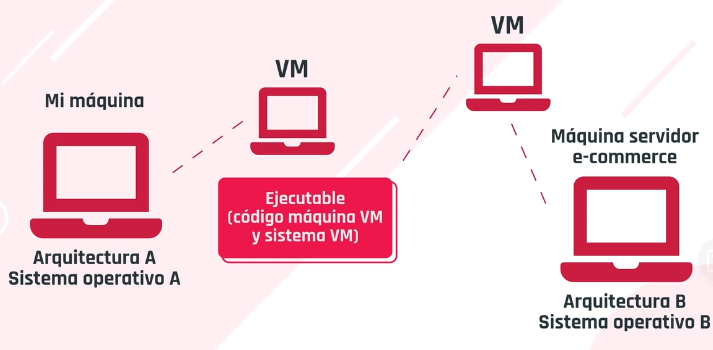

LAs empresas mantienen las VM

2. interprete

Analiza linea por linea en cada sistema donde se ejecuta el codigo fuente, traduce en el momento a un codigo maquina que la misma entiende.
Esto permite que el codigo programa pueda ser independiente de la arquitectura, ya que el codigo fuente, no es compilado previamente a codigo maquina para crear el ejecutable

Esta eleccion viene del lado del tipo de lenguaje de programacion que usemos y como fue diseniado. no podemos decidir si se compila o se ejecuta o con una VM.

Tenemos lenguajes de programacion:
- Compilados:
    Se ejecuta velozmente

- Ejecutados en una VM:
    Por la portabilidad de ejecuta primero en la VM, que hace de intermediaria con la fisica.
    Permiten escribir codigos que van a funcionar independiente de en donde corran

- Interpretados
    La traduccion se hace linea por linea cada vez que se ejecuta, eso relentiza la ejecucion del codigo
    Permiten escribir codigos que van a funcionar independiente de en donde corran

La diferencia radica en la performace y el rendimiento

## frameworks

Un framework es un patrón o esquema que ayuda a la programación a estructurar el código, ahorrando tiempo y esfuerzos a los programadores.

Es un conjunto de herramientas que nos facilitan el desarrollo de software. 

Para poder lograrlo incluyen implementos como los siguientes:
- APIs
- Librerías
- Herramientas de depuración
- Edición
- Prototipado
- Programas de soporte

> Flask | ExpressJS | laravel | Vue.js | spring MVC | django | ANGULAR | Ruby on Rails

No están ligados necesariamente a un lenguaje concreto, aunque así sea en muchas ocasiones.

**Por ejemplo**: 
En *Ruby on Rails*, “Ruby” es el lenguaje de programación y “Rails”, el framework.

Sin embargo, no existen impedimentos para definir el mismo framework para lenguajes diferentes.
También es posible que el framework defina una estructura para una aplicación completa, o bien solo se centre en un aspecto de ella.

## Librerias 

Una librería no es más que un conjunto de código que alguien ha realizado para que podamos reutilizar dentro de nuestros proyectos.

El objetivo de una librería no es otro que hacer más fácil y rápido el desarrollo de ciertas funciones dentro de nuestroprograma o aplicación.Normalmente las librerías **están enfocadas a solucionar problemas concretos**. Es decir, no nos brindan una estructura para nuestro proyecto, pero sí **van a ayudar a resolver funcionalidades específicas**.

> SQLite | jUnit5 | axios | React.JS | GRUNT | Redux

**Librerías vs. Frameworks**

Una `librería` es un código escrito previamente, ya utilizado por otros desarrolladores, listo para que lo utilicemos y pretende hacernos la vidamás fácil y su trabajo másrápido

Un `framework` es un esqueleto. Podría decirse que es como el marco de una casa. La estructura está predeterminada, y el trabajo del desarrolladores llenar los vacíos con su código

## Editores de texto

Los editores de texto se crearon para mostrar el código de una forma agradable y realizaban algunas acciones muy simples. Sin embargo, los editores de texto modernos, siguen agregando capacidades que solo los IDEs tenían.

Los editores de texto son herramientas mucho más simples y compactas. Proporcionan un entorno de desarrollo simple. 

Los editores de texto tienen la peculiaridad de trabajar con archivos de texto y carpetas, es decir, al abrir una carpeta podemos trabajar con todo lo que hay dentro. 

> Existen editores sofisticados como Atom, Sublime Text y Brackets, los cuales muestran el código de una forma pintoresca y atractiva.

## IDE

Los IDEs, a diferencia de los editores de texto, no trabajan con archivos y carpetas. En su lugar, emplean el concepto de proyectos.

Un **IDE o Integrated Development Environment**(entornos de desarrollo integrado) posee muchas más herramientas que se integran en un mismo programa.
Los IDEs tienen como principal característica que **no trabajan con archivos y carpetas**. 
En su lugar, emplean el concepto de proyectos.
Un proyecto es una carpeta en el disco duro, pero tiene la diferencia que **el IDE crea archivos adicionales al código para optimizar la experiencia del usuario**.

En estos archivos puede tener configuraciones de ejecución, deploy, tipo de proyecto, etc. Debido a que los IDEs son plataformas muy complejas, es posible hacer un sinfín de cosas, y los plugins que ofrecen son prácticamente ilimitados.

Las características que más resaltan de un IDE son:
- Debugger en tiempo real.
- Visualiza gráficamente casi cualquier cosa, desde XML,JSON, UML, bases de datos, interfaces gráficas, etc.
- Ayuda en tiempo real.

# Escritorios remotos

- programas que nos permiten acceder e interactuar con una pc  distancia a travess de una conexion a internet desde donde lo necesitemos
- no requieren conexion de red fisica ni un hardware adicional para vincular las computadoras

Los requerimientos son:

- Acceso a internet
- Ambas computadoras con la misma aplicacion de escritorio remoto
- computadoras encendidas en simultaneo

La computadora a la quese accede de forma remota recibe el nombre de *host*
La computadora desde la que se va a trabajar fisicamente se va a llamar *cliente*

Es posible que varios clientes puedan acceder a un mismo *host* mientras cuente con la capacidad suficiente para soportar las conexiones simultaneas

Ventajas:
- ahorro de recursos
- existen apps pagas y gratuitas

> TeamViewer | AnyDesk | Assist | Chrome Remote Desktop | Windows Remote Desktop

Desventajas
- si el programa no posee es posible objeto de ciberataques
- rendimiento depende de la calidad de conexion a internet

# Máquinas virtuales

Los servidores generalmente solo utilizaban un 30% del total de su capacidad, por lo que el otro 70% estaba constantemente desperdiciado. 
Para solucionar estos problemas de mal aprovechamiento de recursos, se creó la virtualización, lo que nos permite en un mismo equipo poder estar corriendo diversos sistemas operativos que simulan ser computadoras reales. A continuación veremos más sobre este tema.

Una imagen en informática es un concepto que puede dividirse de dos formas.

- La primera es la forma digital de una foto. Es decir, se captura un momento a través una cámara digital, en donde lo que está viendo el fotógrafo queda inmortalizado en un conjunto de bits en un archivo, por ejemplo, con un formato .jpg.

- La segunda manera, en vez de capturar una situación, “fotografía” configuraciones y datos de un sistema de archivos, como un programa o sistema.

El formato más conocido o utilizado del segundo tipo de imágenes es el `.iso`, el cual generalmente se utiliza para hacer copias de sistemas de archivos completos.

De esta manera, la imagen de un programa o sistema operativo puede ser trasladada e instalada en cualquier computadora.

- capaz de contener en su interior un sistema operativo, haciendole creer que e suna computadora de verdad

hay 2 tipos de MV

## De sistemas

emula una pc completa
el lugar donde la maquina es creada se llama `hypervisor` es una capa de software que es instalada sobre la parte fisica y su funcion es asignar parte de la
    - Memoria
    - CPU
    - Disco rigido
    - Otros recursos fisicos

**hypervisor**: 

Sobre el hypervisor podemos crear las maquinas virtuales que querramos y funcionan como una pc real

2 tipos de hypervisor

1. Tipo 1
mas rapido
mas seguro
corre en la parte fisica de la pc
sobre el se crea una o mas amquinas virtuales

2. Tipo 2.
Corre sobre un sistema operativo
es mas lento

- MV De procesos

Emula solo un proceso completo
se comporta de la misma manera
util para desarrollar aplicaciones

ventajas:
probar otros sistemas operativos
ejecutar programas antiguos
ejecutar aplicaciones disponibles para otros sistemas
ofrecen entorno de seguridad
mejora el aprovechamiento del hardware
virtualizacion al almacenamiento y las redes

desventajas:
Son menos eficientes, ya que acceden al ahrdware de forma indirecta
cuando hay varias maquinas se puede afectar el rendimiento

[ver componentes de virtualizacion](https://view.genial.ly/60a95ee45e2a3d0d271c0bbd)

[ver beneficios de la virtualizacion](https://view.genial.ly/60a98f355e2a3d0d271c121c)

# Redes

> ver video: Redes y clasificacion en clase 16

[Clasificacion de Redes](https://view.genial.ly/6071ae84bb4aff0d42db659c)

# Medios de transmision

El medio de transmisión constituye el soporte físico a través del cual el emisor y receptor pueden comunicarse en un sistema de transmisión de datos.

[medios guiados y no guiados](https://view.genial.ly/60744a7d653d280d8693dea3)

## Medios guiados

**Pares trenzados**

Conjunto de pares de hilos de cobre conductores, cruzados entre sí. La forma trenzada del cable se utiliza para reducir la interferencia eléctrica con respecto a los pares cercanos que se encuentran a su alrededor. La velocidad máxima de transmisión es de 1 Gbps y la distancia entre repetidores es de 2 a 10 km.

**Cable coaxial**

Tiene un alambre de cobre duro en su parte central. La velocidad máxima de transmisión es de 2 Gbps y la distancia entre repetidores es de 10 a 100 km.

**Fibra óptica**

Es un enlace hecho con un hilo muy fino de material transparente y recubierto de un material opaco que evita que la luz se disipe. Por el núcleo, es una hebra fina hecha de vidrio o plásticos, se envían pulsos de luz, no eléctricos. La velocidad máxima de transmisión es mayor a 10 Gbps y la distancia entre repetidores es mayor a 100 km.

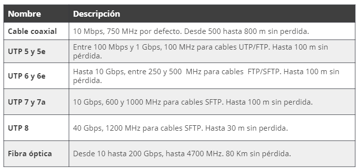

## Medios no guiados

Los medios no guiados transmiten toda su información utilizando el aire como medio de transmisión. Grandes ejemplos en la actualidad de estos medios son el wifi, bluetooth o la comunicación satelital.

**Señales de bluetooth**

Hacen posible la transmisión de los datos mediante un enlace por radiofrecuencia.

**Señales de infrarrojo**

Son ondas direccionales incapaces de atravesar objetos sólidos.

**Señales de wifi**

Permiten la interconexión inalámbrica de dispositivos electrónicos.

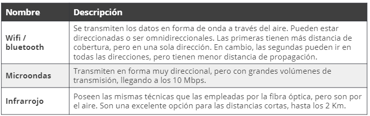

## Lo que se viene

A futuro existen diferentes proyectos que mejorarían notablemente las comunicaciones, aunque algunos son teóricos aún, se esperan grandes resultados de estas tecnologías.

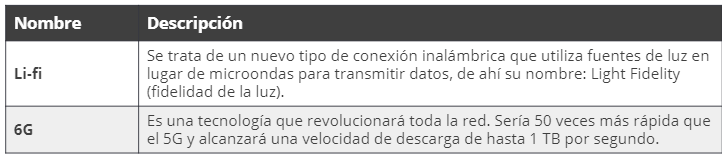

# Velocidades de internet

Internet es una red global donde es posible acceder a casi cualquier tipo de información, mediante la comunicación con cualquier persona o dispositivo en el mundo. Posee las mismas características que las otras redes de comunicaciones de datos. 

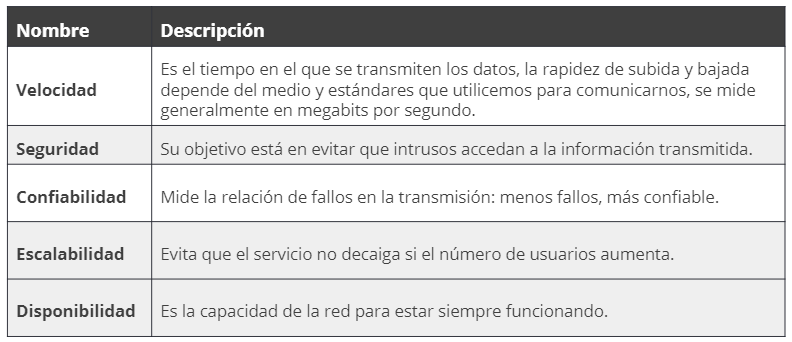

# Bajada de datos

Es la capacidad que tiene Internet para navegar entre la red, es decir, la velocidad con la cual podemos descargar elementos —por ejemplo, páginas web—.

# Subida de datos

Es la capacidad de cargar datos en la Web, por ejemplo, podríamos verlo en el tiempo que demora en subir un video a YouTube.

# Paquetes

Son los bloques en lo que se divide la información al viajar por la red. El pinges el tiempo exacto que demora un paquete de datos en ser enviado de un dispositivo a otro, se mide en milisegundos. 

## Test develocidad

Un test de velocidad, o speedtest, es una herramienta utilizada para evaluar la perfomance de nuestra de red datos o de Internet. En ella podemos ver nuestra velocidad de subida, bajada y ping.Desde aquí podemos ingresar a un test sencillo, que evaluará estos aspectos. Luego de ingresar, hacemos clic en “Inicio”, se realiza el test y, a continuación, nos mostrará una pantalla como la siguiente. 

[Test_velocidad](https://www.speedtest.net/es)

> Ver video: Red en casa

# Componentes red

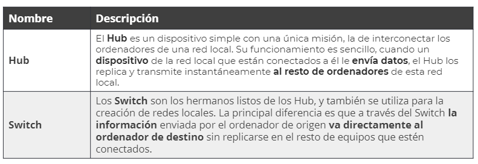

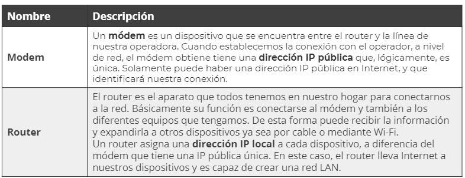

> Ver mas en ppt: Componentes de red

[Problemas de red: Pasos](https://view.genial.ly/60a86042be5e480d57b1c459)

# Modelo OSI

Es un modelo conceptual de interconexión que permite que diversos sistemas se comuniquen mediante un estándar. Se puede entender como un lenguaje universal de comunicación entre redes, computadoras, servidores, etc., que se basa en la idea de dividir un sistema de comunicación en siete capas y cada una de ellas trabaja sobre la precedente.

[Datos_segun_capas_modelo_OSI](https://view.genial.ly/60b299dcfafa9d0d8314a932)

Cuando los datos se envían de un dispositivo a otro, deben viajar hacia abajo a través de cada capa en el dispositivo de envío y luego hacia arriba a través de las capas en el extremo receptor. El diagrama del Modelo OSI ilustra esto mismo:

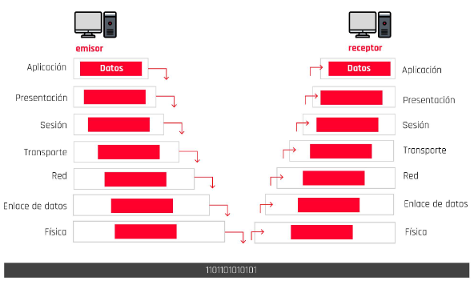

Al comienzo del proceso, los datos se entregan a la capa de aplicación, esta realiza cualquier función que necesite en los datos, luego entrega los datos a la capa de presentación, que los pasa a la siguiente capa y así sucesivamente hasta la capa física.

Al llegar a la capa física, los datos se transmiten por el medio al dispositivo receptor.

En el extremo receptor, los datos son recogidos del medio por la capa física, que luego los entrega a la capa superior. Los datos viajan hacia arriba a través de todas las capas hasta llegar a la capa de aplicación. Luego, la capa de aplicación entrega los datos a la aplicación adecuada.

Ahora, a medida que los datos pasan de una capa a otra, los datos se manipulan de diferentes formas. Por ejemplo, la capa de transporte segmenta los datos y agrega un encabezado al frente de cada segmento. La capa de transporte siempre hace esto con los datos que recibe de las capas superiores; de hecho, está aplicando un protocolo a los datos, un conjunto de reglas que pertenecen a la capa.Las tres capas inferiores del modelo OSI, transporte, red y enlace de datos agrupan los datos de alguna manera y agregan encabezados y, a veces, avances a los datos. Un encabezado contiene información que se adjunta al frente de los datos, mientras que un tráiler es información adjunta al final.

La capa de transporte agrupa los datos en segmentos. Entonces, decimos que la PDU (unidad de datos primaria) de la capa de transporte es el segmento. Agrega un encabezado a cada segmento y entrega cada segmento a la capa de red.

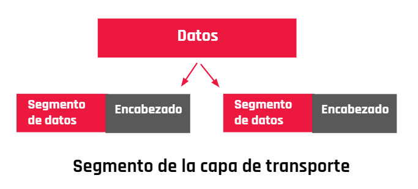

La capa de red convierte cada segmento en un paquete adjuntando otro encabezado. Entonces, decimos que la PDU (unidad de datos primaria) de la capa de red es el paquete. Luego entrega cada paquete a la capa de enlace de datos.

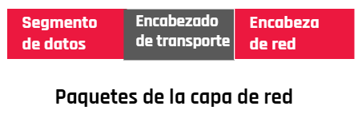

La capa de enlace de datos convierte cada paquete en una trama adjuntando otro encabezado y también un tráiler. Entonces decimos que la PDU (unidad de datos primaria) de la capa de enlace de datos es la trama. Luego entrega cada trama a la capa física.


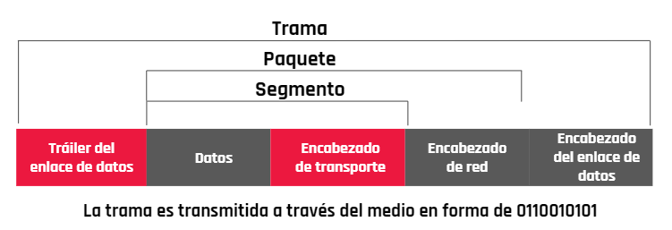

En el extremo receptor, los datos se deben desempaquetar. La capa de enlace de datos elimina el primer encabezado y el final de la trama y pasa el paquete adjunto a la capa de red. Esta capa quita el encabezado del paquete y pasa el segmento adjunto a la capa de transporte. La capa de transporte espera a que lleguen suficientes segmentos y luego ensambla los segmentos para crear el flujo de datos original y lo pasa a los niveles superiores.

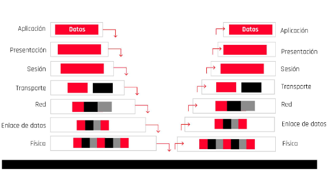

Mediante estos conceptos ahora podemos entender cómo es el flujo de datos entre las diferentes capas de este modelo.

> Todo este proceso también es denominado encapsulación y desencapsulación de datos en el modelo OSI.

# Protocolo de Internet

El protocolo de Internet, conocido por sus siglas en inglés IP —Internet Protocol—, es el protocolo principal de la familia de protocolos de Internet y su importancia es fundamental para el intercambio de mensajes en redes informáticas. Es decir, son normas que nos van a regir el intercambio de información a través de una red de computadoras o dispositivos.

El protocolo IP junto al protocolo de control de transmisiones —TCP o Transmission Control Protocol— sientan las bases de Internet. Para que el remitente pueda enviar un paquete de datos al destinatario, el protocolo IP define una estructura de paquetes que agrupa los datos que se tienen que enviar. Así, el protocolo IP establece cómo se describe la información sobre el origen y el destino de los datos y los separa de los datos útiles en la cabecera de cada paquete de información enviado.

El protocolo IP identifica cada dispositivo que se encuentre conectado a la red mediante su correspondiente dirección IP. La dirección IP se utiliza para identificar de manera unívoca tanto al dispositivo como a la red a la que pertenece, dividiéndose así en dos partes:

- Una dirección que identifica la red.
- Una dirección que identifica al dispositivo dentro de esa red.

No puede haber en una misma red y, por lo tanto, tampoco en Internet, dos dispositivos conectados con una misma dirección IP. La dirección IP es única y exclusiva para cada equipo conectado a Internet.

Pero, normalmente, no solemos memorizar las direcciones IP, sería casi imposible memorizar las IP de las webs a las que queremos acceder. Con este objetivo, se crearon los nombres de dominio. Entonces cada vez que queremos acceder a una página web utilizamos su nombre de dominio, como, por ejemplo, google.com en vez de utilizar su dirección de IP 78.45.789.03

Quien se encarga de estas traducciones entre nombres de dominio y direcciones IP será el protocolo de sistema de nombres de dominio —Domain Name System o DNS— que tenga configurado nuestro dispositivo.

> Ver video: Protocolos - clase 17

[Protocolos de internet](https://view.genial.ly/607c2b39cd833f0cf3c240e8)

## Protocolo de Internet IP

IP —Internet Protocol, en inglés— es un protocolo de comunicación de datos digitales clasificado funcionalmente en la capa de red —que es la que nos proporciona conectividad y la selección de ruta entre dos sistemas hosts—. La función principal es conseguir que los datos lleguen desde origen al destino, aunque no tenga una conexión directa. Estos datos se transfieren mediante paquetes conmutados —método de agrupar los datos transmitidos a través de una red digital en paquetes, estos están compuestos por los datos en sí y la información de control que nos indicará cual es la ruta que debe tomar para que los datos lleguen a destino—.

Este protocolo se encargará de buscar el mejor método de enrutamiento, sin garantías de alcanzar el destino final, pero aun así trata de buscar la mejor ruta entre las conocidas por la máquina que esté usando IP. 

## TCP

El TCP —Transmission Control Protocol, en inglés— garantiza que los datos sean entregados al lugar de destino, sin ningún error y en el mismo orden que se transmitieron. Se encuentra en una capa intermedia entre el protocolo IP y la aplicación y, esta ubicación se debe a que la aplicación necesita que la comunicación de la red sea confiable. El protocolo TCP
da soporte a muchas de las aplicaciones más populares de Internet
—navegadores, intercambio de ficheros, etcétera— y protocolos de aplicación HTTP, SSH, FTP, entre otros.

## DNS

El sistema de nombres de dominio —DNS, en inglés Domain Name System—, es un sistema de nomenclatura jerárquico descentralizado para dispositivos conectados tanto a Internet como a redes privadas, que asocia información con el nombre del dominio. Su función principal es “traducir” los nombres de los dominios que estamos acostumbrados, como youtube.com, en identificadores binarios asociados con los equipos conectados a la red o direcciones IP, como 84.78.754.20.

Para acceder a Internet los usuarios utilizan el nombre de dominio, en lugar de los complejos números de IP, pero ¿de dónde obtiene Internet las direcciones IP correspondientes a los nombres de dominio solicitados? Para ello, Internet utiliza su “agenda grande ” llamada DNS. El servidor DNS proporciona este servicio a Internet.

## TCP/IP

El TCP/IP —protocolo de control de transmisión/protocolo de Internet— consiste en una combinación de los protocolos previamente mencionados y son la piedra angular de las redes informáticas modernas.

## UDP

El protocolo de datagramas de usuario —UDP, en inglés User Datagram Protocol— es un protocolo del nivel de transporte basado en el intercambio
de datagramas —un datagrama es un paquete de datos y un paquete de datos es cada uno de los bloques en que se divide la información para enviar—.
Su función es permitir el envío de datagramas a través de la red sin que se haya establecido previamente una conexión ya que el propio datagrama incorpora suficiente información de direccionamiento en su cabecera.

El protocolo UDP es más ligero ya que no utiliza tantas capas como el protocolo TCP/IP porque no existe un control sobre el envío de los paquetes.
Al ser orientada a la no conexión lo único que le interesa a este protocolo es enviar los datagramas lo más rápido posible, sin tener en cuenta si el paquete llegó completo o no. Se utiliza comúnmente para la transmisión de datos de alta velocidad, por ejemplo para streaming, juegos online, entre otros. 

## HTTP

El protocolo de transferencia de hipertexto —HTTP, en inglés Hypertext Transfer Protocol— es un protocolo orientado a transacciones y sigue el esquema petición-respuesta entre un cliente y un servidor. El cliente
—normalmente un navegador web— realiza una petición enviando un mensaje, con cierto formato al servidor. El servidor —se le suele llamar un servidor web— le envía un mensaje de respuesta, permitiendo la comunicación entre ambos. Tiene como desventaja que no está protegida y podríamos pensar que toda la información está en texto puro. Si alguien intercepta una comunicación, podría ver nuestros datos.

## HTTPS

El protocolo seguro de transferencia de hipertexto —en inglés, Hypertext Transfer Protocol Secure o HTTPS— está destinado a la transferencia segura de datos de hipertexto. Lo que hace es encriptar los datos que son enviados entre clientes y servidores utilizando algoritmos de encriptación, de este modo toda la información sensible, como números de tarjetas, números de teléfono, claves de acceso, entre otros, pueden ser enviados de manera segura. Si alguien intercepta una comunicación, no podría ver nuestros datos sensibles, solamente obtendría un mensaje encriptado y este va a ser muy difícil de desencriptar.


# Protocolo de internet

El protocolo de control de transmisión/protocolo de Internet —TCP/IP— consiste en un par de protocolos que permiten la comunicación entre los dispositivos o computadoras pertenecientes a una red sin importar si el software o el hardware de cada uno es diferente. Este protocolo funciona de la siguiente forma: cuando se transfiere información de un dispositivo a otro —por ejemplo, mensajes de correo electrónico o cualquier otro tipo de datos— esta información no es transmitida de una sola vez, sino que se divide en pequeñas partes. El modelo TCP/IP es usado para comunicaciones en redes y, como todo protocolo, describe un conjunto de guías generales de operación para permitir que un equipo pueda comunicarse en una red. TCP/IP provee conectividad de extremo a extremo especificando cómo los datos deberían ser formateados, direccionados, transmitidos, enrutados y recibidos por el destinatario.

# Refrescando nuestros conocimientos de redes

¿Recuerdan el armado de la red hogareña en donde contábamos con algunos dispositivos como notebooks, tablets y teléfonos, y mediante un router conectado a Internet repartiamos direccionamiento IP y teníamos una red privada con conexión a Internet? ¿Pero qué pasa a bajo nivel de nuestras redes? ¿Cómo es la comunicación?

Para repasar el contenido establecemos en 2 protocolos básicos los tipos de comunicación de los dispositivos que se comunican mediante el protocolo IP.

Estos son TCP y UDP. 

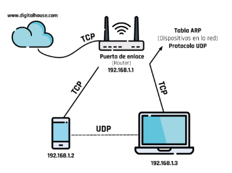

El protocolo TCP (protocolo de control de transmisión) establece una conexión antes de enviar el tráfico, luego envía los paquetes de datos y confirma la recepción.

El protocolo UDP (protocolo de datagrama de usuario) no establece una conexión directa, es decir, el protocolo envía los datos a quien los reciba. Se utiliza para enviar información de manera rápida y sin esperar la confirmación de recepción de los paquetes enviados.

# C19 - Direcciones

De la misma manera que las casas de las personas son identificadas y ubicadas a través de un sistema de numeración o direcciones, la forma de ubicar a las computadoras dentro de las respectivas redes a las cuales se conectan es a través de direcciones. Estas pueden ser:

- MAC
- IP

¡Vamos a conocer un poco más! 