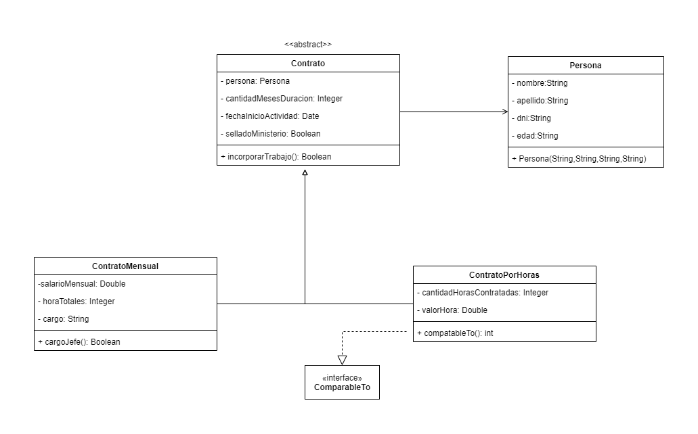

<link rel="stylesheet" type="text/css" media="all" href="../styles.css" />


# Pre - Parcial # 2:

Otro enunciado para practicar POO: Un comercio necesita construir un sistema para administrar los contratos de trabajo que tienen sus empleados.
Un contrato solo puede corresponder a una sola persona y los datos que se necesitan de esta son: el nombre, el apellido, DNI y su edad. Utilizar un constructor que permita asignar todos los atributos al momento de necesitar crear un objeto.
Los contratos además de tener asociado a una persona tienen la cantidad de meses de  duración, fecha en la que la persona inició la actividad y si fue sellado por el ministerio de trabajo. 
Existen dos variantes de contratos: con salario por horas y mensuales. Ambos tienen todas las características que nombramos antes pero los por horas además tienen la cantidad de horas contratadas por mes y el valor de la hora. Los contratos mensuales por otro lado tienen salario mensual, horas totales y el cargo: “empleado”, “supervisor”, “jefe”.

El sistema debe contar con las siguientes funcionalidades:
De cualquier tipo de contrato debemos poder saber si se puede incorporar al trabajo. Para poder incorporarse al trabajo debe estar sellado en el ministerio de trabajo..
En el caso de los contratos por hora debe ser posible compararlos. Un contrato por horas  es mayor a otro de acuerdo a la cantidad de horas contratadas.
Es importante contar con alguna funcionalidad en los contratos mensuales para saber si es un cargo de “jefe”.

En `UML`



En `Persona.java`

```java
package com.company;

public class Persona {
    private String nombre;
    private String apellido;
    private String dni;//no se opera el DNI, ninguna operación matemática
    private Integer edad;

    public Persona(String nombre, String apellido, String dni, Integer edad) {
        this.nombre = nombre;
        this.apellido = apellido;
        this.dni = dni;
        this.edad = edad;
    }
}
```

En `Contrato.java`

```java
package com.company;

import java.util.Date;

public abstract class Contrato {
    private Persona persona;
    private Integer cantidadMesesDuracion;
    private Date fechaInicioActividad;
    private Boolean selladoMinisterio;

    public Contrato(Persona persona, Integer cantidadMesesDuracion, Date fechaInicioActividad, Boolean selladoMinisterio) {
        this.persona = persona;
        this.cantidadMesesDuracion = cantidadMesesDuracion;
        this.fechaInicioActividad = fechaInicioActividad;
        this.selladoMinisterio = selladoMinisterio;
    }

    public Boolean incorporarTrabajo(){
        return this.selladoMinisterio;
    }
}
```

En `ContratoMensual.java`

```java
package com.company;

import java.util.Date;

public class ContratoMensual extends Contrato {
    private Double salarioMensual;
    private Integer horasTotales;
    private String cargo;

    public ContratoMensual(Persona persona, Integer cantidadMesesDuracion, Date fechaInicioActividad, Boolean selladoMinisterio, Double salarioMensual, Integer horasTotales, String cargo) {
        super(persona, cantidadMesesDuracion, fechaInicioActividad, selladoMinisterio);
        this.salarioMensual = salarioMensual;
        this.horasTotales = horasTotales;
        this.cargo = cargo;
    }

    public Boolean cargoJefe(){
        if(cargo.toLowerCase().equals("jefe")){
            return true;
        }
        return false;
    }
}
```

En `ContratoPorHoras.java`

```java
package com.company;

import java.util.Date;

public class ContratoPorHoras extends Contrato implements Comparable {
    private Integer cantidadHorasContratadas;
    private Double valorHora;
    //private Double a = (double) 10;


    public ContratoPorHoras(Persona persona, Integer cantidadMesesDuracion, Date fechaInicioActividad, Boolean selladoMinisterio, Integer cantidadHorasContratadas, Double valorHora) {
        super(persona, cantidadMesesDuracion, fechaInicioActividad, selladoMinisterio);
        this.cantidadHorasContratadas = cantidadHorasContratadas;
        this.valorHora = valorHora;
    }

    @Override
    public int compareTo(Object objetito) {
        ContratoPorHoras contrato = (ContratoPorHoras) objetito;
        return this.cantidadHorasContratadas - contrato.cantidadHorasContratadas;
        /*if(this.cantidadHorasContratadas > contrato.cantidadHorasContratadas){
            return 1;
        }else if (this.cantidadHorasContratadas < contrato.cantidadHorasContratadas){
            return -1;
        }else{
            return 0;
        }*/
    }
}
```

En el `Main.java`

```java
package com.company;

import java.util.Date;

public class Main {

    public static void main(String[] args) {
	// write your code here
        Persona juanito = new Persona("Juanito","Perez","0101",23);
        //El date sale tachado porque ahora es Calendar
        ContratoMensual contratoMensual = new ContratoMensual(juanito,2, new Date(121,8,3),true,232.3,23,"JEFE");

        ContratoPorHoras contratoHora = new ContratoPorHoras(juanito,4,new Date(122,4,12), false, 89,17.5);
        ContratoPorHoras contratoHora1 = new ContratoPorHoras(juanito,4,new Date(122,4,12), true, 89,17.5);
        System.out.println(contratoMensual.cargoJefe());
        System.out.println(contratoMensual.incorporarTrabajo());
        System.out.println(contratoHora.compareTo(contratoHora1));
        System.out.println(contratoHora.incorporarTrabajo());
    }
}
```

## [⏪ Atrás](../README.md)