<link rel="stylesheet" type="text/css" media="all" href="./styles.css" />

<t>Programación orientada a objetos</t>

---

## Índice

1. Introducción a la programación orientada a objetos
<!-- path intellij C:\Users\Leandro\Desktop\Li\courses\CTD\Bimestre_II\programación_orientada_a_objetos -->
- [C1- Que es Java](#c1)
    - [1.1 Bienvenida](#c1a)
    - [1.2 Primer acercamiento a Java](#c1b)
    - [1.3 Primer programa](#c1c)
    - [1.4 Tipos de datos](#c1d)
    - [1.5 ¿Qué es un tipo de dato?](#c1z)
    - [1.6 Actividad PG](#c1pg) 
    - [1.7 Sintaxis Java](#c1y)
    - [1.8 Estructura de control if, for, while, switch](#c1e)
    - [1.9 Clase en vivo](#c1s) üé•
- [C2 - Introducción a Java](#c2)
  - [2.1 Clases > Variables > Tipos de datos](#c2a)
        - [2.1.1 Método .equals()](#c2a1)
        - [2.1.2 Método .comparteTo()](#c2a2)
        - [2.1.3 Paquetes](#c2a3)
        - [2.1.4 String](#c2a4)
        - [2.1.5 String vacía y String nula](#c2a5)
        - [2.1.6 Integer](#c2a6)
        - [2.1.7 Float](#c2a7)
        - [2.1.8 Date](#c2a8)
    - [2.2 Ingreso de datos, Scanner](#c2b)
      - [2.2.1 Clase System](#c2b)
      - [2.2.2 Clase Scanner](#c2b)
        - [2.2.2.1 Instanciación del objeto Scanner](#c2b1)
        - [2.2.2.1 Metodos de Scanner](#c2b2)
        - [Ejemplo paso a paso Scanner](#c2b3)
    - [2.3 Funciones](#c2c)
      - [2.3.1 Definir una funcion > Nombre > Parametros > Devuelto](#c2c1)
      - [Implementación de la función](#c2c2)
      - [Actividad PG > Calculadora > Es divisible](#c2c3)
    - [Array](#c2d)
        - [Ciclos en arrays](#c2d1)
- [C3 - Repaso](#c3)
<!-- HACERNOTAS -->
- [C4 - Objetos y UML](#c4)
    - [Concepto de Objeto y Clases](#c4a)
      - [Análisis de items ⭐⭐⭐](#c4a1)
      - [Ejemplo: Caso veterinaria](#c4a2)
            - [Primera solución](#c4a1a)
    - [Clases](#c4b)
    <!-- - [Atributos, responsabilidades y constructor](#c4c) -->
      - [Diagramar clases y atributos](#c4c1)
      - [Encapsulamiento](#c4c2)
      - [Objetivo: Definir atributos y responsabilidades](#c4c3)
        - [Atributos y responsabilidades](#c4c3a)
          - [Ejemplos de un objeto con sus atributos y métodos ⭐⭐⭐](#c4c5)
      - [Constructor de un objeto](#c4c4)
    - [Encapsulamiento (publico / privado)](#c4d)
      - [Detalles importantes ⭐⭐⭐](#c4d1)
    - [Diagrama UML](#c4e)
        - [Diagrama de clases](#c4e1)
        - [Quiz](#c4e2)
- [C5 - Clases](#c5)
    - [Atributos, constructores  y métodos en Java](#c5a)
      - [Atributos](#c5a1)
      - [Constructores](#c5a2)
      - [Métodos](#c5a3)
      - [Nombres en Java](#c5a4)
      - [Crear una clase en Java](#c5a5)
      - [Crear una clase en el IDE](#c5a6)
    - [Proteger el Encapsulamiento](#c5b)
        - [Métodos de acceso: setters y getters](#c5b)
        - [Uso de setters y getters](#c5b1)
        - [Actividad PG](#c5b2)
    - [Instancia](#c5c)
    - [La clase en Java ⭐⭐⭐](#c5d)
    - [Variables y métodos de clase](#c5e)
        - [Variable de clase](#c5e2)
        - [Métodos de clase](#c5e3)
        - [Ejemplos de uso: La clase Camión](#c5e4)
        - [Actividad PG](#c5e1)
    - [Live coding: Creación de clase y uso](#c5f)
    - [Actividad en clase](#c5s1)
- [C6 - Repaso](#c6)
  - [Actividad: Clase Perro > chip > adopcion](#c6a)
2. Programación orientada a objetos en Java
- [C7 - Relaciones entre clases](#c7)
    - [Introducción: Relaciones entre clases](#c7a)
    - [Representacion en UML de relaciones](#c7b)
      - [Navegación](#c7b1)
      - [Multiplicidad o cardinalidad](#c7b2)
      - [Ejemplos](#c7b3)
    - [Tipos de relaciones](#c7c)
      - [Relación de asociación](#c7c1)
      - [Relación de uso / dependencia](#c7c2)
      - [Relación de Agregación](#c7c3)
      <!-- HACER ejercitarían-->
      - [Relación de Composicion](#c7c4)
      <!-- HACER ejercitarían -->
    - [Implementación en Java](#c7d)
      - [Actividad PG](#c7d2)
- [C8 - Herencia](#c8)
  - [Proceso de abstracción](#c8a)
  - [Relación de Herencia](#c8b)
  - [Relación de herencia en UML](#c8c)
  - [Herencia m√∫ltiple](#c8d)
  - [Generalización y especialización](#c8e)
    <!-- HACER -->
  - [Encapsulamiento y la herencia](#c8f)
  - [Modificador de visibilidad `(#)`](#c8g)
  - [Firma de un método](#c8h)
  - [Sobrecarga de métodos](#c8i)
  - [Sobreescritura de métodos](#c8j)
- [C9 - Repaso](#c9)
<!-- HACER -->
- [C10 - Herencia en Java](#c10)
  - [Actividad PG: Herencia](#c10a)
  - [Sobrecarga en Java](#c10b)
  - [Sobreescritura en Java](#c10c)
<!-- CONTINUAR -->

# C1 - Que es Java <a id='c1'></a>

## ¡Les damos la bienvenida a la materia Programación Orientada a Objetos! <a id='c1a'></a>

Durante la cursada de esta materia vas a adquirir las bases y desarrollar la capacidad de modelar y programar desde la perspectiva del paradigma orientado a objetos. También te va a permitir comprender y analizar los diferentes desafíos que enfrentan los actuales equipos de trabajo al momento de desarrollar.

Los conceptos se aplicarán en el lenguaje de programación Java, uno de los más utilizados para desarrollos en empresas IT hoy en día y el conocimiento de patrones de diseño que resultan fundamentales al momento de diseñar un software.

## Primer acercamiento a Java <a id='c1b'></a>

> ver video: Que es Java
>
> Ver PDF: Instalación IntelliJ Idea y JDK.docx.pdf

### Primer programa <a id='c1c'></a>

> Ver video: Método main.mp4
>
> Ver PDF: Primer programa en Java.pdf

<!-- Resumen pdf-->

en Java el nombre de la clase y el nombre del archivo
deben coincidir —incluso en mayúsculas y minúsculas—.

Esta funcion indica el comienzo del programa

```java
public static void Main(String args[])
```

la forma de mostrar algo por consola,

```java
System.out.println("Mi primer ejemplo ");
```

Con esta instrucción también podemos concatenar un texto literal y una variable.
Por ejemplo:

```java
int num=10;

System.out.println("El valor es " + num);
```

<!-- fin resumen -->

## Tipos de datos <a id='c1d'></a>

### Sintaxis en Java

Vamos a ver cómo se utilizan en Java algunas herramientas que ya conocemos. En algunos conceptos la sintaxis es similar a JavaScript, pero tiene algunas variaciones. Una de las cosas que es bastante diferente es el tratamiento de variables. Vamos a verlo a continuación

> ver PDF: ¿Qué es un tipo de dato.pdf

<!-- Resumen pdf -->

### ¿Qué es un tipo de dato? <a id='c1z'></a>

#### Un lenguaje tipado

Decimos que el lenguaje de programación Java es un lenguaje fuertemente tipado.
Pero esto, ¿qué quiere decir? <r>Un lenguaje tipado es el que me exige una declaración explícita de la variable antes de comenzar a usarla.</r>

### Declaración de una variable

Entonces, para declarar una variable, es necesario indicar el tipo de dato y nombre que se le asigna. Recordar que Java es un lenguaje case sensitive, los tipos de datos siempre se escriben en minúscula. Para los tipos comunes vamos a ver una excepción: el tipo String que siempre lo inicializamos con mayúscula, como en el ejemplo a continuación.

```java
int valor;
double coeficiente;
String nombre;
```

#### Uso de las variables

<r>Una vez declarada la variable, sólo podrá utilizarse con datos del tipo indicado</r>, es decir, una variable de tipo int no podrá almacenar un valor de tipo double, una variable de tipo String no podrá almacenar un valor numérico que se utilice para hacer operaciones aritméticas

### Operaciones aritméticas

Respecto a las operaciones aritméticas, debemos tomar en cuenta que <r>si se opera entre dos variables de tipo entero, el resultado es siempre un valor de tipo entero.</r>
Esto pasa con todos los tipos de datos, es decir, <r>una operación solo puede realizarse con variables del mismo tipo y el resultado mantiene el tipo de dato.</r>
Pero hay una operación en la que podríamos querer cambiar el tipo de dato y que el resultado se diera en otro.

Veamos varias situaciones

<!-- Ver pdf situaciones con enteros y floats -->

> Ver video: Declaración de variables.mp4

### Actividad PG <a id='c1pg'></a>

#### Ejercicio 1

Es hora de que crees tus primeras variables en java
La idea es que crees tres variables una que se va a llamar numeroEntero y va a ser de tipo int una que se va a llamar numeroConComa de tipo double y por √∫ltimo una llamada nombre de tipo string

Luego de declararlas asignarles un valor acorde a su tipo

```java
package com.company;

public class Main {

    public static void main(String[] args) {
        int numeroEntero = 10;
        double numeroConComa = 3.5;
        String nombre = "Lili";
    }
}
```

Como en muchos otros lenguajes de programación, en Java podemos realizar diversas operaciones. Vamos a necesitar realizarlas para poder resolver problemáticas con nuestros futuros programas. A continuación, nos encontramos con ejercicios de operaciones y una Java cheat sheet muy útil con los principales operadores que podemos utilizar en este lenguaje.

#### Ejercicio 2

Ahora ya te damos dos variables creadas, numeroEntero y numeroConComa;
El objetivo del ejercicio es que le asignes un valor acorde a su tipo a cada variable, el valor puede ser cualquiera mientras que respetes el tipo de dato
Luego vas a declarar la variable suma de tipo double, sumar ambos valores y asign√°rselos a suma

```java
package com.company;

public class Main {

    public static void main(String[] args) {

        int numeroEntero = 10;
        double numeroConComa = 3.4;
        double suma;
        suma = (double)numeroEntero + numeroConComa;
    }
}
```

## Sintaxis Java <a id='c1y'></a>

> Ver PDF: Sintaxis Java

| Matematicos              |                                              |
| ------------------------ | -------------------------------------------- |
| Suma                     | +                                            |
| Resta                    | -                                            |
| División                 | /                                            |
| Multiplicación           | \*                                           |
| Módulo                   | % (devuelve el resto de una división entera) |
| Operador unario sumar 1  | ++                                           |
| Operador unario restar 1 | --                                           |

| Operadores lógicos |                                                                             |
| ------------------ | --------------------------------------------------------------------------- |
| Y                  | && (devuelve verdadero si las dos evaluaciones son verdaderas)              |
| O                  | 2palitos (devuelve verdadero si una de las dos evaluaciones son verdaderas) |
| No                 | ! (devuelve lo opuesto al resultado de la evaluación)                       |

| Operadores relacionales |                |
| ----------------------- | -------------- |
| Mayor                   | >              |
| Menor                   | <              |
| Igual                   | == o .equals() |
| Mayor o igual           | >=             |
| Menor o igual           | <=             |
| No igual                | !=             |

| Tipos de datos primitivos |                                                                                |
| ------------------------- | ------------------------------------------------------------------------------ |
| byte                      | N√∫meros enteros entre -128 y 127                                               |
| short                     | N√∫meros enteros entre -32768, 32767                                            |
| int                       | N√∫meros enteros entre -2147483648 y 2147483647                                 |
| long                      | Enteros muy grandes, entre -9223372036854775808 y 9223372036854775807          |
| float                     | N√∫mero con coma -3.402823e38 a 3.402823e38                                     |
| double                    | N√∫mero con coma, mayor capacidad -1.79769313486232e308 a -1.79769313486232e308 |
| string                    | Cadena de caracteres                                                           |
| char                      | Un carácter (Ej: ‘a’) Unicode                                                  |
| boolean                   | Verdadero o falso (true /false)                                                |

## Estructura de control en Java <a id='c1e'></a>

Las estructuras de control en Java tienen la misma sintaxis que en JavaScript.

Contamos con:

✅ Decisión if - switch

✅ Repetición while - for

A continuación recordemos brevemente cómo es su sintaxis.

### Estructura de decision:

```java
if (condición){
//código que se corre si la condición es verdadera
} else if(condición){
//código que se corre si la primera condición no fue verdadera y la segunda sí es verdadera
}else {
// código que se corre si ninguna condición anterior fue verdadera
}
```

```java
switch (variable){
case valor1:
//código que se ejecuta si la variable tiene valor1
break;
case valor2:
//código que se ejecuta si la variable
tiene valor2
break;
.
.
default:
//código que se ejecuta si la variable tiene algún valor no enumerado
}
```

### Estructuras de repetición:

```java
for(Integer i = 0; i < valorM√°ximo; i++){
//código que se ejecuta cada vez
}
```

```java
for(Object object : listaDeObjetos){
//código que se va a ejecutar por cada objeto en la lista
}
```

```java
while(condición){
//hacer este código
}
```

> Ver video: Ciclo for
>
> Ver PDF: Ejercitación estructuras.pdf

### Ejercitación estructuras <a id='c1act'></a>

#### Ejercicio 1

Definir dos n√∫meros enteros. Asignarles un valor a cada uno. Comprobar si un n√∫mero es
divisible por el segundo e indicar mediante un mensaje el resultado obtenido.
NOTA: Que sea divisible quiere decir que al dividir da un valor exacto, es decir, sin
decimales.

```java
package Sincro;

public class C1ejercitaciónEstructuras {
    public static void main(String[] args) {
        int num1 = 10;
        int num2 = 5;

        if (num1%num2 == 0){
            System.out.println("El numero "+num1+" es divisible por "+num2);
        } else {
            System.out.println("Los n√∫meros no son divisibles");
        }
    }
}

// Muestra en consola: El numero 10 es divisible por 5
```

> Ver PDF: Definiendo mascotas / Ejercitación tipo variables.pdf <a id='c1s'></a>

<!-- inicio actividad -->

#### Solución actividad sincrónica

```java
public class c1_actividad_mascotas {
    public static void main(String[] args) {
        // Manchita
        String nombrePerro = "Manchitas";
        Integer edadPerro = 2;
        Double comidaPerro = 1.5;
        String sonidoPerro = "Guau guau guau";
        System.out.println("El perro se llama "+nombrePerro+" tiene "+edadPerro+" años, come "+comidaPerro+" kilos de comida. Y me dice "+sonidoPerro);

        //Nemo
        String nombrePez = "Nemo";
        Integer edadPez = 1;
        Double comidaPez = 0.3;
        String sonidoPez = "Glup glup";
        System.out.println("El pez se llama "+nombrePez+" tiene "+edadPez+" años, come "+comidaPez+" kilos de comida. Y me dice "+sonidoPez);

    }
}
```

<!-- fin actividad sincrónica -->

# C2 - Introducción a Java <a id='c2'></a>

El núcleo de Java son **las clases**, más adelante veremos que son y cómo construirlas.
Pero para comenzar a trabajar debemos comenzar a utilizar las clases propias de Java.

## Variables

En Java encontramos como herramienta para el desarrollo <r>los tipos primitivos, llamamos así a los tipos de datos que solo nos permiten almacenar un valor.</r>
**Por ejemplo:** `int`, `float`, `double` y `char`.
Cuando definimos una variable con estos tipos primitivos, solo podemos almacenar valores.

## Clases

En este caso tendremos un elemento que:

‚úÖ Almacena un valor,

✅ Nos permite realizar ciertas operaciones que ya vienen programadas, a estas operaciones las llamamos métodos.

### Por ejemplo:

`String` es una clase, por eso, se la inicializa en may√∫scula.
**Todas las clases las nombramos con la inicial en may√∫scula**, si definimos:

```java
String nombre;
```

Al utilizar nombre, veremos que nos ofrece los métodos disponibles

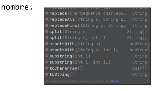

Estas son funciones que ya vienen resueltas y solo podemos utilizarlas con la clase a la cual le pertenece, es decir, <r>**cada clase en Java tiene sus propios métodos**</r>.

Para comenzar a conocer cómo funcionan las clases propias del lenguaje, vamos a nombrar 3 clases que nos resultan útiles —y de hecho String ya la utilizamos en nuestra primera clase—:

‚úÖ String

‚úÖ Integer

‚úÖ Float

> ## üí°
>
> Notemos que todas comienzan con la inicial en may√∫scula.

### Método .equals() <a id='c2a1'></a>

Algo a tener en cuenta <r>cuando usamos estas clases es que no podemos usar operadores como `“==”`</r>, para efectuar una comparación por igual usamos `.equals()`.

Por ejemplo:

```java
nombre.equals(“Juan”)
```

Esto nos devuelve `true` en el caso que en nombre se guarde la cadena “Juan” y falso en caso contrario.

El **`equals()`** se utiliza para comparar por igual, siempre que estemos trabajando con clases.

### Método .compareTo() <a id='c2a2'></a>

Si queremos comparar si un valor es mayor o menor que otro debemos usar `.compareTo()`

Otra cosa a destacar es que una `String` a la cual no le asignamos nada tiene el valor `null`.

> ## üí°
>
> Esto sucede con todas las clases, si definimos un elemento (objeto) de una clase inicialmente tendr√° el valor `null`.

## Paquetes <a id='c2a3'></a>

Para organizar las clases, existen los paquetes, estos son contenedores donde se pueden agrupar las clases. Más adelante los utilizaremos para nuestras clases, pero por ahora debemos saber que <r>también las clases de Java se encuentran agrupadas en paquetes</r>, o como su nombre en inglés: _package_.

## Tipos de dato:

### String <a id='c2a4'></a>

Para utilizar datos de tipo texto, vamos a declararlos como `String`. Las Strings nos permiten utilizar funciones ya programadas, que le pertenecen. Las llamamos métodos.

```java
public static void main(String[] args){
    String nombre;
}
```

A partir de esta variable vamos a ver cómo utilizar algunos de estos métodos de uso frecuente.

Métodos usados:

```java
.length() //calcula longitud del string
.toUpperCase() //convierte a may√∫scula
.equals() //comprueba
.toChar() //obtiene caracteres, en el () indicamos la ubicación
```

#### üìú Ejemplo! <a id='c2a4a'></a>

```java
String nombre= "Juan";
int cantidad;
char inicial;

cantidad = nombre.length();

nombre.toUpperCase();

if(nombre.equals("JUAN")){
    System.out.println("Se pasó a mayúscula");
}
inicial = nombre.charAt();
```

## String vacía

Si aún no hemos asignado nada a las String, entonces, contiene un valor `null`, <r>en ese caso no se pueden usar los métodos.</r>

```java
String nombre;

if(nombre==null){
    System.out.println("Cadena con valor nulo");
}
```

## String vacía y String nula <a id='c2a5'></a>

En una String podemos tener las dos situaciones:
Puede tener un valor nulo o estar vacía.

|                    |                                                                                            |
| ------------------ | ------------------------------------------------------------------------------------------ |
| `String nombre;`   | Cadena que aún no se ha inicializado, esta en null. Aun no puedo utilizar métodos propios. |
| `nombre = "";`     | Cadena vacía.                                                                              |
| `nombre = "Juan";` | Cadena inicializada con el valor "Juan".                                                   |

## Integer <a id='c2a6'></a>

Integer como clase y no como tipo primitivo se utiliza de una forma distinta.

Para comenzar a utilizar un Integer tenemos dos posibilidades:

1. En este caso definimos y creamos un Integer, d√°ndole un valor inicial 0

```java
Integer valor = 0;
```

2. En la segunda forma hacemos algo similar, pero la parte de la izquierda es la definición y la parte de la derecha la creación con un valor inicial 1.

```java
Integer num = new Integer(1);
```

> Cuando solo definimos algo de tipo Integer, su valor inicial es null, es necesario darle un valor inicial.

### üìú Ejemplo!

Comprobamos la relación entre dos números enteros, utilizando clases

Métodos usados:

‚úÖ `.equal()`

‚úÖ `.compareTo()`

```java
Integer valor1 = 10;
Integer valor2 = 30;
int comparar;

if (valor1.equals(valor2)){ //comprobamos si son iguales
    System.out.println("Son iguales");
}
else {
    comparar = valor1.compareTo(valor2); //Compara la relación entre dos valores, si valor 1 es mayor, dará 1, si valor2 es mayor, dará -1
    if (comparar>0){
        System.out.println("valor1 es mayor que valor2");
    }
    else {
        System.out.println("valor2 es mayor que valor1");
    }
}
```

## Float <a id='c2a7'></a>

Float como clase y no como tipo primitivo se utiliza de una forma distinta.
Para comenzar a utilizar un Float tenemos dos posibilidades:

1. En este caso definimos y creamos un Float, d√°ndole un valor inicial `2.5f`, la f quiere decir `float`, si no lo ponemos se asume que es algo de tipo `Double`.

```java
Float coeficiente=2.5f;
```

2. En la segunda forma hacemos algo similar, pero la parte de la izquierda es la definición y la parte de la derecha la creación con un valor inicial 0.5.

```java
Float num = new Float(0.5);
```

Al igual que `Integer`, si no tiene un valor inicial, est√° en `null`

Cuando solo definimos algo de tipo `Float`, su valor inicial es `null`, siempre es necesario darle un valor inicial.

> ## üí°
>
> Las clases `Integer` y `Float` son equivalentes a los tipos de datos primitivos, es decir, me <r>permiten almacenar valores de los tipos indicados, pero adem√°s me dan ciertas funcionalidades.</r> > **Se suele decir que envuelven los tipos primitivos**.
> Ver pdf: String, Integer, Float y Clases String, Integer, Float.pdf

## Date <a id='c2a8'></a>

La clase **Date** permite trabajar con fechas. A diferencia de las clases que vimos hasta ahora, <r>si definimos un objeto de tipo **Date**, no es posible hacerlo vacío</r>. Un objeto Date se crea con un valor inicial que es el de la fecha actual.

```java
import java.util.Date;

public class Main {
    public static void main(String[] args) {
        Date fecha = new Date();
        System.out.println(fecha.toString()); //Muestra la fecha actual
    }
}
```

> Para usar Date es necesario agregar `import java.util.Date;`

Para crear un Date con otro valor, lo hacemos de la siguiente manera:

```java
public static void main(String[] args) {
    Date fecha = new Date(120,11,5);
    System.out.println(fecha.toString());
    //Muestra 5/12/2020
}
```

Los parámetros que usamos son año, mes, día, teniendo en cuenta:
al valor que colocamos para año le suma 1900:

```
1900 + 120 = 2020
```

los meses los enumera desde cero o sea 11 es en realidad 12 (diciembre)De esta forma obtenemos la fecha que necesitamos

> Ver pdf: Ejercitación - Integer,String.pdf

<!-- HACER ejercitación-->

<!--FIN hacer ejercitación -->

### Ingreso de datos, Scanner <a id='c2b'></a>

Muchos elementos de Java son clases, vimos anteriormente String, Integer y Float.
Para realizar la entrada y salida de datos también utilizamos clases propias de Java.

## Clase System

Una clase muy importante es `System`, en ella encontramos `System.in` y `System.out`, que nos permitir√°n <r>interactuar con las entradas y salidas del programa. </r>

Ya vimos que `Sistem.out.println` nos permite mostrar un dato o mensaje.
Para ingresar valores vamos a utilizar `System.in`.

Las entradas se realizan mediante esta clase, es decir, <r>la información ingresa a través de `System.in`, pero para gestionarla y asignarla a las variables utilizaremos los métodos que nos provee `Scanner`</r>.

Veamos de qué se trata.

[Link: Ingreso de datos con Scanner](https://view.genial.ly/60abec1fea8a290d34b9fe66)

## Clase Scanner

Es una clase propia de Java, que nos permite ingresar valores. Tiene métodos, funciones ya programadas, que nos permiten ingresar distintos tipos de datos.

### ¿Cómo lo creamos?

Cuando definimos nuestro elemento de tipo Scanner, nos aparece esta indicación. Esto significa que para poder utilizarlo debemos agregar la clase correspondiente, que se encuentra en `java.util`

```java
public static void Main(String[] args) {
    //write your code here
    Scanner
}
```

**Definición**

Cuando aceptamos la sugerencia, nos agrega el `import`, finalizamos la definición dándole un nombre como lo haríamos con cualquier variable.

```java
import java.util.Scanner;

public class Main {
    public static void main(String[] args) {
        //Write your code
        Scanner lector;
    }
}
```

### Creación / Instanciación del objeto Scanner <a id='c2b1'></a>

Luego de definirlo, es necesario crear el objeto o distanciarlo.

```java
Scanner lector; //Definición del objeto lector
lector = new Scanner(System.in); //creación o instanciación del objeto
```

Lo creamos asociado a System.in, es decir, todo ingreso de datos ser√° interceptado por el Scanner.

### Métodos de Scanner <a id='c2b2'></a>

```java
.nextByte() //para leer un dato de tipo byte.
.nextShort() //para leer un dato de tipo short.
.nextInt() //para leer un dato de tipo int.
.nextLong() //para leer un dato de tipo long.
.nextFloat() //para leer un dato de tipo float.
.nextDouble() //para leer un dato de tipo double.
.nextBoolean() //para leer un dato de tipo boolean.
.nextLine() //para leer un string hasta encontrar un salto de línea.
.next() //para leer un string hasta el primer delimitador, generalmente hasta un espacio en blanco o hasta un salto de línea.
```

> Ver PDF: Ejemplos Scanner.pdf

<!-- inicio resumen pdf -->

### Ejemplo paso a paso Scanner <a id='c2b3'></a>

#### Definición de Scanner

Definimos el Scanner, para luego ingresar los valores en las variable definidas

```java
//Definimos un objeto Scanner, en este caso lo llamamos scanner
Scanner scanner;
//Creamos el scanner a partir del System.in
scanner = new Scanner(System.in);

//Definición de variables para los datos, que necesitamos ingresar
int num1;
int num2;
float coeficiente;
String nombre;
char inicial;
```

#### Ingresar valores numéricos

Ingresamos los datos numéricos. Para lograr una interacción más amigable con el usuario, indicar qué se espera

```java
int num1;
int num2;
float coeficiente;

* //Ingreso de datos de tipo int, se utiliza el método .nextInt()
System.out.println(“Ingrese primer valor”);
num1 = scanner.nextInt();
System.out.println(“Ingrese segundo valor”);
num2 = scanner.nextInt();

//Ingreso de datos de tipo float, se utiliza el método .nextFloat()
System.out.println(“Ingrese el coeficiente”);
coeficiente= scanner.nextFloat();
```

### Ingresar texto

Ingresamos un texto, en este caso un nombre y luego se obtiene la inicial. No hay un método para ingreso de caracteres

```java
String nombre;
char inicial;

System.out.println(“Ingrese su nombre”);
//Ingreso de datos tipo String, se utiliza el método .nextLine()
nombre = scanner.nextLine();
//a partir de la String ingresada en nombre, mediante el método .charAt(0) se obtiene el primer carácter, el parámetro 0 indica que carácter se desea obtener
inicial = nombre.charAt(0)
```

<!-- fin resumen pdf -->

> Ver video: Scanner
>
> Ver PDF: Ejercitación - Scanner.pdf

<!-- HACER pdf -->

<!-- FIN pdf -->

## Funciones <a id='c2c'></a>

> Ver PDF: Funciones

<!-- inicio resumen pdf -->

Las funciones en Java son similares a las vistas en JavaScript, pero hay algunas cosas a tener en cuenta por ser un lenguaje tipado, vamos a tener que definir m√°s cosas.

### Definir una funcion <a id='c2c1'></a>

Para definirla vamos a considerar 3 cosas:

✅ Qué devuelve la función

✅ Qué nombre tiene

‚úÖ Los par√°metros que necesitamos

Cuando decimos qué devuelve nos referimos al tipo de dato que devuelve la función.

Entonces la definición sería en forma general algo de este estilo.

```
Tipo devuelto nombre (parametros)
```

#### Nombre

El nombre debe ser lo m√°s descriptivo posible, no importa si necesitamos unir dos o m√°s palabras, por ejemplo para nombres descriptivos pueden ser:
calcularTotal, asignarTurno, buscarNumeroMasRepetido, suma

#### Par√°metros

No hay muchas diferencias en cuanto a los parámetros, solo que es necesario indicar el tipo de cada uno, entonces para que una función reciba valores lo indicaremos de la siguiente manera.

```
(int num1, int num2)
```

```
(double importe, String descripcion)
```

```
(int cantidad, int posición, String nombre)
```

#### Tipo devuelto

Hasta ahora, las diferencias no fueron tantas, tal vez, esta es la mayor diferencia con la forma en la que aprendimos en JavaScript.
<r>Las funciones pueden devolver un valor de retorno de algún tipo determinado</r>, por ejemplo `int, double, Integer, String`, etc. En realidad pueden devolver cualquier cosa no solo valores, también estructuras enteras, lo veremos más adelante, pero hay que indicar que tipo tiene lo que devolvemos.

Veamos algunos ejemplos

```java
int suma(int num1, int num2)
//devuelve un entero
```

```java
double calcularTotal(double importe, int cantidad)
//Devuelve un Double
```

De esta forma tendremos definida una función con un valor de retorno.

Pero hay otro tipo de funciones, las que no devuelven nada en ese caso en donde
indicamos el tipo devuelto colocaremos la palabra reservada **`void`**.

Veamos un ejemplo.

```java
void mostrarMensaje(String mensaje)
//Cuando no queremos que devuelva nada
```

<r>Usamos las funciones de tipo `void`, cuando queremos que nuestra función sólo realice una serie de pasos o acciones y no nos devuelva nada</r>.

### Implementación de la función <a id='c2c2'></a>

Hasta ahora vimos cómo definir una función, ahora veamos que varía en la
implementación, vamos a tener dos situaciones.

#### 1. Que la función tenga valor de retorno

En el primer caso, debemos incluir un `return` con el valor devuelto, el tipo de este valor tiene que coincidir con el tipo de dato indicado como tipo devuelto.

```java
int suma(int num1, num2){
    return num1,num2;
}
```

> ## üí°
>
> ¬°El valor retornado tiene que ser del tipo indicado!

#### 2. Que no devuelve nada.

En caso de tener una función no tenga tipo de retorno, nos quedaría así:

```java
void mostrarMensaje(String mensaje){
    System.out.println(mensaje);
}
```

<!-- fin resumen pdf -->

> Ver PDF: Ejercitación - funciones.pdf

<!-- HACER -->
<!-- FIN -->

### Ejercicios PG <a id='c2c3'></a>

#### Ej. Calculadora

Vamos a crear nuestras primeras funciones
Tenemos la clase Calculadora que por ahora solo va trabajar con nuestro tipo primitivo int
Tenemos que crearle cuatro funciones a nuestra calculadora sumar, restar, dividir y multiplicar

**Solución:**

```java
public class c2_calculadora_pg {
    public int sumar(int a, int b) {
        int num1 = a;
        int num2 = b;
        return num1 + num2;
    }
    public int restar(int a, int b) {
        int num1 = a;
        int num2 = b;
        return num1 - num2;
    }
    public int multiplicar(int a, int b) {
        int num1 = a;
        int num2 = b;
        return num1 * num2;
    }
    public int dividir(int a, int b) {
        int num1 = a;
        int num2 = b;
        return num1 / num2;
    }
}
```

#### Ej. Es Divisible

Hacer una función que reciba como parámetro dos valores y devuelva un boolean. La función debe comprobar si el primer número es divisible por el segundo.
NOTA: Que sea divisible quiere decir que al dividir da un valor exacto, es decir, sin decimales.

**Solución:**

```java
public class c2_esDivisible {
    public boolean esDivisible(int numero1,int numero2) {
        int num1 = numero1;
        int num2 = numero2;

        if (num1 % num2 == 0) {
            return true;
        } else {
            return false;
        }
    }
}
```

## Array <a id='c2d'></a>

> Ver PDF: Array, diferencia con colecciones.pdf

<!-- Inicio resumen pdf -->

Los arrays son <r>estructuras de datos est√°ticas</r> que permiten guardar elementos del mismo tipo en forma contigua; objetos

Permiten el acceso a sus elementos de forma aleatoria a través de un índice que comienza desde 0 (cero)

> ## üí°
>
> La colección ArrayList tiene este mismo comportamiento y, por ello, su nombre, la colecciones son de longitud dinamica


En Java, <r>un array es un objeto</r> y, como tal, debe usarse el operador `new` **para crear una instancia**, pero a diferencia de las colecciones, <r>los array son de longitud fija</r>, la cual debe definirse en la creación, siendo inmutable.

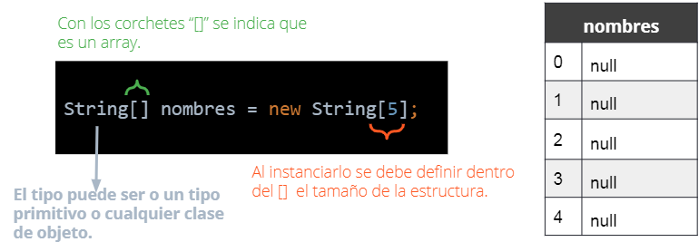

Establecemos valores a un array a través de su índice.
Dado que es una estructura fija, no se pueden eliminar elementos.

```java
nombres[0] = "Juan";
nombres[1] = "Mario";
nombres[3] = "Marcelo";
```


> ### ‚ùå
>
> Intentar acceder a un índice fuera de rango como por ejemplo `nombres[10]` provoca una excepción. (Error)

### Ciclos en array <a id='c2d1'></a>

Podemos recorrer un array a través de un ciclo `for, while o for each` y también utilizar la propiedad `length` que nos indica el tamaño del array

```java
for(int i = 0; i < nombres.length; i++)
    System.out.println(nombres[i]);
```

```java
int i = 0;
while(i < nombres.length) {
    System.out.println(nombres[i]);
    i++;
}
```

```java
for(String nombre : nombres)
    System.out.println(nombre);
```

<!-- fin resumen pdf -->

# C3 - Repaso <a id='c3'></a>

> Ver PDF: Ejercicio 3
>
> Ver PDF: Ejercicio talleres

# C4 - Objetos y UML <a id='c4'></a>

## Concepto de Objeto y Clases <a id='c4a'></a>

Estamos iniciando nuestro aprendizaje de la llamada Programación Orientada a Objetos, que nos va a permitir resolver situaciones problemáticas con un enfoque diferente al de otros paradigmas.
Ahora es como si utilizamos los “anteojos de objetos” para ver nuestro mundo y abstraer la realidad en un programa de puros objetos.

Ahora ya que estamos hablando sobre esto, veamos un video sobre Objetos

> ver video: Concepto de objetos

**Resumen video:**

Un objeto: Es algo que tiene:

✅ Características (o atributos) y

‚úÖ Responsabilidades (dependen del contexto)

Siempre que pensemos en los objetos que van a componer nuestro sistema; <r>tenemos que analizarlos seg√∫n el contexto en el cual estamos trabajando</r>.

### Ejemplo silla

-   Características:

    -   Es de color blanco
    -   Es de pl√°stico
    -   Tiene respaldo

-   Responsabilidades:
    -   Sostenerme al sentarme en ella
        dependiendo del contexto tendria otras como:
    -   golpear un zombie

#### Responsabilidades usuario facebook

-   puede comentar
-   puede postear
-   puede likear

#### Responsabilidades usuario uber

-   Pedir un auto
-   calificar un conductor

> Ver PDF: Analizando un caso.pdf

## Analisis de un caso

Analizar un caso requiere de tomarse un tiempo para :

‚úÖ Comprender el contexto

‚úÖ Tomar nota de los detalles m√°s relevantes

‚úÖ Considerar sus soluciones.

Hay soluciones que pueden amoldarse m√°s a ser eficientes que eficaces.

En este an√°lisis, nos vamos a acotar a lo que les iremos proponiendo mediante distintas consignas.

### Analisis de items <a id='c4a1'></a>

Dentro del análisis de los detalles, es bueno lograr diferenciar ciertos ítems:

1. Cosas que realizan acciones (personas, entidades, m√°quinas, etc)
2. Características (sustantivo)
3. Acciones (verbos)
4. Detalles o requerimientos especiales

### Ejemplo: Caso veterinaria <a id='c4a2'></a>

Analizando el texto donde María detalla cómo sería el proceso de un cliente en la veterinaria podemos **resaltar** las palabras que nos ayudarán luego para sintetizar los requerimientos del sistema.

_“Son las 11 a.m. y entra a la veterinaria por primera vez Juana con su mascota Picha. Las registramos a ambas, anoto el nombre y apellido del cliente y también qué mascota tiene. De la mascota voy a anotar la raza. Juana había pedido previamente un turno con uno de los veterinarios. Juana deja a la perra en la veterinaria para que sea atendida. El veterinario atiende a Picha, le realiza un diagnóstico y lo guarda en el historial de diagnósticos. Más tarde, Juana pasa a buscar a Picha. Los diagnósticos son guardados según la fecha con una descripción y la mascota asociada. De los veterinario — empleados— se conoce el nombre, apellido y matrícula.”_

María nos aclara que la forma de agendar turnos todavía no la tiene definida. Le comentamos que el sistema pronto le va a mostrar el diseño para ver si se había entendido todo bien.

Para empezar con la actividad, destinar 5 minutos con el objetivo de analizar el texto del relato y trata de identificar los ítems con los colores propuestos anteriormente. En la siguiente sección proponemos una posible resolución —no avancemos todavía, no al spoiler—.

#### Primera Solución <a id='c4a1a'></a>

¿Cómo analizar desde el paradigma de objetos?

Tomando las bases de este paradigma podemos realizarnos preguntas que nos ayudan como guía:

**¿Qué objetos participan?**

1. Cliente
2. Veterinario
3. Diagnóstico
4. Historial de diagnósticos

**¬øCu√°les son sus atributos?**

Del Veterinario:

-   Nombre
-   Apellido
-   Matrícula

**¿Qué responsabilidades tienen?**

Del Veterinario:

-   Realiza diagnóstico de las mascota

> ### üí°
>
> Recordemos que su responsabilidad es en este **contexto**

<!-- fin resumen pdf -->

## Clases e instancias <a id='c4b'></a>

Hasta ahora estuvimos hablando de objetos y de sus características, es momento de meternos con otra parte importantisima de la programación orientada a objetos: **las clases**

> #### 🎬
>
> Video: Clases e instancias

**Resumen video:**

Lo primero que debemos hacer antes de crear el sistema, es <r>modelar los aspectos de la vida real que influyen en nuestro contexto</r>

‚úÖ mascotas

✅ dueños

‚úÖ veterinarios

✅ diagnósticos

hay que entender las abstracciones con las que vamos a trabajar. <r>Cada unos de esos elementos se va a traducir como **una clase**</r>

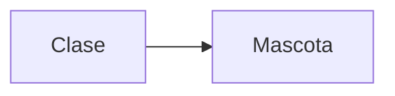
```mermaid
flowchart LR
Clase --> Mascota
```

> ### üí°
>
> Mascota es el molde de lo que representa la idea de una mascota

<r>Los objetos serian instancias concretas de ese molde</r>:
Como los perros los gatos, que representan elementos concretos de nuestro sistema, <r>las instancias pueden ser multiples</r>

instancia y objeto son sinónimos

<r>Nuestro sistema va a tener clases definidas y por cada una de las clases, podemos generar muchas instancias que van a ser las representaciones de los objetos concretos</r>

```java
//clase
class Mascota {
    //instancia
    perro
    gato
    p√°jaro
}
```

<!-- fin resumen video -->

<!-- ## Atributos, responsabilidades y constructor <a id='c4c'></a> -->

> #### 🎬
>
> Video: Conclusion

**Resumen video:**

## Diagramar clases y atributos <a id='c4c1'></a>

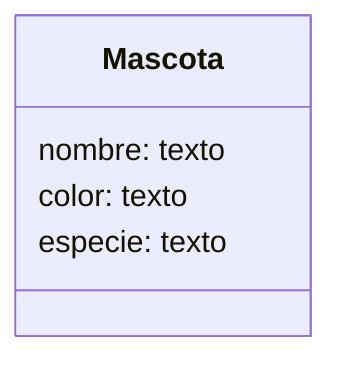
```mermaid
classDiagram
class Mascota{
    nombre: texto
    color: texto
    especie: texto
}
```

Vamos a entender cada `clase` como un **nuevo tipo de dato**

Cada tipo de dato define:

‚úÖ atributos

‚úÖ responsabilidades

Dicho de otra manera, que puedo hacer con ese objeto?

### üìú Ejemplo!

Una lista, es un tipo de dato especifico, al cual podemos pedirle que nos diga la cantidad de elementos que contiene, lo mismo vamos a hacer con las clases que estamos definiendo.

Vamos a agregarle responsabilidades que al estar programando vamos a llamar **métodos**.

Pero como estamos definiendo un tipo de dato desde 0, tenemos que aclarar en nuestro diagrama, todos los metodos; es decir todas las responsabilidades que van a poder ejecutar los objetos de nuestra clase.

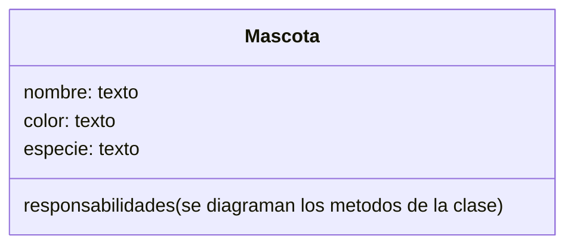
```mermaid
classDiagram

class Mascota{
    nombre: texto
    color: texto
    especie: texto
    responsabilidades(se diagraman los metodos de la clase)
}

```

**por ejemplo**

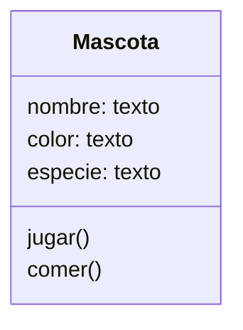
```mermaid
classDiagram

class Mascota{
    nombre: texto
    color: texto
    especie: texto
    jugar()
    comer()
}

```

De esta forma agregamos los métodos a las clases de nuestro sistema

Agregaremos el nombre de la responsabilidad, luego entre parentesis `()` agregaremos los parametros en caso de ser necesario

También podemos definir si un método va a devolver un resultado, señalándolos con `:` y agregando el tipo de dato que va a devolver esa responsabilidad al ejecutarse

Ademas agregaremos adelante del método un `+` si es publico o un `-` si es privado

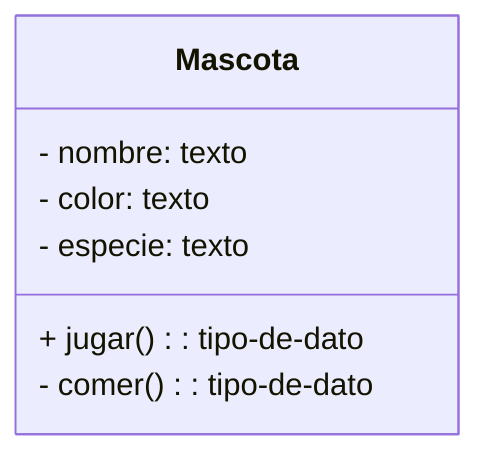
```mermaid
classDiagram

class Mascota{
    - nombre: texto
    - color: texto
    - especie: texto
    + jugar(): tipo-de-dato
    - comer(): tipo-de-dato
}
```

## Encapsulamiento <a id='c4c2'></a>

Porque ponemos los atributos por diseño como privados
Se oculta `el como funciona` y solo deja el enfoque en `que hace`, importa el **`que`**

Cada una de las responsabilidades de nuestra clase se va a modelar como metodos, asi ocultamos las propiedades y el comportamiento interno de los objetos

> ### üí°
>
> Preguntar a la mascota como: decir nombre, decir color, decir especie, se va a explicitar con metodos
>
> Al leer los metodos, se puede saber que se puede hacer con una mascota


**En resumen:** Lo que hacemos es definir un nuevo tipo de dato, con todas las características que lo representan (atributos), y todas las funciones asociadas que podemos ejecutar (Responsabilidades)

<!-- fin resumen video -->

## Atributos y comportamientos <a id='c4c3'></a>

> #### üìë
>
> pdf: Descubriendo Objetos

**Resumen pdf**

### Objetivo: Definir atributos y responsabilidades

Poder definir en los objetos, sus atributos y responsabilidades.

Para eso, en cada ejemplo:
Hacer una lista de los atributos y responsabilidades que descubran.

**Pensá, imaginá y compartí.**

Entonces, ¬øcu√°les son los atributos y las responsabilidades de cada objeto? Siempre pens√° en
lo que tiene que ver con el contexto, es decir, no todo, solamente lo que forme parte de mi
problema.

De los siguientes contextos indic√° los atributos de los objetos a modelar:

|     | Contexto                         | Objeto a modelar                      |
| --- | -------------------------------- | ------------------------------------- |
| 1   | Una f√°brica                      | Empleado                              |
| 2   | Un cine                          | Butaca(o sea, el lugar en el cine)    |
| 3   | Un sistema de facturación        | Artículo                              |
| 4   | Una gestión de servicio mecánico | Auto                                  |
| 5   | Una misión a Marte               | Perseverance(vehículo de exploración) |

**Fin resumen**

## Atributos y responsabilidades <a id='c4c3a'></a>

Entonces, ¿qué son los atributos y las responsabilidades de un objeto?

### Atributos

<r>Los atributos de un objeto son las características y propiedades distintivas que permiten darle significado.</r>
Continuando con el ejemplo visto anteriormente en el video:

-   **Clase**: Veterinaria
-   **Objeto**: Veterinario
-   **Atributo**: nombre, apellido, matrícula

### Responsabilidades

Mientras que <r>las responsabilidades o comportamientos son la manera en que actúa o reacciona un objeto</r> —es decir, **es lo que representa la actividad visible y comprobable exteriormente**—, en la programación orientada a objetos <r>vamos a llamar al comportamiento de los objetos: “**métodos**’, los cuales nos van a permitir establecer cómo van a responder los objetos cuando interactuemos con ellos</r>.

> ### üí°
>
> ¡Atención! Los atributos y comportamientos van a depender del contexto del objeto, tal como hemos visto en el video en el caso de la silla.

Cada método especifica la operación o comportamiento que a su vez puede acceder a la estructura interna del objeto, como así también interactuar con otros objetos. <r>Por lo general, **los encontramos como verbos indicando las acciones que puede realizar el objeto** </r>.

-   **Clase**: Veterinaria
-   **Objeto**: Veterinario
-   **Atributo**: nombre, apellido, matrícula.
-   **Responsabilidades**/**comportamiento**: recibirMascota, curar, HacerDiagnostico.

### Ejemplo: objeto con sus atributos y métodos <a id='c4c5'></a>

> #### üìë
>
> pdf: Ejemplos de un objeto

**Resumen pdf:**

Nuestro contexto es la veterinaria. Ahora vamos a modelar a nuestro **objeto Veterinario** mediante un diagrama. Podemos apreciar cómo modelamos los objetos mediante el lenguaje unificado de modelado, por sus siglas en inglés, UML.

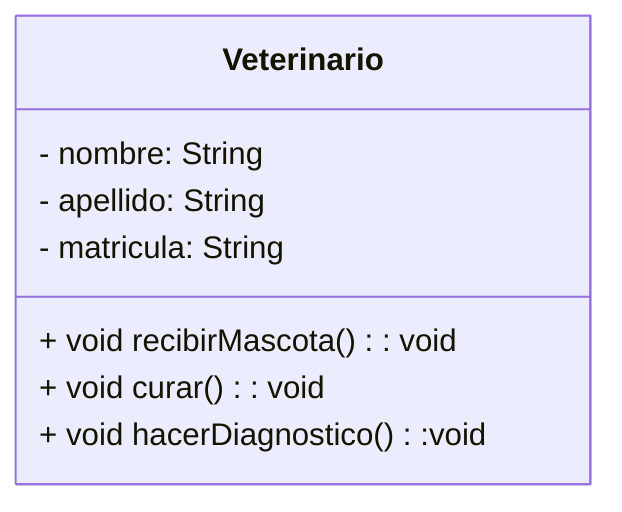
```mermaid
classDiagram
class Veterinario{
    - nombre: String
    - apellido: String
    - matricula: String
    + void recibirMascota(): void
    + void curar(): void
    + void hacerDiagnostico():void
}
```

#### Cambiemos de contexto

Ahora nos encontramos analizando el sistema contable de la clínica veterinaria.
Vamos a modelar nuestro objeto Veterinario para el nuevo contexto

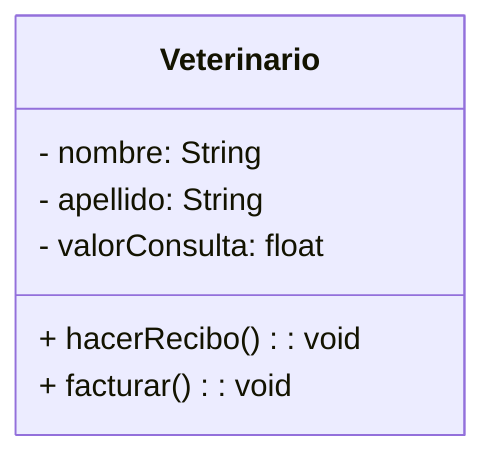
```mermaid
classDiagram
class Veterinario{
    - nombre: String
    - apellido: String
    - valorConsulta: float
    + hacerRecibo(): void
    + facturar(): void
}

```

¬øPodemos ver que ahora hay otros atributos y responsabilidades diferentes?

Ambos son veterinarios, y en cada caso —o contexto— vamos a modelar los atributos y responsabilidades que sean necesarios para lograr la solución de ese problema en particular

> ### üí°
>
> Siempre tenemos que tener en cuenta el contexto de nuestro an√°lisis

**Fin resumen**

## Constructor de un objeto <a id='c4c4'></a>

Ya tenemos claramente definidas las partes de nuestro objeto, ya podemos dejar lista nuestra definición (la clase Veterinaria).

A partir de esa clase, podemos crear los objetos.

Cada objeto tendr√° sus valores propios de cada atributo y ser√° capaz de hacer cada una de sus responsabilidades.

<r>Para poder crear estos **objetos** utilizaremos el **Constructor** que ser√° quien, a partir de la clase, **genera un nuevo objeto**.</r>

Al objeto Veterinario vamos a darle un método constructor:

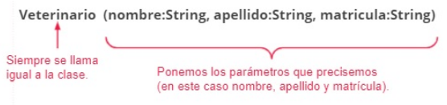

## Encapsulamiento (publico / privado) <a id='c4d'></a>

No todo el mundo no tiene que saber cómo hago yo las cosas
Los objetos son clave para comprender la tecnología orientada a objetos. Tenemos que conocer sus atributos, pero ¿debo cambiarlos?. Claro, como aprendimos desde niños, para usar lo de otro debo pedirlo a su dueño. Por eso:

> ### üí°
>
> es muy importante que en el caso de programación de objetos, cada uno **“oculte”** su manera de guardar sus atributos y los **“exponga”** mediante acciones que cualquiera puede invocar.

Mi manera de recordar mi edad es desconocida para cualquiera, pero cuando me pregunten la edad, van a recibir la información de cuántos años tengo. Y ustedes lo deben hacer de formas diferentes, ¿recuerdan la fecha de nacimiento, cuántos cumplieron o cuántos años más que sus hermanos tienen? Esto se llama encapsulamiento y vamos a estudiarlo a continuación.

> #### üìë
>
> pdf: Qué es encapsular?

**Resumen pdf:**

El encapsulamiento es una de las propiedades más importante de la programación orientada a objetos.

Cuando hablamos de encapsulamiento, no debemos olvidarnos del origen de la palabra “colocar en cápsulas”. ¿Qué serían las cápsulas? Es un envoltorio que protege el contenido en su interior.

> ### üëç
>
> En la POO, buscamos impedir que cualquier otro objeto pueda tener acceso a la estructura interna de un objeto

Solamente yo puedo cambiar o mostrar mi estado y con los métodos específicos que van a indicar cómo pedir cambios en dichos atributos desde el exterior del objeto.

**De ahora en más, cuando diseñamos nuestros objetos, tenemos que tener en cuenta el encapsulamiento.**

### üìú Ejemplo!

Si tuviéramos un objeto `Persona`, que tiene como atributo su clave de acceso bancario, no sería conveniente que todos los objetos puedan acceder libremente a dicho atributo. <r>El objeto Persona debería establecer un método controlado y seguro para devolver la clave de acceso bancario, por ejemplo, si es que se cumplen medidas de seguridad.</r>

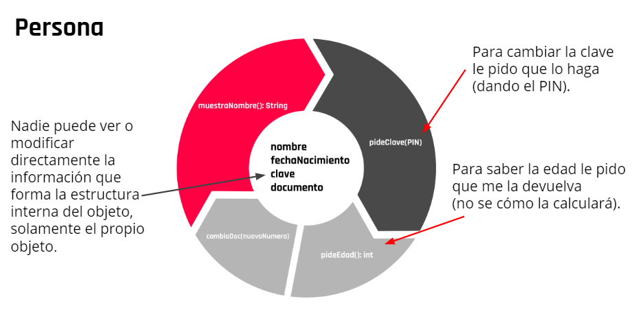

## Detalles importantes a considerar <a id='c4d1'></a>

-   Cuando definamos un objeto, dejar sus atributos privados.
-   Los métodos que sean públicos serán vistos por los otros objetos.
-   Usar siempre métodos públicos para ver o modificar las características de tus objetos.
-   Para cambiar el valor de un atributo se usa un método `set`, por ejemplo, para cambiar el nombre será `setNombre(String)`
-   Para obtener el valor de un atributo se usa un método `get`, por ejemplo, para saber el nombre será `getNombre(): String`

> ### üí°
>
> Los métodos para ver o cambiar atributos se los denomina getters y setters respectivamente.

**fin resumen**

## Diagrama UML <a id='c4e'></a>

**¿Qué es UML?**

UML son las siglas para _Unified Modeling Language_, que en castellano significan: Lenguaje de modelado unificado. Es un lenguaje de modelado, de propósito general, usado para la visualización, especificación, construcción y documentación de sistemas orientados a objetos.

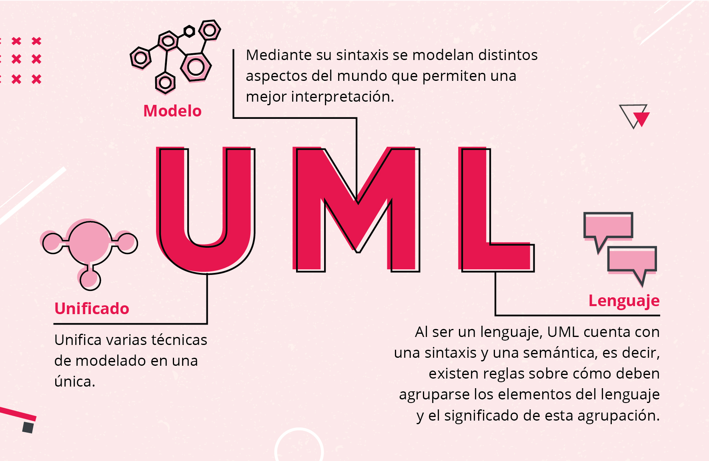

## Diagrama de clases <a id='c4e1'></a>

El lenguaje de modelado unificado (UML) contiene distintos diagramas de estructura, comportamiento e interacción. En este caso, vamos a ver un diagrama de estructura conocido como diagrama de clases, que <r>muestra una vista estática de la estructura del sistema</r>, o de una parte de este, describiendo qué atributos y comportamiento debe desarrollar con los métodos necesarios para llevar a cabo las operaciones del sistema.

¿Cómo le presentamos el sistema de la veterinaria a una persona que nunca vio código en su vida? Con el diagrama de clases vamos a graficar un rectángulo dividido en tres partes por cada tipo de clase que exista. Conozcamos de qué se trata.

[Características: Diagrama de clases](https://view.genial.ly/60b24f2589103c0d7c05a59f)

### Nombre

Nombre de la clase que identifica al objeto en singular y siempre empezando con may√∫scula

### Atributos

Indica los atributos de la clase, tiene en cuenta la visibilidad, el nombre del atributo y el tipo de dato. La visibilidad es una propiedad que permite a un objeto operar sobre otro. Si un objeto no ve a otro, no puede enviarle un mensaje para pedirle su colaboración. Hay tres niveles de visibilidad disponibles:

**Publica**
Se representa con el símbolo `+` e indica que cualquier clase externa con visibilidad hacia el clasificador dado puede utilizar la característica.

`+ atributo:Tipo`

**Privada**
Se representa con el símbolo `-` y solo el propio clasificador puede utilizar la característica.

`- atributo:Tipo`

**Protegida**
Se representa con el símbolo `#` e indica que cualquier descendiente del clasificador puede utilizar la característica.

`# atributo:Tipo`

### Responsabilidades

Indica los métodos de la clase, teniendo en cuenta la visibilidad, el nombre del método, los parámetros y el tipo de dato que retorna el método.

`+ método(parametros):Tipo`

## Draw.io: Software para graficar el Diagrama de Clases

Al momento de poder graficar estas clases, vamos a utilizar un programa que nos facilita el trabajo, aquí hay una breve descripción de cómo usarlo.

> Ver PDF: Draw.io

> ### üìú Quiz <a id='c4e2'></a>
>
> **¬øCu√°l es la diferencia entre clase y objeto ?**
> Una clase es la representación abstracta de objetos de un mismo tipo, mientras que un objeto es una instanciación de una clase.
>
> **Indic√° cu√°les son componentes del objeto.**
> Atributos, nombre, comportamiento
>
> **¿En qué consiste un método en programación orientada a objetos?**
> En la forma en que responden los objetos a los mensajes dirigidos a ellos.

## Reconozcamos en un problema cuales son los objetos

El diagrama de clases y el modelado son fundamentales para la programación orientada a objetos.
Ya tenemos el suficiente detalle para poder hacer un problema m√°s completo.
Es tu turno…. ¡vamos!

> ver PDF: Ejercitación Modelado Objetos.pdf

<!-- HACER -->

> Ver: Ejercitación 1- modelar cuestiones bancarias.pdf

<!-- HACER -->

> Ver: Ejercitación 2- modelar cuestiones bancarias.pdf

**Solución**

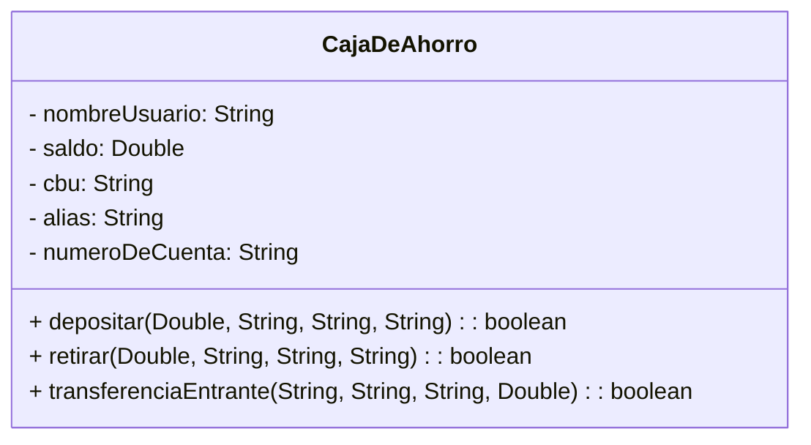
```mermaid
classDiagram
class CajaDeAhorro {
    - nombreUsuario: String
    - saldo: Double
    - cbu: String
    - alias: String
    - numeroDeCuenta: String
    + depositar(Double, String, String, String): boolean
    + retirar(Double, String, String, String): boolean
    + transferenciaEntrante(String, String, String, Double): boolean
}
```

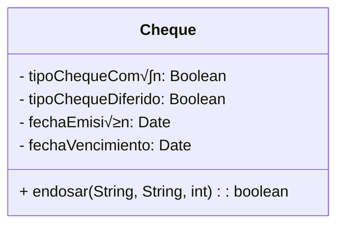
```mermaid
classDiagram
class Cheque {
    - tipoChequeCom√∫n: Boolean
    - tipoChequeDiferido: Boolean
    - fechaEmisión: Date
    - fechaVencimiento: Date
    + endosar(String, String, int): boolean
}
```

# C5 - Clases <a id='c5'></a>

> #### üìë
> pdf: Atributos y metodos, constructores

**Resumen pdf:**

## Atributos, constructores y métodos en Java <a id='c5a'></a>


### Atributos <a id='c5a1'></a>

Los atributos de nuestra clase son:

‚úÖ descripcion 

‚úÖ precioVenta

‚úÖ stock.


**Los atributos de la clase Articulo en Java**

Definimos los atributos como privados para preservar el encapsulamiento.

```java
public class Articulo{

    private String descripcion;
    private double precioVenta;
    private int stock;
}
```

### Constructores <a id='c5a2'></a>

**Los Constructores de la clase Articulo**

En el constructor apareció la palabra reservada `this`, se utiliza para hacer referencia a la instancia u objeto. <r>Cuando creamos una instancia con `new`, se ejecuta el constructor</r>. Esa instancia que estamos creando es la que estamos nombrando con el `this` y al hacer `this.descripcion` nombramos el atributo descripcion de ella.

**El constructor:**


**Los constructor de la clase Articulo en Java**

```java
public class Articulo{
    private String descripcion;
    private double precioVenta;
    private int stock;

    public Articulo(String descripcion, int cantidad,double precio){
    this.descripcion = descripcion;
    precioVenta = precio;
    stock = cantidad;
    }
}
```

✅ El constructor es un método que no tiene tipo de dato, 

‚úÖ Se llama igual que la clase. 

‚úÖ Recibe como par√°metros los valores que se desea asignar inicialmente a los atributos, es decir, los valores iniciales.

‚úÖ Se puede usar para inicializar los atributos.

```java
public Articulo(String descripcion, int cantidad,double precio)

```
> ### üí°
> Para diferenciar el atributo descripcion del par√°metro que tiene el mismo nombre, usamos `this`.
>
> `This` hace referencia al objeto o instancia con el que se est√° trabajando.

```java
this.descripcion = descripcion;
```

### Métodos <a id='c5a3'></a>

**Los métodos de la clase Articulo**

Los métodos de nuestra clase son `hayStock()` y `consultarPrecio()`

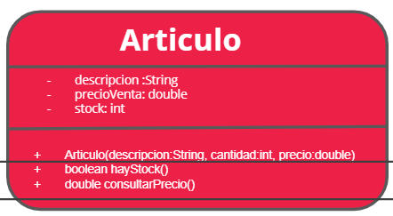

```java
public class Articulo{
    private String descripcion;
    private double precioVenta;
    private int stock;

    +    public Articulo(String descripcion, int cantidad,double precio)

    public boolean hayStock(){
            return stock>0;
    }
    public double consultarPrecio(){
        return precioVenta;
    }
}
```

Método `hayStock()` Devuelve:
- `true` si stock es mayor a 0 
- `false` en caso contrario

```bash
public boolean hayStock(){
    return stock > 0;
}
```

Método `consultarPrecio()` Devuelve:
- el Precio de Venta

```bash
public double consultarPrecio(){
    return precioVenta;
}
```

<!-- fin resumen pdf -->

## Nombres en Java <a id='c5a4'></a>

[Nombres en Java](https://view.genial.ly/60c0aeda7860d10d09dec39c)

<!-- resumen link -->

### Camel Case

Camel case es un estilo de escritura que se aplica a frases o palabras compuestas. El nombre se debe a que las may√∫sculas a lo largo de una palabra en CamelCase se asemejan a las jorobas de un camello.

### Atributos

Los nombres de los atributos comienzan con min√∫scula, si necesitamos usar m√°s de una palabra, a partir de la segunda inicializamos en may√∫scula.
`elAtributo`

### Métodos

Se nombran de la misma forma que los atributos, la primera palabra en min√∫scula y si el nombre tuviera m√°s palabras, todas se inicializan en may√∫scula. Recomendamos poner nombres lo m√°s descriptivos posibles, aunque esto implique usar varias palabras.
`calculoSueldoNeto`

### Objetos

La primera palabra en min√∫scula y si tiene m√°s de una palabra, las siguientes se inicializan en may√∫scula.
`nombre, importeTotal`

### Clase

Los nombres de las clases siempre van con la inicial en may√∫scula, si necesitamos usar dos o m√°s palabras para nombrar una clase van pegadas y con todas las iniciales en may√∫scula.
`CamelCase, Empleado`

### Paquetes

Todas las letras en min√∫scula.

### Constantes

Todas las letras en mayúscula y si hay más de una palabra, separadas por guión.
`IVA, DIAS_SEMANA`

<!-- fin resumen link -->

> Ver PDF: Crear una Clase en Java.pdf

<!-- inicio resumen pdf -->

## Crear una clase en Java <a id='c5a5'></a>

### Planteo

Para resolver un problema hemos detectado la necesidad de una clase Artículo. 

Los artículos tienen:
- nombre, 
- precio de compra, 
- precio de venta y 
- stock disponibles. 

El comportamiento que se espera de ellos es que puedan informar si hay stock disponible y cu√°l es la ganancia obtenida por cada venta, seg√∫n los precios disponibles

### Diseño

Luego de realizar el diseño de la clase en un diagrama, el próximo paso es implementarla:

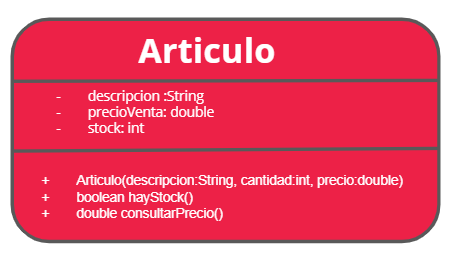

## Crear una clase en el IDE <a id='c5a6'></a>

Creamos una clase en nuestro `package`. 

Al hacer clic con el botón derecho del mouse, obtenemos un menú contextual, seleccionamos **New** y luego **Java Class**.

Luego le asigno un nombre —siempre la inicial en mayúscula—.

**La nueva clase**

Al crear la clase estará vacía. Debemos incorporar los atributos y métodos.
Definiéndolos con el alcance correcto para mantener el encapsulamiento.

>### üëç
> Esto sería los atributos como `private` y los métodos como `public`.

```java
package com.company;

public class Articulo{

}
```

> ### üí° Importante
> - No cambiar nunca el nombre de la clase. El nombre del archivo **.java** debe coincidir con el nombre de la clase.
>
> - Los nombres de las clases siempre deben inicializarse en may√∫scula y deben estar en singular.
>
> - Es importante estar seguros del nombre que le vamos a dar. Java necesita mantener el mismo nombre de la clase como nombre del archivo fuente .java


## Proteger el encapsulamiento <a id='c5b'></a>

Los atributos de una clase deben ser privados, para garantizar el ocultamiento, sin embargo, en alg√∫n momento podemos necesitar consultar o cambiar el valor de un atributo.

### Métodos de acceso

Son métodos públicos que nos permiten acceder al valor de los atributos privados del objeto. 

> ### üí°
> Los métodos modificadores nos posibilitan cambiar el valor de un atributo.
>
> Los métodos consultores u observadores nos devuelven el valor guardado en un atributo.

Para nombrarlos usamos dos prefijos: `get` y `set`.

Debido a estos prefijos se los suele llamar métodos getters y setters.

#### Los métodos get

El primero de estos es para los consultores, por ejemplo,
getNombre, getValor, getSueldo, etc.,

✅ Estos métodos siempre devuelven algo del mismo tipo que el atributo al que acceden

‚úÖ <r>No tienen par√°metros</r> porque solo acceden al valor guardado en el atributo, sin cambiarlo.

#### Los métodos set

Para los métodos modificadores:
setNombre, setValor, setSueldo, etcétera.

✅ Los métodos son de tipo `void`

‚úÖ <r>Tienen un par√°metro del mismo tipo que el atributo al que acceden</r>

‚úÖ El valor que recibe en este par√°metro es el que se asigna al atributo al que acceden.

> ### üí°
> **¡Atención!**
> Si bien cuando comenzamos a hacer nuestras primeras clases ponemos `set` y `get` para todos los atributos, hay que tener cuidado con esto, ya que si queremos proteger los datos, no siempre se debe dejar acceder a ellos mediante un set o get. Esto se debe analizar en cada situación.

> #### üìë
> pdf: Proteger el encapsulamiento

**Resumen pdf:**

## Uso de setters y getters <a id='c5b1'></a>

### Diseño de la clase Articulo

Para lograr el encapsulamiento nuestros atributos son privados:


**Implementación de la clase Articulo**

```java
public class Articulo{
    private String descripcion;
    private double precioVenta;
    private int stock;

+   public Articulo(String descripcion, int cantidad,double precio)
+   public boolean hayStock(){
    }
+   public double consultarPrecio(){
}
```

### Agregar setters y getters

En la clase Artículo, protegimos los atributos, pero si necesitamos acceder a ellos podemos agregar, **métodos de acceso**.

Los métodos que me permitirán acceder a los atributos son: setters y getters

```java
public class Articulo{
    private String descripcion;
    private double precioVenta;
    private int stock;

    public String getDescripcion(){
        return descripcion;
    }
    public double getPrecioVenta(){
        return precioVenta;
    }
    public int getStock(){
        return stock;
    }
    public void setDescripcion(String descripcion){
        this.descripcion = descripcion;
    }
    public void setPrecioVenta(double precio){
        precioVenta = precio;
    }
    public void setStock(int stock){
        this.stock = stock;
    }
```

Los métodos `get` <r>permiten acceder al valor</r> de un atributo para una consulta o para usar ese valor en otra operación.

```java
public String getDescripcion(){
    return descripcion;
}
public double getPrecioVenta(){
    return precioVenta;
}
public int getStock(){
    return stock;
}
```

Los métodos `set` <r>permiten cambiar el valor</r> de un atributo, reciben por parámetro el nuevo valor y lo asignan al atributo correspondiente.

```java
public void setDescripcion(String descripcion){
    this.descripcion = descripcion;
}
public void setPrecioVenta(double precio){
    precioVenta = precio;
}
public void setStock(int stock){
    this.stock = stock;
}
```

Para diferenciar el atributo descripción del parámetro que tiene el mismo nombre, usamos `this`. 
This hace referencia al objeto o instancia con el que se est√° trabajando

```java
this.descripcion = descripcion;
```

### Actividad PG <a id='c5b2'></a>

1. Definir una nueva clase Cliente que contenga los siguiente atributos:

-   nombre de tipo String
-   apellido de tipo String
    no te olvides en java los atributos son privados, crearle getters y setters a ambos para poder acceder a ellos

```java
public class Cliente{
    private String nombre;
    private String apellido;

    public String getNombre(){
        return nombre;
    }
    public String getApellido(){
        return apellido;
    }
    public void setNombre(String nombre){
        this.nombre = nombre;
    }
    public void setApellido(String apellido){
        this.apellido = apellido;
    }
}
```

2. Ejercicio Cliente (Constructor)

Una vez que ya tenemos nuestra clase Cliente funcionando es hora de crearle un constructor.

Nuestro constructor tiene que recibir nombre y apellido y asign√°rselo a los atributos de nuestra clase Cliente

```java
public class Cliente {

    private String nombre;
    private String apellido;

    //Constructor:
    public Cliente (String nombre, String apellido){
        this.nombre = nombre;
        this.apellido = apellido;
    }

    public String getNombre() {
        return nombre;
    }
    public String getApellido() {
        return apellido;
    }
}
```

## Instancia <a id='c5c'></a>

> #### üìë
> pdf: Crear una instancia

**Resumen pdf**

### La clase Artículo

Necesitamos crear una clase Artículo, la información con la que contamos es: 
- Un Articulo tiene una descripción
- Un precio de venta 
- Un stock. 

Esta clase debe poder responder:
- Si hay stock 
- Cu√°l es su precio.


### Métodos de la clase Articulo en Java

```java
public class Articulo{
    private String descripcion;
    private double precioVenta;
    private int stock;

    +    public Articulo(String descripcion, int cantidad,double precio)

    public boolean hayStock(){
        return stock>0;
    }
    public double consultarPrecio(){
        return precioVenta;
    }
}
```

### Cómo comenzar a usarlo

**Programa principal ‚ñ∂**

```java
public class Main {

    public static void main(String[] args) {

        Articulo articulo = new Articulo("Artículo 1",100,1100.00);

        if (articulo.hayStock()){
            System.out.println("Hay stock disponible");
        }

        System.out.println("El precio de venta es " + articulo.consultarPrecio());
    }
}
```

Creamos un objeto o instancia de la clase Articulo.

```java
Articulo articulo = new Articulo("Artículo 1",100,1100.00);
```

Utilizamos el método `.hayStock()`; si es `true` muestra en consola `hay stock disponible`.

```java
if (articulo.hayStock()){
    System.out.println("Hay stock disponible");
}
```

Utilizamos el método `.consultarPrecio`

```java
System.out.println("El precio de venta es " + articulo.consultarPrecio());
```

**fin resumen**

## La clase <a id='c5d'></a>

> #### üìë
> pdf: La clase

**Resumen pdf:**

### üìú Ejemplo!

En Diagrama de clases de UML:

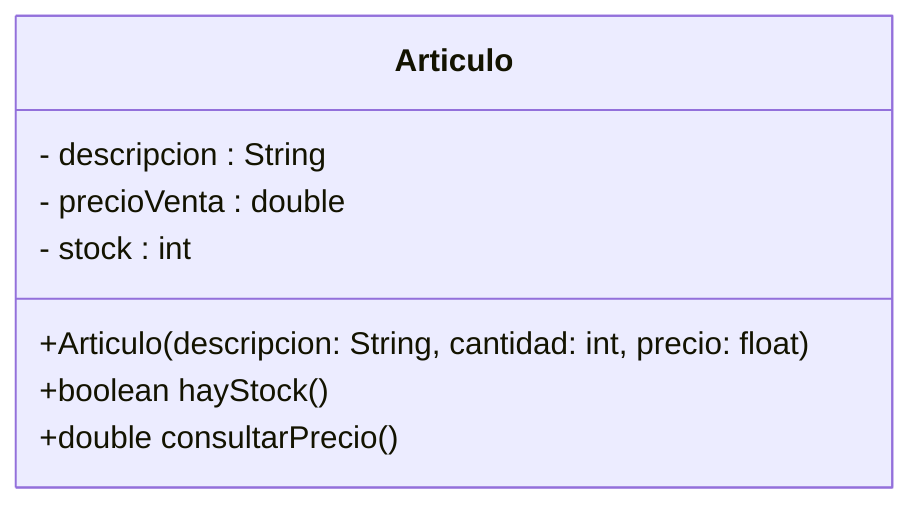
```mermaid
classDiagram
class Articulo{
    - descripcion : String
    - precioVenta : double
    - stock : int
    +Articulo(descripcion: String, cantidad: int, precio: float)

    +boolean hayStock()
    +double consultarPrecio()
}
```
En java:

```java
public class Articulo{

    private String descripcion;
    private double precioVenta;
    private int stock;

    //uso this para que no se confunda el atributo con el parametro
    public Articulo(String descripcion, int cantidad,double precio){
        this.descripcion = descripcion;
        //No es necesario con estos porque no est√°n los mismos nombres en parametros
        precioVenta = precio;
        stock = cantidad;
    }
    //getters: extraigo info
    public String getDescripcion(){
        return descripcion;
    }
    public double getPrecioVenta(){
        return precioVenta;
    }
    public int getStock(){
        return stock;
    }
    //setters: seteo info, la envío por parametros, del mismo tipo del atributo
    public void setDescripcion(String descripcion){
        this.descripcion = descripcion;
    }
    public void setPrecioVenta(double precio){
        precioVenta = precio;
    }
    public void setStock(int stock){
        this.stock = stock;
    }
    //metodos de la clase Articulo
    public boolean hayStock(){
        return stock>0;
    }
    public double consultarPrecio(){
        return precioVenta;
    }
}
```
**Fin resumen**

## Variables y métodos de clase <a id='c5e'></a>

Ya podemos implementar nuestras clases y, a partir de ello, crear objetos o instancias de las mismas.

‚úÖ Todos los objetos que creamos tienen los mismos atributos, pero cada uno tiene su propio estado, 

‚úÖ Los atributos tienen distintos valores para cada objeto. 

Ahora veremos que hay una forma de tener **un √∫nico valor para todos los objetos**.

> #### üìë
> pdf: Variables y Métodos de Clase

**Resumen pdf**

### Las clases

Vimos que el enfoque de la programación orientada a objetos se basa en identificar objetos con sus atributos y responsabilidades. 

Entonces, encontramos que <r>hay grupos de objetos que aunque tienen diferentes estados —valores de los atributos—</r>, tienen en común cuáles son los atributos y cuáles son sus responsabilidades.

Entonces este **"molde"** es lo que llamamos clases.

### Los objetos


**¿Qué comparten los objetos?**

Todos los objetos de una clase tienen la misma estructura: los mismos atributos y el mismo comportamiento, es decir, pueden hacer lo mismo. 

> ### üí°
> Pero cada objeto tiene sus propios atributos, puede tener distintos valores en sus atributos, tiene un estado propio.

**Un valor com√∫n para todos los objetos**

¬øTodos los objetos pueden tener un valor en com√∫n?

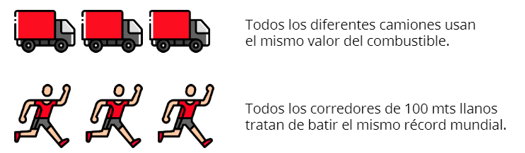

### Variable de clase <a id='c5e2'></a>

Vamos a llamar variables de clase a <r>aquellas variables —atributos— que guardan valores comunes a todos los objetos.</r> 

El combustible vale lo mismo para cualquier objeto Camion.


### Métodos de clase <a id='c5e3'></a>

Un método de clase se puede utilizar, sin necesidad de instanciar o crear un objeto, directamente con la clase.

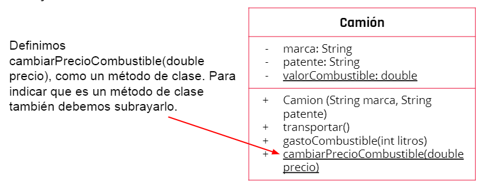

> ### üí°
> Las clases y metodos de clase se debe subrayar en el diagrama de clases UML

### Ejemplos de uso: La clase Camión <a id='c5e4'></a>


```java
public class Camion {
    private String marca;
    private String patente;
    static private double valorCombustible;

    public Camion(String marca, String patente){
        this.marca = marca;
        this.patente = patente;
    }
    public double gastoCombustible(int litros){
        return litros * Camion.valorCombustible;
    }
    static public void cambiarPrecioCombustible(double precio){
        Camion.valorCombustible = precio;
    }
}
```

Definimos la variable como `static`, esto hace que no se pueda usar con un objeto.

```java
static private double valorCombustible;
```

Definimos el método como `static`, esto hace que no se pueda usar con un objeto.

```java
static public void cambiarPrecioCombustible(double precio){
}
```

Accedemos a la variable de clase y podemos cambiar su valor.

```java
Camion.valorCombustible = precio;
```


### El main

```java
public class Main {
    public static void main(String[] args) {

        Camion miCamion = new Camion("Ford",”AB XXX CD”);

        Camion.cambiarPrecioCombustible(98.50);

        System.out.println("Gasto " + miCamion.gastoCombustible(40));

    }
}
```

Creamos un objeto de la clase Camion.

```java
Camion miCamion = new Camion("Ford",”AB XXX CD”);
```

Utilizamos el método de clase a través de la clase y no del objeto

```java
Camion.cambiarPrecioCombustible(98.50);
```

## Live coding: Creación de clase y uso <a id='c5f'></a>

Te invitamos a ver el siguiente live coding donde mostramos un ejemplo de lo visto anteriormente.

> #### 🎬
> Video: Clases

**Transcripcion video**

Abrimos un nuevo proyecto, creamos el archivo donde vamos a trabajar; tiene que tener el mismo nombre de la clase que este creando:

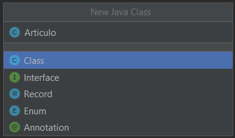

definimos los atributos privados

```java
package com.company;

public class Articulo {
    //Atributos en privado
    private String descripcion;
    private double precioVenta;
    private int stock;

    //primero definimos los metodos que ser√°n p√∫blicos

    //primero definimos el constructor, tiene como parametros los atributos los 3 valores que tengo que asignarles inicialmente a los atributos

    public Articulo(String descripcion, double precio, int stock){
        //En el caso que el parametro tenga el mismo nombre del atributo usamos this para diferenciarlo, si no, no hay necesidad.
        this.descripcion = descripcion;
        precioVenta = precio;
        this.stock = stock;
    }

    //Definimos los get y set(uno por cada atributo)
    //Con set asignamos un nuevo valor al atributo con el que estamos trabajando
    public void setDescripcion(String descripcion) {
        this.descripcion = descripcion;
    }

    //Definimos el get, con el tipo correspondiente al atributo
    public String getDescripcion() {
        return descripcion;
    }

    // metodos definidos para esta clase, consulta atributo stock
    public boolean hayStock(){
        return stock>0;
    }
    public double consultarPrecio(){
        return precioVenta;
    }
}
```
Finalizada la creación de la clase, vamos a ver como la utilizamos.\
Vamos a `Main`.

```java
package com.company;

public class Main {

    public static void main(String[] args) {
	    // definimos una instancia de la clase Articulo
        Articulo articulo;
        //Para comenzar a utilizar la instancia tenemos que crearla, tenia 3 parametros el constructor.
        articulo =  new Articulo("articulo1",1000,100);
        //creado el objeto podemos usar los metodos que le definimos.
        System.out.println("Precio "+articulo.consultarPrecio());
    }
}
```
Resultado en consola:

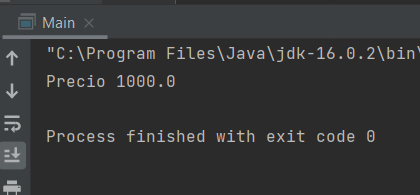

**Fin transcripción**

> ### [üìåActividad: UsuarioJuego > Puntajes > Nivel](./Actividades/act-usuariojuego.md)  <a id='c5s1'></a>


### Actividad PG <a id='c5e1'></a>

Ya creamos la clase Cuenta que contiene 
- un numero de cuenta y 
- un saldo

Crear un método llamado depósito que tenga como parámetros de entrada cantidad de dinero. 
Al ser un depósito la cantidad de dinero se incrementa al saldo.
Crear un método llamado extracción que tenga como parámetros de entrada cantidad de dinero. Al ser una extracción, la cantidad se resta del saldo

Solo permitir realizar la extracción si el saldo es suficiente

```java
public class Cuenta {

    private int numeroDeCuenta;
    private Double saldo;

    //crear la funcion depositar y retirar aca
    public void depositar(Double cantidadDeDinero){
    this.saldo += cantidadDeDinero;
    }
    public void retirar(Double cantidadDeDinero){
        if(saldo >= cantidadDeDinero){
            this.saldo -= cantidadDeDinero;
        }
    }

    //no tocar estas funciones
    public void setSaldo(Double saldo) {
        this.saldo = saldo;
    }

    public Double getSaldo() {
        return saldo;
    }
}
```
# C6 - Repaso <a id='c6'></a>

> ### [📌Actividad: Clase Perro > chip > adopción](./Actividades/act-perro-chip.md) <a id='c6a'></a>

# C7 - Relaciones entre clases <a id='c7'></a>

Los objetos se comunican, se relacionan entre sí, enviándose mensajes. Cuando un objeto le envía un mensaje a otro, el objeto receptor responde con otro mensaje. 

En ese intercambio de mensajes se generan relaciones y en esta clase vamos a explorar cada una de ellas.

> #### üìë
> pdf: Relaciones entre clases

> #### üìë
> pdf: Relación de clases

> #### 🎬
> Video: Relaciones entre clases

## Introducción: Relaciones entre clases <a id='c7a'></a>

Como destacamos siempre, <r>todo va a depender del contexto</r> y como los problemas que debemos solucionar requieren de la creación de clases, las mismas no trabajan por separado.

A partir de lo dicho anteriormente, podemos llegar a la conclusión de que:

‚úÖ Las clases interact√∫an y se relacionan entre ellas de diferentes formas y que 

✅ la relación que exista entre ellas, existirá en una comunicación específica respetando un contexto determinado.

> ### üí°
> Las clases no se encuentran solas ni trabajan individualmente.

### üìú Ejemplo!

En una fábrica de gaseosas, los diferentes objetos que encontramos colaboran entre sí. Debemos representar esa realidad al momento de modelar las clases.

## Representacion en UML de relaciones <a id='c7b'></a>

### Navegación <a id='c7b1'></a>

Cuando una asociación lleva una flecha, indica una dirección de recorrido (de navegación). Implica que es posible para un objeto en un extremo acceder al objeto del otro extremo porque el primero contiene referencias específicas a este último (al que apunta la flecha), no siendo cierto en el sentido contrario

> ### üí°
> En este ejemplo diremos que es la Persona la que tiene un atributo (objeto) de la clase Trabajo.

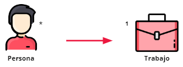

> ### üí°
> Recordá que siempre depende del contexto. Si lo que necesitamos es por cada trabajo saber `todas las personas que trabajan allí`, entonces, el sentido sería al revés

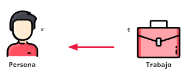


### Multiplicidad o cardinalidad <a id='c7b2'></a>

La multiplicidad también llamada cardinalidad 

‚úÖ Especifica el n√∫mero de instancias de una clase que puede estar relacionadas con una √∫nica instancia de una clase asociada. 

‚úÖ La multiplicidad limita el n√∫mero de objetos relacionados.

Para establecer las multiplicidades, primero, nos paramos en una de las clases, por ejemplo, la clase Persona y paso siguiente debemos hacernos la siguiente pregunta:

¿Para una instancia de esa clase, en este caso de la clase Persona, cuántas posibles instancias podría tener de la clase a la que está asociada, en este caso Trabajo?

Luego nos paramos en la otra clase, en nuestro caso la clase Trabajo y nos debemos hacer la misma pregunta

¿Para una instancia de esa clase, o sea, para un trabajo, cuántas posibles personas podrían tener ese trabajo?

<r>La multiplicidad depende de suposiciones y —como venimos nombrando— muchas veces, del contexto del problema.</r> 

Tener poca información del contexto suele hacer incierta la multiplicidad.


> Por ejemplo, la asociación que acabamos de ver entre Persona y Trabajo ¿es (1 a muchos) o (muchos a muchos)? Esto depende del contexto.

## üìú Ejemplos! <a id='c7b3'></a>

#### Mucho a muchos

Una persona tiene muchas reuniones y en una misma reunión participan muchas personas. A diferencia del modelo relacional donde las relaciones muchos a muchos se transforman en una nueva entidad en el modelo orientado a objetos es posible tener relaciones mucho a muchos.

```
Persona *--->*Reunion
```
> ### üí°
> Es posible tener relaciones “mucho a muchos”

#### Uno a uno

Una persona tiene una sola partida de nacimiento y una partida de nacimiento es de una √∫nica persona

Persona 1 --> 1 PartidaNacimiento

> ### üí°
> Vale aclarar que cuando la multiplicidad es 1 no se suele escribir en el diagrama

Persona --> partidaNacimiento

#### Uno a muchos o muchos a uno

También podemos tener multiplicidades con cantidad de instancias limitadas en el ejemplo que vemos a continuación una persona puede tener 2 pulmones y cada pulmón es de una única persona y, como vimos en el ejemplo anterior, no hay que olvidar que si no escribimos nada en la multiplicidad se entiende que es 1

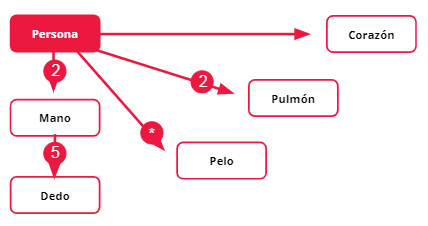

## Tipos de relaciones <a id='c7c'></a>

Existen numerosas relaciones entre las clases, a continuación un listado de los principales tipos de relaciones:

-   Asociación  -->
-   Agregación  o--
-   Composición  *--
-   Generalización 
-   Especialización
-   Dependencia / De uso ..>

En esta clase nos vamos a focalizar en <r>las 3 primeras a las que llamamos relaciones del tipo **“tiene un”**</r> y en la próxima clase nos vamos a dedicar a explorar la generalización y especialización a las que llamamos relaciones del tipo “es un”

## Relación de asociación <a id='c7c1'></a>

> #### 🎬
> Video: Asociación

✅ Relación estructural que describe una conexión entre clases

‚úÖ Es unilateral

✅ Se identifica por palabras como: "tiene", "tiene un", "conoce" o que refiera conexión

‚úÖ Se establece cuando un objeto de una clase colabora con uno o m√°s objetos de otra clase

‚úÖ Habla de un elemento que tiene a otro, como una colaboracion continua

‚úÖ Se dibuja en el diagrama como una flecha completa

‚úÖ Aparece la segunda clase como Atributo de la primera


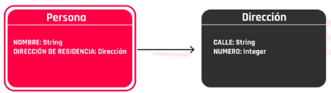

### üìú Ejemplo!

En este diagrama diremos que la clase Persona conoce a una instancia de la clase Mascota, de ahí que la dirección de la flecha es de la clase Persona hacia clase Mascota.

> ### üí°
> Esta relación representa que Persona tiene un atributo del tipo Mascota.

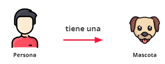

***

Un dueño tiene una mascota, se representa con una mascota de tipo mascota

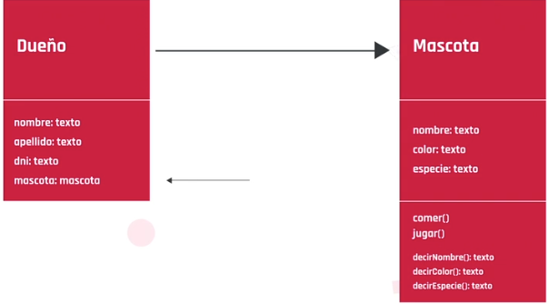

***

Un dueño tiene muchas mascotas, se agrega la cardinalidad, mostrando que tiene **muchas**. Se representa por ahora con un `list<tipo de elemento>`

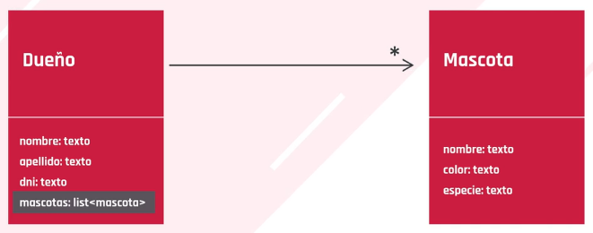

***

Una aplicación para el cálculo de impuestos podría permitir que una persona trabajase en múltiples trabajos. 

Por otra parte, un sindicato de trabajadores del gremio del automóvil que mantuviera registros de sus afiliados trabajadores podría considerar irrelevantes los segundos trabajos.

## Relación de uso / dependencia <a id='c7c2'></a>

✅ Es una relación del tipo **“usa un”**. 

✅ No tiene como atributo la clase, la usa en un método 

‚úÖ Se emplea con flecha punteada 

‚úÖ Una forma de reconocerla es cuando una clase en vez de ser atributo de otra, aparece como **parametro** en uno de sus metodos


‚úÖ No hay una referencia de una clase a la otra, sino que en este caso, 

✅ La relación se da porque hay algún método que devuelve o recibe como parámetro una variable que <r>es del tipo de la otra clase</r>

‚úÖ Colaboracion temporal

✅ Un método de la primera clase utiliza por un rato, un objeto de la segunda clase como parametro


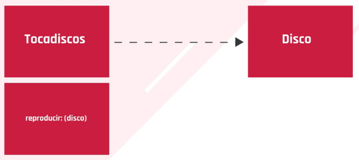

### üìú Ejemplo! <a id='c7b3'></a>

En el ejemplo a continuación la clase `Cuenta` tiene un método que devuelve un Extracto, pero no necesita tener una instancia Extracto dentro de la Cuenta.

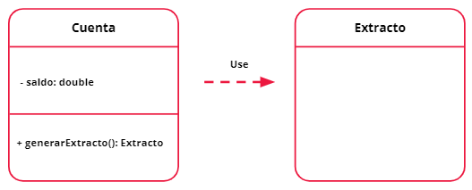


## Relación de Agregación <a id='c7c3'></a>

> #### üìë
> pdf: Agregación

‚úÖ Cuando una clase ademas de tiene o conoce **"es parte"**

‚úÖ Ambas clases pueden existir independientemente

✅ En el diagrama se indica con un **rombo vacío** que parte de la clase que contiene a la otra

✅ Donde existe una relación entre los agregados y el todo, pero los componentes pueden existir aunque el todo fuese destruido. 

✅ Es una relación que indica que una clase forma parte de otra/s clase/s <r>con una relación débil, de tal forma que existe una independencia respecto a su existencia</r>. 

✅ Decimos también que una agregación es una relación de tipo **“es parte de”**.

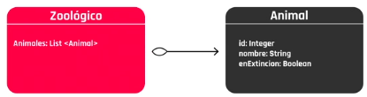

### üìú Ejemplo!

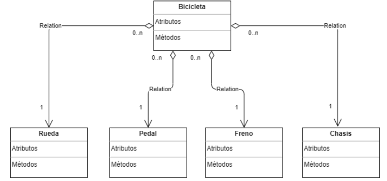

**An√°lisis del ejemplo**

Una bicicleta est√° formada por diversos otros elementos (objetos), como: 

- ruedas, 
- pedales, 
- frenos y 
- chasis. 

Mediante un proceso de ensamblaje, unimos los elementos y conformamos una bicicleta.

¿Qué pasa si efectuamos el proceso inverso? Si desarmamos la bicicleta. ¿Los otros elementos todavía siguen existiendo y cumplen su propósito? <r>La respuesta es sí</r>, ya que cada elemento puede ser utilizado en otra bicicleta o hasta en otro tipo de
transporte como un triciclo o monociclo.

Aquí es donde radica la cuestión. <r>Los objetos tienen una relación débil con la bicicleta y pueden continuar existiendo aun después de que desarmemos la bicicleta.</r>

> #### üìë
> pdf: Ejercitación Modelado Relaciones I

## Relación de Composicion <a id='c7c4'></a>

> #### üìë
> pdf: Composicion

‚úÖ Cuando una clase esta compuesta por otra clase, es decir que una depende de la otra, no tienen sentido por su cuenta

‚úÖ Lo representamos con un **rombo relleno**

✅ La composición es un tipo de agregación que es más fuerte, donde todas las partes (clases) solamente pueden pertenecer a un todo

✅ Es el caso en el que <r>una clase de objeto A **“es dueño de”** una
clase de objeto B, y B no tiene razón de existir sin A</r>.

✅ A diferencia de la agregación, en este caso, la parte no tiene sentido sin el todo.


### üìú Ejemplo!

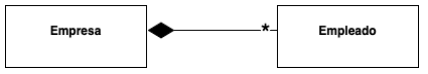

**An√°lisis del ejemplo**

Una empresa tiene empleados, estos por sí solos no tienen sentido, si existe un
empleado es porque tiene que existir una empresa donde ese empleado trabaje.

> #### üìë
> pdf: Ejercitación Modelado Relaciones II

<!-- HACER -->

***

## Implementación en Java <a id='c7d'></a>

> #### 🎬
> Video: Implementación en JAVA

<!-- inicio resumen -->

Las relaciones entre clases nos indican como se comunican los objetos de esas clases entre si y la manera en que sus mensajes se dirigen

### Relación de asociación: 

‚úÖ Un auto tiene un motor

✅ Relación 1 a 1: Las relaciones se implementan como atributos

> ### üí°
> En el UML no se suele poner el atributo de la clase motor ya que se entiende a traves de la relación y seria redundante.

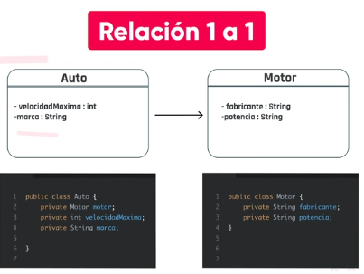

### Relación de asociación: 

‚úÖ Un auto tiene mas de una rueda

✅ Relación 1 a muchos: En este caso se utiliza un array donde se guardan muchos objetos del mismo tipo.

> ### üí°
> Con un array o lista podemos resolver estas relaciones

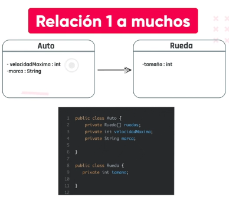

### Relación de agregación: 

‚úÖ Un objeto usa a otro para poder funcionar

‚úÖ Tenemos una computadora que para funcionar necesita un mouse

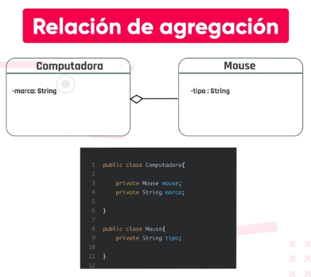

<!-- fin resumen video -->

> ### üí°
> Las clases deben estar en el mismo paquete sino, tiene que hacerse un `import`

## Live coding <a id='c7f'></a>

> #### 🎬
> Video: Live coding

> ### [üìåActividad: Relaciones UML > Chofer > Auto](./Actividades/lc-relaciones.md)
> El chofer tiene asignado un auto

> ### [üìåActividad: Relaciones UML > Chofer > Auto > Motor](./Actividades/lc-relaciones-ii.md)
> El chofer tiene asignado un auto, el auto tiene un motor.

>### üëç
> Cuando tengo atributos que son objetos tengo que tenerlos instanciados, puedo crearlo en el constructor `<ej: motor>`

### Actividad PG <a id='c7e1'></a>

**Consigna**

Es momento de asociar nuestra clase Cliente con nuestra clase Cuenta.

En otro archivo ya tenemos una clase Cliente con sus atributos y responsabilidades , nuestra clase Cuenta debe tener un atributo titular de tipo Cliente.

Les pedimos que modifiquen la Clase Cuenta para que tenga un Cliente. El constructor de la clase Cuenta recibe adem√°s de los valores que ya tiene un Cliente.

```java
public class Cuenta {

    private int numeroDeCuenta;
    private Double saldo;
    private Cliente titular;

    //Modificar este constructor
    public Cuenta(int numeroDeCuenta, Double saldo, Cliente titular) {
        this.numeroDeCuenta = numeroDeCuenta;
        this.saldo = saldo;
        this.titular = titular;
    }

    //no tocar este código
    public Cliente getTitular(){
        return titular;
    }
}
```

 ## Notas clase 7 <a id='c7s'></a>

-   Clases sin responsabilidades se llaman POJOs
-   La revista va a tener como atributo una lista de ediciones
-   Cuando creamos la relación la revista tiene cmo atributo lista de ediciones. No es necesario escribirlas por la relación entre Revista y Edición `- ediciones : list<edición>`
-   Es raro en objetos que la relación sea de muchos a muchos, generalmente la relación es unilateral
-   la clase articulo va a tener un titulo, un tema y un autor

```mermaid
classDiagram
  direction LR
  class Revista {
    - nombre : String
    - código : String
    - periodicidad : String
  }
  class edición{
    - numeroDeEdición : Integer
    - fecha : Date
    - precio : Double
  }
  class Articulo{
    - titulo : String
    - tema : String
    - fecha : Date
    - autor : String
  }
  Revista "1" *--> "n" Edición
  Edición "1" o--> "n"Articulo
```

**Otro ejemplo**

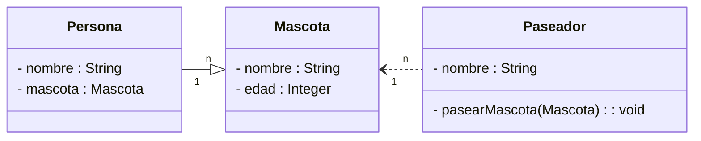
```mermaid
classDiagram
  direction LR
  class Persona {
    - nombre : String
    - mascota : Mascota
  }
  class Mascota{
    - nombre : String
    - edad : Integer
  }
  class Paseador {
    - nombre : String
    - pasearMascota(Mascota) : void
  }
  Persona "1" --|> "n" Mascota
  Mascota "1" <.. "n" Paseador

```

Si el método lo tiene el paseador, el paseador usa a la mascota y se muestra punteado 

## Actividad Mesa de trabajo:

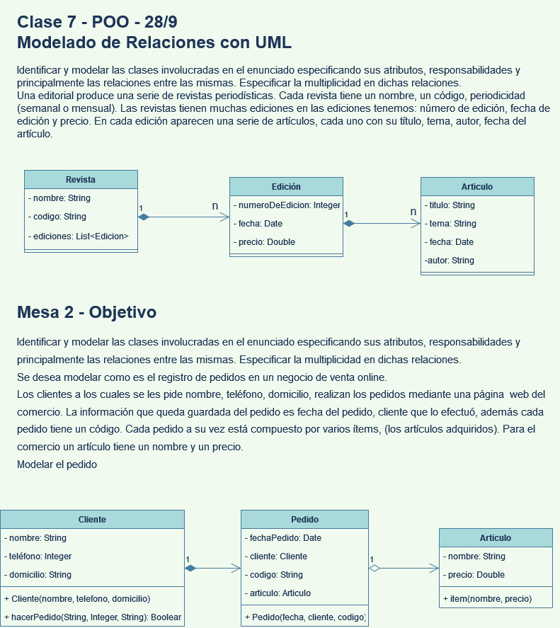


# C8 - Herencia <a id='c8'></a>

## Proceso de abstracción <a id='c8a'></a>

Proceso para identificar los objetos, durante este proceso: 

✅ Identificamos las partes que integran nuestro “universo” o “dominio” según el contexto, 

✅ Interactúan esas partes a través de relaciones. 

Es así como llegamos a definir clases, con sus atributos y operaciones. Además, definimos qué debe hacer cada parte para contribuir a la solución del problema, es decir, establecimos las responsabilidades de las clases. 

En esta clase veremos la relación de herencia y sus beneficios.

> #### 🎬
> Video: Presentación de la herencia

> #### üìë
> pdf: Herencia

## Relación de Herencia <a id='c8b'></a>

✅ la herencia es un ordenamiento entre clases que define una relación “es un”

✅ conocida como una relación del tipo **"es un"**

✅ Favorece la reutilización de código

‚úÖ Permite modelar clases que tengan todo lo que tiene su superclase, tanto en atributos como en metodos

> ### üí°
> Una clase que hereda de otra, suma a sus propios atributos y responsabilidades los de la clase a la cual hereda.

## Relación de herencia en UML

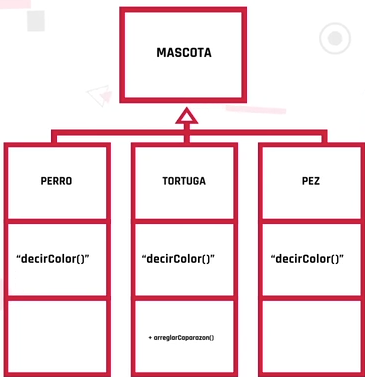

### üìú Ejemplo #1

Teniendo en cuenta el siguiente diagrama que modela un sistema de una veterinaria:

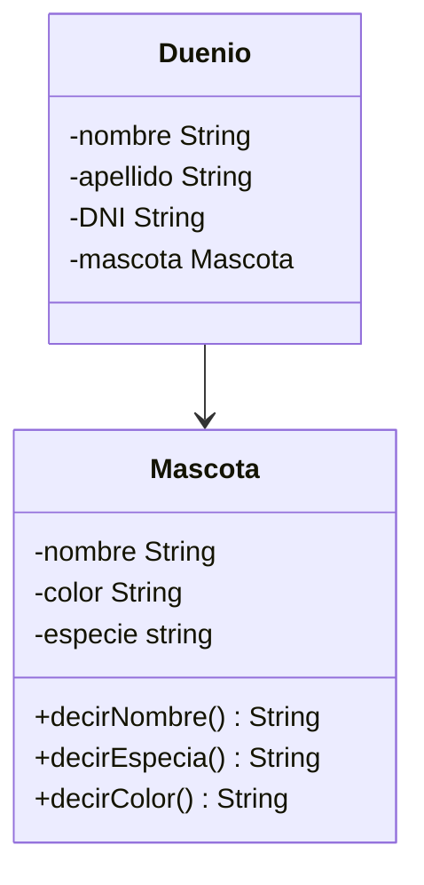
```mermaid
classDiagram

class Duenio{
    -nombre String
    -apellido String
    -DNI String
    -mascota Mascota
}
class Mascota{
    -nombre String
    -color String
    -especie string
    +decirNombre() String
    +decirEspecia() String
    +decirColor() String
}
Duenio --> Mascota
```
este sistema maneja el concepto de `Duenio` y `Mascota`

y entendemos por la relación de asociación que: Un duenio tiene una mascota.

Se necesita tener un control mas especifico sobre los animales que se atienden 

Necesitamos incorporar mas clases para ser mas especificos con cada tipo de mascota (perro, tortuga, pez...) y agregar atributos y responsabilidades propios de cada uno, ej: arreglarCaparazon de la tortuga.

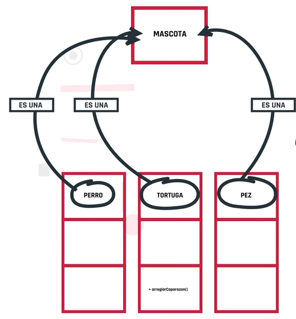

Son todos el mismo concepto, con distintos atributos y comportamientos <r>pero su nucleo en su forma mas fundamental, son mascotas</r>

> ### üí°
> No hablamos de valores de los atributos, hablamos de atributos.

Las clases van a heredar nombre color especie y van a heredar sus responsabilidades, pero ademas van a agregar atributos y responsabilidades propios
que no se van a compartir con los otros componentes del sistema 

### üìú Ejemplo #2

Todos los perros tiene un nombre, una edad y todos ladran y juegan. Cuando nos nombran estas características rápidamente reconocemos que se trata de un perro.

> Si analizamos un caniche, veremos como juega y ladra; si analizamos un Doberman, también veremos como juega y ladra, aunque lo hace muy distinto al caniche

Entonces, tanto el caniche como el Doberman juegan, ladran y ambos tienen nombre y edad: sería razonable asumir que si tienen y hacen todo lo que hace un perro, entonces, es un perro.

Por todo esto, podemos decir que un caniche es un Perro. De la misma manera que podríamos decir que Profesor es un Empleado, y más aún: un Empleado es una Persona, por lo tanto, un Profesor es una Persona.Nuevamente, al observar la realidad y pasar por el proceso de abstracción, obtuvimos una serie de entidades que se ordenan naturalmente, y la herencia responde a ello.

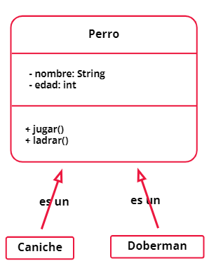

Podemos decir entonces que la herencia es un ordenamiento entre clases que define una relación “es un”. Entonces decimos que un caniche y un Doberman es un perro, porque tiene y hace todo lo que hace un perro.

**¿Para qué sirve la herencia?**

Esta es una pregunta interesante, ya que la herencia es uno de los pilares de la orientación a objetos. Si analizamos el esquema anterior, tanto Caniche como Doberman hacen lo mismo que hace el perro. ¿Si hacen lo mismo que el perro, para qué escribir el código de lo que hacen? ¿No sería más conveniente escribirlo una sola vez en la clase Perro y que Doberman, Caniche, “obtengan” este comportamiento desde Perro?

De hacer esto, decimos que Caniche y Doberman “heredan” el comportamiento de un perro, es decir, la clase Doberman hereda de la clase Perro, todos sus atributos y responsabilidades favoreciendo la reutilization


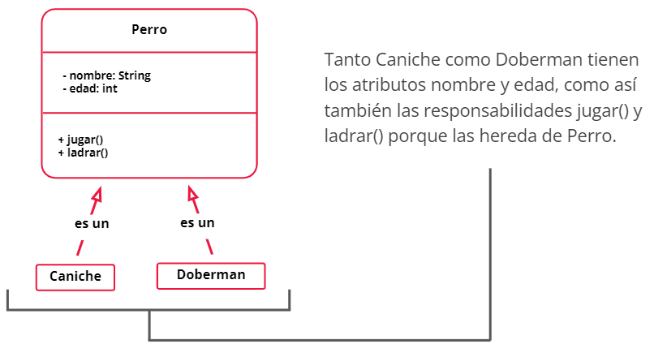

### üìú Ejemplo #3

Jerarquía de empleados:

#### Gerente

Además de los atributos fechaAscenso y montoPresupuesto, tiene los atributos nombre, dirección y salario que hereda de Empleado como así también las responsabilidades ingresa() y egresa().

#### Gerente de proyecto

Adem√°s del atributo tipoProyecto y la responsabilidad de planificarProyecto() tiene todos los atributos y responsabilidades de Gerente y Empleado


### üìú Ejemplo #4

Jerarquía de personas

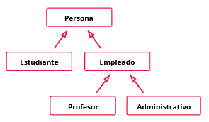

## Herencia m√∫ltiple <a id='c8d'></a>

‚úÖ Se establece cuando una clase hereda de varias otras clases, en este caso, 
‚úÖ La clase hija hereda atributos y responsabilidades de los diferentes padres

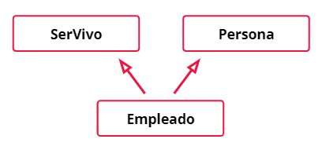

> ### üí°
> El uso de herencia múltiple requiere una consideración muy atenta para evitar la superposición funcional de atributos y responsabilidades.

> ### ‚ùå
> En Java no está permitida la herencia múltiple y al no ser considerada una buena práctica de diseño no la utilizaremos en esta materia.


>### üëç
> Como el uso de la herencia lo tendremos prohibido, buscaremos la manera siempre de mantener una línea de herencia.

## Generalización y especialización <a id='c8e'></a>

[Generalización y especialización](https://view.genial.ly/60c153221f2fc20d9c415ed8)

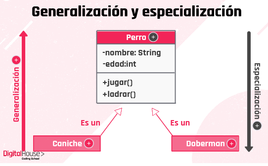

### Generalización

Nos encontramos en el modelo que estamos realizando un conjunto de clases, por ejemplo, Caniche y Doberman. Nos damos cuenta que ambas tienen algunos atributos y/o responsabilidades comunes. En dicho caso:

‚úÖ Creamos una clase de la cual ambas heredar√°n ambas y 

‚úÖ Transportamos todos los atributos y/o responsabilidades que eran comunes a esta nueva clase que, en este ejemplo, llamaremos Perro. 

Este proceso mental de abstracción lo llamamos generalización.

### Especialización

Nos encontramos en el modelo que estamos realizando con que modelamos una clase Perro y, analizando mejor el contexto, nos dimos cuenta que hay perros como el Doberman que tienen adem√°s de los atributos y/o responsabilidades que describimos otros diferentes que no tienen todos los perros, como, por ejemplo, `cuidar()`, ya que los caniches no cuidan. En este caso:

‚úÖ Creamos una clase y le colocamos estos atributos y/o responsabilidades que √∫nicamente tiene ese tipo de perro, en este ejemplo, esas clases son Doberman y Caniche. 

Este proceso mental de abstracción lo llamamos especialización.

> #### üìë
> pdf: Ejercitación Modelado Herencia Inicial

## Alcance, protected <a id='c8f'></a>

## Encapsulamiento y la herencia

Ahora que ya aprendimos a modelar relaciones de herencia y tenemos en claro el concepto de encapsulamiento, analizaremos cómo se comporta la herencia frente al encapsulamiento.

Cuando una propiedad es pública significa que es accesible desde cualquier clase. Es decir, en el momento en que un objeto quiera acceder a un valor público puede obtenerlo y modificarlo sin ninguna operación de por medio. Esto sería el equivalente a no ocultar información y, por lo tanto, “romper” el encapsulamiento.

Por el contrario, si declaramos un atributo privado limitamos completamente el acceso al dato. Nadie que no sea la propia clase puede acceder a ese dato. Siempre que se quiera acceder o modificar el dato, se debe hacer una operación para tal fin, por ejemplo, a través de getters o setters.

## Modificador de visibilidad (#) <a id='c8g'></a>

> ### üí°
> Con la herencia <r>aparece un modificador de visibilidad nuevo llamado **protegido**</r>, que en los diagramas UML se especifica con el **“#”**, donde nos permite tener una visibilidad intermedia del atributo o método al que declaramos como tal. Es decir, es privado para otras clases, pero público para las clases hijas. 

El uso de este modificador de visibilidad “rompe” el encapsulamiento y evitaremos en lo posible su uso como buena práctica.

Veamos esto en el siguiente ejemplo gr√°fico:

[El modificador de visibilidad](https://view.genial.ly/60c13148ddae960d163e85a6)

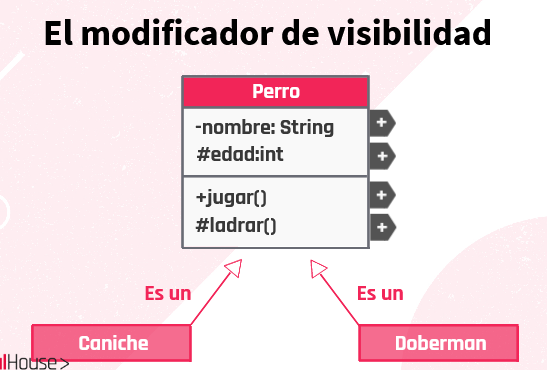

`- nombre: String`: Este atributo es privado y solo puede ser accedido o modificado por otras clases o las clases hijas a través de un método get() o set().

`# edad: int`: Este atributo es protegido y no podr√° ser accedido o modificado por otras clases, excepto por sus clases hijas.

`+ jugar()`: Este método es público y puede ser accedido por cualquier clase y, por consiguiente, por cualquier clase hija.

`# ladrar()`: Este método es protegido, con lo cual no podrá ser invocado por ninguna otra clase, excepto por las clases hijas.

## Firmas de un método <a id='c8h'></a>

‚úÖ Una firma nos permite identificarnos y 

‚úÖ Expresar nuestro consentimiento de un determinado documento. 

‚úÖ En nuestro documento de identidad podemos encontrar muchos elementos, entre ellos est√° la firma o rubrica.

✅ La firma de un método en la programación orientada a objetos <r>es la definición completa de un método, es decir, su nombre, sus parámetros y sus tipos y el orden de aparición de dichos parámetros.</r>

No podrán en una misma clase existir dos métodos con la misma firma, es decir, con el mismo nombre y cantidad de parámetros con sus respectivos tipos en el mismo orden. 

Los siguientes métodos tienen diferentes firmas, son métodos diferentes porque, si bien se llaman igual, tienen diferente cantidad de parámetros o difiere alguno de sus tipos:

`+ sumar(numero1: double, numero2: double): double`

`+ sumar(numero1: double, numero2: double, numero3: double): double`

`+ sumar(numero1: int, numero2: int): int`

## Sobrecarga y Sobreescritura

> #### üìë
> pdf: Sobrecarga y Sobreescritura

### Sobrecarga de métodos <a id='c8i'></a>

La sobrecarga de métodos está relacionada con la firma de los mismos

✅ los métodos sobrecargados pueden devolver cosas diferentes o lo mismo.

✅ El nombre y cantidad, tipo y orden de parámetros forman parte de la firma de un método y deben ser diferentes para poder sobrecargarlo

✅ Lo que devuelve un método no forma parte de la firma

### üìú Ejemplo!

el método `ladrar()` está sobrecargado, ambos métodos tienen diferente firma.

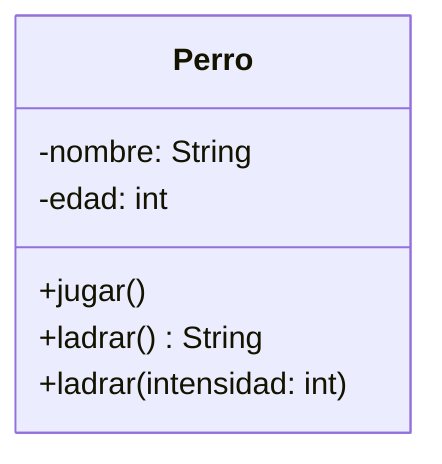
```mermaid
classDiagram

class Perro {
    -nombre: String
    -edad: int
    +jugar()
    +ladrar() String
    +ladrar(intensidad: int)
}
```
> ### ‚ùå
> El valor que devuelve un método y los modificadores de visibilidad no forman parte de la firma

## Sobreescritura de métodos <a id='c8j'></a>

‚úÖ volver a escribir algo existente

✅ Para poder sobreescribir métodos necesitamos una relación de herencia, ya que:

✅ Lo que vamos a sobreescribir es un método de la superclase para que se comporte diferente en la subclase.

> ### üí°
> A diferencia de la sobrecarga donde los métodos tienen que tener diferente firma, en este caso, los métodos deben tener la misma firma

Al escribir en las subclases el método ladrar() estamos diciendo que dicho método está sobrescrito y, por ende, se comporta diferente

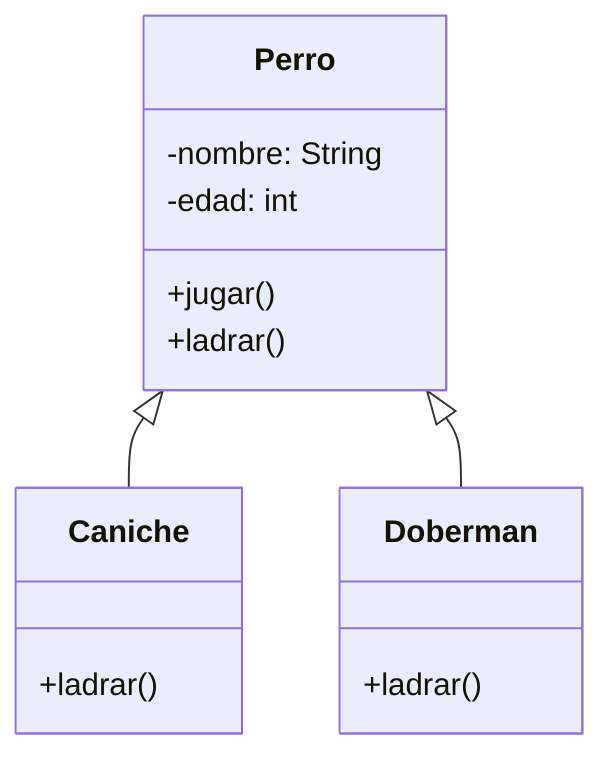
```mermaid
classDiagram

    class Perro{
    -nombre: String
    -edad: int
    +jugar()
    +ladrar()
    }
    class Caniche{
    +ladrar()
    }
    class Doberman{
    +ladrar()
    }

    Perro <|-- Caniche
    Perro <|-- Doberman
```

> Ver pdf: Ejercitación Modelado Herencia I.pdf
<!-- HACER -->

## Actividad en clase

**Ejercicio 1**

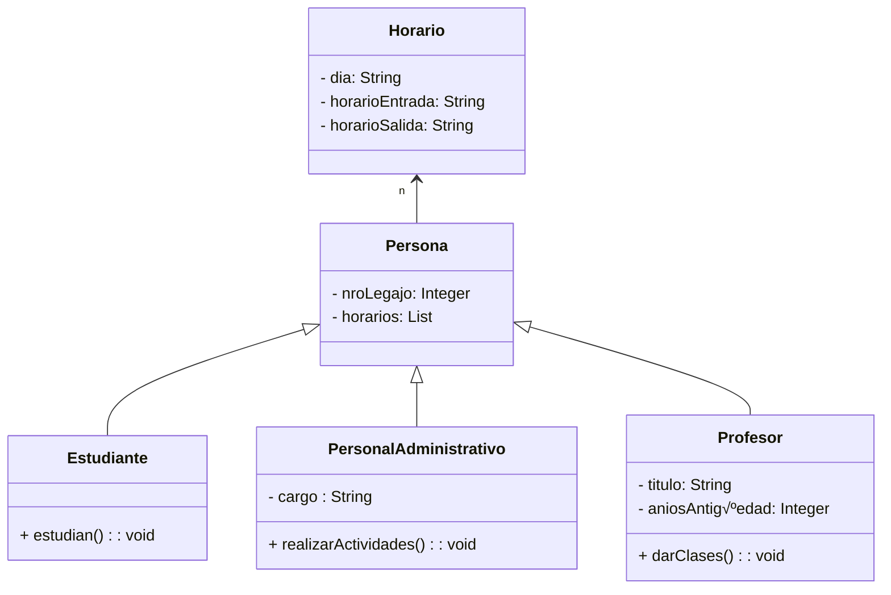
```mermaid
classDiagram
direction TB

class Horario {
    - dia: String
    - horarioEntrada: String
    - horarioSalida: String
}
class Persona {
    - nroLegajo: Integer
    - horarios: List<Horario>
}
class Estudiante {
    + estudian(): void
}
class PersonalAdministrativo {
    - cargo : String
    + realizarActividades(): void
}
class Profesor {
    - titulo: String
    - aniosAntigüedad: Integer
    + darClases(): void
}

Horario "n" <-- Persona
Persona <|-- Estudiante
Persona <|-- PersonalAdministrativo
Persona <|-- Profesor
```

**Ejercicio 2**

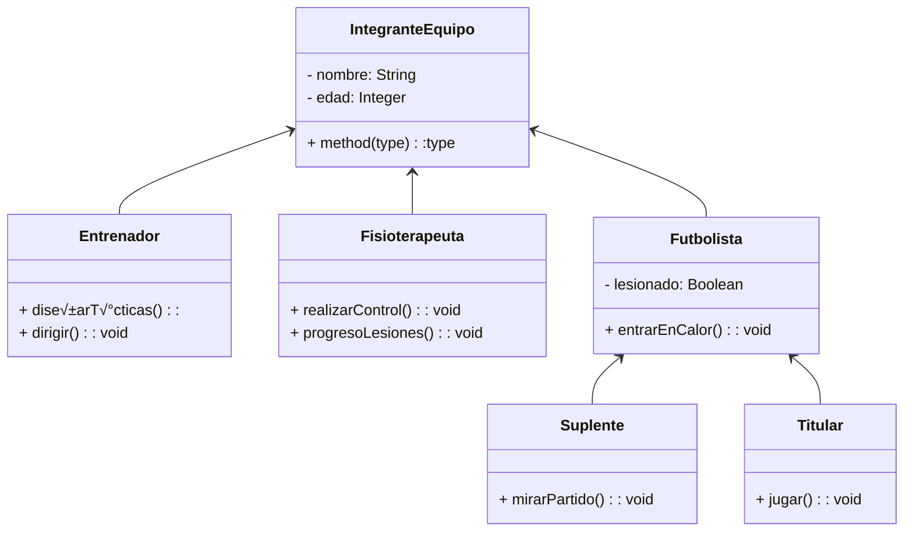
```mermaid
classDiagram
direction TB

class IntegranteEquipo {
    - nombre: String
    - edad: Integer
    + method(type):type
}
class Entrenador {
    + diseñarTácticas():
    + dirigir(): void
}
class Fisioterapeuta {
    + realizarControl(): void
    + progresoLesiones(): void
}
class Futbolista {
    - lesionado: Boolean
    + entrarEnCalor(): void
}
class Suplente {
    + mirarPartido(): void
}
class Titular {
    + jugar(): void
}

IntegranteEquipo <-- Entrenador
IntegranteEquipo <-- Fisioterapeuta
IntegranteEquipo <-- Futbolista
Futbolista <-- Suplente
Futbolista <-- Titular

```

## Notas clase 9

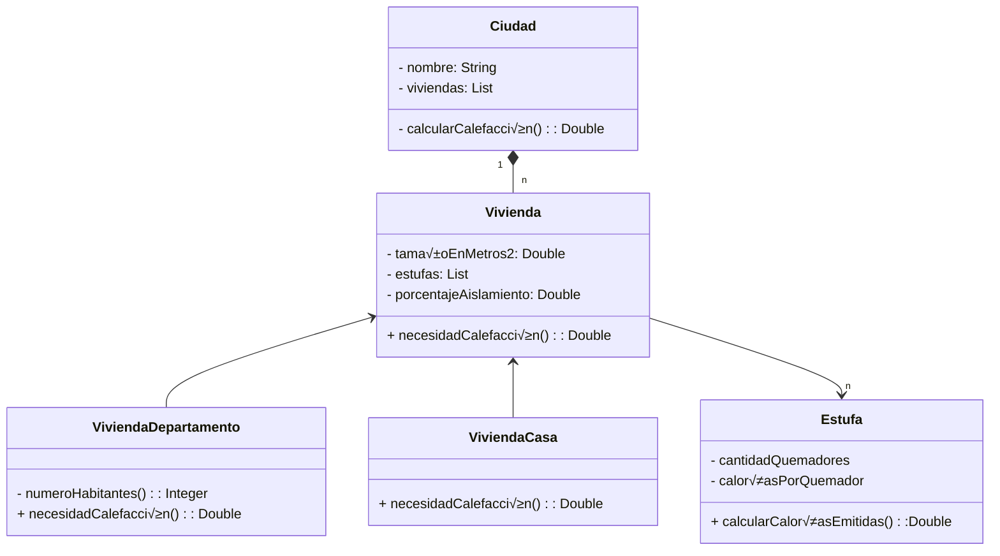
```mermaid
classDiagram
class Ciudad {
- nombre: String
- viviendas: List<Vivienda>
- calcularCalefacción(): Double
}
class Vivienda {
- tamañoEnMetros2: Double
- estufas: List<Estufa>
- porcentajeAislamiento: Double
+ necesidadCalefacción(): Double
}
class ViviendaCasa {
+ necesidadCalefacción(): Double
}
class ViviendaDepartamento {
- numeroHabitantes(): Integer
+ necesidadCalefacción(): Double
}
class Estufa {
    - cantidadQuemadores
    - caloríasPorQuemador
    + calcularCaloríasEmitidas():Double
}
Ciudad "1" *-- "n" Vivienda
Vivienda <-- ViviendaDepartamento
Vivienda <-- ViviendaCasa
Vivienda --> "n" Estufa
```

# C9 - Repaso <a id='c9'></a>

> #### üìë
> pdf: Integrador
<!-- HACER -->

# C10 - Herencia en Java <a id='c10'></a>

‚úÖ Siembre lo que hacemos en el constructor de la subclase, es invocar el constructor de la superclase, respetando si tiene parametros o no.

‚úÖ Usamos la palabra `super`

> #### 🎬
> Video: Herencia en Java.mp4

> #### üìë
> pdf: Sobrecarga y Sobreescritura

### üìú Ejemplo #1

✅ Un empleado tiene características y responsabilidades

✅ Estas características, se agregan a las que ya tenían por ser persona, lo mismo sucede con las responsabilidades.

Es decir, el empleado hereda todo lo que tenia como persona.

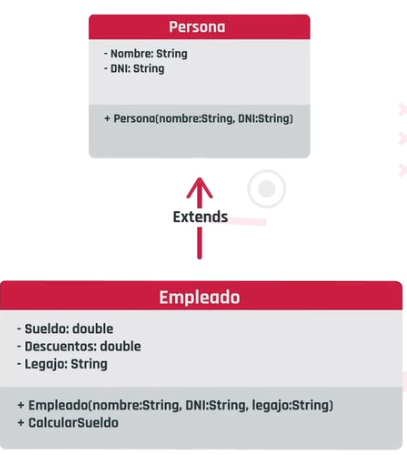

En el codigo:

‚úÖ Se indica la herencia mediante la palabra `extends`

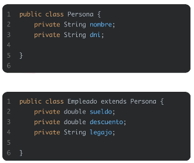

‚úÖ La superclase y la subclase tienen constructor, pero cada uno se debe encargar de sus atributos, entonces el constructor en Persona queda asi:

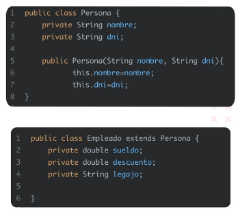

‚úÖ Antes de empezar a trabajar con los atributos propios, se invoca al constructor de la superclase (Persona)

> ### üí°
> Siembre lo que hacemos en el constructor de la subclase, es invocar el constructor de la superclase, respetando si tiene parametros o no.
>
> usamos la palabra `super`

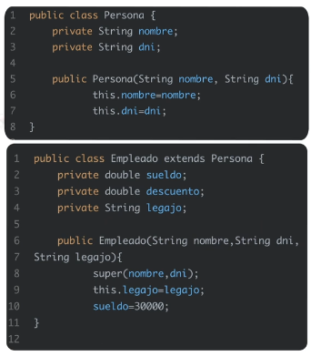

Un empleado es una persona, y hereda todas sus características y responsabilidades, por esto:

> ### üí°
> Es necesario antes de crear sus atributos de Empleado, se creen sus atributos de persona.
> Esto lo logramos con la superclase que como método, hace referencia a su constructor.

## Actividad PG: <a id='c10a'></a>

**Ejercicio Herencia**

Tenemos la clase cuenta bancaria que tiene como atributos numero y saldo. 

A partir de esta clase Cuenta, queremos extender en CuentaCorriente, que agrega un atributo descubierto.

El descubierto lo vamos a fijar inicialmente en $1000. Descubierto es un valor que se permite extraer aunque no haya saldo.

Te pedimos agregar los métodos setters y getters para la nueva clase.

### UML

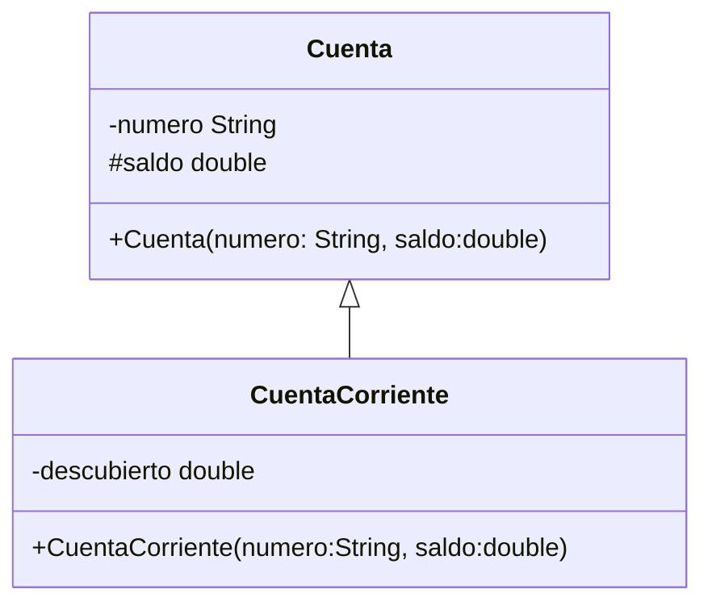
```mermaid
classDiagram

class Cuenta{
    -numero String
    #saldo double
    +Cuenta(numero: String, saldo:double)
}

class CuentaCorriente{
    -descubierto double
    +CuentaCorriente(numero:String, saldo:double)
}

Cuenta <|-- CuentaCorriente
```
En `Cuenta.java`

```java
package com.company;

public class Cuenta {
    private String numero;
    protected double saldo;

    public Cuenta(String numero, double saldo) {
        this.numero = numero;
        this.saldo = saldo;
    }
}
```

En `CuentaCorriente.java`

```java
package com.company;

public class CuentaCorriente extends Cuenta {
    private double descubierto;

    public CuentaCorriente(String numero, double saldo) {
        super(numero, saldo);
        descubierto = 1000;
    }

    public double getDescubierto() {
        return descubierto;
    }

    public void setDescubierto(double descubierto) {
        this.descubierto = descubierto;
    }
}
```

## Sobrecarga y sobreescritura en Java

## Sobrecarga en Java <a id='c10b'></a>

‚úÖ Mismo nombre distinto comportamiento

✅ Solo podemos sobrecargar un método si varía su firma. 

✅ Cuando se utilizan los métodos, según los parámetros que se pasan, 
actuará el método cuya firma coincida con los parámetros utilizados.

### üìú Ejemplo!

Un empleado tiene un legajo y un sueldo. Su sueldo se puede calcular simplemente restando los descuentos al sueldo básico. Ocasionalmente, recibe un premio, por lo que el cálculo del sueldo en ese caso varía, ya que habría que sumarle este premio. 
Por otro lado, hay vendedores, que también son empleados, en este caso, además de su sueldo básico, reciben una comisión por venta. 

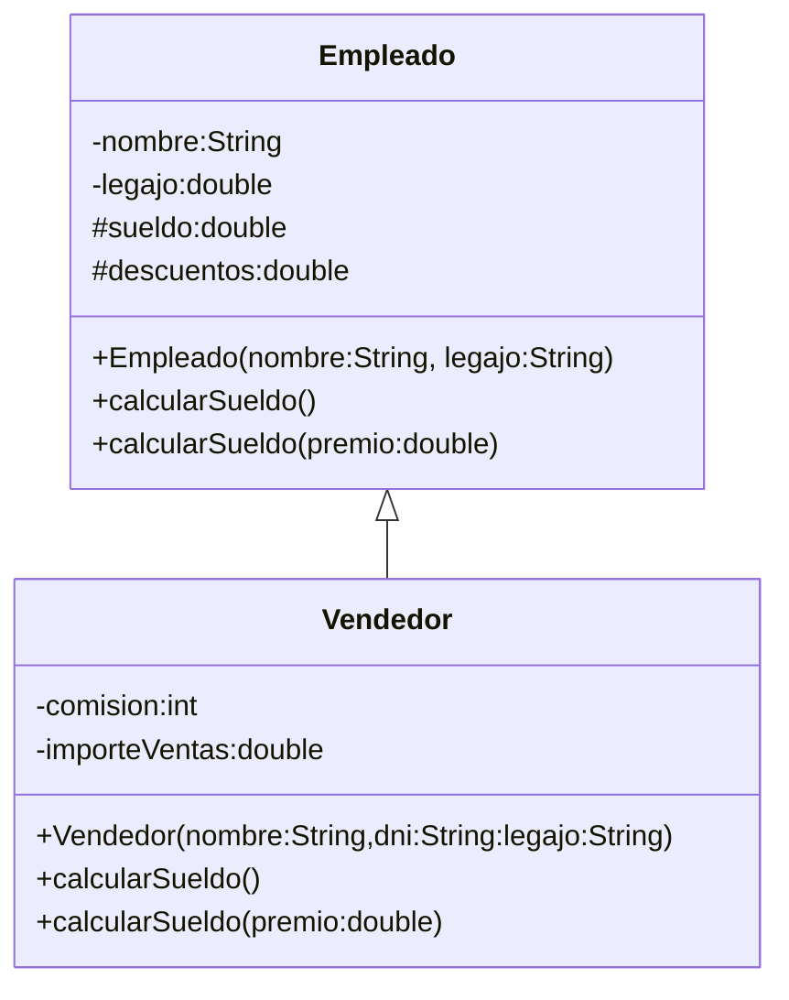
```mermaid
classDiagram

class Empleado{
    -nombre:String
    -legajo:double
    #sueldo:double
    #descuentos:double
    +Empleado(nombre:String, legajo:String)
    +calcularSueldo()
    +calcularSueldo(premio:double)
}
class Vendedor{
    -comision:int
    -importeVentas:double
    +Vendedor(nombre:String,dni:String:legajo:String)
    +calcularSueldo()
    +calcularSueldo(premio:double)
}

Empleado <|-- Vendedor
```

En `Empleado.java`

```java
public class Empleado{
    private   String nombre;
    private   String legajo;
    protected double sueldo;
    protected double descuentos; 

    public double calcularSueldo(){
        return sueldo-descuentos;
    }
    public double calcularSueldo(double premio){
        return sueldo-descuentos + premio;
    }
}
```

Cuando lo usamos en `Main.java`

```java
public class Main {

    public static void main(String[] args) {
        
        Empleado miEmpleado = new Empleado("Juan", "1111");
        System.out.println("Sueldo a cobrar: " + miEmpleado.calcularSueldo());
        System.out.println("Sueldo a cobrar: " + miEmpleado.calcularSueldo(5000)); 
        
    }
}
```

## Sobreescritura en Java <a id='c10c'></a>

‚úÖ Cuando necesitamos otro comportamiento para los metodos, los sobreescribimos.

‚úÖ Lo indicamos con `@Override`

✅ `@Override` Nos indica que se anula el comportamiento anterior del método

‚úÖ Lo sobreescribimos para darle una forma distinta de resolver.


### üìú Ejemplo!

A la clase Vendedor, con los métodos sobreescritos, es necesario darles otro comportamiento para un Vendedor. Por eso, surge la necesidad de sobreescribirlos

En `Empleado.java`

```java
public class Vendedor extends Empleado{
    private int comision;
    private double importeVentas;

    @Override
    public double calcularSueldo(){
        return sueldo - descuentos + importeVentas/100* comision;
    }

    @Override
    public double calcularSueldo(double premio){
        return sueldo - descuentos + premio+ importeVentas/100* comision;
    }
}
```

Para los objetos Vendedor, el método a ejecutar es este que sobreescribe el anterior.

