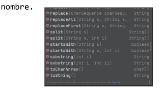

<style>
@import url('https://fonts.googleapis.com/css2?family=Roboto+Mono&display=swap');
t {
font-size: 50px;
color: #006d77;
font-family: 'Roboto Mono', monospace;
letter-spacing: 5px;
}
h1 {
color: #f2cc8f
}
h2 {
color: #e07a5f;
}
h3 {
color: #cd9777
}
r {
color: #03045e;
background-color: #90e0ef;
}
</style>

<t>Programacion orientada a objetos</t>

---

## Índice <a id='up'></a>

1. Introducción a la programación orientada a objetos
- [C1- Que es Java](#c1)
    - [Bienvenida](#c1a)
    - [Primer acercamiendo a Java](#c1b)
    - [Primer programa](#c1c)
    - [Tipos de datos](#c1d)
    - [¿Qué es un tipo de dato?](#c1z)
    - [Actividad PG](#c1pg) 
    - [Sintaxis Java](#c1y)
    - [Estructura de control if, for, while, switch](#c1e)
    - [Clase en vivo](#c1s) 🎥
- [C2 - Introduccion a Java](#c2)
    - [String, Integer, Float](#c2a)
        - [.equals()](#c2a1)
        - [.comparteTo()](#c2a2)
        - [Paquetes](#c2a3)
        - [String](#c2a4)
        - [String vacía y String nula](#c2a5)
        - [Integer](#c2a6)
        - [Float](#c2a7)
        - [Date](#c2a8)
    - [Ingreso de datos, Scanner](#c2b)
    - [Funciones](#c2c)
        - [Actividad PG](#c2c1)
    - [Array](#c2d)
2. Programacion orientada a objetos en Java
3. Patrones de disenio


# C1 - Que es Java <a id='c1'></a>

## ¡Les damos la bienvenida a la materia Programación Orientada a Objetos! <a id='c1a'></a>

Durante la cursada de esta materia vas a adquirir las bases y desarrollar la capacidad de modelar y programar desde la perspectiva del paradigma orientado a objetos. También te va a permitir comprender y analizar los diferentes desafíos que enfrentan los actuales equipos de trabajo al momento de desarrollar.

Los conceptos se aplicarán en el lenguaje de programación Java, uno de los más utilizados para desarrollos en empresas IT hoy en día y el conocimiento de patrones de diseño que resultan fundamentales al momento de diseñar un software.

## Primer acercamiendo a Java <a id='c1b'></a>

> ver video: Que es Java
>
> Ver PDF: Instalación IntelliJ Idea y JDK.docx.pdf

## Primer programa <a id='c1c'></a>

> Ver video: Metodo main.mp4
>
> Ver PDF: Primer programa en Java.pdf

<!-- Resumen pdf-->

en Java el nombre de la clase y el nombre del archivo
deben coincidir —incluso en mayúsculas y minúsculas—.

Esta funcion indica el comienzo del programa

```java
public static void Main(String args[])
```

la forma de mostrar algo por consola,

```java
System.out.println("Mi primer ejemplo ");
```

Con esta instrucción también podemos concatenar un texto literal y una variable. 
Por ejemplo:

```java
int num=10;

System.out.println("El valor es " + num);
```

<!-- fin resumen -->

## Tipos de datos <a id='c1d'></a>

### Sintaxis en Java

Vamos a ver cómo se utilizan en Java algunas herramientas que ya conocemos. En algunos conceptos la sintaxis es similar a JavaScript, pero tiene algunas variaciones. Una de las cosas que es bastante diferente es el tratamiento de variables. Vamos a verlo a continuación 

> ver PDF: ¿Qué es un tipo de dato_.pdf

<!-- Resumen pdf -->

## ¿Qué es un tipo de dato? <a id='c1z'></a>

### Un lenguaje tipado

Decimos que el lenguaje de programación Java es un lenguaje fuertemente tipado.
Pero esto, ¿qué quiere decir? <r>Un lenguaje tipado es el que me exige una declaración explícita de la variable antes de comenzar a usarla.</r>

### Declaración de una variable

Entonces, para declarar una variable, es necesario indicar el tipo de dato y nombre que se le asigna. Recordar que Java es un lenguaje case sensitive, los tipos de datos siempre se escriben en minúscula. Para los tipos comunes vamos a ver una excepción: el tipo String que siempre lo inicializamos con mayúscula, como en el ejemplo a continuación.

```java
int valor;
double coeficiente;
String nombre;
```

### Uso de las variables

<r>Una vez declarada la variable, sólo podrá utilizarse con datos del tipo indicado</r>, es decir, una variable de tipo int no podrá almacenar un valor de tipo double, una variable de tipo String no podrá almacenar un valor numérico que se utilice para hacer operaciones aritméticas

### Operaciones aritméticas

Respecto a las operaciones aritméticas, debemos tomar en cuenta que <r>si se opera entre dos variables de tipo entero, el resultado es siempre un valor de tipo entero.</r>
Esto pasa con todos los tipos de datos, es decir, <r>una operación solo puede realizarse con variables del mismo tipo y el resultado mantiene el tipo de dato.</r>
Pero hay una operación en la que podríamos querer cambiar el tipo de dato y que el resultado se diera en otro.

Veamos varias situaciones 
<!-- Ver pdf situaciones con enteros y floats -->

> Ver video: Declaracion de variables.mp4

### Actividad PG <a id='c1pg'></a>

**Ejercicio 1**
Es hora de que crees tus primeras variables en java
La idea es que crees tres variables una que se va a llamar numeroEntero y va a ser de tipo int una que se va a llamar numeroConComa de tipo double y por último una llamada nombre de tipo string

Luego de declararlas asignarles un valor acorde a su tipo

```java
package com.company;
 
public class Main {
 
    public static void main(String[] args) {
        int numeroEntero = 10;
        double numeroConComa = 3.5;
        String nombre = "Lili";
    }
}
```

> Como en muchos otros lenguajes de programación, en Java podemos realizar diversas operaciones. Vamos a necesitar realizarlas para poder resolver problemáticas con nuestros futuros programas. A continuación, nos encontramos con ejercicios de operaciones y una Java cheat sheet muy útil con los principales operadores que podemos utilizar en este lenguaje. 

**Ejercicio 2**

Ahora ya te damos dos variables creadas, numeroEntero y numeroConComa;
El objetivo del ejercicio es que le asignes un valor acorde a su tipo a cada variable, el valor puede ser cualquiera mientras que respetes el tipo de dato
Luego vas a declarar la variable suma de tipo double, sumar ambos valores y asignárselos a suma

```java
package com.company;
 
public class Main {
 
    public static void main(String[] args) {
        
        int numeroEntero = 10;
        double numeroConComa = 3.4;
        double suma;
        suma = (double)numeroEntero + numeroConComa;
    }
}
```
[🔺](#up)

## Sintaxis Java <a id='c1y'></a>

> Ver PDF: Sintaxis Java

Matematicos |  |
------- | -------
Suma | +
Resta | -
División | /
Multiplicación | *
Módulo | % (devuelve el resto de una división entera)
Operador unario sumar 1 | ++
Operador unario restar 1 | --


Operadores logicos | |
------------------ | -------
Y | && (devuelve verdadero si las dos evaluaciones son verdaderas)
O | 2palitos (devuelve verdadero si una de las dos evaluaciones son verdaderas)
No | ! (devuelve lo opuesto al resultado de la evaluación)


Operadores relacionales | |
------- | -------
Mayor | >
Menor | <
Igual | == o .equals()
Mayor o igual | >=
Menor o igual | <=
No igual | !=

Tipos de datos primitivos | |
------- | -------
byte | Números enteros entre -128 y 127
short | Números enteros entre -32768, 32767
int | Números enteros entre -2147483648 y 2147483647
long | Enteros muy grandes, entre -9223372036854775808 y 9223372036854775807
float | Número con coma -3.402823e38 a 3.402823e38
double | Número con coma, mayor capacidad -1.79769313486232e308 a -1.79769313486232e308
string | Cadena de caracteres 
char | Un carácter (Ej: ‘a’) Unicode
boolean | Verdadero o falso (true /false)

[🔺](#up)

## Estructura de control en Java <a id='c1e'></a>

Las estructuras de control en Java tienen la misma sintaxis que en JavaScript. Contamos con:

Decisión if - switch
Repetición while - for

A continuación recordemos brevemente cómo es su sintaxis.


### Estructura de decision:

```java
if (condición){
//código que se corre si la condición es verdadera
} else if(condición){
//código que se corre si la primera condición no fue verdadera y la segunda sí es verdadera
}else {
// código que se corre si ninguna condición anterior fue verdadera
}
```

```java
switch (variable){
case valor1:
//código que se ejecuta si la variable tiene valor1
break;
case valor2:
//código que se ejecuta si la variable
tiene valor2
break;
.
.
default:
//código que se ejecuta si la variable tiene algún valor no enumerado
}
```
[🔺](#up)

### Estructuras de repetición:

```java
for(Integer i = 0; i < valorMaximo; i++){
//código que se ejecuta cada vez
}
```

```java
for(Object object : listaDeObjetos){
//código que se va a ejecutar por cada objeto en la lista
}
```

```java
while(condición){
//hacer este código
}
```

> Ver video: Ciclo for
>
> Ver PDF: Ejercitacion estructuras.pdf 
[🔺](#up)

### Ejercitacion estructuras <a id='c1act'></a>

Ejercitación Estructuras

Ejercicio 1
Definir dos números enteros. Asignarles un valor a cada uno. Comprobar si un número es
divisible por el segundo e indicar mediante un mensaje el resultado obtenido.
NOTA: Que sea divisible quiere decir que al dividir da un valor exacto, es decir, sin
decimales.

```java
package Sincro;

public class C1ejercitacionEstructuras {
    public static void main(String[] args) {
        int num1 = 10;
        int num2 = 5;

        if (num1%num2 == 0){
            System.out.println("El numero "+num1+" es divisible por "+num2);
        } else {
            System.out.println("Los numeros no son divisibles");
        }
    }
}

// Muestra en consola: El numero 10 es divisible por 5
```
[🔺](#up)

> Ver PDF: Definiendo mascotas / Ejercitacion tipo variables.pdf <a id='c1s'></a>

<!-- inicio actividad -->
### Solucion actividad sincronica

```java
public class c1_actividad_mascotas {
    public static void main(String[] args) {
        // Manchita
        String nombrePerro = "Manchitas";
        Integer edadPerro = 2;
        Double comidaPerro = 1.5;
        String sonidoPerro = "Guau guau guau";
        System.out.println("El perro se llama "+nombrePerro+" tiene "+edadPerro+" años, come "+comidaPerro+" kilos de comida. Y me dice "+sonidoPerro);

        //Nemo
        String nombrePez = "Nemo";
        Integer edadPez = 1;
        Double comidaPez = 0.3;
        String sonidoPez = "Glup glup";
        System.out.println("El pez se llama "+nombrePez+" tiene "+edadPez+" años, come "+comidaPez+" kilos de comida. Y me dice "+sonidoPez);

    }
}
```
<!-- fin actividad sincronica -->

# C2 - Introduccion a Java <a id='c2'></a>

## String, Integer, Float <a id='c2a'></a>


> Ver PDF: Clases String, Integer, Float.pdf

<!-- inicio resumen pdf -->

## **El lenguaje Java**

El núcleo de Java son las clases, más adelante veremos que son y cómo construirlas.
Pero para comenzar a trabajar debemos comenzar a utilizar las clases propias de Java.

## Variables

En Java encontramos como herramienta para el desarrollo <r>los tipos primitivos, llamamos así a los tipos de datos que solo nos permiten almacenar un valor.</r>
**Por ejemplo:** `int`, `float`, `double` y `char`. 
Cuando definimos una variable con estos tipos primitivos, solo podemos almacenar valores.

## Clases

En este caso tendremos <r>un elemento que, además de almacenar un valor, nos permite realizar ciertas operaciones que ya vienen programadas, a estas operaciones las llamamos métodos.</r>
**Por ejemplo:** `String` es una clase, por eso, se la inicializa en mayúscula. 
**Todas las clases las nombramos con la inicial en mayúscula**, si definimos:

```java
String nombre
```
Al utilizar nombre, veremos que nos ofrece los métodos disponibles



Estas son funciones que ya vienen resueltas y solo podemos utilizarlas con la clase a la cual le pertenece, es decir, cada clase en Java tiene sus propios métodos.

Para comenzar a conocer cómo funcionan las clases propias del lenguaje, vamos a nombrar 3 clases que nos resultan útiles —y de hecho String ya la utilizamos en nuestra primera clase—: 
String, Integer, Float, notemos que todas comienzan con la
inicial en mayúscula.

**Las clases `Integer` y `Float` son equivalentes a los tipos de datos primitivos, es decir, me permiten almacenar valores de los tipos indicados, pero además me dan ciertas funcionalidades.** 

> Se suele decir que envuelven los tipos primitivos.

## `.equals()` <a id='c2a1'></a>

Algo a tener en cuenta cuando usamos estas clases es que no podemos usar operadores como `“==”`, para efectuar una comparación por igual usamos `.equals()`, 
por ejemplo:

```java
nombre.equals(“Juan”) 
```
Esto nos devuelve `true` en el caso que en nombre se guarde la cadena “Juan” y falso en caso contrario.

El **`equals()`** se utiliza para comparar por igual, siempre que estemos trabajando con clases.

## `.compareTo()` <a id='c2a2'></a>

Si queremos comparar si un valor es mayor o menor que otro debemos usar `.compareTo()`

Otra cosa a destacar es que una `String` a la cual no le asignamos nada tiene el valor `null`. 
**Esto sucede con todas las clases, si definimos un elemento (objeto) de una clase inicialmente tendrá el valor null.**

[🔺](#up)

## Paquetes <a id='c2a3'></a>

Para organizar las clases, existen los paquetes, estos son contenedores donde se pueden agrupar las clases. Más adelante los utilizaremos para nuestras clases, pero por ahora debemos saber que también las clases de Java se encuentran agrupadas en paquetes, o como su nombre en inglés: package.

> Ver pdf: String, Integer, Float

<!-- inicio resumen PDF -->

## String <a id='c2a4'></a>

Para utilizar datos de tipo texto, vamos a declararlos como String. Las Strings nos permiten utilizar funciones ya programadas, que le pertenecen. Las llamamos métodos.

```java
public static voidmain(String[] args){
    String nombre;
}
```
A partir de esta variable vamos a ver cómo utilizar algunos de estos métodos de uso frecuente.

**Codigo ejemplo**

Métodos usados: 

```java
.length() //calcula longitud del string
.toUpperCase() //convierte a mayuscula
.equals() //comprueba
.toChar() //obtiene caracteres en el () indicamos la ubicacion 
```

```java
String nombre= "Juan";
int cantidad;
char inicial;

cantidad = nombre.length(); 

nombre.toUpperCase(); 

if(nombre.equals("JUAN")){    
    System.out.println("Se pasó a mayúscula");
}
inicial = nombre.charAt();

```

## String vacía 

Si aún no hemos asignado nada a las String, entonces, contiene un valor `null`, **en ese caso no se pueden usar los métodos.**

```java
String nombre;

if(nombre==null){ //Comprueba si aun no se ha inicializado
    System.out.println("Cadena con valor nulo");
}
```

## String vacía y String nula <a id='c2a5'></a>

En una String podemos tener las dos situaciones: 
Puede tener un valor nulo o estar vacía.

| |  |
|------- | ------- |
`String nombre;`| Cadena que aún no se ha inicializado, esta en null. Aun no puedo utilizar métodos propios.
`nombre = "";`| Cadena vacía.
`nombre = "Juan";` | Cadena inicializada con el valor "Juan".

## Integer <a id='c2a6'></a>

Integer como clase y no como tipo primitivo se utiliza de una forma distinta.
Para comenzar a utilizar un Integer tenemos dos posibilidades: 

```java
Integer valor = 0;
```
En este caso definimos y creamos un Integer, dándole un valor inicial 0

```java
Integer num = new Integer(1);
```
En la segunda forma hacemos algo similar, pero la parte de la izquierda es la definición y la parte de la derecha la creación con un valor inicial 1.

>Cuando solo definimos algo de tipo Integer, su valor inicial es null, es necesario darle un valor inicial.

**Codigo ejemplo**

Comprobamos la relación entre dos números enteros, utilizando clasesMétodos usados: 
`.equal()`, `.compareTo()`

```java
Integer valor1 = 10;
Integer valor2 = 30;
int comparar;

if (valor1.equals(valor2)){ //comprobamos si son iguales
    System.out.println("Son iguales"); 
}
else {
    comparar = valor1.compareTo(valor2); //Compara la relacion entre dos valores, si valor 1 es mayor, dara 1, si valor2 es mayor, dara -1
    if (comparar>0){
        System.out.println("valor1 es mayor que valor2");
    }
    else {
        System.out.println("valor2 es mayor que valor1");
    }
}
```

## Float <a id='c2a7'></a>

Integer como clase y no como tipo primitivo se utiliza de una forma distinta.
Para comenzar a utilizar un Integer tenemos dos posibilidades: 

```java
Float coeficiente=2.5f;
```
En este caso definimos y creamos un Integer, dándole un valor inicial `2.5f`, la f quiere decir `float`, si no lo ponemos se asume que es algo de tipo `Double`.

```java
Float num = new Float(0.5);
```

En la segunda forma hacemos algo similar, pero la parte de la izquierda es la definición y la parte de la derecha la creación con un valor inicial 0.5. 
Al igual que `Integer`, si no tiene un valor inicial, está en `null`

> Cuando solo definimos algo de tipo `Float`, su valor inicial es `null`, siempre es necesario darle un valor inicial.

## Date <a id='c2a8'></a>

La clase **Date** permite trabajar con fechas. A diferencia de las clases que vimos hasta ahora, si definimos un objeto de tipo **Date**, no es posible hacerlo vacío. Un objeto Date se crea con un valor inicial que el la fecha actual.

```java
import java.util.Date;

public class Main {
    public static void main(String[] args) {
        Date fecha = new Date();
        System.out.println(fecha.toString()); //Muestra la fecha actual
    }
}
```
> Para usar Date es necesario agregar `import java.util.Date;`

Para crear un Date con otro valor, lo hacemos de la siguiente manera:

```java
public static void main(String[] args) {
    Date fecha = new Date(120,11,5);
    System.out.println(fecha.toString());
    //Muestra 5/12/2020
}
```
Los parámetros que usamos son año, mes, día, teniendo en cuenta:
al valor que colocamos para año le suma 1900:  
```
1900 + 120 = 2020 
```
los meses los enumera desde cero o sea 11 es en realidad 12 (diciembre)De esta forma obtenemos la fecha que necesitamos

> Ver pdf: Ejercitacion - Integer,String.pdf

<!-- HACER ejercitacion-->

<!--FIN hacer ejercitacion -->

## Ingreso de datos, Scanner <a id='c2b'></a>

Muchos elementos de Java son clases, vimos anteriormente String, Integer y Float. 
Para realizar la entrada y salida de datos también utilizamos clases propias de Java. 

Una clase muy importante es `System`, en ella encontramos `System.in` y `System.out`, que nos permitirán <r>interactuar con las entradas y salidas del programa. </r>

Ya vimos que `Sistem.out.println` nos permite mostrar un dato o mensaje. 
Para ingresar valores vamos a utilizar `System.in`. 
Las entradas se realizan mediante esta clase, es decir, **la información ingresa a través de System.in, pero para gestionarla y asignarla a las variables utilizaremos los métodos que nos provee `Scanner`**. 

Veamos de qué se trata. 

[Link: Ingreso de datos con Scanner](https://view.genial.ly/60abec1fea8a290d34b9fe66)

### Que es Scanner

Es una clase propia de Java, que nos permite ingresar valores. Tiene métodos, funciones ya programadas, que nos permiten ingresar distintos tipos de datos.

### ¿Cómo lo creamos?

Cuando definimos nuestro elemento de tipo Scanner, nos aparece esta indicación. Esto significa que para poder utilizarlo debemos agregar la clase correspondiente, que se encuentra en `java.util`

```java
public static void Main(String[] args) {
    //write your code here
    Scanner
}
```
**Definición**

Cuando aceptamos la sugerencia que se vio en la pantalla anterior, nos agrega el import, finalizamos la definición dándole un nombre como lo haríamos con cualquier variable.

```java
import java.util.Scanner;

public class Main {
    public static void main(String[] args) {
        //Write your code
        Scanner lector;
    }
}
```
**Creación del objeto Scanner**

Luego de definirlo, es necesario crear el objeto u instanciarlo.

```java
Scanner lector; //Definicion del objeto lector
lector = new Scanner(System.in); //Creacion o instanciacion del objeto
```
Lo creamos asociado a System.in, es decir, todo ingreso de datos será interceptado por el Scanner.

### Que metodos tiene?

```java
.nextByte() //para leer un dato de tipo byte.
.nextShort() //para leer un dato de tipo short.
.nextInt() //para leer un dato de tipo int.
.nextLong() //para leer un dato de tipo long.
.nextFloat() //para leer un dato de tipo float.
.nextDouble() //para leer un dato de tipo double.
.nextBoolean() //para leer un dato de tipo boolean.
.nextLine() //para leer un string hasta encontrar un salto de línea.
.next() //para leer un string hasta el primer delimitador, generalmente hasta un espacio en blanco o hasta un salto de línea. 
```
> Ver PDF: Ejemplos Scanner.pdf

<!-- HACER resumen pdf -->

<!-- FIN resumen pdf -->

> Ver video: Scanner
>
> Ver PDF: Ejercictacion - Scanner.pdf

<!-- HACER pdf -->

<!-- FIN pdf -->

## Funciones <a id='c2c'></a>

> Ver PDF: Funciones

<!-- inicio resumen pdf -->

Las funciones en Java son similares a las vistas en JavaScript, pero hay algunas cosas a tener en cuenta por ser un lenguaje tipado, vamos a tener que definir más cosas.

**¿Cómo definimos una función?**

Para definirla vamos a considerar 3 cosas:

- Qué devuelve la función
- Qué nombre tiene
- Los parámetros que necesitamos

Cuando decimos qué devuelve nos referimos al tipo de dato que devuelve la función.
Entonces la definición sería en forma general algo de este estilo.

```
Tipo devuelto nombre (parametros)
```
### Nombre

El nombre debe ser lo más descriptivo posible, no importa si necesitamos unir dos o más palabras, por ejemplo para nombres descriptivos pueden ser:
calcularTotal, asignarTurno, buscarNumeroMasRepetido, suma

### Parámetros

No hay muchas diferencias en cuanto a los parámetros, solo que es necesario indicar el tipo de cada uno, entonces para que una función reciba valores lo indicaremos de la siguiente manera.
```
(int num1, int num2)
```
```
(double importe, String descripcion)
```
```
(int cantidad, int posicion, String nombre)
```

## Tipo devuelto

Hasta ahora, las diferencias no fueron tantas, tal vez, esta es la mayor diferencia con la forma en la que aprendimos en JavaScript.
Las funciones pueden devolver un valor de retorno de algún tipo determinado, por ejemplo int, double, Integer, String, etc. En realidad pueden devolver cualquier cosa no solo valores, también estructuras enteras, lo veremos más adelante, pero hay que indicar que tipo tiene lo que devolvemos. 

Veamos algunos ejemplos
```java
int suma(int num1, int num2)
```
```java
double calcularTotal(double importe, int cantidad)
```
De esta forma tendremos definida una función con un valor de retorno.

Pero hay otro tipo de funciones, las que no devuelven nada en ese caso en donde
indicamos el tipo devuelto colocaremos la palabra reservada `void`. 

Veamos un ejemplo.

```java
void mostrarMensaje(String mensaje)
```
Usamos las funciones de tipo void, cuando queremos que nuestra función sólo realice una serie de pasos o acciones y no nos devuelva nada.

## Desarrollo de la función

Hasta ahora vimos cómo definir una función, ahora veamos que varía en la
implementación, vamos a tener dos situaciones. 
1. Que la función tenga valor de retorno o 
2. que no devuelve nada.

En el primer caso, debemos incluir un `return` con el valor devuelto, el tipo de este valor tiene que coincidir con el tipo de dato indicado como tipo devuelto.

```java
int suma(int num1, num2)
{
return num1,num2;
}
```
**¡El valor retornado tiene que ser del tipo indicado!**

En caso de tener una función no tenga tipo de retorno, nos quedaría así:

```java
void mostrarMensaje(String mensaje)
{
System.out.println(mensaje);
}
```

<!-- fin resumen pdf -->

> Ver PDF: Ejercitacion - funciones.pdf

<!-- HACER -->
<!-- FIN -->

## Ejercicios PG <a id='c2c1'></a>

### Ejercicio Calculadora

Vamos a crear nuestras primeras funciones
Tenemos la clase Calculadora que por ahora solo va trabajar con nuestro tipo primitivo int
Tenemos que crearle cuatro funciones a nuestra calculadora sumar, restar, dividir y multiplicar

**Solucion:**

```java
public class c2_calculadora_pg {
    public int sumar(int a, int b) {
        int num1 = a;
        int num2 = b;
        return num1 + num2;
    }
    public int restar(int a, int b) {
        int num1 = a;
        int num2 = b;
        return num1 - num2;
    }
    public int multiplicar(int a, int b) {
        int num1 = a;
        int num2 = b;
        return num1 * num2;
    }
    public int dividir(int a, int b) {
        int num1 = a;
        int num2 = b;
        return num1 / num2;
    }
}
```

### Ejercicio: Es Divisible

Hacer una función que reciba como parámetro dos valores y devuelva un boolean. La función debe comprobar si el primer número es divisible por el segundo.
NOTA: Que sea divisible quiere decir que al dividir da un valor exacto, es decir, sin decimales.

**Solucion:**

```java
public class c2_esDivisible {
    public boolean esDivisible(int numero1,int numero2) {
        int num1 = numero1;
        int num2 = numero2;

        if (num1 % num2 == 0) {
            return true;
        } else {
            return false;
        }
    }
}
```

## Array <a id='c2d'></a>

> Ver PDF: Array, diferencia con colecciones.pdf

<!-- Inicio resumen pdf -->

>Los arrays son estructuras estáticas para almacenar objetos.

Los arrays son estructuras de datos estáticas que permiten guardar elementos del mismo tipo en forma contigua.

<!-- fin resumen pdf -->


<!-- subir al inicio -->

[🔺](#up)