<style>
@import url('https://fonts.googleapis.com/css2?family=Roboto+Mono&display=swap');

t {
font-size: 50px;
color: #006d77;
font-family: 'Roboto Mono', monospace;
letter-spacing: 5px;
}
h1 {
color: #f2cc8f
}
h2 {
color: #e07a5f;
}
h3 {
color: #cd9777
}
r {
color: #03045e;
background-color: #90e0ef;
}
</style>

<t>Programacion orientada a objetos</t>

---

## Índice <a id='up'></a>

1. Introducción a la programación orientada a objetos

-   [C1- Que es Java](#c1)
    -   [Bienvenida](#c1a)
    -   [Primer acercamiendo a Java](#c1b)
    -   [Primer programa](#c1c)
    -   [Tipos de datos](#c1d)
    -   [¿Qué es un tipo de dato?](#c1z)
    -   [Actividad PG](#c1pg)
    -   [Sintaxis Java](#c1y)
    -   [Estructura de control if, for, while, switch](#c1e)
    -   [Clase en vivo](#c1s) 🎥
-   [C2 - Introduccion a Java](#c2)
    -   [String, Integer, Float](#c2a)
        -   [.equals()](#c2a1)
        -   [.comparteTo()](#c2a2)
        -   [Paquetes](#c2a3)
        -   [String](#c2a4)
        -   [String vacía y String nula](#c2a5)
        -   [Integer](#c2a6)
        -   [Float](#c2a7)
        -   [Date](#c2a8)
    -   [Ingreso de datos, Scanner](#c2b)
    -   [Funciones](#c2c)
        -   [Actividad PG](#c2c1)
    -   [Array](#c2d)
        -   [Ciclos en arrays](#c2d1)
-   [C3 - Repaso](#c3)
-   [C4 - Objetos y UML](#c4)
    -   [Concepto de Objeto y Clases](#c4a)
        -   [Ejemplo: Caso veterinaria](#c4a1)
            -   [Primera solucion](#c4a1a)
    -   [Clases](#c4b)
    -   [Atributos, responsabilidades y constructor](#c4c)
        -   [Diagramar clases y atributos](#c4c1)
        -   [Encapsulamiento](#c4c2)
        -   [Atributos y comportamientos](#c4c3)
        -   [Constructor de un objeto](#c4c4)
        -   [Ejemplos de un objeto con sus atributos y métodos](#c4c5)
    -   [Encapsulamiento (publico / privado)](#c4d)
        -   [Importante hacer:](#c4d1)
    -   [Diagrama UML](#c4e)
        -   [Diagrama de clases](#c4e1)
        -   [Quizz](#c4e2)
-   [C5 - Clases](#c5)
    -   [Atributos, constructores y métodos](#c5a)
        -   [Atributos](#c5a1)
        -   [Constructores](#c5a2)
        -   [Metodos](#c5a3)
        -   [Nombres en Java](#c5a4)
        -   [Crear una clase en Java](#c5a5)
    -   [Proteger el encapsulamiento](#c5b)
        -   [setters y getters](#c5b1)
        -   [Actividad PG](#c5b2)
    -   [Instancia](#c5c)
    -   [La clase](#c5d)
    -   [Variables y metodos de clase](#c5e)
        -   [Actividad PG](#c5e1)
        -   [Variable de clase](#c5e2)
        -   [Metodos de clase](#c5e3)
        -   [Ejemplos de uso](#c5e4)
    -   [Conclusion: Live coding](#c5f)
    -   [Actividad en clase](#c5s1)

2. Programacion orientada a objetos en Java
3. Patrones de disenio

# C1 - Que es Java <a id='c1'></a>

## ¡Les damos la bienvenida a la materia Programación Orientada a Objetos! <a id='c1a'></a>

Durante la cursada de esta materia vas a adquirir las bases y desarrollar la capacidad de modelar y programar desde la perspectiva del paradigma orientado a objetos. También te va a permitir comprender y analizar los diferentes desafíos que enfrentan los actuales equipos de trabajo al momento de desarrollar.

Los conceptos se aplicarán en el lenguaje de programación Java, uno de los más utilizados para desarrollos en empresas IT hoy en día y el conocimiento de patrones de diseño que resultan fundamentales al momento de diseñar un software.

## Primer acercamiendo a Java <a id='c1b'></a>

> ver video: Que es Java
>
> Ver PDF: Instalación IntelliJ Idea y JDK.docx.pdf

## Primer programa <a id='c1c'></a>

> Ver video: Metodo main.mp4
>
> Ver PDF: Primer programa en Java.pdf

<!-- Resumen pdf-->

en Java el nombre de la clase y el nombre del archivo
deben coincidir —incluso en mayúsculas y minúsculas—.

Esta funcion indica el comienzo del programa

```java
public static void Main(String args[])
```

la forma de mostrar algo por consola,

```java
System.out.println("Mi primer ejemplo ");
```

Con esta instrucción también podemos concatenar un texto literal y una variable.
Por ejemplo:

```java
int num=10;

System.out.println("El valor es " + num);
```

<!-- fin resumen -->

## Tipos de datos <a id='c1d'></a>

### Sintaxis en Java

Vamos a ver cómo se utilizan en Java algunas herramientas que ya conocemos. En algunos conceptos la sintaxis es similar a JavaScript, pero tiene algunas variaciones. Una de las cosas que es bastante diferente es el tratamiento de variables. Vamos a verlo a continuación

> ver PDF: ¿Qué es un tipo de dato\_.pdf

<!-- Resumen pdf -->

## ¿Qué es un tipo de dato? <a id='c1z'></a>

### Un lenguaje tipado

Decimos que el lenguaje de programación Java es un lenguaje fuertemente tipado.
Pero esto, ¿qué quiere decir? <r>Un lenguaje tipado es el que me exige una declaración explícita de la variable antes de comenzar a usarla.</r>

### Declaración de una variable

Entonces, para declarar una variable, es necesario indicar el tipo de dato y nombre que se le asigna. Recordar que Java es un lenguaje case sensitive, los tipos de datos siempre se escriben en minúscula. Para los tipos comunes vamos a ver una excepción: el tipo String que siempre lo inicializamos con mayúscula, como en el ejemplo a continuación.

```java
int valor;
double coeficiente;
String nombre;
```

### Uso de las variables

<r>Una vez declarada la variable, sólo podrá utilizarse con datos del tipo indicado</r>, es decir, una variable de tipo int no podrá almacenar un valor de tipo double, una variable de tipo String no podrá almacenar un valor numérico que se utilice para hacer operaciones aritméticas

### Operaciones aritméticas

Respecto a las operaciones aritméticas, debemos tomar en cuenta que <r>si se opera entre dos variables de tipo entero, el resultado es siempre un valor de tipo entero.</r>
Esto pasa con todos los tipos de datos, es decir, <r>una operación solo puede realizarse con variables del mismo tipo y el resultado mantiene el tipo de dato.</r>
Pero hay una operación en la que podríamos querer cambiar el tipo de dato y que el resultado se diera en otro.

Veamos varias situaciones

<!-- Ver pdf situaciones con enteros y floats -->

> Ver video: Declaracion de variables.mp4

### Actividad PG <a id='c1pg'></a>

**Ejercicio 1**
Es hora de que crees tus primeras variables en java
La idea es que crees tres variables una que se va a llamar numeroEntero y va a ser de tipo int una que se va a llamar numeroConComa de tipo double y por último una llamada nombre de tipo string

Luego de declararlas asignarles un valor acorde a su tipo

```java
package com.company;

public class Main {

    public static void main(String[] args) {
        int numeroEntero = 10;
        double numeroConComa = 3.5;
        String nombre = "Lili";
    }
}
```

> Como en muchos otros lenguajes de programación, en Java podemos realizar diversas operaciones. Vamos a necesitar realizarlas para poder resolver problemáticas con nuestros futuros programas. A continuación, nos encontramos con ejercicios de operaciones y una Java cheat sheet muy útil con los principales operadores que podemos utilizar en este lenguaje.

**Ejercicio 2**

Ahora ya te damos dos variables creadas, numeroEntero y numeroConComa;
El objetivo del ejercicio es que le asignes un valor acorde a su tipo a cada variable, el valor puede ser cualquiera mientras que respetes el tipo de dato
Luego vas a declarar la variable suma de tipo double, sumar ambos valores y asignárselos a suma

```java
package com.company;

public class Main {

    public static void main(String[] args) {

        int numeroEntero = 10;
        double numeroConComa = 3.4;
        double suma;
        suma = (double)numeroEntero + numeroConComa;
    }
}
```

[🔺](#up)

## Sintaxis Java <a id='c1y'></a>

> Ver PDF: Sintaxis Java

| Matematicos              |                                              |
| ------------------------ | -------------------------------------------- |
| Suma                     | +                                            |
| Resta                    | -                                            |
| División                 | /                                            |
| Multiplicación           | \*                                           |
| Módulo                   | % (devuelve el resto de una división entera) |
| Operador unario sumar 1  | ++                                           |
| Operador unario restar 1 | --                                           |

| Operadores logicos |                                                                             |
| ------------------ | --------------------------------------------------------------------------- |
| Y                  | && (devuelve verdadero si las dos evaluaciones son verdaderas)              |
| O                  | 2palitos (devuelve verdadero si una de las dos evaluaciones son verdaderas) |
| No                 | ! (devuelve lo opuesto al resultado de la evaluación)                       |

| Operadores relacionales |                |
| ----------------------- | -------------- |
| Mayor                   | >              |
| Menor                   | <              |
| Igual                   | == o .equals() |
| Mayor o igual           | >=             |
| Menor o igual           | <=             |
| No igual                | !=             |

| Tipos de datos primitivos |                                                                                |
| ------------------------- | ------------------------------------------------------------------------------ |
| byte                      | Números enteros entre -128 y 127                                               |
| short                     | Números enteros entre -32768, 32767                                            |
| int                       | Números enteros entre -2147483648 y 2147483647                                 |
| long                      | Enteros muy grandes, entre -9223372036854775808 y 9223372036854775807          |
| float                     | Número con coma -3.402823e38 a 3.402823e38                                     |
| double                    | Número con coma, mayor capacidad -1.79769313486232e308 a -1.79769313486232e308 |
| string                    | Cadena de caracteres                                                           |
| char                      | Un carácter (Ej: ‘a’) Unicode                                                  |
| boolean                   | Verdadero o falso (true /false)                                                |

[🔺](#up)

## Estructura de control en Java <a id='c1e'></a>

Las estructuras de control en Java tienen la misma sintaxis que en JavaScript. Contamos con:

Decisión if - switch
Repetición while - for

A continuación recordemos brevemente cómo es su sintaxis.

### Estructura de decision:

```java
if (condición){
//código que se corre si la condición es verdadera
} else if(condición){
//código que se corre si la primera condición no fue verdadera y la segunda sí es verdadera
}else {
// código que se corre si ninguna condición anterior fue verdadera
}
```

```java
switch (variable){
case valor1:
//código que se ejecuta si la variable tiene valor1
break;
case valor2:
//código que se ejecuta si la variable
tiene valor2
break;
.
.
default:
//código que se ejecuta si la variable tiene algún valor no enumerado
}
```

[🔺](#up)

### Estructuras de repetición:

```java
for(Integer i = 0; i < valorMaximo; i++){
//código que se ejecuta cada vez
}
```

```java
for(Object object : listaDeObjetos){
//código que se va a ejecutar por cada objeto en la lista
}
```

```java
while(condición){
//hacer este código
}
```

> Ver video: Ciclo for
>
> Ver PDF: Ejercitacion estructuras.pdf
> [🔺](#up)

### Ejercitacion estructuras <a id='c1act'></a>

Ejercitación Estructuras

Ejercicio 1
Definir dos números enteros. Asignarles un valor a cada uno. Comprobar si un número es
divisible por el segundo e indicar mediante un mensaje el resultado obtenido.
NOTA: Que sea divisible quiere decir que al dividir da un valor exacto, es decir, sin
decimales.

```java
package Sincro;

public class C1ejercitacionEstructuras {
    public static void main(String[] args) {
        int num1 = 10;
        int num2 = 5;

        if (num1%num2 == 0){
            System.out.println("El numero "+num1+" es divisible por "+num2);
        } else {
            System.out.println("Los numeros no son divisibles");
        }
    }
}

// Muestra en consola: El numero 10 es divisible por 5
```

[🔺](#up)

> Ver PDF: Definiendo mascotas / Ejercitacion tipo variables.pdf <a id='c1s'></a>

<!-- inicio actividad -->

### Solucion actividad sincronica

```java
public class c1_actividad_mascotas {
    public static void main(String[] args) {
        // Manchita
        String nombrePerro = "Manchitas";
        Integer edadPerro = 2;
        Double comidaPerro = 1.5;
        String sonidoPerro = "Guau guau guau";
        System.out.println("El perro se llama "+nombrePerro+" tiene "+edadPerro+" años, come "+comidaPerro+" kilos de comida. Y me dice "+sonidoPerro);

        //Nemo
        String nombrePez = "Nemo";
        Integer edadPez = 1;
        Double comidaPez = 0.3;
        String sonidoPez = "Glup glup";
        System.out.println("El pez se llama "+nombrePez+" tiene "+edadPez+" años, come "+comidaPez+" kilos de comida. Y me dice "+sonidoPez);

    }
}
```

<!-- fin actividad sincronica -->

# C2 - Introduccion a Java <a id='c2'></a>

## String, Integer, Float <a id='c2a'></a>

> Ver PDF: Clases String, Integer, Float.pdf

<!-- inicio resumen pdf -->

## **El lenguaje Java**

El núcleo de Java son las clases, más adelante veremos que son y cómo construirlas.
Pero para comenzar a trabajar debemos comenzar a utilizar las clases propias de Java.

## Variables

En Java encontramos como herramienta para el desarrollo <r>los tipos primitivos, llamamos así a los tipos de datos que solo nos permiten almacenar un valor.</r>
**Por ejemplo:** `int`, `float`, `double` y `char`.
Cuando definimos una variable con estos tipos primitivos, solo podemos almacenar valores.

## Clases

En este caso tendremos <r>un elemento que, además de almacenar un valor, nos permite realizar ciertas operaciones que ya vienen programadas, a estas operaciones las llamamos métodos.</r>
**Por ejemplo:** `String` es una clase, por eso, se la inicializa en mayúscula.
**Todas las clases las nombramos con la inicial en mayúscula**, si definimos:

```java
String nombre
```

Al utilizar nombre, veremos que nos ofrece los métodos disponibles


Estas son funciones que ya vienen resueltas y solo podemos utilizarlas con la clase a la cual le pertenece, es decir, cada clase en Java tiene sus propios métodos.

Para comenzar a conocer cómo funcionan las clases propias del lenguaje, vamos a nombrar 3 clases que nos resultan útiles —y de hecho String ya la utilizamos en nuestra primera clase—:
String, Integer, Float, notemos que todas comienzan con la
inicial en mayúscula.

**Las clases `Integer` y `Float` son equivalentes a los tipos de datos primitivos, es decir, me permiten almacenar valores de los tipos indicados, pero además me dan ciertas funcionalidades.**

> Se suele decir que envuelven los tipos primitivos.

## `.equals()` <a id='c2a1'></a>

Algo a tener en cuenta cuando usamos estas clases es que no podemos usar operadores como `“==”`, para efectuar una comparación por igual usamos `.equals()`,
por ejemplo:

```java
nombre.equals(“Juan”)
```

Esto nos devuelve `true` en el caso que en nombre se guarde la cadena “Juan” y falso en caso contrario.

El **`equals()`** se utiliza para comparar por igual, siempre que estemos trabajando con clases.

## `.compareTo()` <a id='c2a2'></a>

Si queremos comparar si un valor es mayor o menor que otro debemos usar `.compareTo()`

Otra cosa a destacar es que una `String` a la cual no le asignamos nada tiene el valor `null`.
**Esto sucede con todas las clases, si definimos un elemento (objeto) de una clase inicialmente tendrá el valor null.**

[🔺](#up)

## Paquetes <a id='c2a3'></a>

Para organizar las clases, existen los paquetes, estos son contenedores donde se pueden agrupar las clases. Más adelante los utilizaremos para nuestras clases, pero por ahora debemos saber que también las clases de Java se encuentran agrupadas en paquetes, o como su nombre en inglés: package.

> Ver pdf: String, Integer, Float

<!-- inicio resumen PDF -->

## String <a id='c2a4'></a>

Para utilizar datos de tipo texto, vamos a declararlos como String. Las Strings nos permiten utilizar funciones ya programadas, que le pertenecen. Las llamamos métodos.

```java
public static voidmain(String[] args){
    String nombre;
}
```

A partir de esta variable vamos a ver cómo utilizar algunos de estos métodos de uso frecuente.

**Codigo ejemplo**

Métodos usados:

```java
.length() //calcula longitud del string
.toUpperCase() //convierte a mayuscula
.equals() //comprueba
.toChar() //obtiene caracteres en el () indicamos la ubicacion
```

```java
String nombre= "Juan";
int cantidad;
char inicial;

cantidad = nombre.length();

nombre.toUpperCase();

if(nombre.equals("JUAN")){
    System.out.println("Se pasó a mayúscula");
}
inicial = nombre.charAt();

```

## String vacía

Si aún no hemos asignado nada a las String, entonces, contiene un valor `null`, **en ese caso no se pueden usar los métodos.**

```java
String nombre;

if(nombre==null){ //Comprueba si aun no se ha inicializado
    System.out.println("Cadena con valor nulo");
}
```

## String vacía y String nula <a id='c2a5'></a>

En una String podemos tener las dos situaciones:
Puede tener un valor nulo o estar vacía.

|                    |                                                                                            |
| ------------------ | ------------------------------------------------------------------------------------------ |
| `String nombre;`   | Cadena que aún no se ha inicializado, esta en null. Aun no puedo utilizar métodos propios. |
| `nombre = "";`     | Cadena vacía.                                                                              |
| `nombre = "Juan";` | Cadena inicializada con el valor "Juan".                                                   |

## Integer <a id='c2a6'></a>

Integer como clase y no como tipo primitivo se utiliza de una forma distinta.
Para comenzar a utilizar un Integer tenemos dos posibilidades:

```java
Integer valor = 0;
```

En este caso definimos y creamos un Integer, dándole un valor inicial 0

```java
Integer num = new Integer(1);
```

En la segunda forma hacemos algo similar, pero la parte de la izquierda es la definición y la parte de la derecha la creación con un valor inicial 1.

> Cuando solo definimos algo de tipo Integer, su valor inicial es null, es necesario darle un valor inicial.

**Codigo ejemplo**

Comprobamos la relación entre dos números enteros, utilizando clasesMétodos usados:
`.equal()`, `.compareTo()`

```java
Integer valor1 = 10;
Integer valor2 = 30;
int comparar;

if (valor1.equals(valor2)){ //comprobamos si son iguales
    System.out.println("Son iguales");
}
else {
    comparar = valor1.compareTo(valor2); //Compara la relacion entre dos valores, si valor 1 es mayor, dara 1, si valor2 es mayor, dara -1
    if (comparar>0){
        System.out.println("valor1 es mayor que valor2");
    }
    else {
        System.out.println("valor2 es mayor que valor1");
    }
}
```

## Float <a id='c2a7'></a>

Integer como clase y no como tipo primitivo se utiliza de una forma distinta.
Para comenzar a utilizar un Integer tenemos dos posibilidades:

```java
Float coeficiente=2.5f;
```

En este caso definimos y creamos un Integer, dándole un valor inicial `2.5f`, la f quiere decir `float`, si no lo ponemos se asume que es algo de tipo `Double`.

```java
Float num = new Float(0.5);
```

En la segunda forma hacemos algo similar, pero la parte de la izquierda es la definición y la parte de la derecha la creación con un valor inicial 0.5.
Al igual que `Integer`, si no tiene un valor inicial, está en `null`

> Cuando solo definimos algo de tipo `Float`, su valor inicial es `null`, siempre es necesario darle un valor inicial.

## Date <a id='c2a8'></a>

La clase **Date** permite trabajar con fechas. A diferencia de las clases que vimos hasta ahora, si definimos un objeto de tipo **Date**, no es posible hacerlo vacío. Un objeto Date se crea con un valor inicial que el la fecha actual.

```java
import java.util.Date;

public class Main {
    public static void main(String[] args) {
        Date fecha = new Date();
        System.out.println(fecha.toString()); //Muestra la fecha actual
    }
}
```

> Para usar Date es necesario agregar `import java.util.Date;`

Para crear un Date con otro valor, lo hacemos de la siguiente manera:

```java
public static void main(String[] args) {
    Date fecha = new Date(120,11,5);
    System.out.println(fecha.toString());
    //Muestra 5/12/2020
}
```

Los parámetros que usamos son año, mes, día, teniendo en cuenta:
al valor que colocamos para año le suma 1900:

```
1900 + 120 = 2020
```

los meses los enumera desde cero o sea 11 es en realidad 12 (diciembre)De esta forma obtenemos la fecha que necesitamos

> Ver pdf: Ejercitacion - Integer,String.pdf

<!-- HACER ejercitacion-->

<!--FIN hacer ejercitacion -->

## Ingreso de datos, Scanner <a id='c2b'></a>

Muchos elementos de Java son clases, vimos anteriormente String, Integer y Float.
Para realizar la entrada y salida de datos también utilizamos clases propias de Java.

Una clase muy importante es `System`, en ella encontramos `System.in` y `System.out`, que nos permitirán <r>interactuar con las entradas y salidas del programa. </r>

Ya vimos que `Sistem.out.println` nos permite mostrar un dato o mensaje.
Para ingresar valores vamos a utilizar `System.in`.
Las entradas se realizan mediante esta clase, es decir, **la información ingresa a través de System.in, pero para gestionarla y asignarla a las variables utilizaremos los métodos que nos provee `Scanner`**.

Veamos de qué se trata.

[Link: Ingreso de datos con Scanner](https://view.genial.ly/60abec1fea8a290d34b9fe66)

### Que es Scanner

Es una clase propia de Java, que nos permite ingresar valores. Tiene métodos, funciones ya programadas, que nos permiten ingresar distintos tipos de datos.

### ¿Cómo lo creamos?

Cuando definimos nuestro elemento de tipo Scanner, nos aparece esta indicación. Esto significa que para poder utilizarlo debemos agregar la clase correspondiente, que se encuentra en `java.util`

```java
public static void Main(String[] args) {
    //write your code here
    Scanner
}
```

**Definición**

Cuando aceptamos la sugerencia que se vio en la pantalla anterior, nos agrega el import, finalizamos la definición dándole un nombre como lo haríamos con cualquier variable.

```java
import java.util.Scanner;

public class Main {
    public static void main(String[] args) {
        //Write your code
        Scanner lector;
    }
}
```

**Creación del objeto Scanner**

Luego de definirlo, es necesario crear el objeto u instanciarlo.

```java
Scanner lector; //Definicion del objeto lector
lector = new Scanner(System.in); //Creacion o instanciacion del objeto
```

Lo creamos asociado a System.in, es decir, todo ingreso de datos será interceptado por el Scanner.

### Que metodos tiene?

```java
.nextByte() //para leer un dato de tipo byte.
.nextShort() //para leer un dato de tipo short.
.nextInt() //para leer un dato de tipo int.
.nextLong() //para leer un dato de tipo long.
.nextFloat() //para leer un dato de tipo float.
.nextDouble() //para leer un dato de tipo double.
.nextBoolean() //para leer un dato de tipo boolean.
.nextLine() //para leer un string hasta encontrar un salto de línea.
.next() //para leer un string hasta el primer delimitador, generalmente hasta un espacio en blanco o hasta un salto de línea.
```

> Ver PDF: Ejemplos Scanner.pdf

<!-- inicio resumen pdf -->

## Ejemplo paso a paso Scanner <a id='c2b1'></a>

### Definicion de Scanner

Definimos el Scanner, para luego ingresar los valores en las variable definidas

```java
//Definimos un objeto Scanner, en este caso lo llamamos scanner
Scanner scanner;
//Creamos el scanner a partir del System.in
scanner = new Scanner(System.in);

//Definición de variables para los datos, que necesitamos ingresar
int num1;
int num2;
float coeficiente;
String nombre;
char inicial;
```

### Ingresar valores numericos

Ingresamos los datos numéricos. Para lograr una interacción más amigable con el usuario, indicar qué se espera

```java
int num1;
int num2;
float coeficiente;

//Ingreso de datos de tipo int, se utiliza el método .nextInt()
System.out.println(“Ingrese primer valor”);
num1 = scanner.nextInt();
System.out.println(“Ingrese segundo valor”);
num2 = scanner.nextInt();

//Ingreso de datos de tipo float, se utiliza el método .nextFloat()
System.out.println(“Ingrese el coeficiente”);
coeficiente= scanner.nextFloat();
```

## Ingresar texto

Ingresamos un texto, en este caso un nombre y luego se obtiene la inicial. No hay un método para ingreso de caracteres

```java
String nombre;
char inicial;

System.out.println(“Ingrese su nombre”);
//Ingreso de datos tipo String, se utiliza el método .nextLine()
nombre = scanner.nextLine();
//a partir de la String ingresada en nombre, mediante el método .charAt(0) se obtiene el primer carácter, el parámetro 0 indica que carácter se desea obtener
inicial = nombre.charAt(0)
```

<!-- fin resumen pdf -->

> Ver video: Scanner
>
> Ver PDF: Ejercitacion - Scanner.pdf

<!-- HACER pdf -->

<!-- FIN pdf -->

## Funciones <a id='c2c'></a>

> Ver PDF: Funciones

<!-- inicio resumen pdf -->

Las funciones en Java son similares a las vistas en JavaScript, pero hay algunas cosas a tener en cuenta por ser un lenguaje tipado, vamos a tener que definir más cosas.

**¿Cómo definimos una función?**

Para definirla vamos a considerar 3 cosas:

-   Qué devuelve la función
-   Qué nombre tiene
-   Los parámetros que necesitamos

Cuando decimos qué devuelve nos referimos al tipo de dato que devuelve la función.
Entonces la definición sería en forma general algo de este estilo.

```
Tipo devuelto nombre (parametros)
```

### Nombre

El nombre debe ser lo más descriptivo posible, no importa si necesitamos unir dos o más palabras, por ejemplo para nombres descriptivos pueden ser:
calcularTotal, asignarTurno, buscarNumeroMasRepetido, suma

### Parámetros

No hay muchas diferencias en cuanto a los parámetros, solo que es necesario indicar el tipo de cada uno, entonces para que una función reciba valores lo indicaremos de la siguiente manera.

```
(int num1, int num2)
```

```
(double importe, String descripcion)
```

```
(int cantidad, int posicion, String nombre)
```

## Tipo devuelto

Hasta ahora, las diferencias no fueron tantas, tal vez, esta es la mayor diferencia con la forma en la que aprendimos en JavaScript.
Las funciones pueden devolver un valor de retorno de algún tipo determinado, por ejemplo `int, double, Integer, String`, etc. En realidad pueden devolver cualquier cosa no solo valores, también estructuras enteras, lo veremos más adelante, pero hay que indicar que tipo tiene lo que devolvemos.

Veamos algunos ejemplos

```java
int suma(int num1, int num2)
//devuelve un entero
```

```java
double calcularTotal(double importe, int cantidad)
//Devuelve un Double
```

De esta forma tendremos definida una función con un valor de retorno.

Pero hay otro tipo de funciones, las que no devuelven nada en ese caso en donde
indicamos el tipo devuelto colocaremos la palabra reservada **`void`**.

Veamos un ejemplo.

```java
void mostrarMensaje(String mensaje)
//Cuando no queremos que devuelva nada
```

Usamos las funciones de tipo void, cuando queremos que nuestra función sólo realice una serie de pasos o acciones y no nos devuelva nada.

## Desarrollo de la función

Hasta ahora vimos cómo definir una función, ahora veamos que varía en la
implementación, vamos a tener dos situaciones.

1. Que la función tenga valor de retorno o
2. que no devuelve nada.

En el primer caso, debemos incluir un `return` con el valor devuelto, el tipo de este valor tiene que coincidir con el tipo de dato indicado como tipo devuelto.

```java
int suma(int num1, num2)
{
return num1,num2;
}
```

**¡El valor retornado tiene que ser del tipo indicado!**

En caso de tener una función no tenga tipo de retorno, nos quedaría así:

```java
void mostrarMensaje(String mensaje)
{
System.out.println(mensaje);
}
```

<!-- fin resumen pdf -->

> Ver PDF: Ejercitacion - funciones.pdf

<!-- HACER -->
<!-- FIN -->

## Ejercicios PG <a id='c2c1'></a>

### Ejercicio Calculadora

Vamos a crear nuestras primeras funciones
Tenemos la clase Calculadora que por ahora solo va trabajar con nuestro tipo primitivo int
Tenemos que crearle cuatro funciones a nuestra calculadora sumar, restar, dividir y multiplicar

**Solucion:**

```java
public class c2_calculadora_pg {
    public int sumar(int a, int b) {
        int num1 = a;
        int num2 = b;
        return num1 + num2;
    }
    public int restar(int a, int b) {
        int num1 = a;
        int num2 = b;
        return num1 - num2;
    }
    public int multiplicar(int a, int b) {
        int num1 = a;
        int num2 = b;
        return num1 * num2;
    }
    public int dividir(int a, int b) {
        int num1 = a;
        int num2 = b;
        return num1 / num2;
    }
}
```

### Ejercicio: Es Divisible

Hacer una función que reciba como parámetro dos valores y devuelva un boolean. La función debe comprobar si el primer número es divisible por el segundo.
NOTA: Que sea divisible quiere decir que al dividir da un valor exacto, es decir, sin decimales.

**Solucion:**

```java
public class c2_esDivisible {
    public boolean esDivisible(int numero1,int numero2) {
        int num1 = numero1;
        int num2 = numero2;

        if (num1 % num2 == 0) {
            return true;
        } else {
            return false;
        }
    }
}
```

## Array <a id='c2d'></a>

> Ver PDF: Array, diferencia con colecciones.pdf

<!-- Inicio resumen pdf -->

> Los arrays son estructuras estáticas para almacenar objetos.

Los arrays son estructuras de datos estáticas que permiten guardar elementos del mismo tipo en forma contigua.

Permiten el acceso a sus elementos de forma aleatoria a través de un índice que comienza desde 0 (cero)
La colección ArrayList tiene este mismo comportamiento y, por ello, su nombre.

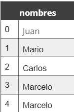

En Java, un array es un objeto y, como tal, debe usarse el operador `new` **para crear una instancia**, pero a diferencia de las colecciones, **los array son de longitud fija**, la cual debe definirse en la creación, siendo inmutable.

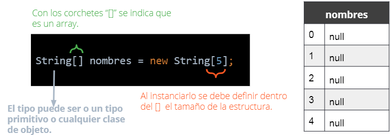

Establecemos valores a un array a través de su índice. Dado que es una estructura fija, no se pueden eliminar elementos.

```java
nombres[0] = "Juan";
nombres[1] = "Mario";
nombres[3] = "Marcelo";
```

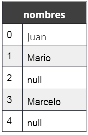

> Intentar acceder a un índice fuera de rango como por ejemplo nombres[10] provoca una excepción. (Error)

### Ciclos en array <a id='c2d1'></a>

Podemos recorrer un array a través de un ciclo `for, while o for each` y también utilizar la propiedad `length` que nos indica el tamaño del array

```java
for(int i = 0; i < nombres.length; i++)
    System.out.println(nombres[i]);
```

```java
int i = 0;
while(i < nombres.length) {
    System.out.println(nombres[i]);
    i++;
}
```

```java
for(String nombre : nombres)
    System.out.println(nombre);
```

<!-- fin resumen pdf -->

# C3 - Repaso <a id='c3'></a>

> Ver PDF: Ejercicio 3
>
> Ver PDF: Ejercicio talleres

# C4 - Objetos y UML <a id='c4'></a>

## Concepto de Objeto y Clases <a id='c4a'></a>

**Un mundo lleno de Objetos**

Estamos iniciando nuestro aprendizaje de la llamada Programación Orientada a Objetos, que nos va a permitir resolver situaciones problemáticas con un enfoque diferente al de otros paradigmas.
Ahora es como si utilizamos los “anteojos de objetos” para ver nuestro mundo y abstraer la realidad en un programa de puros objetos.

Ahora ya que estamos hablando sobre esto, veamos un video sobre Objetos

> ver video: Concepto de objetos

<!-- inicio resumen video -->

**Un objeto:** Es algo que tiene:

-   Caracteristicas (o atributos) y
-   Responsabilidades (dependen del contexto)

Siempre que pensemos en los objetos que van a componer nuestro sistema; tenemos que analizarlos segun el contexto en el cual estamos trabajando.

**Ejemplo silla**

-   Caracteristicas:

    -   Es de color blanco
    -   Es de plastico
    -   Tiene respaldo

-   Responsabilidades:
    -   Sostenerme al sentarme en ella
        dependiendo del contexto tendria otras como:
    -   golpear un zombie

**Responsabilidades usuario facebook**

-   puede comentar
-   puede postear
-   puede likear

**Responsabilidades usuario uber**

-   Pedir un auto
-   calificar un conductor

<!-- fin resumen video -->

> Ver PDF: Analizando un caso.pdf

<!-- inicio resumen pdf-->

Analizar un caso requiere de tomarse un tiempo para comprender el contexto, tomar nota de los detalles más relevantes y considerar sus soluciones.

Hay soluciones que pueden amoldarse más a ser eficientes que eficaces. En este análisis, nos vamos a acotar a lo que les iremos proponiendo mediante distintas consignas.

Dentro del análisis de los detalles es bueno lograr diferenciar ciertos ítems:

1. Cosas que realizan acciones (personas, entidades, máquinas, etc)
2. Características (sustantivo)
3. Acciones (verbos)
4. Detalles o requerimientos especiales

## Ejemplo: Caso veterinaria <a id='c4a1'></a>

Analizando el texto donde María detalla cómo sería el proceso de un cliente en la veterinaria podemos **resaltar** las palabras que nos ayudarán luego para sintetizar los requerimientos del sistema.

_“Son las 11 a.m. y entra a la veterinaria por primera vez Juana con su mascota Picha. Las registramos a ambas, anoto el nombre y apellido del cliente y también qué mascota tiene. De la mascota voy a anotar la raza. Juana había pedido previamente un turno con uno de los veterinarios. Juana deja a la perra en la veterinaria para que sea atendida. El veterinario atiende a Picha, le realiza un diagnóstico y lo guarda en el historial de diagnósticos. Más tarde, Juana pasa a buscar a Picha. Los diagnósticos son guardados según la fecha con una descripción y la mascota asociada. De los veterinario — empleados— se conoce el nombre, apellido y matrícula.”_

María nos aclara que la forma de agendar turnos todavía no la tiene definida. Le comentamos que el sistema pronto le va a mostrar el diseño para ver si se había entendido todo bien.

Para empezar con la actividad, destinar 5 minutos con el objetivo de analizar el texto del relato y trata de identificar los ítems con los colores propuestos anteriormente. En la siguiente sección proponemos una posible resolución —no avancemos todavía, no al spoiler—.

### Primera solucion <a id='c4a1a'></a>

¿Cómo analizar desde el paradigma de objetos?

Tomando las bases de este paradigma podemos realizarnos preguntas que nos ayudan como guia:

-   **¿Qué objetos participan?**

1. Cliente
2. Veterinario
3. Diagnóstico
4. Historial de diagnósticos

-   **¿Cuáles son sus atributos?**

    Del Veterinario:

    -   Nombre
    -   Apellido
    -   Matrícula

-   ¿Qué responsabilidades tienen?

    Veterinario: Realiza diagnóstico de las mascota

> Recordemos que su responsabilidad es en este **contexto**

<!-- fin resumen pdf -->

Hasta ahora estuvimos hablando de objetos y de sus características, es momento de meternos con otra parte importantisima de la programación orientada a objetos: las clases

> ver Video: Clases e instancias

<!-- inicio resumen video-->

Lo primero que debemos hacer antes de crear el sistema, es modelar los aspectos de la vida real que influyen en nuestro contexto

-   mascotas
-   duenios
-   veterinarios
-   diagnosticos

hay que entender las abstracciones con las que vamos a trabajar

Cada unos de esos elementos se va a traducir como una clase

clase => Mascota

Mascota es el molde de lo que representa la idea de una mascota

Los objetos serian instancias concretas de ese molde:
Como los perros los gatos, que representan elementos concretos de nuestro sistema, las instancias pueden ser multiples

instancia y objeto son sinonimos

Nuestro sistema va a tener clases definidas y por cada una de las clases, podemos generar muchas instancias que van a ser las representaciones de los objetos concretos

```java
//clase
class Mascota {
    //instancia
    perro
    gato
    pajaro
}
```

<!-- fin resumen video -->

## Atributos, responsabilidades y constructor <a id='c4c'></a>

> ver video: conclusion

<!-- inicio resumen video -->

## Diagramar clases y atributos <a id='c4c1'></a>


vamos a entender cada `clase` como un **nuevo tipo de dato**
Cada tipo de dato define

-   atributos
-   responsabilidades

Dicho de otra manera, que puedo hacer con ese objeto?

Por ejemplo, una lista, es un tipo de dato especifico, al cual podemos pedirle que nos diga la cantidad de elementos que contiene, lo mismo vamos a hacer con las clases que estamos definiendo.

Vamos a agregarle responsabilidades que al estar programando vamos a llamar metodos.

Pero como estamos definiendo un tipo de dato desde 0, tenemos que aclarar en nuestro diagrama, todos los metodos; es decir todas las responsabilidades que van a poder ejecutar los objetos de nuestra clase.

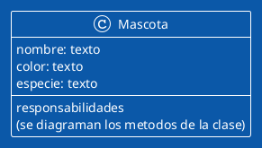

**por ejemplo**

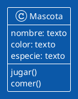

De esta forma agregamso los metodos a las clases de nuestro sistema

Agregaremos el nombre de la responsabilidad, luego entre parentesis `()` agregaremos los parametros en caso de ser necesario

Tambien podemos definir si un metodo va a devolver un resultado, senialandolo con `:` y agregando el tipo de dato que va a devolver esa responsabilidad al ejecutarse

Ademas agregaremos adelante del metodo un `+` si es publico o un `-` si es privado

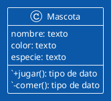

## Encapsulamiento <a id='c4c2'></a>

Porque ponemos los atributos por disenio como privados
Se oculta `el como funciona` y solo deja el enfoque en `que hace`, importa el `que`

Cada una de las responsabilidades de nuestra clase se va a modelar como metodos, asi ocultamos las propiedades y el comportamiento interno de los objetos

preguntar a la mascota como: decir nombre, decir color, decir especie, se va a explicitar con metodos

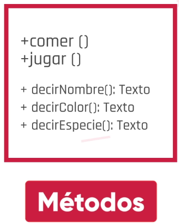

al leer los metodos, se puede saber que se puede hacer con una mascota

> En resumen: Lo que hacemos es definir un nuevo tipo de dato, con todas las caracteristicas que lo representan (atributos), y todas las funciones asociadas que podemos ejecutar (Responsabilidades)

<!-- fin resumen video -->

> ver pdf: Descubriendo Objetos.pdf

<!-- HACER -->

## Atributos y comportamientos <a id='c4c3'></a>

Entonces, ¿qué son los atributos y las responsabilidades de un objeto? <r>Los atributos de un objeto son las características y propiedades</r> distintivas que permiten darle significado. Continuando con el ejemplo visto anteriormente en el video:

-   **Clase**: Veterinaria
-   **Objeto**: Veterinario
-   **Atributo**: nombre, apellido, matrícula

Mientras que <r>las responsabilidades o comportamientos son la manera en que actúa o reacciona un objeto</r> —es decir, **es lo que representa la actividad visible y comprobable exteriormente**—, en la programación orientada a objetos <r>vamos a llamar al comportamiento de los objetos: “**métodos**’, los cuales nos van a permitir establecer cómo van a responder los objetos cuando interactuemos con ellos</r>. ¡Atención! **Los atributos y comportamientos van a depender del contexto del objeto**, tal como hemos visto en el video en el caso de la silla.

Cada método especifica la operación o comportamiento que a su vez puede acceder a la estructura interna del objeto, como así también interactuar con otros objetos. <r>Por lo general, los encontramos como verbos indicando las acciones que puede realizar el objeto</r>.

-   **Clase**: Veterinaria
-   **Objeto**: Veterinario
-   **Atributo**: nombre, apellido, matrícula.
-   **Responsabilidades**/**comportamiento**: recibirMascota, curar, HacerDiagnostico.

## Constructor de un objeto <a id='c4c4'></a>

Ya tenemos claramente definidas las partes de nuestro objeto, ya podemos dejar lista nuestra definición (la clase Veterinaria).
A partir de esa clase, podemos crear los objetos. Cada objeto tendrá sus valores propios de cada atributo y será capaz de hacer cada una de sus responsabilidades.
<r>Para poder crear estos **objetos** utilizaremos el **Constructor** que será quien, a partir de la clase, **genera un nuevo objeto**.</r> Al objeto Veterinario vamos a darle un método constructor:

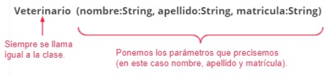

## Ejemplos de un objeto con sus atributos y métodos <a id='c4c5'></a>

> Ver PDF: Ejemplos de un objeto.pdf

Nuestro contexto es la veterinaria. Ahora vamos a modelar a nuestro **objeto Veterinario** mediante un diagrama. A la derecha podemos apreciar cómo modelamos los objetos mediante el lenguaje unificado de modelado, por sus siglas en inglés, UML.

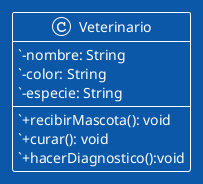

Cambiemos de contexto, ahora nos encontramos analizando el sistema contable de la clínica veterinaria. Vamos a modelar nuestro objeto Veterinario para el nuevo contexto

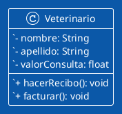

¿Podemos ver que ahora hay otros atributos y responsabilidades diferentes?

Ambos son veterinarios, y en cada caso —o contexto— vamos a modelar los atributosy responsabilidades que sean necesarios para lograr la solución de ese problema en particular

> Siempre tenemos que tener en cuenta el contexto de nuestro análisis

## Encapsulamiento (publico / privado) <a id='c4d'></a>

**No todo el mundo no tiene que saber cómo hago yo las cosas**

Los objetos son clave para comprender la tecnología orientada a objetos. Tenemos que conocer sus atributos, pero ¿debo cambiarlos?. Claro, como aprendimos desde niños, para usar lo de otro debo pedirlo a su dueño. Por eso, es muy importante que en el caso de programación de objetos, cada uno “oculte” su manera de guardar sus atributos y los “exponga” mediante acciones que cualquiera puede invocar.

Mi manera de recordar mi edad es desconocida para cualquiera, pero cuando me pregunten la edad, van a recibir la información de cuántos años tengo. Y ustedes lo deben hacer de formas diferentes, ¿recuerdan la fecha de nacimiento, cuántos cumplieron o cuántos años más que sus hermanos tienen? Esto se llama encapsulamiento y vamos a estudiarlo a continuación.

> ver PDF: ¿Qué es encapsular .pdf

<!-- inicio resumen pdf -->

El encapsulamiento es una de las propiedades más importante de la programación orientada a objetos.

Cuando hablamos de encapsulamiento, no debemos olvidarnos del origen de la palabra “colocar en cápsulas”. ¿Qué serían las cápsulas? Es un envoltorio que protege el contenido en su interior. **En la POO, buscamos impedir que cualquier otro objeto pueda tener acceso a la estructura interna de un objeto**. Solamente yo puedo cambiar o mostrar mi estado y con los métodos específicos que van a indicar cómo pedir cambios en dichos atributos desde el exterior del objeto. **De ahora en más, cuando diseñamos nuestros objetos, tenemos que tener en cuenta el encapsulamiento.** Por ejemplo, si tuviéramos un objeto Persona, que tiene como atributo su clave de acceso bancario, no sería conveniente que todos los objetos puedan acceder libremente a dicho atributo. <r>El objeto Persona debería establecer un método controlado y seguro para devolver la clave de acceso bancario, por ejemplo, si es que se cumplen medidas de seguridad.</r>

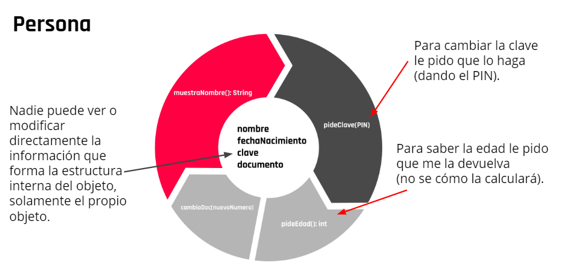

**Importante hacer:** <a id='c4d1'></a>

-   Cuando definamos un objeto, dejar sus atributos privados.
-   Los métodos que sean públicos serán vistos por los otros objetos.
-   Usar siempre métodos públicos para ver o modificar las características de tus objetos.
-   Para cambiar el valor de un atributo se usa un método `set`, por ejemplo, para cambiar el nombre será `setNombre(String)`
-   Para obtener el valor de un atributo se usa un método `get`, por ejemplo, para saber el nombre será `getNombre(): String`

> Los métodos para ver o cambiar atributos se los denomina getters y setters respectivamente.

<!-- fin resumen pdf -->

## Diagrama UML <a id='c4e'></a>

**¿Qué es UML?**

UML son las siglas para _Unified Modeling Language_, que en castellano significan: Lenguaje de modelado unificado. Es un lenguaje de modelado, de propósito general, usado para la visualización, especificación, construcción y documentación de sistemas orientados a objetos.

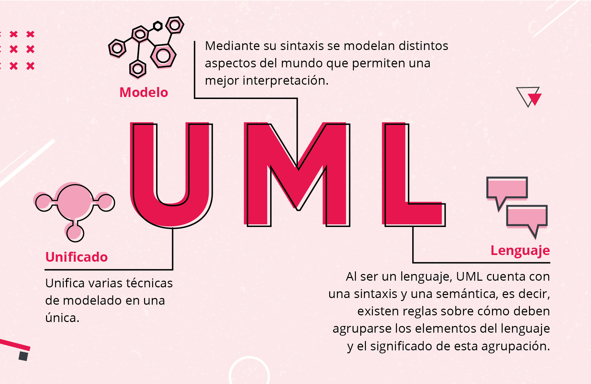

## Diagrama de clases <a id='c4e1'></a>

El lenguaje de modelado unificado (UML) contiene distintos diagramas de estructura, comportamiento e interacción. En este caso, vamos a ver un diagrama de estructura conocido como diagrama de clases, que muestra una vista estática de la estructura del sistema, o de una parte de este, describiendo qué atributos y comportamiento debe desarrollar con los métodos necesarios para llevar a cabo las operaciones del sistema.

¿Cómo le presentamos el sistema de la veterinaria a una persona que nunca vio código en su vida? Con el diagrama de clases vamos a graficar un rectángulo dividido en tres partes por cada tipo de clase que exista. Conozcamos de qué se trata.

[Diagrama de clases](https://view.genial.ly/60b24f2589103c0d7c05a59f)

### Nombre

Nombre de la clase que identifica al objeto en singular y siempre empezando con mayúscula

### Atributos

Indica los atributos de la clase, tiene en cuenta la visibilidad, el nombre del atributo y el tipo de dato. La visibilidad es una propiedad que permite a un objeto operar sobre otro. Si un objeto no ve a otro, no puede enviarle un mensaje para pedirle su colaboración. Hay tres niveles de visibilidad disponibles:

**Publica**
Se representa con el símbolo ‘’+’’ e indica que cualquier clase externa con visibilidad hacia el clasificador dado puede utilizar la característica.

`+ atributo:Tipo`

**Privada**
Se representa con el símbolo ‘’-’’ y solo el propio clasificador puede utilizar la característica.

`- atributo:Tipo`

**Protegida**
Se representa con el símbolo “#” e indica que cualquier descendiente del clasificador puede utilizar la característica.

`# atributo:Tipo`

### Responsabilidades

Indica los métodos de la clase, teniendo en cuenta la visibilidad, el nombre del método, los parámetros y el tipo de dato que retorna el método.

`+ metodo(parametros):Tipo`

## Presentacion del software para graficar el Diagrama de Clases

Al momento de poder graficar estas clases, vamos a utilizar un programa que nos facilita el trabajo, aquí hay una breve descripción de cómo usarlo.

> Ver PDF: Draw.io

## Quizz <a id='c4e2'></a>

**¿Cuál es la diferencia entre clase y objeto ?**
Una clase es la representación abstracta de objetos de un mismo tipo, mientras que un objeto es una instanciación de una clase.

**Indicá cuáles son componentes del objeto.**
Atributos, nombre, comportamiento

**¿En qué consiste un método en programación orientada a objetos?**
En la forma en que responden los objetos a los mensajes dirigidos a ellos.

## Reconozcamos en un problema cuales son los objetos

El diagrama de clases y el modelado son fundamentales para la programación orientada a objetos.
Ya tenemos el suficiente detalle para poder hacer un problema más completo.
Es tu turno…. ¡vamos!

> ver PDF: Ejercitacion Modelado Objetos.pdf

<!-- HACER -->

> Ver: Ejercitacion 1- modelar cuestiones bancarias.pdf

<!-- HACER -->

> Ver: Ejercitacion 2- modelar cuestiones bancarias.pdf

<!-- solucion en clase -->

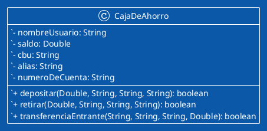

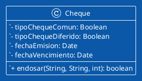

# C5 - Clases <a id='c5'></a>

> Ver PDF: Atributos y metodos, constructores

<!-- inicio resumen -->

## Atributos, constructores y métodos <a id='c5a'></a>

### Atributos <a id='c5a1'></a>

Los atributos de nuestra clase son: descripcion, precioVenta y stock.

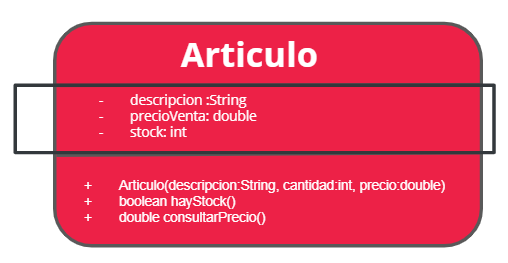

**Los atributos de la clase Articulo en Java**

Definimos los atributos como privados para preservar el encapsulamiento.

```java
public class Articulo{

    private String descripcion;
    private double precioVenta;
    private int stock;
}
```

### Constructores <a id='c5a2'></a>

Los Constructores de la clase Articulo

En el constructor apareció la palabra reservada this, se utiliza para hacer referencia a la instancia u objeto. Cuando creamos una instancia con new, se ejecuta el constructor. Esa instancia que estamos creando es la que estamos nombrando con el this y al hacer this.descripcion nombramos el atributo descripcion de ella.

El constructor

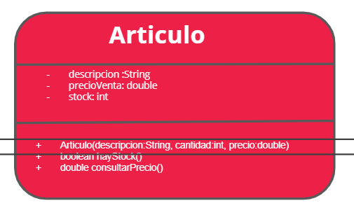

**Los constructor de la clase Articulo en Java**

```bash
public class Articulo{
    private String descripcion;
    private double precioVenta;
    private int stock;

        public Articulo(String descripcion, int cantidad,double precio){
        this.descripcion = descripcion;
        precioVenta = precio;
        stock = cantidad;
        }
}
```

**El constructor es un método que no tiene tipo de dato**, se llama igual que la clase. Recibe como parámetros los valores que se desea asignar inicialmente a los atributos, es decir, los valores iniciales. Se puede usar para inicializar los atributos.

```java
public Articulo(String descripcion, int cantidad,double precio)

```

Para diferenciar el atributo descripcion del parámetro que tiene el mismo nombre, usamos `this`.
This hace referencia al objeto u instancia con el que se está trabajando.

```java
this.descripcion=descripcion;
```

### Metodos <a id='c5a3'></a>

Los métodos de la clase Articulo

Los métodos de nuestra clase son hayStock() y consultarPrecio()

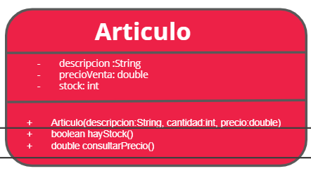

```java
public class Articulo{
    private String descripcion;
    private double precioVenta;
    private int stock;

    +    public Articulo(String descripcion, int cantidad,double precio)

    public boolean hayStock(){
            return stock>0;
    }
    public double consultarPrecio(){
        return precioVenta;
    }
}
```

Método `hayStock()` Devuelve true si stock es mayor a 0 y false en caso contrario

```bash
public boolean hayStock(){
    return stock > 0;
}
```

Método consultarPrecio()Devuelve el Precio de Venta

```bash
public double consultarPrecio(){
    return precioVenta;
}
```

<!-- fin resumen pdf -->

## Nombres en Java <a id='c5a4'></a>

[Nombres en Java](https://view.genial.ly/60c0aeda7860d10d09dec39c)

<!-- resumen link -->

### Camel Case

Camel case es un estilo de escritura que se aplica a frases o palabras compuestas. El nombre se debe a que las mayúsculas a lo largo de una palabra en CamelCase se asemejan a las jorobas de un camello.

### Atributos

Los nombres de los atributos comienzan con minúscula, si necesitamos usar más de una palabra, a partir de la segunda inicializamos en mayúscula.
`elAtributo`

### Metodos

Se nombran de la misma forma que los atributos, la primera palabra en minúscula y si el nombre tuviera más palabras, todas se inicializan en mayúscula. Recomendamos poner nombres lo más descriptivos posibles, aunque esto implique usar varias palabras.
`calculoSueldoNeto`

### Objetos

La primera palabra en minúscula y si tiene más de una palabra, las siguientes se inicializan en mayúscula.
`nombre, importeTotal`

### Clase

Los nombres de las clases siempre van con la inicial en mayúscula, si necesitamos usar dos o más palabras para nombrar una clase van pegadas y con todas las iniciales en mayúscula.
`CamelCase, Empleado`

### Paquetes

Todas las letras en minúscula.

### Constantes

Todas las letras en mayúscula y si hay más de una palabra, separadas por guión.
`IVA, DIAS_SEMANA`

<!-- fin resumen link -->

> Ver PDF: Crear una Clase en Java.pdf

<!-- inicio resumen pdf -->

## Crear una clase en Java <a id='c5a5'></a>

## La clase

### Planteo

Para resolver un problema hemos detectado la necesidad de una clase Artículo. Los artículos tienen nombre, precio de compra, precio de venta y stock disponibles. El comportamiento que se espera de ellos es que puedan informar si hay stock disponible y cuál es la ganancia obtenida por cada venta, según los precios disponibles

### Diseño

Luego de realizar el diseño de la clase en un diagrama, el próximo paso es implementarla:

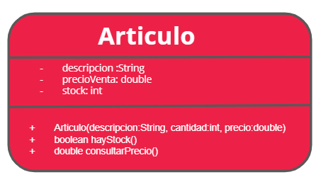

## Como crear una clase en el IDE

## Una clase en Java

Creamos una clase en nuestro package. Al hacer clic con el botón derecho del mouse, obtenemos un menú contextual, seleccionamos New y luego Java Class.

Luego le asigno un nombre —siempre la inicial en mayúscula—.

**La nueva clase**

Al crear la clase estara vacia. Debemos incorporar los atributos y métodos.
Definiéndolos con el alcance correcto para mantener el encapsulamiento, esto sería los atributos como private y los métodos como public.

```java
package com.company;

public class Articulo{

}
```

**Importante**

> No cambiar nunca el nombre de la clase. El nombre del archivo .java debe coincidir con el nombre de la clase.
>
> Los nombres de las clases siempre deben inicializarse en mayúscula y deben estar en singular.

**¿Cómo seguimos?**

Ya logramos crear una clase en el IDE.
Algunas cosas importantes, cuando creamos la clase es importante estar seguros del nombre que le vamos a dar. Java necesita mantener el mismo nombre de la clase como nombre del archivo fuente .java
Ahora vamos a comenzar con los atributos y métodos de nuestra clase Articulo.

## Proteger el encapsulamiento <a id='c5b'></a>

Los atributos de una clase deben ser privados, para garantizar el ocultamiento, sin embargo, en algún momento podemos necesitar consultar o cambiar el valor de un atributo.

### Métodos de acceso

Son métodos públicos que nos permiten acceder al valor de los atributos privados del objeto. Los métodos modificadores nos posibilitan cambiar el valor de un atributo y los métodos consultores u observadores nos devuelven el valor guardado en un atributo.

Para nombrarlos usamos dos prefijos: `get` y `set`.

**`get`**
El primero de estos es para los consultores, por ejemplo,
getNombre, getValor, getSueldo, etc.,
**`set`**
Para los métodos modificadores:
setNombre, setValor, setSueldo, etcétera.

Debido a estos prefijos se los suele llamar métodos getters y setters.

### Los métodos get

Estos métodos siempre devuelven algo del mismo tipo que el atributo al que acceden, no tienen parámetros porque solo acceden al valor guardado en el atributo, sin cambiarlo.

### Los métodos set

Los métodos son de tipo `void` y <r>tienen un parámetro del mismo tipo que el atributo al que acceden</r>, el valor que recibe en este parámetro es el que se asigna al atributo al que acceden.

> **¡Atención!**
> Si bien cuando comenzamos a hacer nuestras primeras clases ponemos `set` y `get` para todos los atributos, hay que tener cuidado con esto, ya que si queremos proteger los datos, no siempre se debe dejar acceder a ellos mediante un set o get. Esto se debe analizar en cada situación.

> Ver PDF: Proteger el encapsulamiento.pdf

## Proteger el encapsulamiento: setters y getters <a id='c5b1'></a>

### Diseño de la clase Articulo

Para lograr el encapsulamiento nuestros atributos son privados:

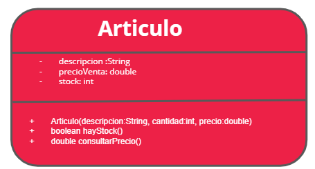

**implementacion de la clase Articulo**

```java
public class Articulo{
    private String descripcion;
    private double precioVenta;
    private int stock;

+   public Articulo(String descripcion, int cantidad,double precio)
+   public boolean hayStock(){
    }
+   public double consultarPrecio(){
}
```

## Agregar setters y getters

En la clase Artículo, protegimos los atributos, pero si necesitamos acceder a ellos podemos agregar, métodos de acceso.
Los métodos que me permitirán acceder a los atributos, setters y getters

```java
public class Articulo{
    private String descripcion;
    private double precioVenta;
    private int stock;


    public String getDescripcion(){
        return descripcion;
    }
    public double getPrecioVenta(){
        return precioVenta;
    }
    public int getStock(){
        return stock;
    }
    public void setDescripcion(String descripcion){
        this.descripcion = descripcion;
    }
    public void setPrcioVenta(double precio){
        precioVenta = precio;
    }
    public void setStock(int stock){
        this.stock = stock;
    }
```

Los métodos `get` permiten acceder al valor de un atributo para una consulta o para usar ese valor en otra operación.

```java

public String getDescripcion(){
    return descripcion;
}
public double getPrecioVenta(){
    return precioVenta;
}
public int getStock(){
    return stock;
}
```

Los métodos `set` permiten cambiar el valor de un atributo, reciben por parámetro el nuevo valor y lo asignan al atributo correspondiente.

```java
public void setDescripcion(String descripcion){
    this.descripcion = descripcion;
}
public void setPrcioVenta(double precio){
    precioVenta = precio;
}
public void setStock(int stock){
    this.stock = stock;
}
```

Para diferenciar el atributo descripción del parámetro que tiene el mismo nombre, usamos this. This hace referencia al objeto u instancia con el que se está trabajando

```java
this.descripcion = descripcion;
```

**Actividad PG** <a id='c5b2'></a>

1. Definir una nueva clase Cliente que contenga los siguiente atributos:

-   nombre de tipo String
-   apellido de tipo String
    no te olvides en java los atributos son privados, crearle getters y setters a ambos para poder acceder a ellos

```java
public class Cliente{
    private String nombre;
    private String apellido;

    public String getNombre(){
        return nombre;
    }
    public String getApellido(){
        return apellido;
    }
    public void setNombre(String nombre){
        this.nombre = nombre;
    }
    public void setApellido(String apellido){
        this.apellido = apellido;
    }
}
```

2. Ejercicio Cliente (Constructor)

Una vez que ya tenemos nuestra clase Cliente funcionando es hora de crearle una constructor
Nuestro constructor tiene que recibir nombre y apellido y asignárselo a los atributos de nuestra clase Cliente

```java
public class Cliente {

    private String nombre;
    private String apellido;

    //Constructor:
    public Cliente (String nombre, String apellido){
        this.nombre = nombre;
        this.apellido = apellido;
    }

    public String getNombre() {
        return nombre;
    }
    public String getApellido() {
        return apellido;
    }
}
```

## Instancia <a id='c5c'></a>

> Ver PDF: crear una instancia

<!-- inicio resumen pdf -->

### La clase Artículo

Necesitamos crear una clase Artículo, la información con la que contamos es: un Articulo tiene una descripción, un precio de venta y un stock. Esta clase debe poder responder si hay stock y cuál es su precio.

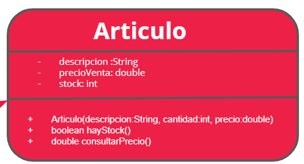

## Los métodos de la clase Articulo en Java

```java
public class Articulo{
    private String descripcion;
    private double precioVenta;
    private int stock;

    +    public Articulo(String descripcion, int cantidad,double precio)

    public boolean hayStock(){
            return stock>0;
    }
    public double consultarPrecio(){
        return precioVenta;
    }
}
```

## Cómo comenzar a usarlo

**Programa principal**

```java
public class Main {

    public static void main(String[] args) {

        Articulo articulo= new Articulo(“Artículo 1”,100,1100.00);

        if (articulo.hayStock()){
            System.out.println("Hay stock disponible");
        }

        System.out.println(“El precio de venta es “ + articulo.consultarPrecio());

    }
}
```

Creamos un objeto o instancia de la clase Articulo.

```java
Articulo articulo= new Articulo(“Artículo 1”,100,1100.00);
```

Utilizamos el método `.hayStock()`

```java
if (articulo.hayStock()){
    System.out.println("Hay stock disponible");
}
```

Utilizamos el método `.consultarPrecio`

```java
System.out.println(“El precio de venta es “ + articulo.consultarPrecio());
```

<!-- fin resumen pdf -->

## La clase <a id='c5d'></a>

> Ver PDF: La clase

<!-- resumen pdf -->

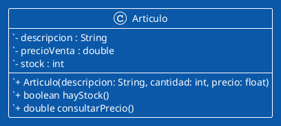

```java
public class Articulo{

    private String descripcion;
    private double precioVenta;
    private int stock;

    public Articulo(String descripcion, int cantidad,double precio){
        this.descripcion=descripcion;
        precioVenta=precio;
        stock=cantidad;
    }

    public String getDescripcion(){
        return descripcion;
    }
    public double getPrecioVenta(){
        return precioVenta;
    }
    public int getStock(){
        return stock;
    }

    public void setDescripcion(String descripcion){
        this.descripcion= descripcion;
    }
    public void setPrecioVenta(double precio){
        precioVenta=precio;
    }
    public void setStock(int stock){
        this.stock=stock;
    }

    public boolean hayStock(){
        return stock>0;
    }
    public double consultarPrecio(){
        return precioVenta;
    }
}
```

<!-- fin resumen pdf -->

## Variables y métodos de clase <a id='c5e'></a>

Ya podemos implementar nuestras clases y, a partir de ello, crear objetos o instancias de las mismas. Todos los objetos que creamos tienen los mismos atributos, pero cada uno tiene su propio estado, los atributos tienen distintos valores para cada objeto. Ahora veremos que hay una forma de tener un único valor para todos los objetos.

**Actividad PG** <a id='c5e1'></a>

Ya creamos la clase Cuenta que contiene un numero de cuenta y un saldo
Crear un método llamado depósito que tenga como parámetros de entrada cantidad de dinero. Al ser un
depósito la cantidad de dinero se incrementa al saldo.
Crear un método llamado extracción que tenga como parámetros de entrada cantidad de dinero. Al ser
una extracción, la cantidad se resta del saldo
Solo permitir realizar la extracción si el saldo es suficiente

```java
public class Cuenta {

    private int numeroDeCuenta;
    private Double saldo;

    //crear la funcion depositar y retirar aca
    public void depositar(Double cantidadDeDinero){
    this.saldo += cantidadDeDinero;
    }
    public void retirar(Double cantidadDeDinero){
        if(saldo >= cantidadDeDinero){
            this.saldo -= cantidadDeDinero;
        }
    }

    //no tocar estas funciones
    public void setSaldo(Double saldo) {
        this.saldo = saldo;
    }

    public Double getSaldo() {
        return saldo;
    }
}
```

> Ver PDF: Variables y Métodos de Clase.pdf

<!-- inicio resumen pdf -->

## Las clases y los objetos

**Las clases**
Vimos que el enfoque de la programación orientada a objetos se basa en identificar objetos con sus atributos y responsabilidades. Entonces, encontramos que hay grupos de objetos que aunque tienen diferentes estados —valores de los atributos—, tienen en común cuáles son los atributos y cuáles son sus responsabilidades.
Entonces este “molde” es lo que llamamos clases.

**Los objetos**

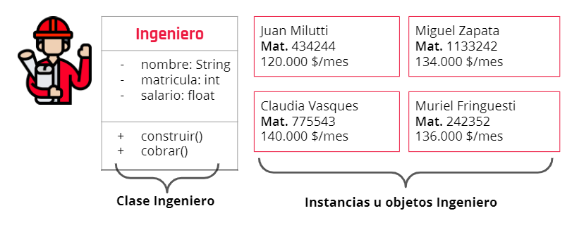

**¿Qué comparten los objetos?**
Todos los objetos de una clase tienen la misma estructura: los mismos atributos y el mismo comportamiento, es decir, pueden hacer lo mismo. Pero cada objeto tiene sus propios atributos, puede tener distintos valores en sus atributos, tiene un estado propio.

**Un valor común para todos los objetos**

¿Todos los objetos pueden tener un valor en común?

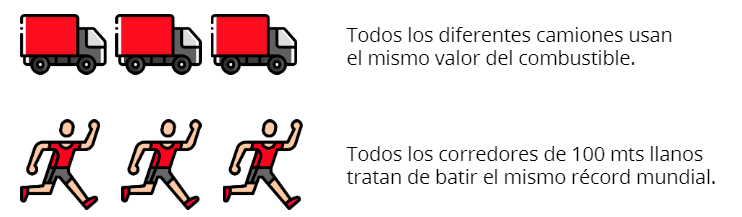

## Variable de clase <a id='c5e2'></a>

Vamos a llamar variables de clase a aquellas variables —atributos— que guardan valores comunes a todos los objetos. El combustible vale lo mismo para cualquier objeto Camion.

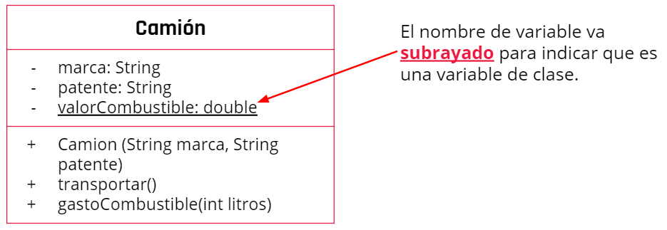

## Métodos de clase <a id='c5e3'></a>

Un método de clase se puede utilizar, sin necesidad de instanciar o crearun objeto, directamente con la clase.

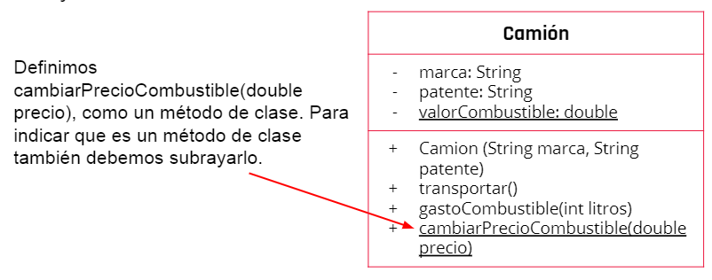

**Ejemplos de uso** <a id='c5e4'></a>

### La clase Camión

```java
public class Camion {
    private String marca;
    private String patente;
    static private double valorCombustible;

    public Camion(String marca, String patente){
        this.marca=marca;
        this.patente=patente;
    }
    public double gastoCombustible(int litros){
        return litros*Camion.valorCombustible;
    }
    static public void cambiarPrecioCombustible(double precio){
        Camion.valorCombustible=precio;
    }
}
```

Definimos la variable como static, esto hace que no se pueda usar con un objeto.

```java
static private double valorCombustible;
```

Definimos el método como static, esto hace que no se pueda usar con un objeto.

```java
static public voidcambiarPrecioCombustible(doubleprecio){
}
```

Accedemos a la variable de clase y podemos cambiar su valor.

```java
Camion.valorCombustible=precio;
```

### El main

```java
public class Main {
    public static void main(String[] args) {

        Camion miCamion = new Camion("Ford",”AB XXX CD”);

        Camion.cambiarPrecioCombustible(98.50);

        Sytem.out.println("Gasto " + miCamion.gastoCombustible(40));

    }
}
```

Creamos un objeto de la clase Camion.

```java
Camion miCamion = newCamion("Ford",”AB XXX CD”);
```

Utilizamos el método de clase a través de la clase y no del objeto

```java
Camion.cambiarPrecioCombustible(98.50);
```

## Conclusion: Live coding <a id='c5f'></a>

Te invitamos a ver el siguiente live coding donde mostramos un ejemplo de lo visto anteriormente.

> Ver video: Clases

**Actividad en clase** <a id='c5s1'></a>

<!-- inicio actividad -->

Para desarrollar un juego necesitamos implementarla clase UsuarioJuego. Los usuariostienen nombre y clave, estos datos se deben suministrarcuando se crea un nuevo usuario.Inicialmente tienen puntaje y nivel en cero. Sin embargo,pueden aumentar tanto el puntajecomo el nivel en 1, debemos suministrar un métodopara poder hacerlo. El usuario tambiénpuede recibir un bonus, esto quiere decir que recibeun valor extra que se suma a su puntaje

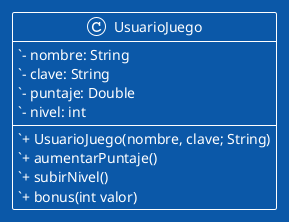

**Solucion:**

`class UsuarioJuego`

```java
package com.company;

public class UsuarioJuego {

    //atributos
    private String nombre;
    private String clave;
    private Double puntaje;
    private int nivel;

    //constructor
    public UsuarioJuego(String nombre, String clave){
        this.nombre = nombre;
        this.clave = clave;
        //lo tengo que inicializar en cero
        this.puntaje = 0.0;
        this.nivel = 0;
    }
    //no lleva parametro porque en uml no dice y porque aumenta siempre en 1
    public void aumentarPuntaje(){
        this.puntaje++;
        System.out.println("Se aumento el puntaje en "+this.puntaje);
    }
    public void subirNivel(){
        this.nivel++;
        System.out.println("Se aumento el nivel en "+this.nivel);
    }
    //recibe un parametro y lo incrementa en puntaje
    public void bonus(int valor){
        //tengo que convertir el int ya que puntaje recibe Double
        this.puntaje += valor;
        System.out.println("Por tu bonus se aumento el puntaje en "+this.puntaje);
    }
}

```

`class Main`

```java
package com.company;

public class Main {

    public static void main(String[] args) {
	// write your code here
        UsuarioJuego usuarioJuego = new UsuarioJuego("Tom","12345");
        usuarioJuego.aumentarPuntaje();
        usuarioJuego.bonus(520);
        usuarioJuego.subirNivel();
    }
}
```

-
-
-
-

<!-- fin resumen pdf -->
<!-- subir al inicio -->

[🔺](#up)
