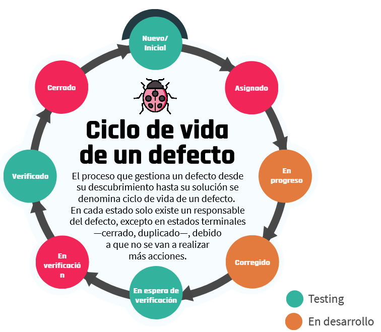

<t>Testing I</t>

---

## Índice

1. Fundamentos de testing y gestión de defectos.
- [C1 - Primeros pasos](#c1)
    - [Bienvenida](#c1a)
    - [Introduccion al testing](#c1b)
    - [Cronologia](#c1z)
    - [Principios del testing](#c1y)
    - [El rol del Tester](#c1c)
    - [Ventajas y desventajas prueba independiente](#c1x)
    - [Equipo - Mesa 3 patas](#c1w)
- [C2 - Gestion de defectos](#c2)
    - [Defectos](#c2a)
        - [ciclo de vida de un defecto](#c2a1)
    - [Gestion de defectos](#c2b)
        - [Proceso de gestión de defectos](#c2b1)
        - [Objetivos](#c2b2)
        - [¿Cómo escribir un buen informe?](#c2b3)
        - [¿Qué condiciones debemos tener en cuenta?](#c2b4)
        - [¿Cuáles son los problemas más comunes con los informes de defectos?](#c2b5)
        - [Partes de un informe de defectos](#c2b6)
    - [Actividad](#c3c)
- [C3 - Repaso](#c3)
2. Diseño e implementación de la prueba
- [C4 - Diseno de la prueba](#c4)
    - [Diseno de la prueba](#c4a)
        - [Características de un buen caso de prueba](#c4a1)
        - [¿Qué debe contener un caso de prueba?](#c4a2)
        - [Testing positivo y testing negativo](#c4a3)
        - [Ejemplo de caso de prueba](#c4a4)
        - [Happy path testing](#c4a5)
        - [Casos de uso y casos de prueba](#c4a6)
        - [Actividad en clase](#c4sm1)
    - [Notas clase 4](#c4s)
- [C5 - Niveles y tipos prueba](#c5)
    - [Ciclo de vida de las pruebas de Software](#c5a1)
    - [Tareas principales](#c5a1a)
        - [Planificacion](#c5a1b)
        - [Seguimiento y control](#c5a1c)
        - [Analisis](#c5a1d)
        - [Diseño](#c5a1e)
        - [Implementacion](#c5a1f)
        - [Ejecucion](#c5a1g)
        - [Conclusion](#c5a1h)
    - [Niveles de prueba](#c5a2)
        - [Prueba de componente o unitaria](#c5a2a)
        - [Prueba de integración](#c5a2b)
        - [Prueba de sistema](#c5a2c)
        - [Prueba de aceptación](#c5a2d)
    - [Implementacion tradicional vs agil](#c5a3)
    - [Tipos de prueba](#c5b)
        - [Prueba Funcional](#c5b1)
        - [Prueba No Funcional](#c5b2)
        - [Prueba Estructurales](#c5b3)
        - [Prueba Asociada al Cambio](#5b4)
    - [Esquema de niveles - Tipos de prueba](#c5a4)
    - [Notas clase 5](#c5s)
- [C6 - Repaso](#c6)
    - [Notas clase 6](#c6s)
- [C7 - Tecnicas de prueba](#c7)
    - [Tecnicas de prueba](#c7a)
        - [Categorías de técnicas de prueba](#c7a1)
            - [Técnicas de caja negra](#c7a1a)
                - [Partición de equivalencia](#c7a1a1)
                - [Valores límites](#c7a1a2)
                - [Tabla de decision](#c7a1a3)
                - [Transición de estados](#c7a1a4)
    - [Notas clase 7](#c7s)

# C1 - Primeros pasos 

## Bienvenida

Les queremos dar la bienvenida a este camino que empezamos juntos en el mundo de la calidad del software. Durante la materia de Testing I aprenderemos nuevos conceptos de testing, incorporaremos diferentes metodologías de trabajo y las aplicaremos para resolver diversos problemas que se presentan en el día a día de un tester. No solamente abarcaremos contenido teórico, sino también práctico, para así reforzar los conocimientos.

La idea es aprender juntos y acompañarlos en este proceso de aprendizaje y hacerlo de la manera más interactiva posible. ¿Estamos listos para comenzar?

[Modulos Testing I](https://view.genial.ly/60af8755c081a90d9f95a95e)

## Introduccion al testing 

> Ver video: Que es el testing

<!-- resumen video -->

se parte de la suposicion que el programa contiene errores
calidad es la satisfaccion del cliente
se toman decisiones a traves de las pruebas
confiabilidad, 
pruebas frecuentes 

factores externos:

- requerimientos poco claros
- mofidicaciones a ultimo momento
- errores de diseno y testers no calificados

Testing sirve para:

- Sirve para encontrar el mayor numero de defectos y remediarlos
- Asegurar que el producto funcione como esta definido en los requisitos
- Proporcionar al producto final un mayor grado de calidad.

<!-- fin resumen video -->

## Cronologia 

[Evolucion historica](https://view.genial.ly/60ae4430920d0f0dae99949f)

<!-- inicio resumen link -->

### 1950-1960

Después de la Segunda Guerra Mundial, los importantes avances en el desarrollo de software tuvieron lugar en EE. UU. y se generaron en el ámbito de la industria militar. En aquella etapa de la evolución del software, las aplicaciones eran desarrolladas para un hardware dedicado, sistemas que contaban al software como una de sus partes. <r>La calidad asociada a estos sistemas se lograba con pruebas exhaustivas una vez terminado de construir.</r>

### 1960 - 1980

Con los avances en el hardware y la aparición de lenguajes de alto nivel, se estableció una nueva tendencia en el desarrollo: se comenzaron a producir sistemas no militares e independientes del hardware. Los avances estuvieron orientados a producir sistemas de propósito general. 

A partir de los inconvenientes de sobrepresupuesto y tiempo adicional necesarios en la terminación del proyecto de desarrollo del sistema operativo de IBM, <r>se generó una alerta en el sentido de la necesidad de contar con métodos de desarrollo que garantizaran la calidad de los productos de software.</r>

### 1980 - 1990

Esta alerta generó el convencimiento de la necesidad y los primeros esfuerzos en la creación de una nueva disciplina llamada ingeniería de software. 

Mientras esto sucedía, la tecnología seguía avanzando y se contaba con plataformas de bajo volumen y costo que ofrecían la posibilidad de desarrollar software como una oportunidad de negocio a gran escala. 

Luego de su paso por Japón, vuelve a EE.UU. <r>W. Demming e introduce el siguiente concepto “la calidad de un producto está directamente relacionada al proceso utilizado para crearlo”</r>, de esta manera, las empresas estadounidenses comienzan a adoptar la estrategia conocida como Gestión de la calidad total.

### 1990 - 2000

En la década de 1990, el crecimiento de los sistemas se acentuó, con protagonistas como Microsoft —ya convertida en líder mundial— Netscape y Oracle, entre otros. Además, <r>se consolidaron las metodologías de desarrollo de tipo iterativas, las cuales van suplantando a las conocidas como cascada.</r> <r>Aparecieron algunas metodologías llamadas ágiles y el concepto de integración continua y también se sigue trabajando en IVV (Independent Verification Validation)</r>. Estas formas de trabajo tienen una fuerte influencia en la calidad del software.

### 2000 - 2010

El escenario establecido para el desarrollo de software está determinado por <r>un hardware cada vez más poderoso, software de última generación, modelos de desarrollo y metodologías ágiles. </r>

Esta velocidad creciente impuesta por el mercado de productos de software tiene un impacto importantísimo en la calidad de los productos y servicios ofrecidos. Es de notar que estos cambios en la evolución de esta industria hicieron que la preparación de los desarrolladores de hoy día sea muy distinta a la que tenían aquellos programadores de sistemas integrados a un hardware dedicado y con requerimientos estables de los años cincuenta.

### 2010 - actualidad

En esta época <r>se afianza la integración entre la ingeniería del software y la ingeniería de sistemas destacándose el papel de los requisitos no funcionales y, sobre todo, de la seguridad</r>; la <r>importancia de la “ciencia, gestión e ingeniería de los servicios” que requiere un enfoque interdisciplinar —informática, marketing, gestión empresarial, derecho, entre otros</r>— a la hora de abordar el diseño de los servicios; <r>la necesidad de adaptar los métodos de desarrollo de software para trabajar en un “mundo abierto”</r> —teniendo en cuenta la inteligencia ambiental, las aplicaciones conscientes del contexto, y la computación pervasiva)—; los sistemas de sistemas intensivos en software (SISOS) con decenas de millones de líneas de código, decenas de interfaces externas, proveedores “competitivos”, jerarquías complejas, entre otros.

También estamos viendo ya la implantación de la ingeniería del software continua, y su correspondiente tecnología y “filosofía” DevOps, que logran reducir el tiempo entre que se compromete un cambio en el sistema y se implementa en producción; lo que requiere un cambio cultural para aceptar la responsabilidad compartida —entre desarrollo y operación— de entregar software de alta calidad al usuario final.

<!-- fin resumen link -->

## Principios del testing 

[7 principios del Testing](https://view.genial.ly/609824f9de75770d03eca4dc)

### 1. La prueba muestra la presencia de defectos, no su ausencia

No puede probar que no hay defectos. Reduce la probabilidad de que queden defectos no descubiertos en el software, pero, incluso si no se encuentran, <r>el proceso de prueba no es una demostración de corrección.</r>

### 2. La prueba exhaustiva es imposible

No es posible probar todo —todas las combinaciones de entradas y precondiciones—, excepto en casos triviales. <r>En lugar de intentar realizar pruebas exhaustivas se deberían utilizar el análisis de riesgos</r>, las técnicas de prueba y las prioridades para centrar los esfuerzos de prueba.

### 3. La prueba temprana ahorra tiempo y dinero

Para detectar defectos de forma temprana, las actividades de testing, tanto estáticas como dinámicas, <r>deben iniciarse lo antes posible en el ciclo de vida de desarrollo de software</r> para ayudar a reducir o eliminar cambios costosos.

### 4. Los defectos se agrupan

En general, un pequeño número de módulos contiene la mayoría de los defectos descubiertos durante la prueba previa al lanzamiento o es responsable de la mayoría de los fallos operativos.

### 5. Cuidado con la prueba del pesticida

Si las mismas pruebas se repiten una y otra vez, eventualmente estas pruebas ya no encontrarán ningún defecto nuevo. Para detectarlo, es posible que sea necesario <r>cambiar las pruebas y los datos de prueba existentes.</r>

### 6. La prueba se realiza de manera diferente según el contexto

Por ejemplo, el software de control industrial de seguridad crítica se prueba de forma diferente a una aplicación móvil de comercio electrónico.

### 7. La ausencia de errores es una falacia

El éxito de un sistema no solo depende de encontrar errores y corregirlos hasta que desaparezcan ya que puede no haber errores, pero sí otros problemas. Existen otras variables a tener en cuenta al momento de medir el éxito.

## El rol del Tester 

> Ver pdf: Aspecto psicologico del testing.pdf

<!-- Resumen pdf -->

> El testing es el proceso de ejecución de un programa con la intención de encontrar errores.

## Aspecto psicológico del testing 

Los seres humanos tienden a ser sumamente orientados a objetivos y el establecimiento de la meta adecuada tiene un efecto psicológico importante. Si nuestro objetivo es demostrar que un programa no tiene errores, entonces, subconscientemente estaremos dirigidos a esa meta, es decir, <r>tendemos a seleccionar los datos de prueba que tienen una baja probabilidad de causar que el programa falle</r>. Por otro lado, <r>si nuestro objetivo es demostrar que un programa tiene errores, nuestros datos de prueba tendrán una mayor probabilidad de encontrarlos.</r>

Más allá del desarrollador o el tester, las tareas de prueba pueden ser realizadas por personas que desempeñan un rol de prueba específico u otro rol —por ejemplo, clientes—.

## Prueba independiente

La forma en que se implementa la independencia de la prueba 
- Varía dependiendo del modelo de ciclo de vida de desarrollo de software. Por ejemplo, en el desarrollo ágil, <r>los probadores pueden formar parte de un equipo de desarrollo</r>. 
- En algunas organizaciones que utilizan métodos ágiles, <r>estos probadores también pueden ser considerados parte de un equipo de prueba independiente más grande</r>. 
- En dichas organizaciones, <r>los propietarios de producto pueden realizar la prueba de aceptación para validar las historias de usuario al final de cada iteración</r>.

## Ventajas y desventajas de la prueba independiente 

|Beneficios potenciales de la independencia de la prueba|Desventajas de la independencia de la prueba|
|----------------------------------|---------------------------|
|Es probable que los probadores independientes reconozcan diferentes tipos de fallos en comparación con los desarrolladores debido a sus diferentes contextos, perspectivas técnicas y sesgos. |Los desarrolladores pueden perder el sentido de la responsabilidad con respecto a la calidad|
|Un probador independiente puede verificar, cuestionar o refutar las suposiciones hechas por los implicados durante la especificación e implementación del sistema|Los probadores independientes pueden ser vistos como un cuello de botella o ser culpados por los retrasos en el lanzamiento o liberación|
| |Los probadores independientes pueden carecer de información importante —por ejemplo, sobre el objeto de prueba—.|

<!-- fin resumen pdf -->

## Equipo / Mesa de 3 patas 

[Equipo](https://view.genial.ly/609fb88d81ac730cff0404aa)

- Si bien cada actor tiene un rol definido, es necesario un trabajo en comunión entre los 3 actores. Es decir, es necesario que trabajen como equipo. Por eso, utilizamos la analogía con una mesa de 3 patas, pues si falta alguna de ellas, la mesa no podría estar de pie.
- En algunas empresas de software pequeñas o “start up” es posible que una misma persona tenga más de un rol.
- Además, algo importante dentro de las metodologías de desarrollo ágiles, es la reunión de los 3 amigos. Es una sesión en la que participan estos tres roles y cada uno de ellos da su punto de vista respecto al software que está bajo desarrollo. Aquí, más que nunca se pone en manifiesto el funcionamiento de la mesa.

### Business analyst / Analista de negocio

Se encarga de detectar los factores clave del negocio y es el intermediario entre el departamento de sistemas y el cliente final.

### Software developer / Desarrollador de software

Su función es diseñar, producir, programar o mantener componentes o subconjuntos de software conforme a especificaciones funcionales y técnicas para ser integrados en aplicaciones.

### QA

La principal función es <r>probar los sistemas informáticos para que funcionen correctamente de acuerdo a los requerimientos del cliente</r>, documentar los errores encontrados y desarrollar procedimientos de prueba para hacer un seguimiento de los problemas de los productos de forma más eficaz y eficiente.

<!-- fin resumen link -->

> Ver actividad: 1

# C2 - Gestion de defectos 

**Grandes empresas - Grandes defectos**

A lo largo de la historia, se registraron grandes errores producidos en grandes empresas. ¿Se acuerdan del famoso error de Samsung en donde los teléfonos Galaxy Note 7 explotaban? La empresa luego de reconocer el error, publicó un informe con los motivos:

_El informe explica que en las primeras baterías se produjo un error en el diseño en la esquina superior derecha, que provocó deformaciones en el electrodo negativo, generando un cortocircuito en algunas de las celdas y un sobrecalentamiento que hacía que el dispositivo se incendiara._

Otra gran empresa que cometió un error que hizo dudar de su fiabilidad a sus clientes —y que produjo una pérdida muy grande de dinero— fue Tesla. Se produjo un error en el sistema de control de crucero de sus vehículos y este se activaba accidentalmente. ¿Qué salió a decir la empresa?

_La empresa explica que se produjo un error dentro de su software que producía que se active el control de crucero aleatoriamente en sus vehículos. La solución fue una nueva actualización del software, pero esto generó la desconfianza de sus clientes._

Otro suceso importante le pasó a la famosa plataforma YouTube, el video musical de Gangnam Style rompió la plataforma. ¿Qué pasó aquí?

_El contador de YouTube antes usaba un número entero de 32 bits, que es una unidad que se usa para representar datos en la arquitectura de la computadora. Este entero de 32 bits determina que el número máximo de vistas posibles que podía contar era 2,147,483,647. El famoso video excedió este valor máximo y rompió la plataforma. Hoy en día, YouTube usa un número entero de 64 bits para su contador de videos._

Todos estos sucesos (y muchísimos más registrados a lo largo de la historia) podrían haber sido evitados con un buen plan de testing, de manera de encontrarlos rápidamente y que no lleguen a la sociedad. Es por ello que a lo largo de la materia veremos cómo crear un plan de testing, cómo registrar estos defectos y, por ende, evitar grandes defectos en grandes empresas.

Para comenzar, en este módulo veremos todo acerca de ¡defectos!

> Ver video: Que es un defecto

<!-- resumen video -->

<r> **Error** Es la equivocacion de una persona, esto produce un fallo y produce un error cuando la prueba se ejecuta
Esto se convierte en un **defecto** y al ejecutarse provoca un mal funcionamiento; un **fallo**.</r>

<!-- fin resumen video -->

## Ciclo de vida de un defecto 

El proceso que gestiona un defecto desde su descubrimiento hasta su solución se denomina ciclo de vida de un defecto. 
En cada estado solo existe un responsable del defecto, excepto en estados terminales —cerrado, duplicado—, debido
a que no se van a realizar
más acciones.

[Detalle del ciclo](https://view.genial.ly/609948c81ba6380d85590b90)

1. **Nuevo/Inicial** Se recopila la información y se registra el defecto.
2. **Asignado** Si es un defecto válido y debe solucionarse se asigna al equipo de desarrollo, sino se puede rechazar o diferir (bug triage).
`Duplicado`: Si el defecto se repite o existe otro
con una misma causa raíz.
`Devuelto o rechazado`: Se solicita más información o el receptor rechaza el defecto.
`Diferido`: el defecto
no es prioritario y se solucionará en una próxima versión.
2. **En progreso** Se analiza y trabaja en la solución.
3. **Corregido** Se realizan los cambios de código para solucionar el defecto..
4. **En espera de verificacion** En espera de que sea asignado a un probador. El desarrollador está a la expectativa del resultado de la verificación.
5. **En verificacion** El probador ejecuta una prueba de confirmación.
`Reabierto`: debe contener la siguiente descripción “La prueba de confirmación indica que el defecto no se ha solucionado.” 
6. **Verificado** Se obtiene el resultado esperado en la prueba de confirmación
7. **Cerrado** El defecto fue corregido y se encuentra disponible para el usuario final.

## Gestion de defectos 

> ver PDF: Gestión de defectos.pdf

<!-- inicio resumen pdf -->

## Proceso de gestión de defectos 

1. Detectar
2. Registrar
3. Investigacion y seguimiento
4. Clasificacion/Resolucion

## Objetivos 

- Brindar información sobre cualquier evento adverso que haya ocurrido, para poder identificar efectos específicos, aislar el problema con una prueba de reproducción mínima y corregir los defectos potenciales.

- Proporcionar a los jefes de prueba un medio para hacer un seguimiento de la calidad del producto de trabajo y del impacto en la prueba.

- Dar ideas para la mejora de los procesos de desarrollo y prueba.

## ¿Cómo escribir un buen informe? 

Si el defecto se reporta eficientemente, las probabilidades de que sea solucionado rápidamente es mayor. Entonces, <r>la solución de un defecto dependerá de la eficiencia con que se reporte</r>. 

## ¿Qué condiciones debemos tener en cuenta? 

**Los bugs deben tener identificadores únicos.**
Si bien muchas herramientas de bug tracking asignan automáticamente un ID único a los bugs, muchas veces se reportan fallas por medio de e-mails, saltando la registración en la herramienta.

**Una falla debe ser reproducible para reportarla.**
Si el defecto no es reproducible, no es un defecto. Para defectos que ocurren en forma aislada, podemos realizarnos una nota personal para investigar luego y determinar qué condiciones deben ser dadas para que el mismo se produzca.

## ¿Cuáles son los problemas más comunes con los informes de defectos? 

- Redactar un defecto de manera excesivamente coloquial y ambigua.
- Dar solo una captura del defecto sin indicar qué se estaba haciendo cuando sucedió. 
- No incluir en la descripción del defecto cuál era el resultado esperado para los pasos realizados.
- No determinar un patrón con el cual el defecto ocurre antes de reportar el mismo —es importante para ser directos en cuál es el problema—.
- No leer el defecto reportado siguiendo los pasos uno mismo para ver que la descripción es clara.
- No incluir información que dada las características del defecto, la misma es de relevancia.

<!-- fin resumen pdf -->

### Defectos

Cuando se detecta un defecto —como parte de las pruebas estáticas—, o se observa un fallo —como parte de las pruebas dinámicas—, la persona implicada debería recopilar los datos e incluirlos en el informe de defectos. 

Esta información debería ser suficiente para tres fines:

- Gestión del informe durante el ciclo de vida de los defectos.
- Evaluación del estado del proyecto, especialmente en términos de calidad del producto y progreso de las pruebas.
- Evaluación de la capacidad del proceso.

Los datos necesarios para la gestión de los informes de defectos y el estado del proyecto pueden variar en función de cuándo se detecta el defecto en el ciclo de vida, siendo la información requerida menor en etapas anteriores —por ejemplo, revisiones de requisitos y pruebas unitarias—. No obstante, la información básica recopilada debería ser coherente durante todo el ciclo de vida e, idealmente, en todos los proyectos para permitir una comparación significativa de los datos de defectos del proceso durante el proyecto y en todos los proyectos.

> Ver PDF: Partes de un informe de defectos.pdf

<!-- inicio resumen pdf -->

## Partes de un informe de defectos 

|Atributo|Descripcion|Ejemplo|
|--|-----------|-------|
|**ID**|Abreviatura de identificador, un código único e irrepetible que puede ser número o letras|001 - Test01|
|**Título**|El título debe ser corto y específico, que se entienda en este lo que queremos reportar. Cuando el desarrollador o el equipo vean el título pueden interpretar rápidamente qué es, dónde está y cuán importante es ese defecto.|Login - Ingresa con campos en blanco|
|**Descripción**|Describir un poco más sobre el error, es decir, desarrollar lo que dejamos afuera en el título lo podríamos explicar acá|En la pantalla login si dejo vacío los campos nombre y password y apretó ingresar, me lleva a la página principal.|
|**Fecha del informe del defecto**|La fecha que detectó el defecto para saber posteriormente el tiempo en que se resolvió.|23/04/21|
|**Autor**|El nombre del tester que descubrió el defecto, por si el desarrollador tiene una duda, sabe a quién consultar|Pepito Román|
|**Identificación del elemento de prueba**|Nombre de la aplicación  o componente que estamos probando|Carrito compras|
|**Versión**|Es un número que nos indica en qué versión está la aplicación|1.0.0|
|**Entorno**|El entorno en el que probamos (desarrollo, QA, producción).|Desarrollo|
|**Pasos a reproducir**|Los pasos a seguir para llegar al defecto encontrado|1) Ingresar a la aplicación.2) Dejar en blanco el campo nombre.3) Dejar en blanco el campo password.4) Hacer click en el botón “Ingresar”.|
|**Resultado esperado**|Es lo que esperamos que suceda o muestre la aplicación muchas veces según los requerimientos de la misma.|No debe ingresar a la aplicación sin un usuario y una contraseña válidos.|
|**Resultado obtenido o actual**|Es lo que sucedió realmente o lo que nos mostró la aplicación. Puede coincidir o no con el resultado esperado, si no coincide, hemos detectado un error o bug|Ingresa a la aplicación sin usuario y sin contraseña.|
|**Severidad**|Cuán grave es el defecto que hemos encontrado, puede ser: bloqueado, crítico, alto, medio, bajo o trivial|Crítico|
|**Prioridad**|Con esto decimos qué tan rápido se debe solucionar el defecto, puede ser: alta, media, baja|Alta|
|**Estado del defecto**|Los estados pueden ser: nuevo, diferido, duplicado, rechazado, asignado, en progreso, corregido, en espera de verificación, en verificación, verificado, reabierto y cerrado.|Nuevo|
|**Referencias**|Link al caso de prueba con el cual encontramos el error.|https://repositorio.-com.ar/TC-001-User-Login|
|**Imagen**|Se puede adjuntar una captura de pantalla del error, esto nos permite demostrar que el error sucedió y al desarrollador lo ayuda a ubicar el error||

<!-- fin resumen pdf -->

<!-- inicio quizz -->

**Quizz**

Como programador cometo una equivocación en el código de mi aplicación, ¿cómo se llama esta equivocación?   
Error

Como testers, buscamos:
Encontrar la mayor cantidad de defectos antes de que la aplicación salga al público y brindar calidad del sistema. 

¿En qué etapas del ciclo de vida de un defecto, este se encuentra en desarrollo?
En la etapa en progreso y corregido.

Un defecto puede ser devuelto o rechazado.
Verdadero

Como tester, puedo reportar un defecto sin indicar cómo reproducirlo nuevamente ni evidenciar con pruebas.
Falso

<!-- fin quizz -->

# C3 - Repaso 

> Ver actividad 3

# C4 - Diseño de prueba 

## Caso de prueba 

Un caso de prueba es un <r>conjunto de acciones que se ejecutan para verificar una característica o funcionalidad particular de una aplicación de software. Es decir, que todas las características de una aplicación de software van a ser representadas por uno o más casos de prueba</r>. Es por ello que este documento es de vital importancia en el mundo de la calidad.

En esta parte de la materia, aprenderemos cómo crear un caso de prueba de manera correcta mediante el uso de técnicas de prueba. También, nos centraremos en la relación existente entre casos de prueba y defectos.

> ver PDF: Casos de Prueba.pdf

<!-- Resumen pdf inicio -->

**¿Qué es un caso de prueba?**

Es un documento escrito que <r>proporciona información escrita **sobre qué y cómo probar.</r>**

## Características de un buen caso de prueba 

### Deben ser simples 
Se deben crear casos de prueba que sean lo más simples posibles ya que otra persona que no sea el autor puede ejecutarlos. Utilizar un lenguaje asertivo para facilitar la comprensión y que la ejecución sea más rápida. 

### El título debe ser fuerte
Solo leyendo el título, cualquier probador debería comprender el objetivo del caso de prueba.

### Tener en cuenta al usuario final
El objetivo final es crear casos de prueba que cumplan con los requisitos del cliente y que sean fáciles de usar. 

### No asumir
No asumir la funcionalidad y las características de la aplicación mientras se prepara el caso de prueba. Se debe ser fiel a los documentos de especificación y ante cualquier duda, hay que consultar. 

### Asegurar la mayor cobertura posible
Escribir casos de prueba para todos los requisitos especificados. 

### Autonomía
El caso de prueba debe generar los mismos resultados siempre, sin importar quien lo pruebe. 

### Evitar la repetición de casos de prueba
Si se necesita un caso de prueba para ejecutar otro, indicar el caso de prueba por su ID.

## ¿Qué debe contener un caso de prueba? 

### Identificador

Puede ser numérico o alfanumérico. La mayoría de herramientas lo generan automáticamente.

### Nombre del caso de prueba (conciso)

Se debe utilizar una nomenclatura que esté definida, pero, si no existe, lo recomendable es incluir el nombre de módulo al que corresponde el caso de prueba.

### Descripción

Debe decir qué se va a probar, el ambiente de pruebas y los datos necesarios para ejecutarlo.

### Precondición

Asunción que debe cumplirse antes de ejecutar el caso de prueba

### Pasos

Son las acciones que se deben realizar para obtener los resultados.

### Resultados esperados

Es lo que le indica al probador cuál debería ser la experiencia luego de ejecutar los pasos y determinar si el test falló o no
<!-- fin resumen pdf -->

## Testing positivo y testing negativo 

### Testing positivo (+)

Son aquellos casos de prueba que validan el flujo normal de un sistema bajo prueba. Es decir, flujos que están relacionados a los requisitos funcionales del sistema bajo prueba.

### Testing negativo (-)

Son aquellos casos de prueba que validan flujos no contemplados dentro de los requisitos de un sistema bajo prueba. 

## Ejemplo de caso de prueba 

**Ejemplo: Caso prueba positivo**

Este es un caso de prueba positivo para el login de Facebook basado en el siguiente requerimiento y pantalla:

- Verificar el login en la página de Facebook para un usuario:

**Ejemplo: Caso prueba negativo**

A continuación, vemos un caso de prueba negativo para el login de Facebook basado en el mismo requerimiento y pantalla

## Happy path testing 

- Escenarios de prueba diseniados
- Deben recorrer mismo flujo que usuario final
- Ela primera forma de prueba que se realiza en una aplicacion
- Es una prueba positiva
- Su proposito no es encontrar defectos si no ver que el producto funcione como ha sido diseniado

## Casos de uso 

Antes de realizar el diseño de los casos de prueba, lo que se debe llevar a cabo es el análisis de los documentos que van a ser la base para la generación de esos casos de prueba. **Estos documentos van a asegurar los requisitos del cliente**. Generalmente, estos requisitos se encuentran escritos como casos de uso. **Un tester debe comprender qué es un caso de uso y cómo diseñar los casos de prueba a partir de estos**.

Se pueden crear uno o mas casos de prueba para cada comportamiento detallado en los casos de uso.

> Ver pdf: Ejercicio - Caso de Prueba.pdf

### Actividad en clase 

**Consigna:** Dada la aplicación Playground, seleccionar 3 escenarios y escribir 3 casos de prueba. Dentro de
los escenarios que van a utilizar, se deberá contemplar al menos un caso de testing negativo y
uno de testing positivo.

**Solucion:**

[link spreadsheet](https://docs.google.com/spreadsheets/d/1ZiXXRQR0R-knsEGOCOjDVWD8PmUOyn6fPpFNi28_OyU/edit#gid=0)

## NOTAS: Clase 4 

- Un defecto es consecuencia  de un caso de prueba que fallo
- Un **caso de prueba** es un documento que le dice al probador que es lo que debo probar y como lo debo probar
- los modulos del sistema van a estar agrupados
- **La comparacion del sistema con el documento de requemiento se haran a traves de los casos de prueba.**
- los casos de prueba analizan/desmenuzan el documento de requerimiento, creando casos de prueba para poder validar mi sistema.
- Lo que une el doc de requermientos y al sistema que esta bajo prueba, son los casos de prueba

- **El caso de prueba** es el documento por excelencia del equipo de calidad, detalle `que y como probar`, se basa en el doc de casos de uso.
- Analista crea un documento de pruebas basandose en un documento de requerimientos, por ejemplo el documento de casos de uso
**por ejemplo:**
    - El usuario tiene que poder logguearse
    - El usuario tiene que poder cambair su foto de perfil
    - El usuario tiene que poder publicar un articulo a la venta
    
    El analista tiene que desmenuzar eso en varios casos de prueba: ejemplo con el caso de loggearse:

        - Formato de contrasenia
        - Cantidad largo de password
        - Caracteres especiales
        - Si tiene arroba, si no.

- El caso de prueba puede ser positivo o negativo
- Caso de prueba que falla desencadena un defecto
- Los casos de testing positivo y negativo estan cercanos a encontrar defectos
- **Testing positivo**: Valida flujo normal de un sistema, el flujo que se va a repetir mas en el sistema. no esta visiado, no tiene impronta de maldad. Ej: loguearse con credenciales correctas, caracteres correctos.
- **Testing negativo:** contempla flujos no contemplados en los requerimientos, donde mas "maldad como probador se deben tener", crea escenarios mas negativos, cuestionamos mas al documento de requerimientos. Forza mas a encontrar el defecto, el sistema deberia responder bien antes estas pruebas. No porque sea negativo va a dar falla.
- El happy path dentro de los positivos, los mas importantes o prioridad uno y mas comunes del sistema.
    **Por ejemplo:** Tenemos una pantalla login con dos casos de prueba positivos.
    1. Contrasenia con letras
    es el happy path, el que mas se va a usar, el que menos deberia fallar
    2. contrasenia con letras numeros y caracteres especiales
    
    Son los que a nivel camino no deberian fallar. Hace mas foco en el testing positivo. Es el mas positivo de los positivos
    El objetivo de happy path es encontrar defectos con una prioridad alta de resolucion por que si falla un happy path es grave ya que son replicas de usuarios finales.
    Happy path pone warnings super grandes

- Si tengo un sistema bajo prueba que falla tengo un defecto
- El QA reporta defectos.
- Casos de uso, es uno de los formatos que puede venir el documento de requerimientos, es uno de los mas conocidos y usados. Que describe la forma en que el usuario va a interactuar para lograr un determinado objetivo.
- Un requerimiento de un caso de uso puede ser: 

    **por ejemplo**: El usuario pueda operar con tarjeta de credito; como analista tenemos que contemplar lo que implique: 
    - fecha de vencimiento de la tarjeta
    - formato de la fecha de vencimiento 
    - cantidad de numeros

- Cada caso de prueba debe representar un solo defecto, se reporta individualmente
- Estado: `TO DO`, `IN PROGRESS`: cuando es muy largo el proceso y esta en proceso. `DEPRECATED`: Cuando ya lo borraron. `FAIL`: Cuando falla algun resultado esperado. `PASSED`: Cuando da el resultado esperado.

<!-- fin notas clase 4 vivo -->

# C5 - Niveles y tipos prueba 

En toda actividad es importante conocer el marco global, es decir, tener esa visión general para no perder de vista dónde estamos y cómo seguimos. En este módulo, para lograr esta visión global, comenzaremos por conocer cómo se relacionan en forma lógica y cronológica las actividades que se desarrollan a lo largo del ciclo de vida de las pruebas de software (STLC).

Luego, se agruparán estas actividades con el fin de organizarlas y gestionarlas conjuntamente en los distintos niveles de prueba. <r>Cada nivel de prueba es una instancia del proceso de prueba</r>, desde componentes individuales hasta sistemas completos.

Finalmente, <r>estas actividades de prueba serán agrupadas de acuerdo a características específicas</r> que se necesitan probar en un sistema de software o partes de un sistema. <r>Estos grupos de pruebas con un objetivo específico son llamados tipos de prueba. </r>

>Ver pdf: Ciclo de vida de las pruebas de Software.pdf

<!-- inicio resumen pdf -->

## Ciclo de vida de las pruebas de Software 

No existe un proceso de prueba único y universal, pero existen actividades de prueba comunes que nos ayudan a organizarnos para alcanzar los objetivos establecidos

**El proceso de prueba en contexto**

Algunos factores de contexto que influyen en el proceso de prueba son:

- Modelo de ciclo de vida de desarrollo de software y metodologías de proyecto en uso. 
- Niveles y tipos de prueba considerados. 
- Riesgos de producto y de proyecto. 
- Dominio del negocio. 
- Restricciones operativas, incluyendo, pero no limitadas a:
    - Plazos
    - Complejidad

## Ciclo de vida: Tareas principales 

El ciclo de vida de las pruebas de software consiste en las siguientes actividades principales —aunque no siempre están agrupadas de esta manera en todos los proyectos de software:

### Planificación 

En esta actividad se definen los objetivos y el enfoque de la prueba dentro de las restricciones impuestas por el contexto.

Algunas subactividades realizadas son:
- Determinar el alcance, los objetivos y los riesgos.
- Definir el enfoque y estrategia general.
- Integrar y coordinar las actividades a realizar durante el ciclo de vida del software.
- Definir las especificaciones de técnicas, tareas de prueba adecuadas, las personas y otros recursos necesarios
- Establecer un calendario de pruebas para cumplir con un plazo límite.
- Generar el plan de prueba

**Documentos de salida:**
- Plan de prueba —general y/o por nivel de prueba—.

### Seguimiento y control 

El objetivo de esta actividad es reunir información y proporcionar retroalimentación y visibilidad sobre las actividades de prueba. Como parte del control, se pueden tomaracciones correctivas, como cambiar la prioridad de las pruebas, el calendario y reevaluar los criterios de entrada y salida.

**Algunas subactividades realizadas son:**
- Comprobar los resultados y los registros de la prueba en relación con los criteriosde cobertura  especificados.
- Determinar si se necesitan más pruebas dependiendo del nivel de cobertura quese debe alcanzar.

**Documento de salida:**
- Informe de avance de la prueba.

### Análisis 

Durante esta actividad se determina “qué probar”.

**Algunas subactividades realizadas son:**
- Analizar la base de prueba correspondiente al nivel de prueba considerado —información de diseño e implementación, la implementación del componente o sistema en sí, informes de análisis de riesgos, etc.—.
- Identificar defectos de distintos tipos en las bases de prueba —ambigüedades, omisiones, inconsistencias, inexactitudes, etc.—.
- Identificar los requisitos que se van a probar y definir las condiciones de prueba para cada requisito.
- Capturar la trazabilidad entre la base de prueba y las condiciones de prueba.

**Documento de salida:**
- Contratos de prueba que contienen las condiciones de prueba

### Diseño 

Durante esta actividad se determina “cómo probar”.

**Algunas subactividades realizadas son:**
- Diseñar y priorizar casos de prueba y conjuntos de casos de prueba de alto nivel. 
- Identificar los datos de prueba necesarios.
- Diseñar el entorno de prueba e identificar la infraestructura y las herramientas necesarias. 
- Capturar la trazabilidad entre la base de prueba, las condiciones de prueba, los casos de prueba y los procedimientos de prueba.

**Documento de salida:**
- Casos de prueba de alto nivel diseñados y priorizados.

### Implementación 

Se completan los productos de prueba necesarios para la ejecución de la prueba, incluyendo la secuenciación de los casos de prueba en procedimientos de prueba.

**Algunas subactividades realizadas son:**

- Desarrollar y priorizar procedimientos de prueba.
- Crear juegos de prueba (test suite) a partir de los procedimientos de prueba.
- Organizar los juegos de prueba dentro de un calendario de ejecución.
- Construir el entorno de prueba y verificar que se haya configurado correctamente todo lo necesario.
- Preparar los datos de prueba y asegurarse de que estén correctamente cargados.
- Verificar y actualizar la trazabilidad entre la base de prueba, las condiciones de prueba, los casos de prueba, los procedimientos de prueba y los juegos de prueba.

**Documento de salida:**
- Procedimientos y datos de prueba. 
- Calendario de ejecución.
- Test suite

### Ejecución 

Durante esta actividad se realiza la ejecución de los casos de prueba. 

**Algunas subactividades realizadas son:**
- Registrar los identificadores y las versiones de los elementos u objetos de prueba.
- Ejecutar y registrar el resultado de las pruebas de forma manual o utilizando herramientas.
- Comparar los resultados reales con los resultados esperados. 
- Informar sobre los defectos en función de los fallos observados.
- Repetir las actividades de prueba, ya sea como resultado de una acción tomada para una anomalía o como parte de la prueba planificada —retest o prueba de confirmación—.
- Verificar y actualizar la trazabilidad entre la base de prueba, las condiciones de prueba, los casos de prueba, los procedimientos de prueba y los resultados de la prueba.

**Documento de salida:**
- Reporte de defectos. 
- Informe de ejecución de pruebas

> Se recopilan la información de las actividades completadas y los productos de prueba. Puede ocurrir cuando un sistema de software es liberado, un proyecto de prueba es completado —o cancelado—, finaliza una iteración de un proyecto ágil, se completa un nivel de prueba o se completa la liberación de un mantenimiento.

### Conclusión 

**Algunas subactividades realizadas son:**

- Comprobar que todos los informes de defecto están cerrados. - Finalizar, archivar y almacenar el entorno de prueba, los datos de prueba, la infraestructura de prueba y otros productos de prueba para su posterior reutilización. 
- Traspaso de los productos de prueba a otros equipos que podrían beneficiarse con su uso.
- Analizar las lecciones aprendidas de las actividades de prueba completadas.
- Utilizar la información recopilada para mejorar la madurez del proceso de prueba. 

**Documento de salida:**
- Informe resumen de prueba.
- Lecciones aprendidas.

<!-- fin resumen pdf -->

## Niveles de prueba 

[Link: Niveles de prueba](https://view.genial.ly/6140fef03f7d930d762f0233)

Vamos a conocer los objetivos específicos, las bases de prueba, el objeto de prueba, los defectos y fallos característicos y los enfoques y responsabilidades específicas de cada nivel de prueba.

### Prueba de componente o unitaria 

**Objetivos especificos**
- Reducir el riesgo.
- Verificar que los comportamientos funcionales y no funcionales del componente son los diseñados y especificados.
- Generar confianza en la calidad del componente.
- Encontrar defectos en el componente.
- Prevenir la propagación de defectos a niveles de prueba superiores.

**Bases de prueba**
Algunos ejemplos de productos de trabajo que se pueden utilizar como base de prueba incluyen:

- Diseño detallado.
- Código.
- Modelo de datos.
- Especificaciones de los componentes.

**Objeto de prueba**
Los objetos de prueba característicos para la prueba de componente incluyen:

- Componentes, unidades o módulos.
- Código y estructuras de datos.
- Clases.
- Módulos de base de datos.

**Defectos y fallos característicos**

Ejemplos de defectos y fallos característicos de la prueba de componente incluyen:

- Funcionamiento incorrecto —por ejemplo, no lo hace de la manera en que se describe en las especificaciones de diseño—.
- Problemas de flujo de datos.
- Código y lógica incorrectos.

**Enfoques y responsabilidades específicas**

En general, el desarrollador que escribió el código realiza la prueba de componente. Los desarrolladores pueden alternar el desarrollo de componentes con la búsqueda y corrección de defectos. A menudo, estos escriben y ejecutan pruebas después de haber escrito el código de un componente. Sin embargo, especialmente en el desarrollo ágil, la redacción de casos de prueba de componente automatizados puede preceder a la redacción del código de la aplicación.

### Prueba de integración 

**Objetivos especificos**
La prueba de integración se centra en las interacciones entre componentes o sistemas.

- Reducir el riesgo.
- Verificar que los comportamientos funcionales y no funcionales de las interfaces sean los diseñados y especificados.
- Generar confianza en la calidad de las interfaces.
- Encontrar defectos —que pueden estar en las propias interfaces o dentro de los componentes o sistemas—.
- Prevenir la propagación de defectos a niveles de prueba superiores.

**Bases de prueba**
Algunos ejemplos de productos de trabajo que pueden utilizarse como base de prueba incluyen:

- Diseño de software y sistemas.
- Diagramas de secuencia.
- Especificaciones de interfaz y protocolos de comunicación.
- Casos de uso.
- Arquitectura a nivel de componente o de sistema.
- Flujos de trabajo.
- Definiciones de interfaces externas.

**Objeto de prueba**
Los objetos de prueba característicos para la prueba de integración incluyen:

- Subsistemas.
- Bases de datos.
- Infraestructura.
- Interfaces.
- Interfaces de programación de aplicaciones —API por sus siglas en inglés—.
- Microservicios.

**Defectos y fallos característicos**
- Datos incorrectos, datos faltantes o codificación incorrecta de datos.
- Secuenciación o sincronización incorrecta de las llamadas a la interfaz.
- Incompatibilidad de la interfaz.
- Fallos en la comunicación entre componentes.
- Fallos de comunicación entre componentes no tratados o tratados de forma incorrecta.
- Suposiciones incorrectas sobre el significado, las unidades o las fronteras de los datos que se transmiten entre componentes.

**Enfoques y responsabilidades específicas**

La prueba de integración debe concentrarse en la integración propiamente dicha. Se puede utilizar los tipos de prueba funcional, no funcional y estructural. En general es responsabilidad de los testers.

### Prueba de sistema 

**Objetivos específicos**
- Reducir el riesgo.
- Verificar que los comportamientos funcionales y no funcionales del sistema son los diseñados y especificados.
- Validar que el sistema está completo y que funcionará como se espera.
- Generar confianza en la calidad del sistema considerado como un todo.
- Encontrar defectos.
- Prevenir la propagación de defectos a niveles de prueba superiores o a producción.

**Bases de prueba**
Algunos ejemplos de productos de trabajo que se pueden utilizar como base de prueba incluyen:

- Especificaciones de requisitos del sistema y del software —funcionales y no funcionales—.
- Informes de análisis de riesgo.
- Casos de uso.
- Épicas e historias de usuario.
- Modelos de comportamiento del sistema.
- Diagramas de estado.
- Manuales del sistema y del usuario.

**Objeto de prueba**
- Aplicaciones.
- Sistemas hardware/software.
- Sistemas operativos.
- Sistema sujeto a prueba (SSP).
- Configuración del sistema y datos de configuración.

**Defectos y fallos característicos**
- Cálculos incorrectos.
- Comportamiento funcional o no funcional del sistema incorrecto o inesperado.
- Control y/o flujos de datos incorrectos dentro del sistema.
- Incapacidad para llevar a cabo, de forma adecuada y completa, las tareas funcionales extremo a extremo.
- Fallo del sistema para operar correctamente en el/los entorno/s de producción.
- Fallo del sistema para funcionar como se describe en los manuales del sistema y de usuario.

**Enfoques y responsabilidades específicas**
La prueba de sistema debe centrarse en el comportamiento global y extremo a extremo del sistema en su conjunto, tanto funcional como no funcional. Deben utilizar las técnicas más apropiadas para los aspectos del sistema que serán probados. Los probadores independientes, en general, llevan a cabo la prueba de sistema.

### Prueba de aceptación 

**Objetivos específicos**
La prueba de aceptación, al igual que la prueba de sistema, se centra normalmente en el comportamiento y las capacidades de todo un sistema o producto. Los objetivos de la prueba de aceptación incluyen:

- Establecer confianza en la calidad del sistema en su conjunto.
- Validar que el sistema está completo y que funcionará como se espera.
- Verificar que los comportamientos funcionales y no funcionales del sistema sean los especificados.

**Bases de prueba**
Entre los ejemplos de productos de trabajo que se pueden utilizar como base de prueba se encuentran:

- Procesos de negocio.
- Requisitos de usuario o de negocio.
- Normativas, contratos legales y estándares.
- Casos de uso.
- Requisitos de sistema.
- Documentación del sistema o del usuario.
- Procedimientos de instalación.
- Informes de análisis de riesgo.

**Objeto de prueba**
- Sistema sujeto a prueba.
- Configuración del sistema y datos de configuración.
- Procesos de negocio para un sistema totalmente integrado.
- Sistemas de recuperación y sitios críticos —para pruebas de continuidad del negocio y recuperación de desastres—.
- Procesos operativos y de mantenimiento.
- Formularios.
- Informes.
- Datos de producción existentes y transformados.

**Defectos y fallos característicos**
Entre los ejemplos de defectos característicos de cualquier forma de prueba de aceptación se encuentran:

- Los flujos de trabajo del sistema no cumplen con los requisitos de negocio o de usuario.
- Las reglas de negocio no se implementan de forma correcta.
- El sistema no satisface los requisitos contractuales o reglamentarios.
- Fallos no funcionales tales como vulnerabilidades de seguridad, eficiencia de rendimiento inadecuada bajo cargas elevadas o funcionamiento inadecuado en una plataforma soportada.

**Enfoques y responsabilidades específicas**
A menudo es responsabilidad de los clientes, usuarios de negocio, propietarios de producto u operadores de un sistema, y otros implicados también pueden estar involucrados. La prueba de aceptación se considera, a menudo, como el último nivel de prueba en un ciclo de vida de desarrollo secuencial.

> Ver video: Niveles de pruebas

<!-- inicio resumen video -->

Cuando se desarrolla una aplicacion de software hay que llevar a cabo pruebas en todos los niveles para entregarle al cliente un producto que cumpla todas sus espectativas y necesidades, asegurando la calidad del mismo.

Para entregar un producto de calidad debemos testearlo; para esto existen distintos niveles de prueba y actividades que se organizan y gestionan conjuntamente.

Para comprender que son niveles de prueba:

**Modelo en V**

Aparecio en los anios 90, define las fases de desarrollo de un proyecto, los procedimientos de gestiones de calidad que lo acompanian y describe como pueden interactuar estas fases individuales entre si.

Este modelo compara las fases de desarrollo con las fases de control de calidad correspondientes

> Para cada fase del desarrollo debe existir un resultado verificable

)

Del lado izquiero observamos las fases de desarrollo y disenio y para cada una de ellas a su derecha se encuentran las medidas de control de calidad

En el medio de ambos lados se situa la implementacion del producto

Empezando del lado izquierdo el modelo preeve un analisis de requisimos y especificaciones
Luego el proyecto se centra en las caracteristicas funcionales y no funcionales 
Posteriormente de definen los componentes y las interfaces 
y finalmente se realiza la implementacion

En paralelo, de acuerdo a estas etapas, se produce el desarrollo en si del software a traves de diferentes niveles de control de la calidad o tambien llamadas de verificacion o validacion que siempre estan relacionadas con las fases de desarrollo

**Verificacion** Es el conjunto de actividades que aseguran que el software implemente correctamente una funcion especifica.
Estamos construyendo el producto correstamente?

**Validacion** Es un conjunto de actividades que aseguran que el software construido respeta los requisitos del cliente.
Estamos construyendo el producto correcto?

El metodo v abarca las pruebas de:
- De componente
- De integracion
- De sistema
- De aceptacion 

En las pruebas de componente se aisla cada parte del programa: clases, modulos, paquetes, subsistemas; para comprobar que cada una de esas partes funciona por separado

En las de integracion se realiza sobre un conjunto de modulos de la aplicacion para comprobar que funcionan correctamente; es decir, se prueba la interaccion entre las distintas partes del software

Luego, las pruebas de sistemas son llevadas a cabo por el proveedor para demostrar que el sistema cumple con los requisitos funcionales y no funcionales y con el disenio tecnico

Las pruebas de aceptacion, son realizadas por el usuario en un entorno muy similar al de produccion para demostrar que el sistema cumple las especificaciones funcionales y requisitos del cliente

## Implementacion tradicional vs agil 

> Ver PDF: Tipos de prueba.pdf

<!-- inicio resumen -->

## Tipos de prueba 

### Prueba Funcional 

La prueba funcional de un sistema incluye pruebas que evalúan las funciones que el sistema debe realizar. Las funciones describen **qué hace** el sistema

**implementacion:**
La prueba funcional observa el comportamiento del software.

**Niveles de Prueba**
Se pueden realizar pruebas funcionales en todos los niveles de prueba.

**Alcance**
Los requisitos funcionales pueden estar detallados en los siguientes documentos: especificaciones de requisitos del negocio, épicas, historias de usuarios, casos de uso y/o especificaciones funcionales

**Cobertura**
La cobertura funcional es la medida en que algún tipo de elemento funcional ha sido practicado por pruebas, y se expresa como un porcentaje del tipo o tipos de elementos cubiertos.

#### Ejemplo:

**Prueba de componente:** las pruebas se diseñan con base en la forma en que un componente debe calcular el interés a pagar por un préstamo.

**Prueba de integración de componentes:** las pruebas se diseñan en función de cómo la información de la cuenta capturada en la interfaz de usuario se transfiere a la lógica de negocio.

**Prueba de sistema:** las pruebas se diseñan sobre la base de cómo los titulares de cuentas pueden solicitar una línea de crédito sobre sus cuentas corrientes.
    
**Prueba de integración de sistemas:** las pruebas se diseñan en función de cómo el sistema utiliza un microservicio externo para comprobar la calificación crediticia del titular de una cuenta.

**Prueba de aceptación:** las pruebas se diseñan con base en la forma en que el empleado del banco tramita la aprobación o rechazo de una solicitud de crédito.

### Prueba No Funcional 

La prueba no funcional prueba **“cómo de bien”** se comporta el sistema.**Como lo hace**

**implementacion:**
El diseño y ejecución de la prueba no funcional puede implicar competencias y conocimientos especiales, como el conocimiento de las debilidades inherentes a un diseño o tecnología -por ejemplo: vulnerabilidades de seguridad asociadas con determinados lenguajes de programación-.

**Niveles de prueba**
Se pueden realizar pruebas no funcionales en todos los niveles de prueba

**Alcance**
La prueba no funcional del sistema evalúa características como la usabilidad, la eficiencia del desempeño o la seguridad

**Cobertura**
La cobertura no funcional es la medida en que algún tipo de elemento no funcional ha sido practicado por pruebas,  y se expresa como un porcentaje del tipo o tipos de elementos cubiertos.

### Prueba Estructurales 

Éstas pruebas están basadas en la estructura interna del sistema o en su  implementación. La estructura interna puede incluir código, arquitectura, flujos de trabajo y/o flujos de datos  dentro del sistema

**implementacion:**
El diseño y la ejecución de este tipo de pruebas pueden implicar competencias o conocimientos  especiales, como la forma en que se construye el código, cómo se almacenan los datos, y cómo utilizar las herramientas de cobertura e interpretar correctamente sus resultados.

**Niveles de prueba**
Se puede realizar en el nivel de componente y de integración. 

**Alcance**
En el nivel de prueba de integración de componentes, la prueba estructural pueden basarse en la arquitectura del sistema, como las interfaces entre componentes

**Cobertura**
La cobertura  estructural es la medida en que algún tipo de elemento estructural ha sido practicado mediante pruebas, y  se expresa como un porcentaje del tipo de elemento cubierto.

#### Ejemplo:

**Prueba de componente:** pruebas están diseñadas para lograr una cobertura completa de sentencia y decisión para todos los componentes que realizan cálculos financieros.

**Prueba de integración de componentes:** las pruebas están diseñadas para evaluar cómo cada pantalla de la interfaz del navegador pasa datos a la siguiente pantalla y a la lógica de negocio.

**Prueba de sistema:** las pruebas están diseñadas para cubrir las secuencias de páginas web que pueden ocurrir durante una solicitud de línea de crédito (workflow).

**Prueba de integración de sistemas:** las pruebas están diseñadas para evaluar todos los tipos de consulta posibles que se envían al microservicio de calificación crediticia.

**Prueba de aceptación:** las pruebas están diseñadas para cubrir todas las estructuras de archivos de datos financieros soportados y rangos de valores para transferencias de banco a banco.

###  Prueba Asociada al Cambio 

Existen 2 tipos de prueba relacionadas al cambio:

- **Prueba de confirmación**: Una vez corregido un defecto, el software se puede probar con todos los  casos de prueba que fallaron debido al defecto, que se deben volver a ejecutar en la nueva versión  de software. <r>El  objetivo de una prueba de confirmación es confirmar que el defecto original se ha solucionado de  forma satisfactoria</r>.  

- **Prueba de regresión**: Es posible que un cambio hecho en una parte del código, ya sea una  corrección u otro tipo de cambio, pueda afectar accidentalmente el comportamiento de otras partes  del código, ya sea dentro del mismo componente, en otros componentes del mismo sistema, o  incluso en otros sistemas. <r>La prueba de regresión implica la  realización de pruebas para detectar estos efectos secundarios no deseados</r>.  

**implementacion:**
Especialmente en los ciclos de vida de desarrollo iterativos e incrementales (por ejemplo, Agile), las nuevas  características, los cambios en las características existentes y la refactorización del código dan como  resultado cambios frecuentes en el código, lo que también requiere pruebas asociadas al cambio.

**Niveles de prueba**
La prueba de confirmación y la prueba de regresión se realizan en todos los niveles de prueba

**Cobertura**
Los juegos de prueba de regresión se ejecutan muchas veces y generalmente evolucionan lentamente,  por lo que la prueba de regresión es un fuerte candidato para la automatización.
La cobertura crece a medida que se agregan más funcionales al sistema por lo tanto más pruebas de regresión

#### Ejemplo

**Prueba de componente:** se construyen pruebas de regresión automatizadas para cada componente y se incluyen dentro del marco de integración continua.

**Prueba de integración de componentes:** las pruebas están diseñadas para confirmar la corrección de defectos relacionados con la interfaz a medida que las correcciones se registran en el repositorio de código.

**Prueba de sistema:** las pruebas de un flujo de trabajo dado se ejecutan de nuevo si cambia alguna pantalla de ese flujo de trabajo.

**Prueba de integración de sistemas:** las pruebas de la aplicación que interactúa con el microservicio de calificación de crédito se vuelven a ejecutar diariamente como parte del despliegue continuo de ese microservicio.

**Prueba de aceptación:** todas las pruebas que han fallado previamente se vuelven a ejecutar después de que se haya corregido un defecto encontrado en la prueba de aceptación.

<!-- fin resumen pdf -->

## Esquema de niveles - Tipos de prueba 

[img gigante](https://assets.digitalhouse.com/content/ar/td/ts/niveles%20y%20%20tipos%20de%20prueba_Mesa%20de%20trabajo%201.jpg)

>Ver PDF: Ejercitacion 5

<!-- inicio actividad -->

**Consigna**
Dado el sistema de PlayGround, ejemplificar:
- 2 niveles de prueba que podrían aplicarse.
- 2 casos de prueba que podrían redactarse y ejecutarse para tareas de testing.

**Solucion ejercitacion 5** 

Nivel III
Prueba del sistema:
Se probará que el acceso a zoom de la clase que se está dictando en el momento funcione correctamente haciendo click en el mismo en la página de inicio luego del logueo.

Nivel IV
Prueba de aceptación:
Dentro de la pestaña de usuario esperaríamos encontrar los datos personales que servirían para reportar algún tipo de error de los mismos. Además sería interesante tener un analítico parcial para poder tener un seguimiento de la trayectoria académica.  

<!-- fin actividad -->

## NOTAS: Clase 5 

- **Tipos de prueba**: clasificacion que se pueden hacer a las pruebas: funcionales, no funcionales, dinamicas, no dinamicas 
- **Los niveles de prueba** son momentos dentro del circuito de desarrollo donde enfoco mi energia en un formato de prueba en especifico. **Segun el momento de desarrollo en el que este voy a hacer una prueba de componente, una prueba de iteracion, de sistemas, de aceptacion.** El feedback o el output que yo voy a recibir de cada prueba va a ser distinta segun cada nivel y mi forma de encarar la prueba va a ser distinta segun el nivel donde yo este parado. Los niveles de prueba nos dan distintas opticas a los probadores 

    - **`Prueba componente:`** Nivel I, Desarrollo. Se hace sobre el codigo, o algun modelo de datos, sobre algunas partes que hacen al desarrollo de mi sistema, aplican como pruebas de caja blanca; tengo acceso al codigo, puedo probarlo individualmente, el desarrollador es el encargado de estas pruebas, se hacen con `scripts`. Cuando hacemos prueba de componente nos enfocamos en la funcionalidad que estamos validando, no las relacionamos, somos atomicos con la funcionalidad que estoy probando y no su impacto en otro lugar. El componente puede ser un metodo de java. Los objetivos pueden ser recidir un riesgo, intenta que no suba a un nivel superior. Detectarlo de forma temprana.
    podemos eencontrar problemas de codigo, problemas de logica, variables sin uso.
    - **Objetivos especificos:** 
        - Reducir riesgo 
        - Verificar que los comportamientos funcionales y no funcionales del componente son los esperados. 
        - Generar confianza en la calidad del componente. 
        - Encontrar confianza en la calidad del componente. 
        - Prevenir la prolongacion de defectos a niveles de prueba superiores.
    - **Base de prueba:**
        - Codigo
        - Modelo de datos

    - **`Pruebas de integracion`**: Nivel II, QA y Desarrollo. El objetivo es como se integra, como interactua con los componentes cercanos a el. Ejemplo: si estoy probando una pantalla de login, voy a ver como esa pantalla se relaciona con las pantallas amigas. el logout, con el registro, la primer pantalla despues del login. Valida el componente con sus componentes hermanos. Relacion en los casos de prueba (precondiciones). 
    - **Objetivos especificos:** 
        - Verificar que los comportamientos funcionales y no funcionales de las interfaces sean los diseniados y especificados
        - Generar confianza en la calidad de las interfaces.
        - Encontrar defectos
        - Prevenir la propagacion de defectos a niveles superiores
    - **Base de prueba:**
        - Disenio de software
        - Casos de uso
        - Arquitectura

    - **`Prueba de sistemas`** Nivel III, QA. Dependencias de conectores, de apis, sistema como un todo, la completitud del sistema. Prueba end to end, cumplir todos los requisitos del sistema. Interactua con componentes directos pero se ve todo el sistema en su totalidad, no se incluye al usuario final. hay conjuntos de pasos mas largos.
    - **Objetivos especificos:** 
        - Verificar que los comportamientos funcionales y no funcionales del sistema son los dinseniados y especificados
        - Validar que el sistema esta completo
        - Considerar el sistema como un todo
        - Encontrar defectos
        - Prevenir la prolongacion de defectos en produccion
    - **Base de prueba:**
        - Informes de analisis de prueba
        - Casos de uso
        - Manuales de sistema y del usuario
        
    - **`Prueba de aceptacion`** Nivel IV, El sistema segun mi ojo no tiene defectos, ahora vemos si impacta positivamente, si es lo que quiere el cliente. Que sea usable, que no infrinja la ley, como impacta. Todo lo que no hace a la calidad.
    - **Objetivos especificos:** 
        - Establecer confianza en la calidad del sitema en su conjunto
        - Validar que el sistema esta completo y que funcionara como se espera
        - Verificar que los comportamientos funcionales y no funcionales son los especificados
    - **Base de prueba:**
        - Procesos de negocio
        - Normativas, contratos legales, y estandares
        - Documentos del sistema o del usuario

- Mientras mas arriba estamos mas caro es un defecto.
- Tipos de prueba: 
    - **Pruebas funcionales** Validar lo que hace el sistema. La prueba funcional de un sistema incluye pruebas que evaluan las funciones que el sistema debe realizar. Describen que hace el sistema.
    La prueba funcional observa el comportamiento del sotfware. **Que deberia hacer el sistema**
    Ejemplo: El sistema me deja logguear, el sistema me deja cambiar la foto de perfil
    - **Pruebas no funcionales:** **Que tan bien hace las cosas**, como lo hace? Rapido, lento? Dificil? con poca usabiliad? Mantenerlo a nivel codigo es dificil? Poca escalabilidad?
    
    <!-- fin notas clase 5 vivo -->

# C6 - Repaso 

## NOTAS: Clase 6 

> Ver pdf: Cierre semana

<!-- resumen pdf -->

## ¿Qué es Testing?

Probar un software es un proceso que incluye muchas actividades diferentes: 
    - Ejecución de prueba y comprobación de resultados. 
    - Planificar las pruebas. 
    - Analizar, diseñar e implementar las pruebas. 
    - Informar el avance y resultado de la ejecución de pruebas. 
    - Evaluar la calidad de un objeto de prueba.

## 7 Principios de Testing
1. La prueba muestra la presencia de defectos, no su ausencia. 
2. La prueba exhaustiva es imposible. 
3. La prueba temprana ahorra tiempo y dinero. 
4. Los defectos se agrupan. 
5. Cuidado con la prueba del pesticida. 
6. La prueba se realiza de manera diferente según el contexto. 
7. La ausencia de errores es una falacia

## Niveles de Prueba

- Componentes
- Integración
- Sistema
- Aceptación

## Tipos de prueba

- Funcionales
- Pruebas no funcionales

> Ver PDF: Actividad 

**Solucion**

[Solucion actividad clase 6](https://docs.google.com/spreadsheets/d/14ISa3o4D0VEYkJMyNrHAs-0YOKW6UjAIk_UWTySUawI/edit#gid=0)

# C7 - Tecnicas de pruebas 

## Técnicas de prueba 

Dado que la escritura, diseño e implementación de casos de prueba ocupan un lugar central dentro de un proceso de calidad, estamos descubriendo juntos todo aquello que rodea a estos conceptos.

Comprender y aplicar las técnicas de pruebas más utilizadas en el mercado nos dará una gran ventaja como testers al momento de analizar y dar cobertura a una funcionalidad dentro de un sistema que está bajo prueba.

Conocer estas técnicas de prueba será una gran ventaja en nuestro rol, ya que <r>nos facilitará la tarea de certificar calidad dentro de un proyecto de software. Otra ventaja será el orden que nos dará al momento de escribir casos de prueba empezando desde cero, desde un caso de uso o desde una historia de usuario</r>.

Es por ello que nos centraremos en los fundamentos teóricos escondidos dentro del diseño de casos de pruebas.

> Ver PDF: Técnicas de Prueba.pdf

<!-- inicio prueba pdf -->

## Categorías de técnicas de prueba 

El objetivo de una técnica de prueba es ayudar a identificar las condiciones, los casos y los datos de prueba.

**Elección de una técnica de prueba**

La elección de la técnica de prueba a utilizar depende de los siguientes factores:
- Tipo y complejidad del componente o sistema
- Estándares de regulación
- Requisitos del cliente o contractuales
- Clases y niveles de riesgo
- Objetivo de la prueba
- Documentación disponible
- Conocimientos y competencias del probador
- Modelo del ciclo de vida del software
- Tiempo y presupuesto

**Clasificación de las técnicas de prueba**

### Técnicas de caja negra: 

se basan en el comportamiento extraído del análisis de los documentos que son base de prueba (documentos de requisitos formales, casos de uso, historias de usuario, etc). Son aplicables tanto para pruebas funcionales como no funcionales. Se concentran en las entradas y salidas sin tener en cuenta la estructura interna.

#### Partición de equivalencia 

En esta técnica se dividen los datos en particiones conocidas como clases de equivalencia donde cada miembro de estas clases o particiones es procesado de la misma manera. Las características de esta técnica son:

- La “partición de equivalencia válida” contiene valores que son aceptados por el componente o sistema.
- La “partición de equivalencia no válida” contiene valores que son rechazados por el componente o sistema.
- Se pueden dividir las particiones en subparticiones.
- Cada valor pertenece a solo una partición de equivalencia.
- Las particiones de equivalencia no válidas deben probarse en forma individual para evitar el enmascaramiento de fallos.
- La cobertura se mide de la siguiente manera:

**Ejemplo**

Colores RGB en formato String minúscula. El valor de entrada solo puede corresponder a uno de los colores RGB escrito en minúscula, << red >>, << green >>, << blue >>. Se supone que cada una de esas entradas se debería manejar de forma distinta en el programa. Por lo tanto, tendríamos tres entradas de equivalencia válidas, una para cada unos de los valores de entrada: << red >>, << green >> y << blue >>. Una clase de equivalencia inválida incluiría aquellos colores no especificados en la condición. 

#### Análisis de valores límites 

Es una extensión de la técnica de partición de equivalencia
que solo se puede usar cuando la partición está ordenada, 
y consiste en datos numéricos o secuenciales. 

- Se deben identificar los valores límites mínimo y máximo (o valores inicial y final).
- Se pueden utilizar 2 o 3 valores límites.
- Para 2 valores límites se toma el valor que marca el límite (como valor que corresponde a la partición válida), y el valor anterior o posterior  que corresponda a la partición de equivalencia inválida.
- Para 3 valores límites se toma el valor que marca el límite, un valor anterior y otro posterior a ese límite.
- La cobertura se mide de la siguiente manera:

**Ejemplos**

Si una condición para un dato de entrada i especifica un rango de valores definido como n <= i <= m, los casos de prueba resultantes de aplicar el análisis de valores límite corresponden a n-1, n, n+1, m-1, m y m+1.

Por ejemplo, si el dato de entrada corresponde a un número que nos indica el día de la semana en el que estamos, deberíamos definir el rango de valores válidos como: 1 <= día <= 7. En ese caso, los casos de prueba resultantes a aplicar serían 0, 1, 2, 6, 7 y 8.

#### Tabla de decisión 

Esta técnica se utiliza para **pruebas combinatorias**, formadas por reglas de negocio complejas que un sistema debe implementar. Las características de esta técnica son:

- Se deben identificar las condiciones (entradas) y las acciones resultantes (salidas). Estas conforman las filas de la tabla.
- Las columnas de la tabla corresponden a reglas de decisión. Cada columna forma una combinación única de condiciones y la ejecución de acciones asociadas a esa regla.
- Los valores de las condiciones y acciones pueden ser valores booleanos,discretos, numéricos o intervalos de números.
- Ayuda a identificar todas las combinaciones importantes de condiciones y a encontrar cualquier desfase en los requisitos.
- La cobertura se mide de la siguiente manera:

**Ejemplo**

Cuando un cliente de la empresa paga dentro de los 30 días y la cantidad solicitada no supera el stock, se factura con descuento y se envía la mercadería solicitada. Sin embargo, si el pago se hiciera después de los 30 días, se facturará sin descuento, remitiendo la mercadería. Las mismas acciones se emprenden si se trata de un cliente nuevo. Se debe hacer lo mismo cualquiera sea el plazo de pago.

Si no existe cantidad suficiente de stock y se trata de un cliente de la empresa que paga dentro de los 30 días, facturar con descuento, realizando la entrega de la cantidad de stock y dejar pendiente el resto del pedido. Si el cliente fuera nuevo, no practicar descuento alguno.

En el caso de que el pago se efectuara dentro de los 30 días, cualquiera sea el cliente, se procederá de esta última manera.

Si un cliente que compra por primera vez solicita mayor mercadería que la de stock, cualquiera sea el plazo de pago, no se le practicará descuento alguno, remitiendo la cantidad en stock y dejando pendiente la diferencia.

Separemos las condiciones y las acciones:

- Condiciones:

    - Cliente de la empresa.
    - Paga dentro de los 30 días.
    - Cantidad solicitada no supera el stock.
    - Pago después de 30 días.
    - Cliente nuevo.
    - Cantidad no supera el stock.
    - Cualquiera sea el plazo.
    - No hay suficiente cantidad en stock.
    - Cliente por primera vez.
    - Mayor cantidad de mercadería que la de stock.

- Acciones:

    - Facturar con descuento.
    - Enviar mercadería solicitada.
    - Facturar sin descuento.
    - Dejar pendiente lo solicitado menos el stock.
    - Enviar stock.
    
Normalicemos el lenguaje y construyamos la tabla:

**Tipos de reglas:**

En cada regla se distinguen dos partes. La primera corresponde a las condiciones y la segunda, a las acciones. En la parte de las condiciones se pueden colocar tres tipos de entradas: S (sí), N (no), - (indiferencia). La entrada S (sí) significa que la condición debe satisfacerse o que es cierto que la condición se satisface. La entrada N (no) significa que la condición no debe cumplirse o que es cierto que la condición no se cumple. El – (indiferencia) significa que no importa que la condición se cumpla o no. En la parte de reglas de las acciones hay dos tipos de entradas: X si se debe realizar esa acción y el - si no se debe realizar esa acción. Finalmente, leyendo cada una de las columnas, tendremos los potenciales casos de pruebas para esta funcionalidad.

#### Transición de estados 

Un diagrama de transición de estado muestra los posibles estados del software, así como la forma en que el software entra, sale y realiza las transiciones entre estados. Las características de esta técnica son:

- Una tabla de transición de estado muestra todas las transiciones válidas y las transiciones potencialmente inválidas entre estados, así como los eventos, las condiciones de guarda y las acciones resultantes para las transiciones válidas.
- Los diagramas de transición de estado, normalmente, sólo muestran las transiciones válidas y excluyen las transiciones no válidas.
- La prueba de transición de estado se utiliza para aplicaciones basadas en menús y es extensamente utilizada en la industria del software embebido. La técnica también es adecuada para modelar un escenario de negocio con estados específicos o para probar la navegación en pantalla.
- La cobertura se mide de la siguiente manera:

**Ejemplo**

Veamos un ejemplo en donde podríamos aplicar la técnica de transición de estados:

Visitás un cajero automático y retirás $1000. Obtenés tu dinero en efectivo. Ahora te quedás sin saldo y hacés exactamente la misma solicitud de retirar $1000. Esta vez, el cajero automático se niega a darte el dinero por falta de saldo. Entonces, aquí la transición que causó el cambio de estado es la extracción anterior.

### Técnicas de caja blanca:
se basan en la estructura extraída de los documentos de arquitectura, diseño detallado, estructura interna o código del sistema. Se concentran en el procesamiento dentro del objeto de prueba.

### Técnicas basadas en la experiencia: 
aprovechan el conocimiento de desarrolladores, probadores y usuarios para diseñar, implementar y ejecutar las pruebas.

**Predicción de errores**

Esta técnica se utiliza para anticipar la ocurrencia de equivocaciones, defectos y fallos basados en el conocimiento del probador.

**Se crea una lista teniendo en cuenta:**

- Cómo ha funcionado la aplicación en el pasado.
- Equivocaciones comunes en los desarrolladores.
- Fallos en aplicaciones relacionadas.

En base a esa lista se diseñan pruebas que expongan esos fallos y defectos.

**Prueba exploratoria**

En esta técnica se diseñan, ejecutan, registran y evalúan de forma dinámica pruebas informales durante la ejecución de la prueba.

Los resultados de estas pruebas se utilizan para aprender más sobre el funcionamiento del  componente o sistema.

Generalmente se utilizan para complementar otras técnicas formales o cuando las especificaciones son escasas, inadecuadas o con restricciones de tiempo.

**Prueba basada en listas de comprobación**

En esta técnica se diseñan, implementan y ejecutan casos de prueba que cubren las condiciones que se encuentran en una lista de comprobación definida. 

Se crean basadas en la experiencia y conocimiento de lo que el  probador cree que es importante para el usuario y se utilizan debido a la falta de casos de prueba detallados. 

Durante la ejecución puede haber cierta variabilidad, dependiendo de quién ejecuta la prueba y condiciones del contexto. Esto da lugar a una mayor cobertura.

Se utiliza tanto en pruebas funcionales como no funcionales.

> Ver PDF: Ejercitacion

**Casos de prueba:** Usando las tecnicas de particion de equivalencia y analisis de valores limites.

**Solucion mesa Gaby-Benja-Cami**

## Notas clase 7 

> ver PDF: Ejercitacion-mesas.pdf

- caso de prueba doc que ayuda a validar un sistema
- clasificar pruebas funcionales no funcionales, asociadas al cambio
- niveles son los momentos donde ejecutar pruebas
- tipos son los distintos escenarios donde crear pruebas, recetas o formas de encarar o encaminar una prueba
- integracion y sistema suele estar muy pegados
- no debemos tratar todo con una tecnica, veamos todas las herramientas a disposicion
- clasificamos las tecnicas de prueba: caja negra, caja blanca, basada en la experiencia.
- caja blanca tiene mas codigo

**caja negra** siempre tenemos un doc de requerimiento/ que describe el comportamiento del software. Existen varios formatos
Tenemos un sistema que debe ser probado nos basamos en defectos del sistema
Es mas facil

### Particion de equivalencias

Agrupa datos que tengan el mismo resultado final.
Se ahorra casos de prueba

**Ejemplo**
un sistema que tenemos que ingresar colores
tenemos un campo donde ingresan los colores
rojo-verde-azul
nuestro sistema hace algo distinto para cuando ingrese cualquiera de los 3 colores
pueden ingresarlo en cualquier formato: mayus, min...
cada grupo que se arme se llama clase equivalencia
hay clase validas y no validas
las no validas son usadas como escenarios negativos; testing negativo

### Análisis de valores límites
Es un tipo de particio de equivalencias
Tiene que ser para daos numericos y estar ordenado

**Ejemplo**

Dias de la semana
de 1 a 7 dias de la semana para ingresar
traza particiones en los valores limites que tengan los datos.
analiza que pasa en los bordes, 
crea un caso de prueba para el 0 y el 1 y otro para el 7 y otro para el 8

1 se puede juntar con 7 porque van al final

**caja blanca**, mas documentacion, acceso al codigo, acceso a la base de datos, con credenciales de lectura, soporte mas profundo.
Estandares que sno se estan cumpliendo, focos que hacen a la calidad del codigo
El desarrollador hace mas testing de caja blanca
Requiere mas conocimientos tecnicos

**caja gris** Capturas de base de datos, charlas con admnistrador de base de datos, mas info que el doc de requerimientos, el uso de dev tools del navegador permite hacer una prueba msa profunda

las cajas pueden convivir en simultaneo, 

# C8 - Implementacion y ejecucion de la prueba 

## Implementacion de la prueba 

Al completarse la implementación de los cambios o nuevas funcionalidades solicitados por el cliente, y ya diseñados los casos de pruebas correspondientes, estamos en la etapa de ejecutar las pruebas como parte de la fase de pruebas del ciclo de desarrollo de software (SDLC).

El objetivo de la implementación de las pruebas es asegurar que se cumplen los requerimientos del usuario, comprobando que los resultados obtenidos coinciden con los esperados, al mismo tiempo que se identifican y reportan los defectos encontrados. Las tareas dentro de la ejecución se llevan a cabo en forma iterativa hasta conseguir un sistema lo más estable posible. 

## Ejecucion de la prueba 

[Ejecucion de la prueba](https://view.genial.ly/60c0ef03ddae960d163e7d71)

Durante la ejecución de las pruebas, los conjuntos de pruebas se ejecutan luego del despliegue de cambios en los ambientes de prueba como parte del desarrollo planificado dentro de un sprint. 
La ejecución de pruebas incluye las siguientes actividades principales. Para conocerlas, pasar con el mouse por encima de cada uno de los iconos que se encuentran a continuación.

1. Registrar los identificadores y las versiones de los elementos u objetos de prueba, las herramientas de prueba y los productos de prueba. 

2. Ejecutar pruebas de forma manual o utilizando herramientas de ejecución de pruebas.

3. Comparar resultados reales con resultados esperados.

4. Analizar las anomalías para establecer sus causas probables.

5. Informar sobre los defectos en función de los fallos observados.

6. Registrar el resultado de la ejecución de la prueba.

7. Repetir las actividades de prueba, ya sea como resultado de una acción tomada para una anomalía o como parte de la prueba planificada.

## Pruebas de humo y pruebas de regresión 

Las pruebas de humo y las pruebas de regresión son dos de las pruebas más importantes que se ejecutan a lo largo del desarrollo de un sistema. Ambas son necesarias para el funcionamiento saludable del producto en construcción y relevantes para la calidad final del producto.

Las pruebas de humo son previas a las de regresión. 

Si se encuentra algún problema durante las de humo, la compilación no se encuentra estable por lo que retorna al equipo de desarrollo hasta que lo sea. 

Una vez que nos encontramos en una versión estable del sistema, se llevan a cabo las pruebas de regresión sobre las funcionalidades existentes de forma exhaustiva.

> Ver video: Creacion de suites

<!-- inicio resumen video -->

Durante el desarrollo de software

✅ Se implementan continuamente cambios

✅ Soluciones a defectos

✅ Mas funcionalidades

Que pueden presentar fallas en el funcionamiento de apps

Estos casos se van a ejecutar luego del despliegue de nuevas compilaciones y/o versiones del mismo 

Conocidas como `suites de casos de prueba`

## 1. Las pruebas de humo / Smoke testing

Se ejecutan para evaluar la estabilidad de las compilaciones de software iniciales o desarrolladas recientemente. 

Cumplen las funcionalidades principales de un componente o sistema

Su objetivo es verificar la escalabilidad de la aplicacion para continuar con pruebas mas exhaustivas

Se ejecutan en las etapas iniciales del SDLC - Software developing life cycle (Ciclo de vida de desarrollo de un software) Cada vez que los desarrolladores entregan una nueva version del sistema al equipo de software.

Asi con pruebas rapidas y sencillas verificamos que funcionan correctamente los flujos criticos del sistema en desarrollo

Por ejemplo: en la app de whatsapp, verificando que se pueda 
- mandar un mensaje, 
- que las configuraciones no me den problemas, 
- que pueda cambiar la foto de perfil...

## 2. Las pruebas de regresión / Regression testing

Tienen la tarea de verificar y validar las funcionalidades existentes de la aplicación después de cada modificación o en la adición de nuevas funciones.

Estas pruebas son mas detalladas y nos aseguran que despues de cualquier mejora, actualizacion, o cambio de codigo, no sufran danios:

✅ Interfaces

✅ Componentes

✅ Sistemas

Manteniendo el funcionamiento esperado, esta suite es mas completa, profundizaria en las pruebas

- Envio de imagenes
- Envio de videos
- Llamadas
- Pruebas de envio:
- Gestion de estados
- Configuraciones
- Vinculacion o desvinculacion de dispositivos

Para verificar que todo funcione sin fallas

Estas pruebas de regresion se ejecutan periodicamente y evolucionan lentamente. Si se requiere iniciar un proyecto de automatizacion deberian ser las primeras candidatas, se gana el tiempo y garantiza calidad.

Las pruebas manuales de regresion:
- Requieren mas tiempo
- Mas propensas a errores

Primero se ejecutan las pruebas de humo, una vez confirmadas la ejecucion exitosa de estas pruebas, estamos en condiciones de continuar con las pruebas de regresion en nuestro sistema.

### Porque es importante ejecutar estas pruebas:

✅ Las pruebas de uno ayudan a confirmar que luego del despliegue las funcionalidades basicas, no sufrieron fallas.

✅ Las pruebas de regresion terminan por confirmar y ratificar que todo sigue funcionando de la misma forma

## Actividad

> Ver pdf: Actividad - Ejecución de casos de pruebas.pdf
<!-- HACER -->
> Actividad - Creación de suites.pdf

## Notas clase 8 

## Tecnica de prueba 

Nos dicen cuales son los casos de prueba suficientes que yo tengo que crear/diseniar para una funcionalidad 

## **caja negra** 

### ✅ Particion de equivalencia

vamos a usar estas tecnicas cuando haya **ingreso de datos**, estos datos hay que organizarlos, y esta organizacion va a estar soportada por una **Particion de equivalencias** a menos que sea numerica, los datos se agrupan.

La idea de esta técnica de prueba es evitar ir probando valor por valor. Es por ello que dividen los datos en clases y si los test para uno de los datos es correcto, suponemos que para los demás también.
Los datos que estan en una particion de equivalencia tienen el mismo resultado final  en el sistema. 

- Crea un caso de prueba por cada valor limite que se detecte;por cada punto limite 
- Por cada clase de equivalencia, creamos un caso de prueba

> ## 💡 Ejemplo: 
> Formularios, desplegables, texto libre, ingresar campos.
>
> 1. elegir sexo: masculino, femenino, otros, se hace una particion de equivalencias para cada uno. 
> 2. Formato correo login, que tenga `@` y `.com`
>   - Clase válida:  tiene `@` dominio y `.com` (se cumple la condición)
>   - Clase no válida:  no tenga `@` (no cumple la condición)
> 3. El sistema permite sólo los nombres que comiencen con mayúscula.
>   - Clase válida:  cadenas cuya primera letra es una mayúscula (se cumple la condición)
>   - Clase no válida:  cadenas que comienzan en minúscula (no cumple la condición)

### ✅ Analisis de valores limites

vamos a usar estas tecnicas cuando haya **ingreso de datos**; estos datos hay que organizarlos, y esta organizacion va a estar soportada si los datos son numericos o secuenciales por un **analisis de valores limites**.
Viene se clase de equivalencias entonces tiene la idea de agrupar valores.
Se harian 3 casos por cada punta. s

> ## 💡 Ejemplo: 
> Formularios, desplegables, texto libre, ingresar campos.
>
> 1. Limites de horarios
> 2. cantidad de caracteres.

### ✅ Tablas de decision

Donde hay reglas de negocio complejos, requiere muchas validaciones previas, donde esta tecnica ayuda. Esta regla plantea que armes una tabla para ver todos los flujos dentro del sistema.

Esta tabla es un documento estandarizado en donde yo poniendo condiciones y acciones puedo darme cuenta cual es la accion que se va a ejecutar, cada **columna** nos da un caso de prueba

> ## 💡 Ejemplo: 
> Comprar articulos, publicar fotos en instagram, transferencias bancarias, descuentos de tarjeta, inscripcion de alumnos, dosis de vacunas, prepagas( margen de edades, enfermedades, antecedentes), calificacion de notas, seguros.

**Actividad en mesas**
<!-- benja lo hizo -->

### ✅ Transicion de estados

No declaramos varias acciones, declaramos estados posibles y segun se va moviendo el usuario entre esos estados, va a llegar a un estado final, usado para reglas de negocio o procesos de muchos pasos, los casos de prueba estan organizados en **filas**
Permite organizar al momento de probar, concepto de movimiento en el tiempo, se hace temporal.

> ## 💡 Ejemplo
> Procesos que van el linea temporal.

# C9 - Repaso

[link ejercicio vivo](https://docs.google.com/spreadsheets/d/1orYkZcPIdLn5zcKQMT19VX1MQXB3s8zBJR3hE6eN4oA/edit#gid=1409603249)

## Notas clase 9

La aplicacion de una tecnica de prueba es un proceso previo a la redaccion de un caso de prueba.

Los casos de prueba se van a agrupar en conjuntos/suites de casos de prueba

## Por modulos/features/funcionalidades

Hay dos conjuntos de casos de prueba. Se pueden ejecutar en cualquier nivel de prueba, son bolsas conenedoras de casos de prueba

> ## 💡 
> Publicar un articulo, vender un articulo, agrupacion muy pegada al negocio.

### ✅ Pruebas de humo

- Verifica estabilidad
- Intenta encontrar defectos graves

- Cubren la funcionalidad principal de un componente o sistema 
- Su objetivo es asegurar que las funciones cruciales de un programa funcionan, pero sin preocuparse por los detalles finos.
- Con este conjunto de pruebas demanda poco tiempo de ejecucion

### ✅ Pruebas de regresion

- Corresponde a aquellos conjuntos de pruebas que nos permiten asegurarnos que los cambios no han daniado los componentes, las interfaces o los sistemas exitentes.

- Busca cambios no deseados en el comportamiento que resulten de cambios en el software o en el entorno

- Dentro de un proyecto de automatizacion, lo idea es comenzar con las pruebas de regresion, ya que estas se ejecutan muchas veces y generalmente evolucionan lentamente.

## Ejecutar:

Leer el caso de prueba y replicarlo en el sistema

## Implementar
Es lo que hace a ese momento de implementacion que estamos llevando a cabo

 
> Ver pdf: Ejercitación.pdf

# C10 - Análisis y Planificación de la prueba 

## Pruebas estáticas y dinámicas 

Las pruebas son una combinación de múltiples actividades del ciclo de vida del software relacionadas con la planificación, el diseño y la evaluación del producto de software, con el objetivo de encontrar los defectos y determinar si el software cumple o no con los requisitos especificados.

Es por ello que en este módulo continuaremos desarrollando otros tipos de pruebas: las pruebas estáticas y las pruebas dinámicas. Estas se complementan entre sí y nos permiten entregar un software con la mejor calidad posible.

> Ver pdf: Pruebas estáticas y dinámicas.pdf

Las pruebas estáticas y dinámicas tienen el objetivo de proporcionar una evaluación de calidad de los productos de trabajo e identificar defectos en forma temprana.

## Pruebas estáticas 

> TODO LO QUE ES PAPALEEO, NO TIENE NADA QUE VER CON EL SISTEMA, DIAGRAMAS, ARQUITECTURA, CALENDARIO, PROYECTO, REQUISITOS, HISTORIAS DE USUARIO, NORMATIVAS.

**Conceptos básicos de la prueba estática**

La prueba estática se basa en la evaluación manual de los productos de trabajo  (es  decir,revisiones)  o  en  la  evaluación  basada  en  herramientas del  código  u  otros  productos  de  trabajo  (es  decir,análisis  estático).  Este tipo  de  pruebas  no  requieren  la  ejecución  del  software  que  se  está probando.

Se utilizan este tipo de pruebas para examinar cualquier producto de trabajo, como por ejemplo:
- Especificaciones, requisitos de negocio, funcionales y de seguridad.
- Épicas, historias de usuarios y criterios de aceptación.
- Especificaciones de arquitectura y diseño.
- Código.
- Productos de prueba: planes, casos, procedimientos y guiones de prueba.
- Manuales de usuario.
- Contratos, planes de proyecto, calendarios y presupuestos.

### Ventajas de las pruebas estáticas tempranas 

Cuando se aplica al principio del ciclo de vida del desarrollo del software, la prueba estática permite la detección temprana de defectos. Esto genera una reducción de costos y tiempo de desarrollo y prueba.Por el contrario, si el defecto se encuentra luego de las pruebas dinámicas, solucionarlo va a requerir el cambio de código, realizar una prueba de confirmación y luego incluir el mismo en pruebas de regresión, además de los cambios de toda la documentación asociada.

### Defectos encontrados con pruebas estáticas 

Algunos de los defectos encontrados con pruebas estáticas que son más fáciles y económicos de detectar y corregir son:
- Defectos en los requisitos (inconsistencias, ambigüedades, etc.).●Defectos de diseño (estructura de base de datos ineficiente, alto acoplamiento, etc.).●Defectos de codificación (variables con valores no definidos, código inalcanzable o duplicado, etc.).●Desviaciones con respecto a estándares (falta de uso de estándares de codificación).

## Kahoot
- Cual de estos no es principio de testing:
cuidado con el defecto del pesticida.

- la ausencia de errores es posible
falso

- un eror es la ejecucion de un defecto
falso
la falla es la ejecución del defecto
defecto es introducido por un error humano
un defecto puede ser descubierto hasta que se ejecute el sistema

- un defecto es introducido al sistema por medio de un error
verdadero

- un caso de prueba es un conjunto de acciones que se ejecutan para verificar una caracteristica de una aplicacion
verdadero,
qué y cómo probar

- la mayoria de las caracteristicas de una aplicacion de software van a ser representadas por uno o mas casos de prueba
falso, 
es todas las caracteristicas

- los niveles de prueba son
componente, integracion, sistema, aceptacion

- particion de equivalencias es una tecnica de
caja negra

> En el documento de requerimientos deberíamos buscar el requisito que mencione: "el campo de password (contraseña) y confirm password (confirmar contraseña) deben ser iguales y tener una extensión entre 6 y 12 caracteres alfanuméricos" **PROCESO DE REVISIÓN FORMAL**

