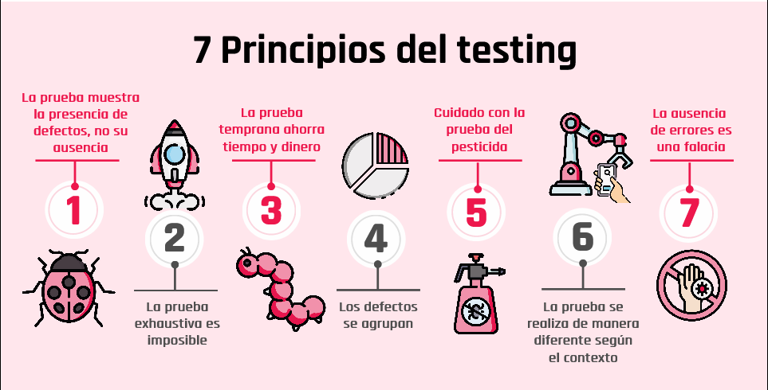
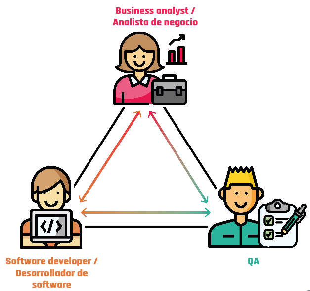
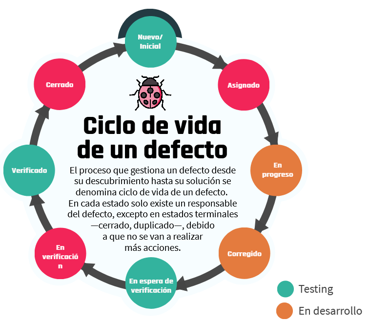
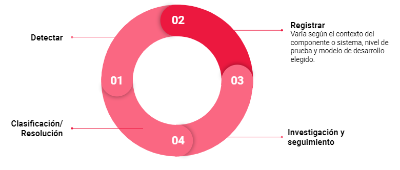

<t>Testing I</t>

---

## Índice

1. Fundamentos de testing y gestión de defectos.
- [C1 - Primeros pasos](#c1)
    - [Bienvenida](#c1a)
    - [Introduccion al testing](#c1b)
    - [Cronologia](#c1z)
    - [Principios del testing](#c1y)
    - [El rol del Tester](#c1c)
    - [Ventajas y desventajas prueba independiente](#c1x)
    - [Equipo - Mesa 3 patas](#c1w)
- [C2 - Gestion de defectos](#c2)
    - [Defectos](#c2a)
        - [ciclo de vida de un defecto](#c2a1)
    - [Gestion de defectos](#c2b)
        - [Proceso de gestión de defectos](#c2b1)
        - [Objetivos](#c2b2)
        - [¿Cómo escribir un buen informe?](#c2b3)
        - [¿Qué condiciones debemos tener en cuenta?](#c2b4)
        - [¿Cuáles son los problemas más comunes con los informes de defectos?](#c2b5)
        - [Partes de un informe de defectos](#c2b6)
    - [Actividad](#c3c)

2. Gestion de defectos
3. Disenio de pruebas
4. implementación de la prueba
5. Analisis de la prueba
6. Planificacion de la prueba
7. Introduccion a TDD 
8. Be testing
9. Introduccion a automation
10. Full stack y DevOps tester

# C1 - Primeros pasos 

## Bienvenida

Les queremos dar la bienvenida a este camino que empezamos juntos en el mundo de la calidad del software. Durante la materia de Testing I aprenderemos nuevos conceptos de testing, incorporaremos diferentes metodologías de trabajo y las aplicaremos para resolver diversos problemas que se presentan en el día a día de un tester. No solamente abarcaremos contenido teórico, sino también práctico, para así reforzar los conocimientos.

La idea es aprender juntos y acompañarlos en este proceso de aprendizaje y hacerlo de la manera más interactiva posible. ¿Estamos listos para comenzar?

[Modulos Testing I](https://view.genial.ly/60af8755c081a90d9f95a95e)

## Introduccion al testing 

> Ver video: Que es el testing

<!-- resumen video -->

se parte de la suposicion que el programa contiene errores
calidad es la satisfaccion del cliente
se toman decisiones a traves de las pruebas
confiabilidad, 
pruebas frecuentes 

factores externos:

- requerimientos poco claros
- mofidicaciones a ultimo momento
- errores de diseno y testers no calificados

Testing sirve para:

- Sirve para encontrar el mayor numero de defectos y remediarlos
- Asegurar que el producto funcione como esta definido en los requisitos
- Proporcionar al producto final un mayor grado de calidad.

<!-- fin resumen video -->

## Cronologia 

[Evolucion historica](https://view.genial.ly/60ae4430920d0f0dae99949f)

<!-- inicio resumen link -->

### 1950-1960

Después de la Segunda Guerra Mundial, los importantes avances en el desarrollo de software tuvieron lugar en EE. UU. y se generaron en el ámbito de la industria militar. En aquella etapa de la evolución del software, las aplicaciones eran desarrolladas para un hardware dedicado, sistemas que contaban al software como una de sus partes. <r>La calidad asociada a estos sistemas se lograba con pruebas exhaustivas una vez terminado de construir.</r>

### 1960 - 1980

Con los avances en el hardware y la aparición de lenguajes de alto nivel, se estableció una nueva tendencia en el desarrollo: se comenzaron a producir sistemas no militares e independientes del hardware. Los avances estuvieron orientados a producir sistemas de propósito general. 

A partir de los inconvenientes de sobrepresupuesto y tiempo adicional necesarios en la terminación del proyecto de desarrollo del sistema operativo de IBM, <r>se generó una alerta en el sentido de la necesidad de contar con métodos de desarrollo que garantizaran la calidad de los productos de software.</r>

### 1980 - 1990

Esta alerta generó el convencimiento de la necesidad y los primeros esfuerzos en la creación de una nueva disciplina llamada ingeniería de software. 

Mientras esto sucedía, la tecnología seguía avanzando y se contaba con plataformas de bajo volumen y costo que ofrecían la posibilidad de desarrollar software como una oportunidad de negocio a gran escala. 

Luego de su paso por Japón, vuelve a EE.UU. <r>W. Demming e introduce el siguiente concepto “la calidad de un producto está directamente relacionada al proceso utilizado para crearlo”</r>, de esta manera, las empresas estadounidenses comienzan a adoptar la estrategia conocida como Gestión de la calidad total.

### 1990 - 2000

En la década de 1990, el crecimiento de los sistemas se acentuó, con protagonistas como Microsoft —ya convertida en líder mundial— Netscape y Oracle, entre otros. Además, <r>se consolidaron las metodologías de desarrollo de tipo iterativas, las cuales van suplantando a las conocidas como cascada.</r> <r>Aparecieron algunas metodologías llamadas ágiles y el concepto de integración continua y también se sigue trabajando en IVV (Independent Verification Validation)</r>. Estas formas de trabajo tienen una fuerte influencia en la calidad del software.

### 2000 - 2010

El escenario establecido para el desarrollo de software está determinado por <r>un hardware cada vez más poderoso, software de última generación, modelos de desarrollo y metodologías ágiles. </r>

Esta velocidad creciente impuesta por el mercado de productos de software tiene un impacto importantísimo en la calidad de los productos y servicios ofrecidos. Es de notar que estos cambios en la evolución de esta industria hicieron que la preparación de los desarrolladores de hoy día sea muy distinta a la que tenían aquellos programadores de sistemas integrados a un hardware dedicado y con requerimientos estables de los años cincuenta.

### 2010 - actualidad

En esta época <r>se afianza la integración entre la ingeniería del software y la ingeniería de sistemas destacándose el papel de los requisitos no funcionales y, sobre todo, de la seguridad</r>; la <r>importancia de la “ciencia, gestión e ingeniería de los servicios” que requiere un enfoque interdisciplinar —informática, marketing, gestión empresarial, derecho, entre otros</r>— a la hora de abordar el diseño de los servicios; <r>la necesidad de adaptar los métodos de desarrollo de software para trabajar en un “mundo abierto”</r> —teniendo en cuenta la inteligencia ambiental, las aplicaciones conscientes del contexto, y la computación pervasiva)—; los sistemas de sistemas intensivos en software (SISOS) con decenas de millones de líneas de código, decenas de interfaces externas, proveedores “competitivos”, jerarquías complejas, entre otros.

También estamos viendo ya la implantación de la ingeniería del software continua, y su correspondiente tecnología y “filosofía” DevOps, que logran reducir el tiempo entre que se compromete un cambio en el sistema y se implementa en producción; lo que requiere un cambio cultural para aceptar la responsabilidad compartida —entre desarrollo y operación— de entregar software de alta calidad al usuario final.

<!-- fin resumen link -->

## Principios del testing 

[7 principios del Testing](https://view.genial.ly/609824f9de75770d03eca4dc)

### 1. La prueba muestra la presencia de defectos, no su ausencia

No puede probar que no hay defectos. Reduce la probabilidad de que queden defectos no descubiertos en el software, pero, incluso si no se encuentran, <r>el proceso de prueba no es una demostración de corrección.</r>

### 2. La prueba exhaustiva es imposible

No es posible probar todo —todas las combinaciones de entradas y precondiciones—, excepto en casos triviales. <r>En lugar de intentar realizar pruebas exhaustivas se deberían utilizar el análisis de riesgos</r>, las técnicas de prueba y las prioridades para centrar los esfuerzos de prueba.

### 3. La prueba temprana ahorra tiempo y dinero

Para detectar defectos de forma temprana, las actividades de testing, tanto estáticas como dinámicas, <r>deben iniciarse lo antes posible en el ciclo de vida de desarrollo de software</r> para ayudar a reducir o eliminar cambios costosos.

### 4. Los defectos se agrupan

En general, un pequeño número de módulos contiene la mayoría de los defectos descubiertos durante la prueba previa al lanzamiento o es responsable de la mayoría de los fallos operativos.

### 5. Cuidado con la prueba del pesticida

Si las mismas pruebas se repiten una y otra vez, eventualmente estas pruebas ya no encontrarán ningún defecto nuevo. Para detectarlo, es posible que sea necesario <r>cambiar las pruebas y los datos de prueba existentes.</r>

### 6. La prueba se realiza de manera diferente según el contexto

Por ejemplo, el software de control industrial de seguridad crítica se prueba de forma diferente a una aplicación móvil de comercio electrónico.

### 7. La ausencia de errores es una falacia

El éxito de un sistema no solo depende de encontrar errores y corregirlos hasta que desaparezcan ya que puede no haber errores, pero sí otros problemas. Existen otras variables a tener en cuenta al momento de medir el éxito.

## El rol del Tester 

> Ver pdf: Aspecto psicologico del testing.pdf

<!-- Resumen pdf -->

> El testing es el proceso de ejecución de un programa con la intención de encontrar errores.

## Aspecto psicológico del testing 

Los seres humanos tienden a ser sumamente orientados a objetivos y el establecimiento de la meta adecuada tiene un efecto psicológico importante. Si nuestro objetivo es demostrar que un programa no tiene errores, entonces, subconscientemente estaremos dirigidos a esa meta, es decir, tendemos a seleccionar los datos de prueba que tienen una baja probabilidad de causar que el programa falle. Por otro lado, <r>si nuestro objetivo es demostrar que un programa tiene errores, nuestros datos de prueba tendrán una mayor probabilidad de encontrarlos.</r>

Más allá del desarrollador o el tester, las tareas de prueba pueden ser realizadas por personas que desempeñan un rol de prueba específico u otro rol —por ejemplo, clientes—.

## Prueba independiente

La forma en que se implementa la independencia de la prueba varía dependiendo del modelo de ciclo de vida de desarrollo de software. Por ejemplo, en el desarrollo ágil, los probadores pueden formar parte de un equipo de desarrollo. En algunas organizaciones que utilizan métodos ágiles, estos probadores también pueden ser considerados parte de un equipo de prueba independiente más grande. Además, en dichas organizaciones, los propietarios de producto pueden realizar la prueba de aceptación para validar las historias de usuario al final de cada iteración.

## Ventajas y desventajas de la prueba independiente 

|Beneficios potenciales de la independencia de la prueba|Desventajas de la independencia de la prueba|
|----------------------------------|---------------------------|
|Es probable que los probadores independientes reconozcan diferentes tipos de fallos en comparación con los desarrolladores debido a sus diferentes contextos, perspectivas técnicas y sesgos. |Los desarrolladores pueden perder el sentido de la responsabilidad con respecto a la calidad|
|Un probador independiente puede verificar, cuestionar o refutar las suposiciones hechas por los implicados durante la especificación e implementación del sistema|Los probadores independientes pueden ser vistos como un cuello de botella o ser culpados por los retrasos en el lanzamiento o liberación|
| |Los probadores independientes pueden carecer de información importante —por ejemplo, sobre el objeto de prueba—.|

<!-- fin resumen pdf -->

## Equipo / Mesa de 3 patas 

[Equipo](https://view.genial.ly/609fb88d81ac730cff0404aa)

- Si bien cada actor tiene un rol definido, es necesario un trabajo en comunión entre los 3 actores. Es decir, es necesario que trabajen como equipo. Por eso, utilizamos la analogía con una mesa de 3 patas, pues si falta alguna de ellas, la mesa no podría estar de pie.
- En algunas empresas de software pequeñas o “start up” es posible que una misma persona tenga más de un rol.
- Además, algo importante dentro de las metodologías de desarrollo ágiles, es la reunión de los 3 amigos. Es una sesión en la que participan estos tres roles y cada uno de ellos da su punto de vista respecto al software que está bajo desarrollo. Aquí, más que nunca se pone en manifiesto el funcionamiento de la mesa.

### Business analyst / Analista de negocio

Se encarga de detectar los factores clave del negocio y es el intermediario entre el departamento de sistemas y el cliente final.

### Software developer / Desarrollador de software

Su función es diseñar, producir, programar o mantener componentes o subconjuntos de software conforme a especificaciones funcionales y técnicas para ser integrados en aplicaciones.

### QA

La principal función es probar los sistemas informáticos para que funcionen correctamente de acuerdo a los requerimientos del cliente, documentar los errores encontrados y desarrollar procedimientos de prueba para hacer un seguimiento de los problemas de los productos de forma más eficaz y eficiente.

<!-- fin resumen link -->

> Ver actividad: 1

## C2 - Gestion de defectos 

**Grandes empresas - Grandes defectos**

A lo largo de la historia, se registraron grandes errores producidos en grandes empresas. ¿Se acuerdan del famoso error de Samsung en donde los teléfonos Galaxy Note 7 explotaban? La empresa luego de reconocer el error, publicó un informe con los motivos:

_El informe explica que en las primeras baterías se produjo un error en el diseño en la esquina superior derecha, que provocó deformaciones en el electrodo negativo, generando un cortocircuito en algunas de las celdas y un sobrecalentamiento que hacía que el dispositivo se incendiara._

Otra gran empresa que cometió un error que hizo dudar de su fiabilidad a sus clientes —y que produjo una pérdida muy grande de dinero— fue Tesla. Se produjo un error en el sistema de control de crucero de sus vehículos y este se activaba accidentalmente. ¿Qué salió a decir la empresa?

_La empresa explica que se produjo un error dentro de su software que producía que se active el control de crucero aleatoriamente en sus vehículos. La solución fue una nueva actualización del software, pero esto generó la desconfianza de sus clientes._

Otro suceso importante le pasó a la famosa plataforma YouTube, el video musical de Gangnam Style rompió la plataforma. ¿Qué pasó aquí?

_El contador de YouTube antes usaba un número entero de 32 bits, que es una unidad que se usa para representar datos en la arquitectura de la computadora. Este entero de 32 bits determina que el número máximo de vistas posibles que podía contar era 2,147,483,647. El famoso video excedió este valor máximo y rompió la plataforma. Hoy en día, YouTube usa un número entero de 64 bits para su contador de videos._

Todos estos sucesos (y muchísimos más registrados a lo largo de la historia) podrían haber sido evitados con un buen plan de testing, de manera de encontrarlos rápidamente y que no lleguen a la sociedad. Es por ello que a lo largo de la materia veremos cómo crear un plan de testing, cómo registrar estos defectos y, por ende, evitar grandes defectos en grandes empresas.

Para comenzar, en este módulo veremos todo acerca de ¡defectos!

> Ver video: Que es un defecto

<!-- resumen video -->

<r> **Error** Es la equivocacion de una persona, esto produce un fallo y produce un error cuando la prueba se ejecuta
Esto se convierte en un **defecto** y al ejecutarse provoca un mal funcionamiento; un **fallo**.</r>

<!-- fin resumen video -->

## ciclo de vida de un defecto 

El proceso que gestiona un defecto desde su descubrimiento hasta su solución se denomina ciclo de vida de un defecto. 
En cada estado solo existe un responsable del defecto, excepto en estados terminales —cerrado, duplicado—, debido
a que no se van a realizar
más acciones.

[Detalle del ciclo](https://view.genial.ly/609948c81ba6380d85590b90)

## Gestion de defectos 

> ver PDF: Gestión de defectos.pdf

<!-- inicio resumen pdf -->

## Proceso de gestión de defectos 

1. Detectar
2. Registrar
3. Investigacion y seguimiento
4. Clasificacion/Resolucion

## Objetivos 

- Brindar información sobre cualquier evento adverso que haya ocurrido, para poder identificar efectos específicos, aislar el problema con una prueba de reproducción mínima y corregir los defectos potenciales.

- Proporcionar a los jefes de prueba un medio para hacer un seguimiento de la calidad del producto de trabajo y del impacto en la prueba.

- Dar ideas para la mejora de los procesos de desarrollo y prueba.

## ¿Cómo escribir un buen informe? 

Si el defecto se reporta eficientemente, las probabilidades de que sea solucionado rápidamente es mayor. Entonces, la solución de un defecto dependerá de la eficiencia con que se reporte. 

## ¿Qué condiciones debemos tener en cuenta? 

**Los bugs deben tener identificadores únicos.**
Si bien muchas herramientas de bug tracking asignan automáticamente un ID único a los bugs, muchas veces se reportan fallas por medio de e-mails, saltando la registración en la herramienta.

**Una falla debe ser reproducible para reportarla.**
Si el defecto no es reproducible, no es un defecto. Para defectos que ocurren en forma aislada, podemos realizarnos una nota personal para investigar luego y determinar qué condiciones deben ser dadas para que el mismo se produzca.

## ¿Cuáles son los problemas más comunes con los informes de defectos? 

- Redactar un defecto de manera excesivamente coloquial y ambigua.- Dar solo una captura del defecto sin indicar qué se estaba haciendo cuando sucedió. 
- No incluir en la descripción del defecto cuál era el resultado esperado para los pasos realizados.
- No determinar un patrón con el cual el defecto ocurre antes de reportar el mismo —es importante para ser directos en cuál es el problema—.
- No leer el defecto reportado siguiendo los pasos uno mismo para ver que la descripción es clara.
- No incluir información que dada las características del defecto, la misma es de relevancia.

<!-- fin resumen pdf -->

### Defectos

Cuando se detecta un defecto —como parte de las pruebas estáticas—, o se observa un fallo —como parte de las pruebas dinámicas—, la persona implicada debería recopilar los datos e incluirlos en el informe de defectos. Esta información debería ser suficiente para tres fines:

- Gestión del informe durante el ciclo de vida de los defectos.
- Evaluación del estado del proyecto, especialmente en términos de calidad del producto y progreso de las pruebas.
- Evaluación de la capacidad del proceso.

Los datos necesarios para la gestión de los informes de defectos y el estado del proyecto pueden variar en función de cuándo se detecta el defecto en el ciclo de vida, siendo la información requerida menor en etapas anteriores —por ejemplo, revisiones de requisitos y pruebas unitarias—. No obstante, la información básica recopilada debería ser coherente durante todo el ciclo de vida e, idealmente, en todos los proyectos para permitir una comparación significativa de los datos de defectos del proceso durante el proyecto y en todos los proyectos.

> Ver PDF: Partes de un informe de defectos.pdf

<!-- inicio resumen pdf -->

## Partes de un informe de defectos 

|Atributo|Descripcion|Ejemplo|
|--|-----------|-------|
|**ID**|Abreviatura de identificador, un código único e irrepetible que puede ser número o letras|001 - Test01|
|**Título**|El título debe ser corto y específico, que se entienda en este lo que queremos reportar. Cuando el desarrollador o el equipo vean el título pueden interpretar rápidamente qué es, dónde está y cuán importante es ese defecto.|Login - Ingresa con campos en blanco|
|**Descripción**|Describir un poco más sobre el error, es decir, desarrollar lo que dejamos afuera en el título lo podríamos explicar acá|En la pantalla login si dejo vacío los campos nombre y password y apretó ingresar, me lleva a la página principal.|
|**Fecha del informe del defecto**|La fecha que detectó el defecto para saber posteriormente el tiempo en que se resolvió.|23/04/21|
|**Autor**|El nombre del tester que descubrió el defecto, por si el desarrollador tiene una duda, sabe a quién consultar|Pepito Román|
|**Identificación del elemento de prueba**|Nombre de la aplicación  o componente que estamos probando|Carrito compras|
|**Versión**|Es un número que nos indica en qué versión está la aplicación|1.0.0|
|**Entorno**|El entorno en el que probamos (desarrollo, QA, producción).|Desarrollo|
|**Pasos a reproducir**|Los pasos a seguir para llegar al defecto encontrado|1) Ingresar a la aplicación.2) Dejar en blanco el campo nombre.3) Dejar en blanco el campo password.4) Hacer click en el botón “Ingresar”.|
|**Resultado esperado**|Es lo que esperamos que suceda o muestre la aplicación muchas veces según los requerimientos de la misma.|No debe ingresar a la aplicación sin un usuario y una contraseña válidos.|
|**Resultado obtenido o actual**|Es lo que sucedió realmente o lo que nos mostró la aplicación. Puede coincidir o no con el resultado esperado, si no coincide, hemos detectado un error o bug|Ingresa a la aplicación sin usuario y sin contraseña.|
|**Severidad**|Cuán grave es el defecto que hemos encontrado, puede ser: bloqueado, crítico, alto, medio, bajo o trivial|Crítico|
|**Prioridad**|Con esto decimos qué tan rápido se debe solucionar el defecto, puede ser: alta, media, baja|Alta|
|**Estado del defecto**|Los estados pueden ser: nuevo, diferido, duplicado, rechazado, asignado, en progreso, corregido, en espera de verificación, en verificación, verificado, reabierto y cerrado.|Nuevo|
|**Referencias**|Link al caso de prueba con el cual encontramos el error.|https://repositorio.-com.ar/TC-001-User-Login|
|**Imagen**|Se puede adjuntar una captura de pantalla del error, esto nos permite demostrar que el error sucedió y al desarrollador lo ayuda a ubicar el error||

<!-- fin resumen pdf -->

<!-- inicio quizz -->

**Quizz**

Como programador cometo una equivocación en el código de mi aplicación, ¿cómo se llama esta equivocación?   
Error

Como testers, buscamos:
Encontrar la mayor cantidad de defectos antes de que la aplicación salga al público y brindar calidad del sistema. 

¿En qué etapas del ciclo de vida de un defecto, este se encuentra en desarrollo?
En la etapa en progreso y corregido.

Un defecto puede ser devuelto o rechazado.
Verdadero

Como tester, puedo reportar un defecto sin indicar cómo reproducirlo nuevamente ni evidenciar con pruebas.
Falso
<!-- fin quizz -->

<!-- subir al inicio -->
[subir al indice](#up)